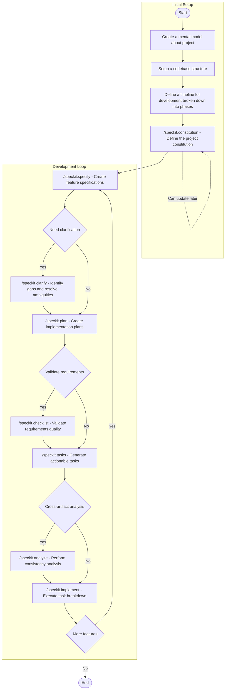
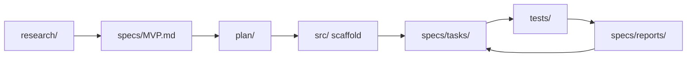
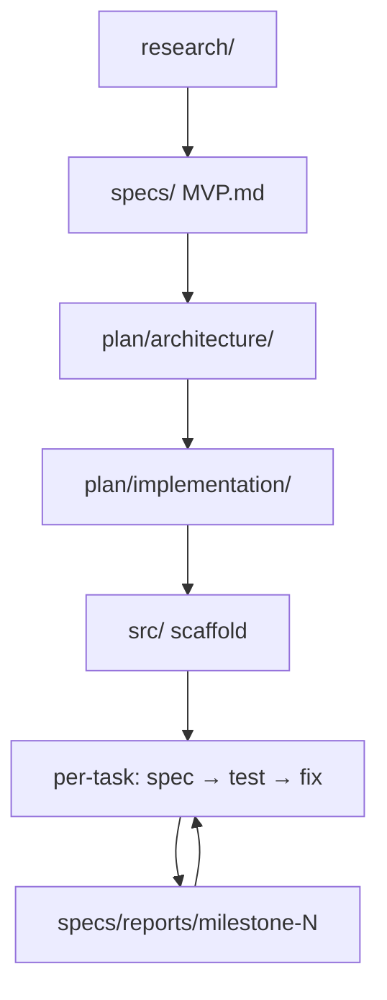
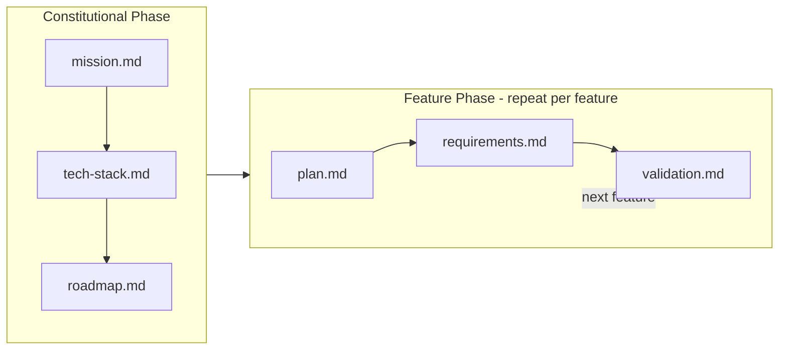
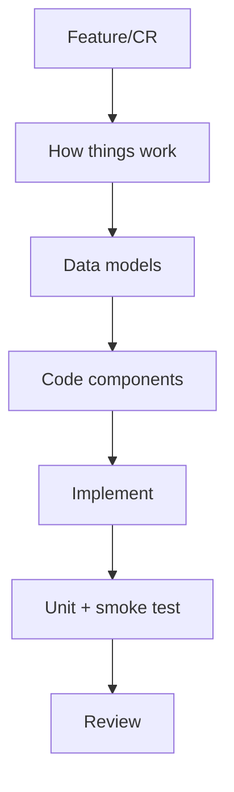
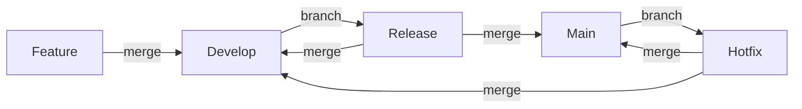

# Coding Today

## 1. Some helpful commands

### Git commands

Here are some useful git commands for daily development:

`git add`: Stage changes for commit

`git log`: Review commit history

`git commit`: Record staged changes

`git diff`: Show differences between working directory, index, and commits

`git reset`: Reset the current HEAD to a specified state

`git fetch`: Download objects and refs from another repository

`git rebase`: Reapply commits on top of another base tip

### Custom slash commands

I also have some custom slash commands (workflows) for AI to help me with repetitive tasks:

`/make-commit-message`

```md
---
description: Generate a commit message based on staged changes
---

You are a senior engineer writing a commit message for the staged changes.

1. Review recent history — `git log` — to match commit patterns.
2. Run `git diff --staged` to see the changes.
3. Analyze related files (package files, configs, docs, tests that may need updates).
4. Write a conventional-commits message:
   - feat: new features
   - fix: bug fixes
   - docs: documentation
   - refactor: code restructuring
   - test: test changes
   - chore: tooling / maintenance
```

`/review`

```md
---
auto_execution_mode: 0
description: Review code changes for bugs, security issues, and improvements
---
You are a senior software engineer performing a thorough code review to identify potential bugs.

Your task is to find all potential bugs and code improvements in the code changes. Focus on:
1. Logic errors and incorrect behavior
2. Edge cases that aren't handled
3. Null/undefined reference issues
4. Race conditions or concurrency issues
5. Security vulnerabilities
6. Improper resource management or resource leaks
7. API contract violations
8. Incorrect caching behavior, including cache staleness issues, cache key-related bugs, incorrect cache invalidation, and ineffective caching
9. Violations of existing code patterns or conventions

Make sure to:
1. If exploring the codebase, call multiple tools in parallel for increased efficiency. Do not spend too much time exploring.
2. If you find any pre-existing bugs in the code, you should also report those since it's important for us to maintain general code quality for the user.
3. Do NOT report issues that are speculative or low-confidence. All your conclusions should be based on a complete understanding of the codebase.
4. Remember that if you were given a specific git commit, it may not be checked out and local code states may be different.
```

## 2. Spec-driven development

### Speckit

I studied some famous SDD frameworks like [BMAD](https://github.com/bmad-code-org/BMAD-METHOD) or [GSD](https://github.com/gsd-build/get-shit-done) but they seem too overkill for my current needs. I think in the future, developers will shift from writing code to design, so I love keeping the design in my head and making it grow up gradually by brainstorming with AI instead of delegating the entire work to AI. [Speckit](https://github.com/github/spec-kit/blob/main/spec-driven.md) is good enough for me. I will take care of the design and after having the codebase in my mental model, I will harness the power of AI to generate the code. SpecKit is quite flexible; it can accept a simple sentence about feature description or a full PRD document, and anything missing can be clarified when implementing the feature. That makes it more convenient because I don't need to write a PRD for my personal projects. Here is a structure of a PRD:

```
# PRD: [Feature Name]

## User Stories
*Who the feature is for and what problem it solves*
- As a [user type], I want [action] so that [benefit]
- As a [user type], I want [action] so that [benefit]

## Functional Requirements
*What the feature should do*
- [FR-1] Requirement description
- [FR-2] Requirement description
- [FR-3] Requirement description

## Success Criteria
*How to measure if the feature is working correctly*
- [ ] Criteria 1
- [ ] Criteria 2

## Acceptance Criteria
*Specific conditions that must be met for the feature to be considered complete*
- [ ] Given [condition], when [action], then [expected outcome]
- [ ] Given [condition], when [action], then [expected outcome]

## User Personas
*Who will use the feature*
- [Persona 1]: Description and goals
- [Persona 2]: Description and goals

## Use Cases
*Scenarios of how users interact with the feature*
- [Use case 1]: Description
- [Use case 2]: Description

## Technical Constraints
*Technology limitations or requirements*
- Technology stack requirements
- Performance requirements
- Security requirements

## UI/UX Specifications
*Wireframes, mockups, or design descriptions*
- [ ] Wireframes or design references
- [ ] User flow description
- [ ] Key interaction patterns

## Success Metrics
*KPIs to track after launch*
- Metric 1: Description and target
- Metric 2: Description and target

## Dependencies
*Other features or systems this feature relies on*
- Features or systems this depends on
- External APIs or services needed

## Risks and Mitigation
*Potential issues and how to address them*
- [Risk 1]: Mitigation strategy
- [Risk 2]: Mitigation strategy
```

Here is my personal practice of using SDD in greenfield projects:




### Other variations of SDD

Another variation I found focuses on formalization, traceability, and TDD:

```
SDD ≈ Layered formalization + Traceability + TDD
```

The project layout reflects the layers directly:

```
project/
├── research/                       ← exploration notes, tradeoff studies
├── specs/
│   ├── MVP.md                      ← product spec (the what)
│   ├── tasks/
│   │   ├── M1-T1.md                ← one file per atomic task
│   │   ├── M1-T2.md
│   │   └── M{N}-T{N}.md
│   └── reports/
│       ├── milestone-1-report.md   ← one per milestone
│       └── milestone-N-report.md
├── plan/
│   ├── architecture/               ← design docs (the how)
│   │   ├── high-level.md
│   │   └── {subsystem}.md
│   └── implementation/             ← execution plan (the when)
│       ├── phase-1-tasks.md
│       └── phase-N-tasks.md
├── src/                            ← scaffold first, patched per task
└── tests/                          ← grows per task, one file per module
```

And the flow between them:



The top row is written once upfront. The bottom row is the per-task loop: each task gets its own `specs/tasks/M{N}-T{N}.md`, tests are written against the scaffold, and the loop closes with a `specs/reports/milestone-N-report.md` that feeds the next milestone. Every task spec cites the architecture section it implements, so you can always walk the chain in reverse, from a line of code back to the research finding that justified it.

**Layer 1 — `research/`**

A dump of exploration notes: existing tools, technical tradeoffs, competitive landscape. The output is an honest audit of what already exists and what gaps remain. This is the justification for everything downstream.

**Layer 2 — `specs/` (the *what*)**

The product spec (`MVP.md`) formalizes the research into user-facing behavior, success criteria, and data schema. It exists to be disagreed with — if the spec is wrong, you fix it here, not later.

**Layer 3 — `plan/architecture/` (the *how*)**

The architecture docs translate the product spec into component responsibilities, data flow, and module boundaries. Each architecture doc becomes the reference target that task specs will cite by section number.

**Layer 4 — `plan/implementation/` (the *when*)**

The execution plan slices the architecture into deliverables. The hierarchy is strict: **Phase → Milestone → Task**. A phase is a strategic chunk ("MVP", "Queue + Permissions"). A milestone is a 1-to-2-day delivery checkpoint. A task is an atomic unit of 30 min to 3 hours. The same ID — `M3.T1` — threads through the phase plan, its own `specs/tasks/M3-T1.md`, the commit message, the test file, and the milestone report. You can grep any ID and see every artifact it touches.

**Layer 5 — `src/` scaffold**

Once all four layers above are settled, the whole code scaffold lands in one commit — not stubs, but working skeletons that realize the architecture in code. The scaffold is a draft, not a proof; it will be verified piece by piece in the task loop.

**Layer 6 — Per-task loop (this is where TDD lives)**

For each task you write `specs/tasks/M{N}-T{N}.md`, which includes a "Gaps in Existing Code" section — a deliberate diff between what the architecture says and what the scaffold actually does. Then tests come first, following classic TDD: *red → green → refactor*. Tests fail against whatever is wrong in the scaffold, you patch only what failed, commit. The commit message records the verdict — "Gaps fixed: none" means the scaffold was right on that piece; a list means TDD caught real drift.

**Layer 7 — `specs/reports/milestone-N-report.md`**

Closes each milestone. Documents which tasks passed, what gaps were found, and where reality deviated from the architecture — and why. The next milestone reads this before starting.

<div align="center">



</div>

The spirit is not "upfront design for its own sake" — it is that **every line of code must have a paper trail back to a research finding**. Nothing lives in the codebase that you can't justify, layer by layer, up to the original problem. The payoff is that six months later, you can pick any commit, read its task spec, follow the cross-references up, and understand the full reason the code exists. The cost is the discipline of refusing to code ahead of the paper trail.


Another simpler variation — strips the ceremony down to two phases: a constitutional phase and a feature phase.

**Constitutional phase (once, at project start)**

Create three files in `specs/`:

- **`mission.md`** — The project's *why*: purpose, audience, and definition of success. Written once, rarely changed.
- **`tech-stack.md`** — Technology choices with rationale. Documents the full stack, environment variables, and what you explicitly chose *not* to use.
- **`roadmap.md`** — A flat ordered list of phases, each a shippable slice small enough to complete in a single session.

**Feature phase (repeated for each feature)**

For each feature, create a dated directory (e.g., `specs/2026-04-20-feature-name/`) with three files:

- **`plan.md`** — Numbered task groups, ordered from setup to verification. Each task is actionable and sequenceable.
- **`requirements.md`** — Scope (in and out), key architectural decisions, and assumptions.
- **`validation.md`** — The definition of done: a concrete checklist of criteria that must all pass before the feature is considered complete.

```
specs/
├── mission.md
├── tech-stack.md
├── roadmap.md
└── 2026-04-20-feature-name/
    ├── plan.md
    ├── requirements.md
    └── validation.md
```



The difference from the layered approach above is pragmatism: no architecture docs, no per-task spec files, no milestone reports. The spec is lean enough to write in under an hour per feature, yet rigorous enough that both you and your AI agent share a contract before any code is written. The agent reads the spec, asks clarifying questions, implements against `plan.md`, and validates against `validation.md`.

If you already have an existing codebase and the task is to add a new feature, you don't need the full constitutional setup. A single `plan.md` is enough — structured around this workflow:

<div align="center">



</div>

The `plan.md` maps directly to these steps: start with a reading pass of the relevant code, note the data shapes involved, list the components to add or modify, drive implementation with tests, then hand off for review. No upfront architecture docs needed — the existing codebase is already the architecture.

### SDD ❤️ Mkdocs

Most projects go through the same lifecycle, though not every project needs every artifact:

```
Project
├── 1. Idea
├── 2. Requirements
│   ├── Clear requirements
│   └── Hidden requirements (surface during implementation)
├── 3. Solution Architecture + Tech Stack
│   ├── High-level design
│   └── Technology decisions
├── 4. System Design
│   ├── Architecture diagram
│   ├── Sequence diagram
│   ├── ERD
│   ├── Data flow diagram
│   └── Data store
├── 5. Specs
│   └── How to implement
├── 6. Implementation
├── 7. Testing
├── 8. Deployment
└── 9. Maintenance
```

So I think in a modern codebase, we should have not only `src` and `tests` (containing test suites) but also `specs` to document how to implement features, and `docs` to capture the artifacts from steps 1–4.

And [Mkdocs](https://www.mkdocs.org/) is a great tool to help render those document into human friendly format. By install mkdocs as a tool `uv tool install mkdocs`  (simpler like speckit `uv tool install specify-cli --from git+https://github.com/github/spec-kit.git`) or `uv add mkdocs` and add some helpful extensions like `mkdocs-material` to make the documentation more beautiful.

```toml
[project.optional-dependencies]
docs = [
    "mkdocs>=1.6.0",
    "mkdocs-material>=9.0.0",               # beautiful theme + search
    "mkdocs-awesome-pages-plugin>=2.0.0",   # control nav order via .pages files
    "mkdocs-llmstxt>=0.1.0",               # generates llms.txt for AI consumption
    "mkdocs-kroki-plugin>=0.8.0",          # renders PlantUML, Mermaid, and more
]
```

The key idea is to keep everything as **plain text in version control**. Wherever you would normally reach for a binary format, replace it with its text equivalent:

| Instead of | Use |
|---|---|
| Excel spreadsheet | Markdown table |
| PNG / JPG diagram | PlantUML or Mermaid |
| Word document | Markdown file |

This gives you a single source of truth that is human-readable in any editor, renderable by MkDocs into a hosted site for your team, and — thanks to `mkdocs-llmstxt` — also consumable by AI agents as an `llms.txt` file. The whole `docs/` folder becomes living documentation: versioned alongside the code, searchable, and never out of sync.


### The art of writing code

Writing code is like writing a story — each commit message should carry semantic meaning and narrate what you were doing. Read the git graph six months later and you should be able to follow the plot: what was built, in what order, and why. That discipline makes a codebase maintainable not just for others, but for your future self.

I built [commit-explorer](https://github.com/locchh/commit-explorer) (CEX) for exactly this reason. GitHub doesn't show a commit timeline graph, and cloning a repo just to run `git log --graph` is wasteful. CEX lets you explore any repository's commit history — graph, diffs, branch comparisons — directly from the terminal without a full clone, using shallow fetching under the hood.

The other craft is controlling how your code *grows*. Code change moves through several layers of isolation, and each boundary is a checkpoint:

```
┌────────────────────────────────────────────────────────────────────────┐
│  6. Environment      ← local → staging → production                    │
│  ┌──────────────────────────────────────────────────────────────────┐  │
│  │  5. Repository     ← local vs. remote                            │  │
│  │  ┌────────────────────────────────────────────────────────────┐  │  │
│  │  │  4. Branch       ← isolated line of work                   │  │  │
│  │  │  ┌──────────────────────────────────────────────────────┐  │  │  │
│  │  │  │  3. Commit     ← atomic unit of change               │  │  │  │
│  │  │  │  ┌────────────────────────────────────────────────┐  │  │  │  │
│  │  │  │  │  2. Staged   ← deliberate selection            │  │  │  │  │
│  │  │  │  │  ┌──────────────────────────────────────────┐  │  │  │  │  │
│  │  │  │  │  │  1. Unstaged  ← scratch pad              │  │  │  │  │  │
│  │  │  │  │  └──────────────────────────────────────────┘  │  │  │  │  │
│  │  │  │  └────────────────────────────────────────────────┘  │  │  │  │
│  │  │  └──────────────────────────────────────────────────────┘  │  │  │
│  │  └────────────────────────────────────────────────────────────┘  │  │
│  └──────────────────────────────────────────────────────────────────┘  │
└────────────────────────────────────────────────────────────────────────┘
```

By controlling each layer deliberately — what you stage, what you commit, when you push — your code can never ship without going through every checkpoint first: tested locally, merged to a shared branch, validated on staging, then released to production.

Another art is how to control development via branches. [A Successful Git Branching Model](https://nvie.com/posts/a-successful-git-branching-model/) was written in 2010 and is still one of the most referenced pieces on the topic — a sign that the fundamentals haven't changed much. It defines a strategy built around two permanent branches and three supporting types:

**Permanent branches**
- `main` — always production-ready; every merge is a release
- `develop` — the integration branch where finished features accumulate

**Supporting branches**
- `feature/*` — branches off `develop`, merges back to `develop` when done
- `release/*` — branches off `develop` when a release is being prepared; merges into both `main` and `develop`
- `hotfix/*` — branches off `main` for emergency production fixes; merges into both `main` and `develop`



## 3. The lifecycles

SDLC (Software Development Life Cycle)

SMLC (Software Migration Life Cycle)

https://cognition.ai/blog/how-devin-is-modernizing-cobol-at-fortune-500-companies

https://claude.com/blog/how-ai-helps-break-cost-barrier-cobol-modernization

https://corestory.ai/


## 4. How to improve your AI

### Improve via iteration

### Improve via memory

https://github.com/thedotmack/claude-mem

https://github.com/mem0ai/mem0

https://github.com/topoteretes/cognee

### Improve via feedback loop


## 5. Conclusions

Some people say AI can replace developers, designers, testers, etc. Indeed, AI-assisted tools like [Claude Code](https://code.claude.com/docs/en/overview) impact the human labor force in software development. But the reality is different. Tech giants like Google or Amazon, after firing thousands of employees, are rehiring them back in an effect called "Boomerang Hiring." The core reason is that the code generated by AI lacks "Business Context" and "Domain Knowledge." Also, the code is more complex and becomes a burden for senior developers to review and maintain, decreasing the productivity of the remaining team members.

I remember that "Your code is your understanding of the problem you're exploring. So it's only when you have your code in your head that you really understand the problem." — [Paul Graham](https://paulgraham.com/head.html). So coding is just a part of the process; it is not software development itself.

There is a paradox here, called "[Jevons Paradox](https://en.wikipedia.org/wiki/Jevons_paradox)." The core idea is that increased efficiency in using a resource can lead to increased overall consumption of that resource, rather than decreased consumption. This means that if making software becomes easier, the demand for software development will increase, leading to more software being built.

Coding faster makes coding less fun. We thought if AI could handle the code, we would have more time for other things, but that's not true. I still spend the entire day at my desk, reviewing thousands of lines of code, testing more, and debugging more. The workload increases, and the pressure to deliver more features faster also increases.