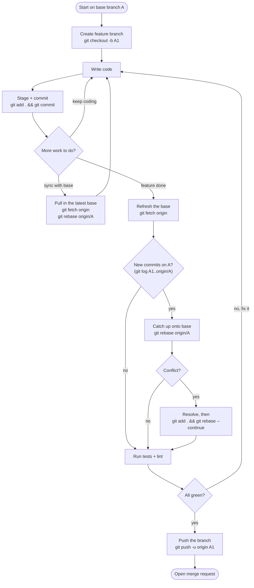
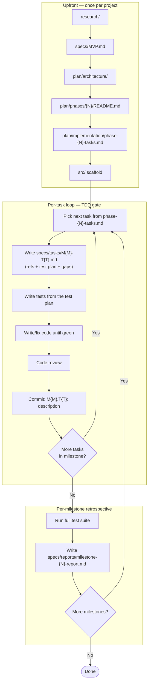
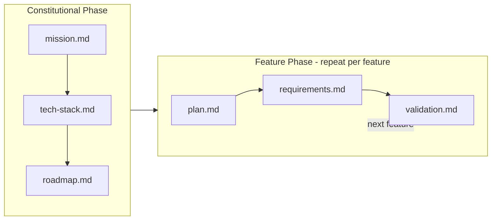
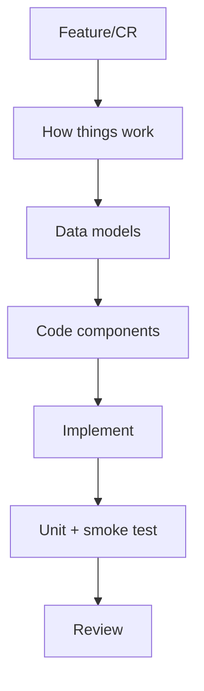
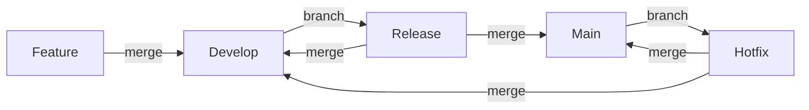
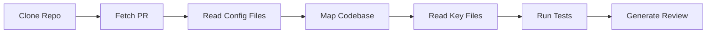
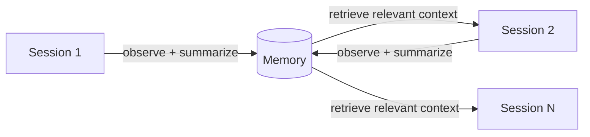
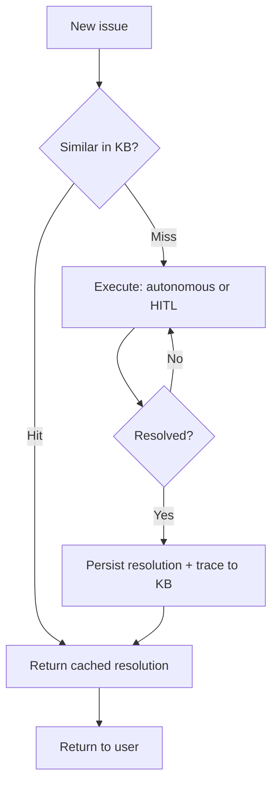

## 1. Some helpful commands

### Git commands and workflows

Here are some useful git commands for daily development:

- `git log`: Review commit history
  - `git log` - show commit history of current branch
  - `git log --oneline` - compact view
  - `git log main..feature` - commits in feature but not in main
  - `git log --graph --all` - visual branch graph

- `git add`: Stage changes for commit

- `git commit`: Record staged changes

- `git diff`: Show differences between working directory, index, and commits
  - `git diff` - see unstaged changes (working vs staging) in the same current working branch
  - `git diff --staged` - see staged changes (staging vs last commit) in the same current working branch
  - `git diff origin/main` - compare your working tree against `origin/main` (the last-fetched snapshot of the remote `main`)
  - `git diff main feature` - compare two branches in local
  - `git diff file.txt` - see changes of a specific file

- `git reset`: Reset the current HEAD to a specified state
  - `git reset file.txt` - unstage a file
  - `git reset --soft HEAD~1` - undo last commit but keep changes staged
  - `git reset --hard HEAD~1` - undo last commit and discard changes
  - `git reset --hard origin/main` - reset local branch to match remote

- `git restore`: Discard changes in the working tree (the modern, safer replacement for `git checkout -- file`)
  - `git restore file.txt` - discard unstaged changes to a file
  - `git restore .` - discard all unstaged changes in the working tree
  - `git restore --staged file.txt` - unstage a file but keep its changes
  - `git restore --source=HEAD~1 file.txt` - restore a file from an older commit

- `git clean`: Remove untracked files from the working tree
  - `git clean -nfd` - **dry run**: preview which untracked files and directories *would* be removed, without deleting anything (always run this first)
  - `git clean -fd` - actually remove untracked files and directories
  - `git clean -fdx` - also remove ignored files (those in `.gitignore`) — use with caution

- `git fetch`: Download objects and refs from another repository

- `git rebase`: Reapply commits on top of another base tip
  - `git rebase main` - rebase current branch onto main
  - `git rebase -i HEAD~3` - interactive rebase for last 3 commits
  - `git rebase --continue` - continue after resolving conflicts
  - `git rebase --abort` - abort rebase and return to original state

### My feature-branch workflow

Beyond the individual commands, here is the day-to-day workflow I follow for a feature task. The idea is simple: branch off the base, loop on small commits, and **sync with the base before I open the merge request** so I never push a stale branch. Two habits make it reliable — sync from the base *throughout* the work (not just at the end, so conflicts stay small), and put a **test gate** between "resolved" and "push".



The same flow, as the literal commands I actually type:

```bash
# start a feature off the latest base
git fetch
git checkout -b feature/TICKET-123-short-desc origin/main

# work in a loop
git add .
git commit -m "meaningful message"

# catch up before the PR
git fetch
git rebase origin/main

# (optional) tidy history before review
git rebase -i origin/main

# publish and open the PR
git push -u origin feature/TICKET-123-short-desc

# after it is merged on GitHub, delete the local branch
git branch -d feature/TICKET-123-short-desc
```

A few things I never do: force-push to `main`, commit directly to `main`, run `git merge main` locally just to catch up (rebase instead — see below), or leave stale branches lying around for weeks.

### Git merge vs git rebase — a practical lesson

The two commands that confuse people the most are `merge` and `rebase`. Both integrate changes between branches — but in opposite directions, for opposite purposes.

> **merge** = integrate *your work* **into** the product (feature → main)
>
> **rebase** = integrate *the product's updates* **into** your work (main → feature)

```
rebase: main → your feature   (you catch up)
merge:  your feature → main   (you ship)
```

#### There are three layers, not two

Most confusion comes from thinking there are two things (local and GitHub) when there are really three:

| # | Layer | Where it lives | What it is |
|---|---|---|---|
| 1 | Remote branch | GitHub's servers | the source of truth — the real `main` |
| 2 | Remote-tracking branch | your machine (read-only) | `origin/main` — a cached copy, refreshed by `git fetch` |
| 3 | Local branch | your machine | `feature/...` — where you actually work |

**`origin/main` is a local cache, not GitHub itself.** It lives on your machine in `.git/refs/remotes/origin/main` — a read-only snapshot of what GitHub looked like the last time you ran `git fetch`.

```
GitHub (real): main → A-B-C-D
        ↑
git fetch (refresh the cache)
        ↓
Your machine: origin/main → A-B-C-D (cache, read-only)
```

Think of it like a news app: GitHub is the news server, `origin/main` is the articles cached on your phone, and `git fetch` is hitting refresh.

| Command | What it updates |
|---|---|
| `git fetch` | only `origin/*` (remote-tracking branches) — never your files |
| `git pull` | `fetch` **+** auto-merge into your current local branch |

`git fetch` is the safe one — it never touches your local branches or working tree. And here's a senior-dev habit worth knowing: your local `main` goes stale the moment a teammate pushes, and you rarely actually need it — `origin/main` is always fresh after a fetch. Some people delete local `main` entirely and build from `origin/main` directly:

```bash
git branch -d main                  # you never edit main locally anyway
git fetch
git checkout --detach origin/main   # detached HEAD, no stale branch
# build, test, run
git checkout feature/your-branch    # back to work
```

#### Merge — how you ship

`merge` combines two histories by creating a new merge commit. In a real workflow you rarely run it by hand — it happens when you click **"Merge pull request"** on GitHub/GitLab.

```
main: A - B - C ----------\
                           \
feature:      D  -  E  -  [M]   <- merge commit
```

`[M]` has two parents, so the full history is preserved — you can always see where the branch came from. The UI is just running this for you:

```bash
git checkout main
git merge feature/your-branch
```

**Don't run `git merge main` locally to catch up.** It litters your feature branch with a noisy "merged main into feature" commit that reviewers have to wade through. Use `rebase` for catching up.

#### Rebase — how you catch up

`rebase` takes your commits and **replants them on top of the latest base**. No merge commit; history stays linear.

```
Before:                        After git rebase origin/main:

main:    A - B - C             main:    A - B - C
              \                                  \
feature:       D - E           feature:           D' - E'
              (based on B)                       (replayed on C)
```

`D'` and `E'` are *new* commits — rebase rewrites each one with a new parent and a new hash. Same changes, new objects. That is exactly why the rules are:

- Only rebase **your own** local/feature branches — never a shared one.
- Rewriting a branch others have already pulled breaks their history.
- It is local-only until you `git push`.

```bash
git fetch                # refresh origin/main
git rebase origin/main   # replay your commits on top
```

#### Interactive rebase — cleaning up history before a PR

`git rebase -i origin/main` opens an editor where you can reshape your commits before they go up for review:

```
pick abc  wip
pick def  fix
pick ghi  fix again

# rewrite to:
pick   abc  add login feature
squash def
squash ghi          # 3 messy commits → 1 clean one
```

| Command | What it does |
|---|---|
| `pick` | keep the commit as-is |
| `reword` | keep the commit, edit its message |
| `squash` | fold into the previous commit |
| `drop` | delete the commit entirely |

Use plain `rebase origin/main` when your commits are already clean and you just need to catch up; use `rebase -i` right before opening a PR to turn "wip / fix / oops" into a history worth reading.

#### Resolving conflicts

A conflict happens when two branches edit the **same lines**. Git can't decide which version wins, so it stops and writes markers into the file:

```
<<<<<<< HEAD            (your version)
const timeout = 3000;
=======
const timeout = 5000;
>>>>>>> origin/main     (the incoming version)
```

Edit the file to keep the right code and delete the markers, then:

```bash
git status              # see which files conflict
# ...fix the file by hand...
git add src/config.ts   # stage the resolution
git rebase --continue   # do NOT run git commit during a rebase
```

VS Code gives you buttons above each block — *Accept Current / Incoming / Both* — then you stage the file and run `git rebase --continue` in the terminal.

The one difference between the two to keep in your head:

| | Merge | Rebase |
|---|---|---|
| Conflicts surface | once, all together | one commit at a time |
| Continue with | `git merge --continue` | `git rebase --continue` |
| Bail out | `git merge --abort` | `git rebase --abort` |

With rebase, if 2 of your 3 commits conflict, you resolve **twice** — once per commit as Git replays them. And if it ever gets too messy, `git rebase --abort` puts you back exactly where you started. No harm done.

#### The golden rules

> **Rebase to clean up your own work. Merge to integrate into shared history.**
>
> **`main` is protected — it only changes through a PR, never a direct push.**
>
> **Feature branches are rebased locally to catch up.**

```
main (protected, on GitHub)
 └── changes only via PR — never pushed to directly

feature (local)
 └── rebased onto origin/main to catch up
 └── pushed → PR → merged on GitHub
```

### Other workflows worth knowing

A few more recipes I reach for regularly:

**Park work-in-progress with `git stash`.** When something urgent interrupts you mid-change and you're not ready to commit:

```bash
git stash push -m "half-done login form"   # shelve changes, clean the working tree
git checkout main                           # go deal with the urgent thing
# ...later...
git checkout feature/login
git stash pop                               # bring the changes back
git stash list                              # see everything you've shelved
```

**Undo a *pushed* commit with `git revert`, never `git reset`.** `reset` rewrites history — fine locally, but it breaks everyone else once a commit is shared. `revert` records a *new* commit that undoes the old one, so it is safe on shared branches:

```bash
git revert <commit-sha>   # creates an "undo" commit
git revert HEAD           # undo the most recent commit
```

(Save `git reset` for commits that never left your machine.)

**Find the commit that introduced a bug with `git bisect`.** Binary-search the history instead of reading every commit:

```bash
git bisect start
git bisect bad             # the current commit is broken
git bisect good v1.2.0     # this old tag worked
# git checks out the midpoint — you test it, then mark it:
git bisect good            # or: git bisect bad
# repeat until git names the culprit, then clean up:
git bisect reset
```

**Grab a single commit from another branch with `git cherry-pick`.** When you need just one fix without merging the whole branch:

```bash
git cherry-pick <commit-sha>
```

**Fix the last commit before pushing with `--amend`.** Forgot a file, or want to reword the message:

```bash
git add forgotten-file.ts
git commit --amend         # folds the staged change into the last commit
```

Only amend commits you **haven't pushed** — like rebase, it rewrites history.

### Custom slash commands

I also have some custom slash commands (workflows) for AI to help me with repetitive tasks:

`/make-commit-message`

```md
---
description: Generate a commit message based on staged changes
---

You are a senior engineer writing a commit message for the staged changes.

1. Review recent history — `git log` — to match commit patterns.
2. Run `git diff --staged` to see the changes.
3. Analyze related files (package files, configs, docs, tests that may need updates).
4. Write a conventional-commits message:
   - feat: new features
   - fix: bug fixes
   - docs: documentation
   - refactor: code restructuring
   - test: test changes
   - chore: tooling / maintenance
```

`/review`

```md
---
auto_execution_mode: 0
description: Review code changes for bugs, security issues, and improvements
---
You are a senior software engineer performing a thorough code review to identify potential bugs.

Your task is to find all potential bugs and code improvements in the code changes. Focus on:
1. Logic errors and incorrect behavior
2. Edge cases that aren't handled
3. Null/undefined reference issues
4. Race conditions or concurrency issues
5. Security vulnerabilities
6. Improper resource management or resource leaks
7. API contract violations
8. Incorrect caching behavior, including cache staleness issues, cache key-related bugs, incorrect cache invalidation, and ineffective caching
9. Violations of existing code patterns or conventions

Make sure to:
1. If exploring the codebase, call multiple tools in parallel for increased efficiency. Do not spend too much time exploring.
2. If you find any pre-existing bugs in the code, you should also report those since it's important for us to maintain general code quality for the user.
3. Do NOT report issues that are speculative or low-confidence. All your conclusions should be based on a complete understanding of the codebase.
4. Remember that if you were given a specific git commit, it may not be checked out and local code states may be different.
```

## 2. Spec-driven development

### Speckit

I studied some famous SDD frameworks like [BMAD](https://github.com/bmad-code-org/BMAD-METHOD) or [GSD](https://github.com/gsd-build/get-shit-done) but they seem too overkill for my current needs. I think in the future, developers will shift from writing code to design, so **I love keeping the design in my head and making it grow up gradually by brainstorming with AI instead of delegating the entire work to AI**. [Speckit](https://github.com/github/spec-kit/blob/main/spec-driven.md) is good enough for me. **I will take care of the design and after having the codebase in my mental model, I will harness the power of AI to generate the code**. SpecKit is quite flexible; it can accept a simple sentence about feature description or a full PRD document, and anything missing can be clarified when implementing the feature. That makes it more convenient because I don't need to write a PRD for my personal projects. Here is a structure of a PRD:

```
# PRD: [Feature Name]

## User Stories
*Who the feature is for and what problem it solves*
- As a [user type], I want [action] so that [benefit]
- As a [user type], I want [action] so that [benefit]

## Functional Requirements
*What the feature should do*
- [FR-1] Requirement description
- [FR-2] Requirement description
- [FR-3] Requirement description

## Success Criteria
*How to measure if the feature is working correctly*
- [ ] Criteria 1
- [ ] Criteria 2

## Acceptance Criteria
*Specific conditions that must be met for the feature to be considered complete*
- [ ] Given [condition], when [action], then [expected outcome]
- [ ] Given [condition], when [action], then [expected outcome]

## User Personas
*Who will use the feature*
- [Persona 1]: Description and goals
- [Persona 2]: Description and goals

## Use Cases
*Scenarios of how users interact with the feature*
- [Use case 1]: Description
- [Use case 2]: Description

## Technical Constraints
*Technology limitations or requirements*
- Technology stack requirements
- Performance requirements
- Security requirements

## UI/UX Specifications
*Wireframes, mockups, or design descriptions*
- [ ] Wireframes or design references
- [ ] User flow description
- [ ] Key interaction patterns

## Success Metrics
*KPIs to track after launch*
- Metric 1: Description and target
- Metric 2: Description and target

## Dependencies
*Other features or systems this feature relies on*
- Features or systems this depends on
- External APIs or services needed

## Risks and Mitigation
*Potential issues and how to address them*
- [Risk 1]: Mitigation strategy
- [Risk 2]: Mitigation strategy
```

Here is my personal practice of using SDD in greenfield projects:


### Other variations of SDD

Another variation — the one i saw from another developer — treats SDD as **two nested loops bound by a single traceable ID**. A task like `M3.T1` appears in the phase plan, its pre-code spec, the test file, the commit message, and the milestone report. `grep M3.T1` reconstructs the full paper trail in one shot.

```
SDD ≈ Phase/Milestone/Task hierarchy + Pre-code TDD spec + Milestone retrospective
```

The layout separates *what you write once* from *what you write per task* and *per milestone*:

```
project/
├── research/                              ← exploration notes, tradeoff studies
├── plan/
│   ├── architecture/                      ← design docs (the how)
│   │   ├── high-level.md
│   │   └── {subsystem}.md
│   ├── phases/
│   │   └── phase-{N}-{name}/README.md     ← phase overview: goal, demo, milestones
│   └── implementation/
│       └── phase-{N}-tasks.md             ← flat task breakdown per phase
├── specs/
│   ├── MVP.md                             ← product spec (the what)
│   ├── tasks/
│   │   └── M{M}-T{T}.md                   ← one per task, written BEFORE code
│   └── reports/
│       └── milestone-{N}-report.md        ← one per milestone, written AFTER
├── src/                                   ← scaffold first, patched per task
└── tests/                                 ← grows per task, one file per module
```

The flow is two nested loops on top of a one-time setup:

<div align="center">



</div>

The top subgraph runs once. The middle subgraph runs per task — spec first, then tests, then code, then commit, all tagged with the same ID. The bottom subgraph runs once per milestone, at the close, and only captures what the commit log can't. Every task spec cites the architecture section it implements, so you can always walk the chain in reverse, from a line of code back to the research finding that justified it.

**Layer 1 — `research/`**

A dump of exploration notes: existing tools, technical tradeoffs, competitive landscape. The output is an honest audit of what already exists and what gaps remain. This is the justification for everything downstream.

**Layer 2 — `specs/MVP.md` (the *what*)**

The product spec formalizes the research into user-facing behavior, success criteria, and data schema. It exists to be disagreed with — if the spec is wrong, you fix it here, not later.

**Layer 3 — `plan/architecture/` (the *how*)**

The architecture docs translate the product spec into component responsibilities, data flow, and module boundaries. Each architecture doc becomes the reference target that task specs will cite by section number.

**Layer 4 — `plan/phases/` + `plan/implementation/` (the *when*)**

The execution plan slices the architecture into deliverables. The hierarchy is strict: **Phase → Milestone → Task**. A phase is a strategic chunk ("MVP", "Queue + Permissions") with its own `phases/phase-{N}-{name}/README.md` that lists its milestones and a concrete demo scenario. A milestone is a 1-to-2-day delivery checkpoint. A task is an atomic unit of 30 min to 3 hours, enumerated in `implementation/phase-{N}-tasks.md`. The same ID — `M3.T1` — threads through the phase plan, its own `specs/tasks/M3-T1.md`, the commit message, the test file, and the milestone report. You can grep any ID and see every artifact it touches.

**Layer 5 — `src/` scaffold**

Once all four layers above are settled, the whole code scaffold lands in one commit — not stubs, but working skeletons that realize the architecture in code. The scaffold is a draft, not a proof; it will be verified piece by piece in the task loop.

**Layer 6 — Per-task loop (TDD gate lives here)**

For each task you write `specs/tasks/M{M}-T{T}.md` *before writing any code*. It contains references back to `plan/architecture/` and `plan/implementation/`, a test plan (happy path / edge cases / errors), key architecture constraints, and a "Gaps in Existing Code" section — a deliberate diff between what the architecture says and what the scaffold actually does. Only then do the tests come first, following classic TDD: *red → green → refactor*. Tests fail against whatever is wrong in the scaffold, you patch only what failed, commit with `M{M}.T{T}: description`. The commit message records the verdict — "Gaps fixed: none" means the scaffold was right on that piece; a list means TDD caught real drift.

**Layer 7 — `specs/reports/milestone-{N}-report.md`**

Written **once**, at milestone close — not updated per task. Per-task status already lives in the git log (`M3.T1:` commits) and the green test suite. The report captures only what commits can't: a summary table across tasks, gaps discovered and fixed, blockers, architecture deviations (and *why*), and readiness for the next milestone. The next milestone reads this before starting; if reality bent the architecture, `plan/architecture/` gets updated in the next cycle.

The spirit is not "upfront design for its own sake" — it is that **every line of code must have a paper trail back to a research finding**, and that paper trail is kept cheap by the single ID. Nothing lives in the codebase that you can't justify, layer by layer, up to the original problem. Six months later you can pick any commit, grep its ID, and read the full chain: task spec → phase plan → architecture doc → research note. The cost is the discipline of refusing to code ahead of the paper trail.


Another simpler variation — strips the ceremony down to two phases: a constitutional phase and a feature phase.

**Constitutional phase (once, at project start)**

Create three files in `specs/`:

- **`mission.md`** — The project's *why*: purpose, audience, and definition of success. Written once, rarely changed.
- **`tech-stack.md`** — Technology choices with rationale. Documents the full stack, environment variables, and what you explicitly chose *not* to use.
- **`roadmap.md`** — A flat ordered list of phases, each a shippable slice small enough to complete in a single session.

**Feature phase (repeated for each feature)**

For each feature, create a dated directory (e.g., `specs/2026-04-20-feature-name/`) with three files:

- **`plan.md`** — Numbered task groups, ordered from setup to verification. Each task is actionable and sequenceable.
- **`requirements.md`** — Scope (in and out), key architectural decisions, and assumptions.
- **`validation.md`** — The definition of done: a concrete checklist of criteria that must all pass before the feature is considered complete.

```
specs/
├── mission.md
├── tech-stack.md
├── roadmap.md
└── 2026-04-20-feature-name/
    ├── plan.md
    ├── requirements.md
    └── validation.md
```



The difference from the layered approach above is pragmatism: no architecture docs, no per-task spec files, no milestone reports. The spec is lean enough to write in under an hour per feature, yet rigorous enough that both you and your AI agent share a contract before any code is written. The agent reads the spec, asks clarifying questions, implements against `plan.md`, and validates against `validation.md`.

If you already have an existing codebase and the task is to add a new feature, you don't need the full constitutional setup. A single `plan.md` is enough — structured around this workflow:

<div align="center">



</div>

The `plan.md` maps directly to these steps: start with a reading pass of the relevant code, note the data shapes involved, list the components to add or modify, drive implementation with tests, then hand off for review. No upfront architecture docs needed — the existing codebase is already the architecture.

>To summarize, there are many ways to perform SDD. This seems like a key to achieving autonomous coding agents. I think these are some key factors of an SDD method:
>- Having a mental model about the code in your mind
>- Make your coding workflow predictable
>- Break down your work into smaller, implementable, verifiable units (targets, steps, tasks, milestones, phases, etc.)
>- Accumulate the output, make your codebase grow gradually based on balancing between working units and agent system ability

### SDD ❤️ Mkdocs

Most projects go through the same lifecycle, though not every project needs every artifact:

```
Project
├── 1. Idea
├── 2. Requirements
│   ├── Clear requirements
│   └── Hidden requirements (surface during implementation)
├── 3. Solution Architecture + Tech Stack
│   ├── High-level design
│   └── Technology decisions
├── 4. System Design
│   ├── Architecture diagram
│   ├── Sequence diagram
│   ├── ERD
│   ├── Data flow diagram
│   └── Data store
├── 5. Specs
│   └── How to implement
├── 6. Implementation
├── 7. Testing
├── 8. Deployment
└── 9. Maintenance
```

So I think in a modern codebase, we should have not only `src` and `tests` (containing test suites) but also `specs` to document how to implement features, and `docs` to capture the artifacts from steps 1–4.

And [Mkdocs](https://www.mkdocs.org/) is a great tool to help render those document into human friendly format. By install mkdocs as a tool `uv tool install mkdocs`  (simpler like speckit `uv tool install specify-cli --from git+https://github.com/github/spec-kit.git`) or `uv add mkdocs` and add some helpful extensions like `mkdocs-material` to make the documentation more beautiful.

```toml
[project.optional-dependencies]
docs = [
    "mkdocs>=1.6.0",
    "mkdocs-material>=9.0.0",               # beautiful theme + search
    "mkdocs-awesome-pages-plugin>=2.0.0",   # control nav order via .pages files
    "mkdocs-llmstxt>=0.1.0",               # generates llms.txt for AI consumption
    "mkdocs-kroki-plugin>=0.8.0",          # renders PlantUML, Mermaid, and more
]
```

The key idea is to keep everything as **plain text in version control**. Wherever you would normally reach for a binary format, replace it with its text equivalent:

| Instead of | Use |
|---|---|
| Excel spreadsheet | Markdown table |
| PNG / JPG diagram | PlantUML or Mermaid |
| Word document | Markdown file |

This gives you a single source of truth that is human-readable in any editor, renderable by MkDocs into a hosted site for your team, and — thanks to `mkdocs-llmstxt` — also consumable by AI agents as an `llms.txt` file. The whole `docs/` folder becomes living documentation: versioned alongside the code, searchable, and never out of sync.


### The art of writing code

**Writing code is like writing a story — each commit message should carry semantic meaning and narrate what you were doing. Read the git graph six months later and you should be able to follow the plot: what was built, in what order, and why. That discipline makes a codebase maintainable not just for others, but for your future self.**

I built [commit-explorer](https://github.com/locchh/commit-explorer) (CEX) for exactly this reason. GitHub doesn't show a commit timeline graph, and cloning a repo just to run `git log --graph` is wasteful. CEX lets you explore any repository's commit history — graph, diffs, branch comparisons — directly from the terminal without a full clone, using shallow fetching under the hood.

**The other craft is controlling how your code *grows*.** Code change moves through several layers of isolation, and each boundary is a checkpoint:

```
┌────────────────────────────────────────────────────────────────────────┐
│  6. Environment      ← local → staging → production                    │
│  ┌──────────────────────────────────────────────────────────────────┐  │
│  │  5. Repository     ← local vs. remote                            │  │
│  │  ┌────────────────────────────────────────────────────────────┐  │  │
│  │  │  4. Branch       ← isolated line of work                   │  │  │
│  │  │  ┌──────────────────────────────────────────────────────┐  │  │  │
│  │  │  │  3. Commit     ← atomic unit of change               │  │  │  │
│  │  │  │  ┌────────────────────────────────────────────────┐  │  │  │  │
│  │  │  │  │  2. Staged   ← deliberate selection            │  │  │  │  │
│  │  │  │  │  ┌──────────────────────────────────────────┐  │  │  │  │  │
│  │  │  │  │  │  1. Unstaged  ← scratch pad              │  │  │  │  │  │
│  │  │  │  │  └──────────────────────────────────────────┘  │  │  │  │  │
│  │  │  │  └────────────────────────────────────────────────┘  │  │  │  │
│  │  │  └──────────────────────────────────────────────────────┘  │  │  │
│  │  └────────────────────────────────────────────────────────────┘  │  │
│  └──────────────────────────────────────────────────────────────────┘  │
└────────────────────────────────────────────────────────────────────────┘
```

By controlling each layer deliberately — what you stage, what you commit, when you push — your code can never ship without going through every checkpoint first: tested locally, merged to a shared branch, validated on staging, then released to production.

Another art is how to control development via branches. [A Successful Git Branching Model](https://nvie.com/posts/a-successful-git-branching-model/) was written in 2010 and is still one of the most referenced pieces on the topic — a sign that the fundamentals haven't changed much. It defines a strategy built around two permanent branches and three supporting types:

**Permanent branches**
- `main` — always production-ready; every merge is a release
- `develop` — the integration branch where finished features accumulate

**Supporting branches**
- `feature/*` — branches off `develop`, merges back to `develop` when done
- `release/*` — branches off `develop` when a release is being prepared; merges into both `main` and `develop`
- `hotfix/*` — branches off `main` for emergency production fixes; merges into both `main` and `develop`



## 3. The lifecycles

We quite often hear about SDLC (Software Development Life Cycle). Which including the following stages:

- Planning
- Analysis
- Design
- Implementation
- Testing
- Deployment
- Maintenance

But i think, anything have their own lifecycles. For example a feature branch have its own lifecycle. After merged to main, it will be deleted. A application, a service or a company also have their own lifecycles. So if you start a greenfield project, you should think about how to maintain it in the long run.

In recent years, modernizing legacy systems (brownfield projects) has become urgent. The [average age of the remaining COBOL developers is 58.3](https://softwaremodernizationservices.com/mainframe-modernization/) — a ticking clock, especially given that COBOL still handles an estimated 95% of US ATM transactions. AI companies like Anthropic and Cognition.ai have achieved real results here: [How Devin Is Modernizing COBOL at Fortune 500 Companies](https://cognition.ai/blog/how-devin-is-modernizing-cobol-at-fortune-500-companies) reports a 73% cost reduction on a 25,000-line automotive migration and Itaú Unibanco finishing 5–6x faster with zero production errors. [How AI helps break the cost barrier](https://claude.com/blog/how-ai-helps-break-cost-barrier-cobol-modernization) makes a similar case: AI collapses the discovery cost that historically made modernization economically infeasible.

What stands out to me most is [Corestory.ai](https://corestory.ai/) — they essentially apply the same **SDD philosophy from Section 2 to brownfield systems**. Instead of writing specs first and then code (greenfield), they read legacy code and generate the specs *from* it: natural-language requirements linked to a knowledge graph of dependencies, workflows, and business logic. Their own framing is that "most context engineering solutions treat context as disposable — rebuilt per session, per tool, or per person," whereas their model builds a **persistent, durable understanding** that survives team turnover. Concretely, they can ingest 100,000+ lines of COBOL in minutes, and a joint study with Microsoft showed AI coding agents become [51% more accurate when grounded in these structured specifications](https://siliconangle.com/2025/10/28/corestory-raises-32m-help-companies-modernize-legacy-code-ai/). That is the missing piece for AI modernization: the knowledge graph is what lets every subsequent migration decision trace back to the original business intent.

Some people think modernization works like putting a cow into a machine and getting sausage back 🤣. It doesn't. Migration requires strategy, and the strategy must protect the AS-IS system at every step.

I think of this as the **SMLC (Software Migration Life Cycle)** — a distinct lifecycle from SDLC, because the constraints are fundamentally different: you are not building from scratch, you are moving a live system without stopping it.

```
1. Discovery           ← map the existing system: call chains, data flows, business rules
2. Risk Assessment     ← identify high-coupling modules, hidden dependencies, critical paths
3. Strategy (7 Rs)     ← for each component, pick one: rehost, replatform, refactor,
                         relocate, repurchase, retire, or retain
4. Incremental         ← migrate one bounded slice at a time (Strangler Fig pattern),
   Migration             validate against AS-IS behavior before moving to the next
5. Parallel Validation ← run old and new side-by-side; compare input/output until they match
6. Cutover             ← switch traffic to the new system, monitor closely
7. Decommission        ← retire the legacy system only after the new one is stable
```

Two industry patterns sit underneath this lifecycle:

- **The [Strangler Fig pattern](https://martinfowler.com/bliki/StranglerFigApplication.html)** (Martin Fowler, named after the rainforest fig that grows around a host tree until the host is gone). You wrap the legacy system with a facade that routes each request either to the old code or the new one. Slice by slice, the new implementation takes over, and the legacy system can be retired when nothing routes to it anymore. This is how you avoid the catastrophic "big bang" rewrite.
- **The [7 Rs framework](https://www.ibm.com/think/insights/7-rs-cloud-migration)** (originally 5 Rs from Gartner, expanded by AWS). Not every component deserves the same treatment: some you rehost (lift-and-shift), some you refactor, some you retire entirely, some you retain on the old platform because migration isn't worth the cost. The 7 Rs force an honest per-component decision instead of a blanket "rewrite everything."

The key insight from Devin's work is that AI unblocks specific phases, not the whole lifecycle. Devin's three challenges are revealing: (1) COBOL uses memory-position data sharing so fields have no semantic names, (2) there's almost no public COBOL for LLMs to learn from, and (3) COBOL can't run on Linux so the agent can't iterate with a test loop. Their solution is to attack discovery with a tool like DeepWiki that maps the whole codebase *before* any code changes, and to restrict automation to batch workloads (30–50% of migrations) where the feedback loop can be reconstructed by comparing input/output pairs. Transactional workloads still need humans.

The meta-lesson: most migrations fail in steps 1–3, not in step 4. Skipping discovery means you discover the hidden dependencies mid-migration, when the cost of finding them is highest. The modernization is only as good as your understanding of what you are modernizing — which is exactly why "put a cow in, get sausage out" doesn't work.


## 4. How to improve your AI

### Improve via iteration

In 2022, when ChatGPT first launched, there were some techniques that could help improve the output, like "few-shot learning" or "chain-of-thought prompting", etc. People talked about how to prompt better, what bad prompts look like, and how to avoid hallucination with tips like repeating the question, challenging the output, and asking for evidence. In my personal experience, we cannot get a perfect output in the first try, no matter how good the prompt is. We need to continue interacting with the AI, tuning the output, and iterating until we get the desired result. There are a lot of people who seem weird when talking to a machine, and I think that is normal. Before ChatGPT, we didn't have any effective way to talk with machines in natural language, and this had been the case for hundreds of years.

Today, in 2026, things have gone to a next level. AI agents with the power of LLMs and the ability to execute can handle complex tasks end-to-end. Prompts can be shorter but the output still has good quality because the agent can reason and autonomously perform necessary steps to make requirements clear and collect more context to understand the problem better. But it doesn't mean we don't need interaction anymore. **The interaction just shifts—instead of interacting with humans, the agent now interacts with the environment** (e.g., web, file system, database, etc.) to complete tasks.

For example, if we want to review a PR from branch `feature` to `main`, simply get changes in that PR and review them is not enough. Here is structure of a PR/MR:

```
pr/mr (continue updating)
└── File changes
|   └── per file change (the accumulation of commits)
|       ├── File header
|       └── Hunks
|           └── Per hunk
|               ├── Hunk header
|               └── Hunk body
└── Chain of commits
└── Metadata
|   ├── Title
|   ├── Description
|   ├── Status
|   └── Reviewers
└── Conversation
```

But the context for reviewing a PR/MR seem like more complex than just the changes. Instead it include many layers

```
┌─────────────────────────────────────────────────────────────┐
│                    PR/MR Review Context                     │
└─────────────────────────────────────────────────────────────┘
                              │
                              ▼
                    ┌───────────────────┐
                    │   Layer 1         │
                    │   What changed    │
                    │   (git diff)      │
                    └───────────────────┘
                              │
                              ▼
                    ┌───────────────────┐
                    │   Layer 2         │
                    │   Why changed     │
                    │   (git log)       │
                    └───────────────────┘
                              │
                              ▼
                    ┌───────────────────┐
                    │   Layer 3         │
                    │   How it fits     │
                    │   to codebase     │
                    └───────────────────┘
                              │
              ┌───────────────┼───────────────┐
              │               │               │
              ▼               ▼               ▼
        ┌──────────┐   ┌──────────┐   ┌──────────┐
        │ Intent   │   │Architect │   │Edge cases│
        └──────────┘   └──────────┘   └──────────┘
        ┌──────────┐   ┌──────────┐   ┌──────────┐
        │Error han │   │Security  │   │Perform.  │
        └──────────┘   └──────────┘   └──────────┘
        ┌──────────┐   ┌──────────┐   ┌──────────┐
        │Testabil. │   │Transpar. │   │Readabil. │
        └──────────┘   └──────────┘   └──────────┘
              │
              ▼
        ┌──────────┐
        │Consisten │
        └──────────┘
              │
              ▼
┌─────────────────────────────────────────────────────────────┐
│                    Layer 4: Business Context                │
├─────────────────────────────────────────────────────────────┤
│  • PR description                                           │
│  • Linked issues, tickets                                   │
│  • Business requirements, Business value                    │
└─────────────────────────────────────────────────────────────┘
```

Some highlight agent-based review tools: [Devin Review](https://docs.devin.ai/work-with-devin/devin-review) and [Claude Code Review](https://code.claude.com/docs/en/code-review). Here is what an agent-based review process looks like under the hood:

1. **Clone the repository** — large codebases require smart cloning strategies to stay fast:
   - **Shallow clone** (`--depth 1`) — only the latest commit, no full history; smallest download
   - **Sparse checkout** — download only the directories or files touched by the PR
   - **Git LFS** — handle large binary assets separately from the main repo
   - **Cached clone** — reuse a previously cloned copy and fetch only the delta
   - **Incremental update** (`git fetch`) — avoid re-cloning entirely if a warm copy already exists on the runner

2. **Fetch the PR** — pull the branch, the diff against the base, the commit chain, and PR metadata (title, description, linked issues). This is the raw material for the review.

3. **Read review configuration** — before touching code, read `REVIEW.md`, `AGENTS.md`, `CLAUDE.md`, or any project-level convention files. These act as standing instructions: project-specific rules that take precedence over generic heuristics.

4. **Map the codebase structure** — a targeted orientation pass with `grep`, `find`, and `ls` to understand the repository layout: where modules live, how they relate, where tests are, what the dependency graph looks like. The goal is not to read everything — it is to build enough of a mental model to understand the *role* of each changed file.

5. **Read key files in depth** — focused reads of the changed files, their callers and callees, the tests that should cover them, and any schema or config files they touch. This is where the agent shifts from knowing the *what* to understanding the *why*.

6. **Run tests (if available)** — execute the test suite, or at minimum the tests covering the changed modules. A pre-existing failure is worth flagging; a new failure after applying the PR branch is a direct regression signal.

7. **Generate the review** — synthesize everything into structured feedback: confirmed bugs, unhandled edge cases, security issues, architectural concerns, and readability notes. A good agent distinguishes *blocking* issues (must fix before merge) from *advisory* observations (worth noting, not a merge gate).

<div align="center">



</div>

### Improve via memory (also reduce cost)

Every new session starts cold. The agent has no recollection of what it learned last time — the architecture you walked it through, the bug you fixed together, the convention you agreed on. So it re-reads the same files, re-greps for the same symbols, and re-asks the same clarifying questions. That is both friction for you and a direct token cost: the context window fills up with rediscovery instead of progress.

Persistent memory closes this gap. Instead of treating each session as a fresh slate, the agent writes durable notes — decisions, gotchas, mental models — and reads them back on the next run. Three tools take meaningfully different approaches to the same problem.

**[claude-mem](https://github.com/thedotmack/claude-mem) — lifecycle hooks + progressive disclosure**

Built specifically for Claude Code. It wires into Claude's lifecycle hooks (`SessionStart`, `UserPromptSubmit`, `PostToolUse`, `Stop`, `SessionEnd`) and passively observes tool usage, compressing what it sees into semantic summaries stored in SQLite with Chroma vector embeddings. The defining idea is **progressive disclosure**: retrieval happens in three layers — a compact index first (~50–100 tokens), then chronological context, then full details only when the agent actually needs them (~500–1,000 tokens). You pay for detail only when detail is needed, which keeps the running token cost low across sessions.

**[mem0](https://github.com/mem0ai/mem0) — universal memory layer, multi-signal retrieval**

A general-purpose memory SDK, not tied to any one agent. It organizes memory across three levels — **user** (long-term preferences), **session** (in-conversation context), and **agent state** (current operational data) — and retrieves with a blend of semantic search, BM25 keyword matching, and entity linking. The v3 algorithm uses single-pass ADD-only extraction: memories accumulate, nothing is overwritten, and agent-confirmed actions get the same priority as user-provided facts. The strength is generality — if you are building your own agent, mem0 gives you a memory plane without dictating an architecture.

**[cognee](https://github.com/topoteretes/cognee) — knowledge graphs instead of vectors alone**

Where mem0 treats memory as a set of retrievable facts, cognee treats it as a **knowledge graph**. It combines vector search, graph databases, and cognitive-science-inspired memory models, exposing four operations: `remember`, `recall`, `forget`, `improve`. Retrieval uses auto-routing — the engine picks vector-based or graph-based search depending on the query shape. The differentiator is relationship intelligence: a vector store can find "similar invoices"; cognee can reconstruct the timeline of an interaction, map resolution patterns, and detect contradictions that only surface when you see the edges, not just the nodes. Better suited when your memory has heavy structure — entities, timelines, cause/effect chains.

| Tool | Storage | Best for | Tied to |
|---|---|---|---|
| claude-mem | SQLite + Chroma | Continuity across Claude Code sessions | Claude Code (hook-based) |
| mem0 | Vector + BM25 + entities | General agents, preference tracking | Any LLM |
| cognee | Vector + Graph DB | Relationship-heavy, structured knowledge | Any LLM |

<div align="center">



</div>

The cost story is the interesting part. Without memory, an agent spends tokens every session *re-discovering* what it already knew — reading the same files, running the same `grep`s, asking you to re-explain the same constraints. With memory, that discovery cost is paid once and cached. On a large codebase this is not a small optimization: the "exploration tax" of a fresh session can easily run into the hundreds of thousands of tokens before the agent does anything useful. A good memory layer turns that into a lookup, and progressive disclosure means you only inflate the context when the task genuinely needs the detail.

The limitation worth naming: memory is only useful if it stays truthful. A stale note ("the auth module lives in `src/auth`") that was true three months ago but false today is worse than no memory at all — the agent confidently acts on wrong information. Each tool addresses this differently (cognee has an `improve` operation, mem0 v3 uses ADD-only extraction to avoid overwrite conflicts, claude-mem re-derives summaries from live tool usage), but the general rule stands: **trust but verify**. Memory should prime the agent's context, not replace its reading of the current code.

A different philosophy worth studying is Andrej Karpathy's [LLM Wiki](https://gist.github.com/karpathy/442a6bf555914893e9891c11519de94f). Instead of an opaque vector store, the memory is a folder of plain markdown files the LLM maintains on your behalf — an `index.md` catalog, entity pages with cross-references, and a `log.md` of everything that has been ingested or queried. The core idea is "**compile knowledge once at ingest time, query the compiled wiki forever**": ingestion is where the work happens, not retrieval. Three workflows keep it alive — *ingest* (read a source, extract key points, update relevant pages), *query* (search the wiki and synthesize an answer with citations; valuable answers become new pages), and *lint* (periodic health checks for contradictions, stale claims, and orphan pages). The split of responsibility is the interesting part: the human curates and directs, the LLM handles the tedious bookkeeping. Compared to the three tools above, the tradeoff is transparency for automation — you can read and edit the wiki directly, at the cost of it being a more deliberate, human-in-the-loop system.

### Improve via feedback loop

Another way to improve an agent is through feedback loops — mechanisms that let it learn from its own execution and get better over time. Early research pointed the way here. **[ReAct](https://arxiv.org/abs/2210.03629)** (2022) introduced a "reasoning + acting" paradigm where the LLM interleaves thoughts ("I need to search for X") with actions (calling a search tool) and observations, creating a tight loop that grounds reasoning in real-world results. **[CodeAct](https://arxiv.org/abs/2303.04917)** (2023) took this further by treating code execution itself as the tool — the agent writes and runs Python code to solve problems, getting immediate feedback from execution errors or outputs. The insight is that code is a precise, executable specification: if the agent writes code that doesn't run or produces the wrong answer, it knows immediately and can iterate. Compared to opaque tool calls, code execution gives the agent a sandbox where it can experiment, test hypotheses, and refine its approach through actual execution rather than speculation.

A loop I've been thinking about lately is narrower but more practical: **incident resolution as a learning loop**. Building an agent that solves *any* problem perfectly is unrealistic, but scoping it down to one platform or one application makes it tractable — the universe of possible issues is finite, and patterns repeat. The mechanism works like this:

1. **Ingest** — a new issue or request arrives.
2. **Lookup** — check the knowledge base for similar past cases.
3. **Hit** — if a match exists, return the cached resolution (saves time and tokens, no execution needed).
4. **Miss** — if no match, execute: diagnose, attempt a fix, observe the outcome. This step can run fully autonomous (the agent handles it end-to-end) or as **Human-in-the-Loop (HITL)** collaboration, where the human brings business/domain knowledge and the agent brings parallel execution and pattern recall.
5. **Persist** — once resolved, write the *resolution*, the *outcome*, and the *execution trace* back to the knowledge base. The trace matters as much as the answer: it captures *how* the problem was solved, not just *what* the answer was.
6. **Return** the result to the user.

<div align="center">



</div>

The interesting arc is what happens over time. Early on, humans are **in the loop** — they own the hard calls, and every resolution they make becomes a training example for the knowledge base. As the KB grows, the agent starts imitating past human decisions on similar issues, and the human role shifts from *in the loop* to **on the loop** — monitoring outcomes, correcting drift, but no longer executing every case. The business knowledge that used to live only in a human's head has been transferred into the KB, where the agent can reference it.

This pattern recurs under several names: **case-based reasoning** (retrieve past cases, adapt them), **learn from the past** (every execution is a training example), **self-improvement** (today's resolution lowers tomorrow's cost), **continuous learning** (the system improves as it runs), and **knowledge transfer** (tacit human expertise made explicit and durable). The common thread is that every resolved issue is not just a ticket closed — it is an asset deposited into the KB that makes the next resolution cheaper.

The caveats mirror the memory section: the KB is only as good as its freshness and correctness. A wrong past resolution stored as a template becomes a persistent bug, confidently re-applied. So the loop needs an explicit lint step — periodic review of what the KB contains, pruning what has gone stale, and validating that high-confidence matches still reflect the current system.


## 5. Conclusions

Some people say AI can replace developers, designers, testers, etc. Indeed, AI-assisted tools like [Claude Code](https://code.claude.com/docs/en/overview) impact the human labor force in software development. But the reality is different. Tech giants like Google or Amazon, after firing thousands of employees, are rehiring them back in an effect called "Boomerang Hiring." The core reason is that the code generated by AI lacks "Business Context" and "Domain Knowledge." Also, the code is more complex and becomes a burden for senior developers to review and maintain, decreasing the productivity of the remaining team members.

I remember that "Your code is your understanding of the problem you're exploring. So it's only when you have your code in your head that you really understand the problem." — [Paul Graham](https://paulgraham.com/head.html). So coding is just a part of the process; it is not software development itself.

There is a paradox here, called "[Jevons Paradox](https://en.wikipedia.org/wiki/Jevons_paradox)." The core idea is that increased efficiency in using a resource can lead to increased overall consumption of that resource, rather than decreased consumption. This means that if making software becomes easier, the demand for software development will increase, leading to more software being built.

Coding faster makes coding less fun. We thought if AI could handle the code, we would have more time for other things, but that's not true. I still spend the entire day at my desk, reviewing thousands of lines of code, testing more, and debugging more. The workload increases, and the pressure to deliver more features faster also increases.
