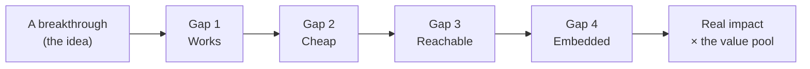

The paper that made all of this possible came out in 2017. It was called ["Attention Is All You Need"](https://arxiv.org/abs/1706.03762). Claude Code, the thing I now use to do a day's work in an afternoon, showed up in 2025 and got good in 2026. That's roughly **nine years** for one idea to grow up — to go from a clever result in a paper to something a whole industry runs on.

Here's the part that took me a while to see: almost none of those nine years were spent making the idea *better*. The transformer was already the transformer. What took nine years was everything *around* it catching up.

We don't really have a good word for that. We say a technology "takes off," as if it were a single moment. It isn't. Growing up is a slow process with a shape — and the shape is worth learning, because once you can see it, you can tell a breakthrough that's about to change your life from one that's still ten years out. So here's the whole post in one line: **maturing is not the idea getting better. It's the world catching up to it.**

And it's this blog's usual thesis, one size larger. [The model is the rented part; the system around it is the job.](/blogs/blog/migration_is_a_harness/) Scale that up — from a single model to a whole technology growing up in the world — and you get the same shape.

> The breakthrough is the cheap part. Growing up is the job.

Software people have an old name for believing the opposite. [Fred Brooks](https://en.wikipedia.org/wiki/No_Silver_Bullet), back in 1986, called the hoped-for fix the **silver bullet**: every few years a technology promises a ten-times jump, and Brooks argued none would deliver, because the hard part of software was never the typing — it's deciding what the thing should do. The transformer is the first technology I've seen that even aims at that hard part. And still it took nine years of unglamorous work — cost, access, harness — before it landed. Brooks's rule didn't break. It moved: the silver bullet finally showed up, and the world still had to spend a decade building the gun around it.

---

## Four gaps, not one

We talk about technology as if there's a single line: it works, therefore it matters. That line is wrong. Between "it works in a lab" and "it changes an industry" there are **four separate gaps**, and each one has to close on its own schedule. Those four gaps *are* what we call maturing — nothing more, nothing less.

| Gap | It closes when… | The old idea behind it |
|---|---|---|
| **1. Works** | it does a *real, bounded, valuable* task reliably — not a cherry-picked demo | [the bitter lesson](http://www.incompleteideas.net/IncIdeas/BitterLesson.html), scaling laws — the capability curve |
| **2. Cheap** | the cost per unit of useful work drops below the thing it's replacing | [experience curves](https://en.wikipedia.org/wiki/Experience_curve_effects) — cost falls as volume grows |
| **3. Reachable** | a normal person can try it and *see* it work, without being an expert | [diffusion of innovations](https://en.wikipedia.org/wiki/Diffusion_of_innovations) — trialability and observability |
| **4. Embedded** | the surrounding system exists: tools, workflows, standards, trust, org change | [complementary assets](https://en.wikipedia.org/wiki/Complementary_assets); the [productivity J-curve](https://www.nber.org/papers/w25148) |

Look at gap 4 for a second. That's this whole blog. The harness, the memory layer, the knowledge base, `CLAUDE.md`, the tests that act as receipts — that is the "surrounding system" a raw model needs before it can do real work. **The thing I've been calling "the job" is gap 4 for the entire LLM era.**

The gaps close in roughly this order, but they overlap, and — this is the important part — **they close at wildly different speeds.** An idea is only as grown-up as its slowest gap.

---

## Two rules

Once you see the four gaps, two rules fall out. They're the whole formula.

**The clock rule: an idea grows up at the speed of its *widest* gap, not its narrowest.**

Hype watches gap 1. Every demo, every benchmark, every "look what it did" clip is about capability. But the technology doesn't land until the *slowest* of the four gaps closes — and that's almost never gap 1. This is exactly why [Amara's Law](https://en.wikipedia.org/wiki/Roy_Amara) is true: *"We tend to overestimate the effect of a technology in the short run and underestimate the effect in the long run."* We see gap 1 close and assume the rest follow next week. They don't. They take years, quietly, while everyone's disappointed.

**The magnitude rule: how much a grown-up idea matters is set by the value pool it sits on.**

A chess engine crossed all four gaps decades ago. It plays better than any human alive. It changed almost nothing about the economy, because there was no giant pool of money and labor tied up in "humans playing chess." A coding agent crosses the same four gaps and sits on top of the entire global software-labor budget. Same maturity. Completely different earthquake.

So the formula, in one line:

> **Impact ≈ (the value pool) × [all four gaps closed] — and it arrives at the speed of the widest gap.**

One rule tells you *how big*. The other tells you *how long*. Most arguments about technology confuse the two — people point at a huge value pool (gap: big!) and conclude it'll happen soon (clock: unrelated).

---

## The worked example: transformer to your terminal

Let me run the formula backwards on the thing I actually know. Here's how the four gaps closed for AI coding — how the idea grew up.

| Gap | When it closed | What closed it |
|---|---|---|
| **Works** | 2017 → 2020 → 2024 | Transformer, then GPT-3 scale, then [reasoning trained on verifiable rewards](/blogs/blog/what_comes_after_transformer/) — which finally made multi-step code reliable, not just plausible |
| **Cheap** | 2020 → 2026 | Inference cost per token fell by orders of magnitude — Mixture-of-Experts, distillation, open weights, better chips |
| **Reachable** | 2022 → 2025 | ChatGPT was the moment *language* became reachable; Copilot, then Cursor, then Claude Code were the moment *code* became reachable — you watch it write something and the tests pass |
| **Embedded** | 2024 → 2026 | The harness: the agent loop, tools, [MCP](/blogs/blog/agent_driven_design/), git as [durable state](/blogs/blog/agents_arent_the_point_state_is/), tests as feedback, skills, `CLAUDE.md` |

Notice the shape. **Capability raced ahead and stopped being the bottleneck around 2020.** The other six years were gaps 2, 3, and 4. The nine-year childhood of this idea was not the idea getting smarter. It was the world building the parts around it.

That's the clock rule in one story. The widest gap for LLMs was gap 4 — embedding — and it set the pace for everything.

And nine years is the *short* version of this story. The transformer was act three of an idea that had been waiting since 1958, when Rosenblatt's [perceptron](https://en.wikipedia.org/wiki/Perceptron) first learned from examples. Act one had a real flaw — Minsky and Papert proved in 1969 that a perceptron couldn't learn even XOR, one of the simplest functions in logic — and act two, backprop, fixed it by 1986. That part *was* the idea getting better, so let me be honest about it. But after 1986 the idea was done, and it still sat for another 26 years, parked at gap 2: no cheap compute, no big data. GPUs got cheap because gamers wanted better graphics; in 2012, [AlexNet](https://en.wikipedia.org/wiki/AlexNet) borrowed two of them and the wait ended. Twenty-six years of "the idea doesn't work," when the truth was "the world hasn't caught up." And notice *who* closed the gap: not the field that needed it — a market next door, by accident.

> **Lesson 1:** when a technology feels stuck, the thing that's stuck is usually not the breakthrough. It's the slowest gap. Find it, and you know what the idea is actually waiting on to grow up.

---

## Why code grew up first

Here's a question worth sitting with. Of all the knowledge work in the world, why did **software** get automated first? Not law, not medicine, not accounting — code. Why?

Because code has the **smallest gap 4** of any serious domain. Its complementary parts are almost free:

- **It's verifiable.** Tests are a reward signal you get for nothing. The machine can check its own work. (I've called this [tests as receipts](/blogs/blog/migration_is_a_harness/) before.)
- **It's structured.** Git is free, actor-agnostic state. The syntax tree is free context. The work already lives in a shape a machine can pick up and put down.
- **It's observable.** Code runs, or it doesn't. There's no committee arguing about whether it's good.
- **It's expensive.** Software labor is one of the biggest value pools there is. The magnitude rule was always going to be kind to it.

Everything a raw model needs to become useful — a feedback loop, a memory of the work, a way to tell right from wrong — code hands over for free. In every other field you'd have to *build* those things, and building them is slow and expensive. That's gap 4 being wide.

This gives a genuinely useful rule of thumb, the kind of thing you can point at the future:

> **Lesson 2:** a field grows up at the speed of its feedback loop. Where truth is cheap to check, the machine arrives early. Where truth is expensive or contested, it arrives late.

Run that forward inside AI itself. The next domains to mature are the ones with cheap ground truth — parts of math, parts of finance and operations, anything where the answer can be checked by a machine. The last will be the ones where "correct" is a matter of taste, judgment, or care, and no test can settle it. Not because the model can't do them — because gap 4 is expensive there, and the clock runs slow.

---

## Now run it forward: quantum computing

This is the part I actually wanted to write. Everyone asks "is quantum computing the next AI?" The formula gives a sharper answer than yes or no. Score it against the four gaps.

| Gap | AI coding (2026) | Quantum computing (2026) |
|---|---|---|
| **Works** | ✅ raced ahead early | ❌ still limited by error correction; a handful of narrow problems |
| **Cheap** | ✅ collapsed | ❌ cryogenic, capital-heavy, no experience curve at scale |
| **Reachable** | ✅ the ChatGPT moment | ❌ no way for a normal person to try it and see it work |
| **Embedded** | ⏳ the slow part | ❌ almost no software, few algorithms, no ecosystem |

Look at the *shape*, not just the checks. AI and quantum are almost mirror images.

For LLMs, capability came first and the slow gap was embedding — gap 4. Growing up was **inevitable but delayed**: the engine was running, the world just had to build the car around it.

For quantum, **all four gaps are open, and the widest one is gap 1 — the physics itself.** That changes everything about the prediction. When the rate-limiter is embedding, you're waiting on engineers and habits, and that's a matter of years. When the rate-limiter is *capability*, you're waiting on physics, and nobody can put a date on physics.

So the honest read: "quantum is the next AI" is the wrong comparison, at least for now. The two are at different stages of growing up, gated by different gaps. Quantum's clock is set by the hardware, not the software — which means the right thing to watch is gap 1 (are we getting reliable logical qubits?), and the right thing to ignore is the demos and the funding rounds. Those are gap-1 excitement leaking into a [hype-cycle](https://en.wikipedia.org/wiki/Gartner_hype_cycle) peak, and they tell you nothing about the clock.

> **Lesson 3:** to guess how far off a technology is, don't ask how exciting it is. Ask which gap is widest, and what that gap is waiting on. A gap waiting on engineering closes in years. A gap waiting on physics has no schedule.

---

## Two stories from history: electricity, and the car that's always one year away

If you don't believe the clock rule, history has two clean proofs of ideas that grew up slowly for opposite reasons.

**Electricity.** The electric motor was ready in the 1890s. Factories didn't get much more productive for about *forty years*. Why? Because factories were built around one giant steam engine driving shafts and belts, and you can't just swap the engine — you have to redesign the whole building around small motors on each machine, retrain everyone, rethink the workflow. That's gap 4, and it took a generation. The economist [Paul David told this story](https://en.wikipedia.org/wiki/Productivity_paradox) to explain why computers, too, showed up in every office long before they showed up in the productivity numbers. Which is the same thing Robert Solow said in 1987, in the line every economist quotes: *"You can see the computer age everywhere but in the productivity statistics."* Gap 1 was closed. Gap 4 was not. The idea was capable long before it was grown up.

**The self-driving car.** The opposite failure. We've had impressive demos since the early 2010s, and a confident "next year" every year since. What's stuck? Gap 1 is *jagged* — the car is superhuman on the highway and helpless in a situation it's never seen — and gap 4 is brutal, because the surrounding system here is public trust, regulation, and liability, which move at the speed of law, not code. Ten years of "almost" is Amara's Law wearing a seatbelt.

Two technologies, two different wide gaps, and in both cases the excitement was about a gap that had *already* closed. That's the trap this whole formula is built to avoid.

---

## What happens when the gaps finally close

Now the question that actually scares people. When does a grown-up technology "wake the whole market"?

Not at the breakthrough. At gap 4. [Carlota Perez](https://en.wikipedia.org/wiki/Technological_Revolutions_and_Financial_Capital) splits every technological revolution into two halves: an **installation phase** — the frenzy, the bubble, the capability racing ahead — and a **deployment phase**, where the technology stops being a toy for enthusiasts, turns into boring infrastructure, and *reprices everything it touches*. The labor shock lives in the deployment phase. It's a gap-4 event, not a gap-1 event. Adulthood, not the clever childhood.

And the shape of that shock is something this blog already predicted, from the other end. When a task gets automated, it doesn't vanish evenly. The cheap-to-check parts collapse first (Lesson 2), and what's left is the expensive human residue: judgment, taste, deciding what's worth doing at all. Which is exactly the move I argued for in [you can't fork yourself](/blogs/blog/you_cant_fork_yourself/) — stop being one more worker in the swarm, become the orchestrator. A grown-up technology doesn't delete the human seat. It moves the seat up, to the one job that can't be forked.

So "AI coding wakes the labor market" is true, but be precise about *why*. It's not because the model got smart. It's because the idea finished growing up — gap 4 closed — on top of the biggest value pool in knowledge work. Magnitude rule times clock rule, landing at the same time.

---

## Making it grow up — and what's next

So far this has been a way to *read* an idea's age. Flip it over and the same four gaps become a to-do list for anyone trying to *push* one to grow up — and it turns out "making an idea mature" and "winning with it" are the same act.

Here's the pattern, stated as strategy: **capability leads, complements lag, and whoever builds the complements — not whoever had the breakthrough — both makes the idea mature and keeps the money.** Google published the transformer; the labs that built the harness around it captured the decade. [David Teece](https://en.wikipedia.org/wiki/Complementary_assets) named this forty years ago: owning the engine and owning the road are different businesses.

So the recipe is simple to say and hard to do. Find your widest gap, and deliberately build what's missing:

| If the widest gap is… | The move to close it |
|---|---|
| **Works** | Don't wait for general capability. **Shrink the task** to the slice the jagged frontier already does reliably, and ship that. Then build a *verifiable reward* so it keeps climbing — a checkable answer is why code and math trained so well. |
| **Cheap** | Ride the experience curve on purpose: attack the biggest cost line, distill and quantize, cache, and **take the human out of every step** — a human in every loop caps you at human cost. |
| **Reachable** | Build the *ChatGPT moment* — a non-expert tries it and sees value in seconds. Collapse the time to first win, and make the win **visible**. |
| **Embedded** | Manufacture the missing complement — above all, **a cheap feedback loop**. Where the domain won't hand you free ground truth the way code hands over tests, *build the grader or the simulator yourself*. Then add state, standards, trust, and workflow fit. |

And here's the one hard limit, which is the whole game: **you can buy your way across gaps 2, 3, and 4 with engineering and money. You cannot buy your way across gap 1 when it's waiting on science.** So the real move isn't heroics — it's *choosing a domain where gap 1 is already closed*, then closing gap 4 faster than anyone else.

> **Lesson 4:** you can build cheap, reachable, and embedded. You can't build physics. Pick a field where the science is already done, then win by building the feedback loop first.

Which brings us to the obvious question: what's next? We already scored quantum — all four gaps open, stuck on the physics. Here's the rest of the field, read the same way:

| What's next | Works | Cheap | Reachable | Embedded | Widest gap → read |
|---|---|---|---|---|---|
| **Agentic AI beyond code** — agents that browse, book, run operations | ⏳ jagged | ✅ | ✅ | ⏳ | **Gap 4** — growing up now, one vertical at a time; blocked only where truth is hard to check |
| **Humanoid / embodied AI** — driven by [world models](/blogs/blog/what_comes_after_transformer/) | ❌ but moving | ❌ hardware | ❌ can't try one | ❌ | **Gaps 1 + 2** — a real childhood, capability-gated by engineering, not new physics |
| **AI for science** — drug and material discovery | ✅ in pockets | ⏳ | ⏳ expert-only | ⏳ | **Gap 1, per subfield** — matures fastest where a simulation or experiment gives cheap truth |
| **Quantum · fusion · brain interfaces** | ❌ | ❌ | ❌ | ❌ | **Gap 1 = physics** — a different clock; watch the science, ignore the funding |

The one bet I'd actually make: the next idea to finish growing up is **agentic AI in verifiable verticals** — agents that don't just write code but run real tasks, in domains where the result can be checked. It inherits code's cheap-feedback advantage, and the embedding layer — MCP, A2A, evals — is being poured right now. After it come **robotics** and **AI for science**, both gated by gap 1, both sitting on enormous value pools, so when they land the magnitude rule will be merciless. Anything gated by physics is on a different clock, and no amount of funding moves it.

Notice what every one of these has in common. The way to grow *any* of them up is to build its harness — and the single most valuable piece of harness is the one that hands the machine cheap ground truth. That's Lesson 2 turned into a business plan, and it's the same claim this blog started with: the model is the rented part, and the system you build around it is the job.

---

## The idea isn't mine

None of the pieces here are original, and pretending otherwise would break the one rule this blog actually keeps. The four gaps are a repackaging of work that's been sitting in plain sight for decades:

- **Amara's Law** — Roy Amara, on over- and under-estimating. The clock rule is just his line with a mechanism attached.
- **Diffusion of Innovations** — Everett Rogers, on why trialability and observability (my gap 3) decide adoption, and Geoffrey Moore's *Crossing the Chasm* on the cliff between the curious and the mainstream.
- **Experience curves** — the old observation (often called Wright's Law) that cost falls predictably with volume. That's gap 2.
- **General-purpose technology** economics — Bresnahan and Trajtenberg on why a few technologies (steam, electricity, the computer) reshape everything, and Erik Brynjolfsson's [productivity J-curve](https://www.nber.org/papers/w25148) on why they *lower* measured productivity first, while everyone quietly rebuilds around them. That's gap 4, with a number on it.
- **Complementary assets** — David Teece on why the inventor usually isn't the one who gets rich. Google published the transformer. OpenAI, Anthropic, and Nvidia captured the impact. Inventing the engine and owning the road are different businesses.
- **Technological revolutions** — Carlota Perez on installation versus deployment.

What I've done is line them up against one lineage I know from the inside, and notice they're all describing the same thing: the four stages of an idea growing up.

And the honest catch, because the formula cuts both ways: it is equally a cure for "it's all just hype" and for "this time is different." Both are lazy. One stares at a wide gap and calls the whole thing fake; the other stares at a closed gap and calls the whole thing imminent. The formula's only demand is that you say *which gap you mean* before you make a prediction.

---

## Where this leaves us

The transformer was finished in 2017. The impact showed up years later, and when it did, it came from the least glamorous work imaginable: making it cheap, making it reachable, and building the harness around it. That's what growing up looks like for an idea. The breakthrough was the easy part. It's almost always the easy part.

That's the uncomfortable lesson for anyone trying to spot the next big thing. You will be shown gap 1 — the demo, the benchmark, the breakthrough — and asked to bet on impact. Don't. Go find the widest gap instead. Ask what it's waiting on. If it's waiting on engineering and habit, it's coming, slower than the hype and bigger than you think. If it's waiting on physics, no one knows.

> **Lesson:** a breakthrough tells you an idea is *possible*. It tells you almost nothing about when it grows up, or how much it will matter when it does. For that, stop watching the idea. Watch the four gaps around it — and time the slowest one.
