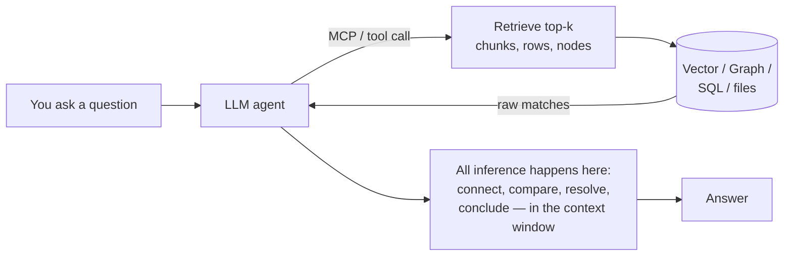
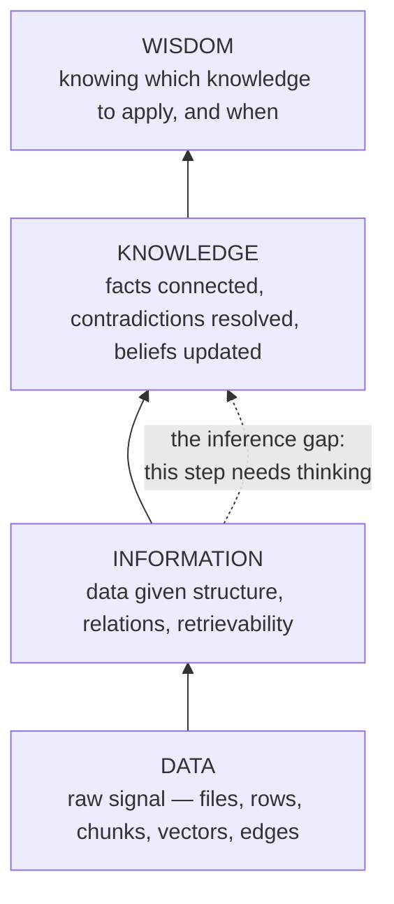
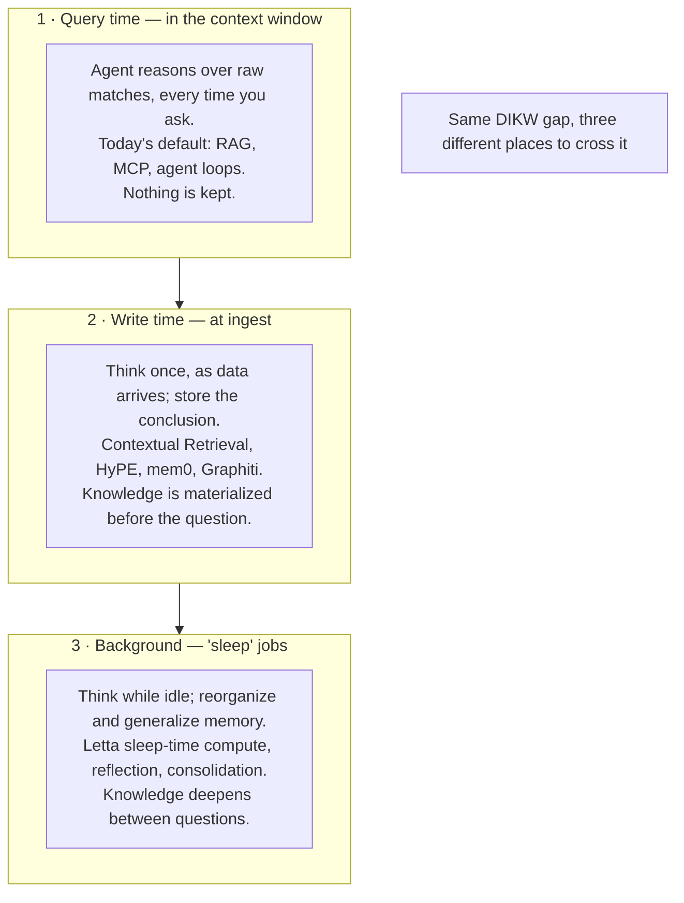
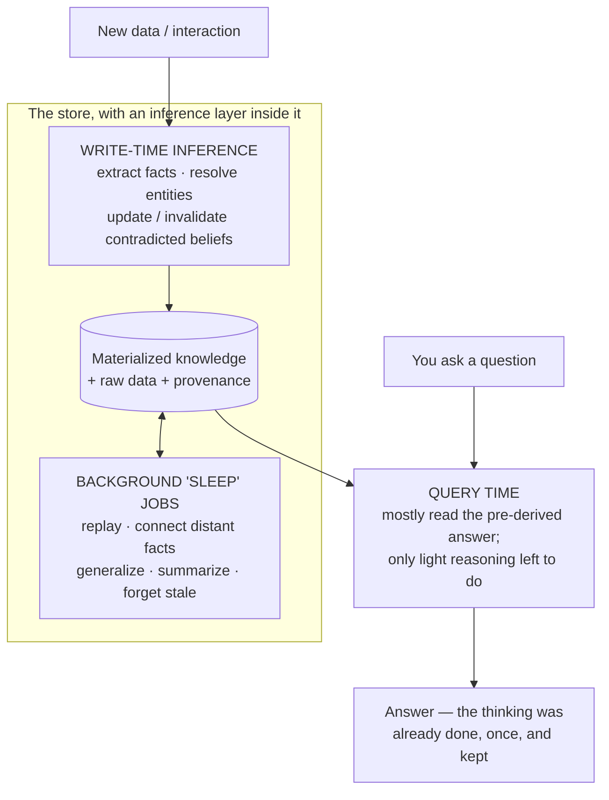
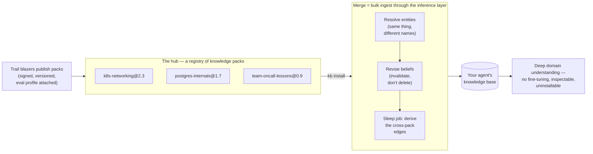

Everyone building with AI right now is quietly building a knowledge base. You give the agent a folder of markdown, or a vector index, or a graph of your codebase, and you call it "memory." I did the same. Then I spent a while asking a simpler question — *is any of this actually a knowledge base, or is it just a well-organized pile of stuff I still have to think about myself?* This post is where I landed. The short version: **most of what we call a knowledge base is storage, and storage is the easy half.** The hard half is the thinking, and almost nobody puts the thinking where it belongs.

## Far far ago

Before the vector database, before RAG, before any of it, two people already had the whole idea.

The first is [Donald Hebb](https://en.wikipedia.org/wiki/Donald_O._Hebb). In *The Organization of Behavior* (1949) he wrote the sentence that neuroscience has been unpacking ever since: *"When an axon of cell A is near enough to excite cell B and repeatedly or persistently takes part in firing it, some growth process or metabolic change takes place... such that A's efficiency, as one of the cells firing B, is increased."* The bumper-sticker version you've heard — *"neurons that fire together, wire together"* — is a later paraphrase, not his words, but it captures the point. Memory, biologically, is not a stored symbol sitting in a slot. It is a **strengthened connection**. The primitive is the *link*.

The second is [Vannevar Bush](https://en.wikipedia.org/wiki/Memex). In 1945, in *As We May Think*, he described the **Memex** — a desk that stored your documents on microfilm and, crucially, let you build **associative trails** between them. The name is "memory" plus "index." Bush explicitly rejected the alphabetical, hierarchical filing of a library as "artificial," and proposed retrieval "by association... as we may think." His primitive, too, is the link.

Sit with that for a second, because it sets up everything below. Eighty years ago the two founding visions of machine memory both agreed the unit was the **association** — the edge between two things. And that is *exactly* what a graph database's edges and a vector database's nearest-neighbors are. We built Hebb's synapse and Bush's trail. We nailed it.

But here is the part nobody quotes: **neither of them described a machine that thinks.** The Memex stores and links. It does not read your trails and tell you what they mean. Hebb's synapse strengthens on its own; there is no separate engine sitting on top deriving conclusions. Both men gave us the storage layer and stopped there — because in 1945 and 1949 that was the entire dream. We inherited the dream and, eighty years later, we are *still* mostly stopping there too.

## The current state of knowledge base

Look at what we actually reach for today when we say "knowledge base." Four things:

- **File-based LLM wikis** — plain markdown, wikilinks, a `CLAUDE.md` or a folder of notes the agent reads. The "database" is a filesystem.
- **Structured DBs** — Postgres, SQLite: rows, columns, foreign keys.
- **Vector DBs** — Qdrant, Chroma, FAISS, pgvector: text chunked, embedded, retrieved by cosine similarity.
- **Graph DBs** — Neo4j, FalkorDB, Kuzu: entities and the typed edges between them.

Every one of these is genuinely good at its job. And every one of them is **storage**. Ask any of them a question and the honest answer is the same: *"here are the rows / chunks / nodes that look relevant — you figure out the answer."* The figuring-out doesn't happen in the database. It happens somewhere else.

Where? In the model's head. The dominant architecture of 2026 looks like this — the store is dumb, the agent is smart, and all the thinking happens in the context window at the moment you ask:



This works. RAG works, agents work, MCP works. But notice what it *costs* and what it *forgets*. Every single question re-does the thinking from scratch. You ask "who owns this service and has that changed?" — the model re-reads the chunks, re-connects the facts, re-resolves the contradiction, answers, and then **throws all of that reasoning away.** The next person asks the same question and pays for the same thinking again. The knowledge was never *kept*. Only the raw information was kept. The knowledge lived for one context window and died.

That is the gap I want to talk about. And to name it precisely, we need the old pyramid.

## The pyramid of DIKW

```
Data -> Information -> Knowledge -> Wisdom
```

The DIKW hierarchy is old and a bit corporate, but it cuts exactly where we need it to:



- **Data** is the raw signal — the PDF bytes, the log line, the chunk.
- **Information** is data with structure and retrievability — parsed, chunked, embedded, indexed. *This is where every storage engine tops out.*
- **Knowledge** is where facts get **connected** ("these two services share an owner"), where you **generalize** ("this team always ships on Fridays"), where you **resolve contradictions** ("the config said X in Q1 but Y now — Y wins"), and where you **update beliefs** as the world changes.
- **Wisdom** is knowing which knowledge to apply when. Leave that one for the philosophers.

The move from Information to Knowledge is not a bigger index or a better embedding model. **It is an act of inference.** Something has to *think* to cross that line. That's the whole thesis of this post in one sentence: a vector DB, a graph DB, a structured DB, a file wiki — they are all magnificent Data→Information machines, and the reason they are not knowledge bases is that **nothing in them crosses the inference gap.** We bolt the thinking on afterward, in the agent, at query time, and then delete it.

So the real question isn't "which database?" It's "**where do we put the thinking?**"

## Where the thinking happens

There are only three places inference can live. Every memory system ever built picks one or more of them, whether or not it says so out loud.



**Query time** is the architecture we just drew — the default. Cheap to build, expensive to run, and amnesiac by design.

**Write time** is more interesting, and it is quietly everywhere already. The trick is: do the thinking *once*, as the data comes in, and store the *result* alongside the data. A few real examples, because this is the crux:

- Anthropic's [Contextual Retrieval](https://www.anthropic.com/engineering/contextual-retrieval) has an LLM read each chunk *in the context of its whole document* and prepend a sentence situating it, **before** embedding. That one write-time inference step cuts top-20 retrieval failures by 35% on its own, 49% with contextual BM25, and 67% with reranking. The thinking that a plain vector DB would force onto the query is instead baked into the index once.
- [HyPE](https://machinelearningplus.com/gen-ai/hype-rag-how-hypothetical-prompt-embeddings-solve-question-matching-in-retrieval-systems/) goes further and, at ingest, generates the *hypothetical questions* each chunk could answer, then embeds *those*. Retrieval becomes question-to-question matching. All the LLM work moved to write time; the query is pure vector math.
- [mem0](https://github.com/mem0ai/mem0) is the clearest case. When you add a message, an LLM extracts the atomic facts and then a second "memory manager" LLM compares each fact to what's already stored and decides: **ADD, UPDATE, DELETE, or NOOP.** That is contradiction resolution and belief revision — genuine Knowledge-layer work — running *inside the memory system at write time*, not in your agent at query time.
- [Zep's Graphiti](https://github.com/getzep/zep) makes belief revision a first-class storage primitive: every fact-edge carries a validity window, and when a new fact contradicts an old one, the old edge is **invalidated, not deleted** — so you can ask "what's true now?" *and* "what was true then?" ([paper](https://arxiv.org/abs/2501.13956); it reports 94.8% on Deep Memory Retrieval and up to +18.5% on LongMemEval at ~90% lower latency than stuffing the full transcript).

**Background inference** is the third place, and it's the one that most closely mirrors how *your own head* works — which brings us to the idea I actually want to pitch.

## An inference layer on the DB layer

Here's the proposal, stated plainly: **stop pushing all the thinking up into the agent. Push an inference layer down onto the database.** Let the store itself derive, connect, resolve, and consolidate — at write time, and in background "sleep" jobs while it's idle — so that by the time a question arrives, the knowledge is already there to be read, not re-derived.

Why "sleep"? Because the best knowledge base we know of already does exactly this. Your brain does **not** keep raw experience. During sleep, the hippocampus *replays* the day's episodes and gradually teaches them to the neocortex, and in the process it **restructures** them — throwing away most of the episodic detail and keeping the generalized pattern. As Singh, Norman & Schapiro put it, consolidation is "not a simple strengthening of individual memories... but a restructuring that acts to **update our internal models of the world** to better reflect the environment over time." That sentence is almost a definition of the Information→Knowledge step. And the substrate it writes into is Hebb's synapse, from the top of this post. The circle closes: the brain stores with associations (write time) *and* re-derives knowledge offline (background). It does not wait for you to ask a question before it understands your day.

The AI field is, right now, rediscovering this — and it has names for it:



- **[Generative Agents](https://arxiv.org/abs/2304.03442)** (Park et al., 2023) gave us **reflection**: periodically, the agent takes its recent raw observations, asks itself "what are the most salient high-level questions here?", answers them, and stores the *insights* back as new memory nodes that point to their sources. Repeat, and you get a *tree* — raw observations at the leaves, increasingly abstract derived knowledge above. That's a sleep job producing Knowledge from Information.
- **[Letta](https://github.com/letta-ai/letta)** made it a named scaling axis: **sleep-time compute** ([paper](https://arxiv.org/abs/2504.13171)). A background "sleep-time agent" runs while the main agent is idle, rewriting raw context into "learned context." Reported result: ~5× fewer tokens to hit the same accuracy, up to +18% on reasoning tasks, ~2.5× lower cost per query — because the expensive thinking is done once, in advance, and amortized across every future question.
- **[HippoRAG](https://arxiv.org/abs/2405.14831)** (NeurIPS 2024) is the cleanest proof it can live in the *index*: offline, an LLM builds a knowledge graph (the "artificial hippocampal index"); at query time, a cheap Personalized PageRank walk does multi-hop reasoning in one step. Up to +20% on multi-hop QA, 10–20× cheaper than iterative query-time retrieval. The knowledge integration was pushed **down into the store**.

Now — before this sounds like I invented something — the honest truth is that **"put inference in the database" is a fifty-year-old idea that has been built three times**, and each attempt teaches us what the 2026 version needs.

| Era | What it was | What it got right | Why it stalled |
|---|---|---|---|
| **Symbolic** (1980s–now) | Deductive DBs / Datalog, rule engines (Rete/CLIPS), OWL reasoners. [RDFox](https://www.oxfordsemantic.tech/) does *incremental* Datalog materialization; [GraphDB](https://www.ontotext.com/products/graphdb/) forward-chains at load time, Stardog reasons lazily at query time | The **engine architecture** — write-time vs query-time derivation, and incremental maintenance of derived facts with provenance | The **knowledge-acquisition bottleneck**: rules and ontologies were hand-written, brittle, closed-world, couldn't generalize. (This is precisely what LLMs now automate — and why Samsung bought RDFox in 2024.) |
| **In-DB ML** (2020s) | [PostgresML](https://postgresml.org/) runs models inside Postgres; [MindsDB](https://mindsdb.com/) exposed models as SQL "AI Tables"; Weaviate/pgai embed at write time | Models *can* run in or beside the engine; "move the models to the data, not the data to the models" | The inference was **per-row** — embed, classify, predict. It produced Information, never *connected* Knowledge. Vendors drifted toward agents and federation |
| **LLM-at-ingest** (2024–now) | [GraphRAG](https://github.com/microsoft/graphrag) pre-computes entity graphs and community summaries at index time; LlamaIndex property graphs; Graphiti's temporal graph | Finally materializes **real** knowledge — summaries, resolved entities, invalidated beliefs | **Cost** (GraphRAG indexing runs 10–40× vector RAG), **staleness** (batch pipelines update poorly), and an **extraction-quality ceiling**. Microsoft's own *LazyGraphRAG* retreated much of it back to query time |

So the idea is not just plausible — it's *converged upon* from three independent directions. What no one has yet assembled is the **union**: LLM-grade inference (which removes the symbolic era's rule-writing bottleneck) running on top of engine-grade incremental maintenance and provenance (which the symbolic era got right), with **bi-temporal belief revision** as a native storage primitive (Graphiti's move, but in the engine), governed by a **cost-based planner** that decides, per derivation, whether to think now (write time), later (sleep job), or never-until-asked (query time). That last piece is the real insight hiding in the GraphRAG-vs-LazyGraphRAG fight: **eager vs lazy is not a doctrine, it's a query-optimizer decision** — the same `index-vs-scan` tradeoff databases have made for decades, now measured in tokens.

Two caveats I owe you, because I don't want to sell a fantasy:

1. **Write-time thinking isn't free.** It costs write latency, and bad consolidation causes *drift* — the store confidently believing something wrong, at machine speed. Tellingly, mem0's v3 algorithm (April 2026) actually *retreated* from write-time UPDATE/DELETE back to append-only, pushing conflict resolution to read time. The eager approach I'm advocating is a real tradeoff, not a free lunch.
2. **Non-monotonic beliefs are hard to maintain.** When a source changes, the engine has to know exactly which *derived* knowledge to invalidate and cheaply re-derive. Symbolic systems (RDFox's deletion/re-derivation) solved this for hard logic; nobody has solved it for soft, probabilistic, LLM-derived facts with confidence scores. This is the open research problem, and it's a good one.

## A hub of knowledge

Now back to the Memex, because earlier I only told you half of it — and the half I skipped is the reason I'm writing this post at all.

Bush did not stop at private trails. Read [the 1945 essay](https://www.theatlantic.com/magazine/archive/1945/07/as-we-may-think/303881/) to the end and you find he described a complete *economy* of knowledge. He described ready-made knowledge you drop into your own machine: *"Wholly new forms of encyclopedias will appear, ready made with a mesh of associative trails running through them, ready to be dropped into the memex and there amplified."* He described sharing — the owner with a good trail *"sets a reproducer in action, photographs the whole trail out, and passes it to his friend for insertion in his own memex, there to be linked into the more general trail."* He described a market (*"Most of the memex contents are purchased on microfilm ready for insertion"*) and even a profession: *"There is a new profession of trail blazers, those who find delight in the task of establishing useful trails through the enormous mass of the common record."*

And then the line that gives me chills: *"The inheritance from the master becomes, not only his additions to the world's record, but for his disciples **the entire scaffolding by which they were erected**."* You don't just inherit the master's conclusions. You inherit the connected structure that produced them.

That is the idea: **once knowledge is materialized in the store, knowledge is an artifact — and artifacts compose.** A knowledge base becomes something you can copy, diff, version, sign, publish, *download*, and **merge into a bigger one**. Imagine a hub of knowledge, the way npm is a hub of code and Hugging Face is a hub of weights: your agent needs to understand Kubernetes networking, so you `install` the pack a trail blazer already built, it merges into your agent's store, and the agent has deep understanding of the domain **without a second of training**. It's the closest real thing to Neo's *"I know kung fu"* — except it's a JSON file.

Notice what training *cannot* do here. Fine-tuning is per-model, slow, opaque, and permanent — you can't diff it, can't inspect it, can't uninstall it, and it quietly forgets things it wasn't supposed to. A knowledge pack is model-agnostic cargo: plug it into whatever reasoner you run today, swap the reasoner tomorrow, keep the knowledge. And this is already happening in embryo: Understand-Anything's committed `knowledge-graph.json` lets teammates *skip the pipeline* entirely; Graphify literally ships a `merge-graphs` command; GitNexus stitches separate repo graphs together across API-contract links; the skills marketplaces distribute procedural knowledge as installable folders. The two giant precedents point the way and mark the trap: [Wikidata](https://en.wikipedia.org/wiki/Wikidata) — communal, machine-readable, CC0, over a hundred million items — is the closest thing to a working hub today, while [Cyc](https://en.wikipedia.org/wiki/Cyc) spent four decades hand-authoring one proprietary universal knowledge base and never became the substrate anyone builds on. The bazaar beat the cathedral in software; I'd take the same bet for knowledge.

But here is the catch, and it's the same catch as the whole post. The naive merge — the one I first sketched in my notes as "concat two graphs" — is one line:

```
merged = (nodes_A ∪ nodes_B,  edges_A ∪ edges_B)
```

Union the nodes, union the edges, done. And what you get is exactly what this post has been warning about: a **bigger pile of information, not bigger knowledge.** Three things go wrong, and they should look familiar by now:

1. **Identity.** Graph A has a node `Postgres`, graph B has `PostgreSQL`. The union happily keeps both, and your "bigger" graph is now *worse* — the trails don't connect where they should. Entity resolution is mandatory (the semantic web spent a decade on `owl:sameAs` learning this).
2. **Contradiction.** A says the service default is X, B — built six months later — says Y. Union keeps both, silently. Your agent now flips a coin at answer time.
3. **The missing edges.** The real reason to merge at all: the connections that exist in *neither* input. A knows your service runs Postgres 14; B knows Postgres 14 has a particular vacuum behavior. The edge that matters — *your service is exposed to that behavior* — is not in A, not in B, and no union operation will ever produce it. Only inference does.

Which delivers the punchline this whole post was building toward: **merging is just a big write.** If your store already has the inference layer from the previous section, composition falls out of the same machinery — a pack import is bulk ingest through the same resolve → revise → derive pipeline, and the sleep job afterward is what welds the new knowledge to the old. Concatenation is what happens *without* the inference layer. **Composition is what happens with it.** (Your brain agrees: integrating new learning into old schemas is precisely what sleep consolidation is for.)



Concretely, a pack needs surprisingly little — the manifest, the facts, and (this is the valuable part) the *pre-derived* knowledge, so you inherit the scaffolding and not just the record:

```
postgres-internals@1.7/
  manifest.json      # name, version, license, author, signature,
                     # eval profile (its scorecard — see next section)
  entities.jsonl     # nodes: canonical name, aliases, embedding
  claims.jsonl       # edges: subject, predicate, object,
                     # confidence, valid_at, provenance
  derived/           # the expensive thinking, already done:
                     # summaries, tours, resolved contradictions
```

And the install path is the inference layer wearing a package manager's clothes:

```python
def install(kb, pack):
    verify(pack.signature)                    # trust before truth

    ids = {}
    for e in pack.entities:                   # 1 · identity
        match = kb.resolve(e)                 # exact -> alias -> embedding -> context
        ids[e.id] = match.id if match else kb.add(e, source=pack.name).id

    for c in pack.claims:                     # 2 · belief revision
        c = c.rewrite(ids)
        for old in kb.contradicting(c):
            kb.invalidate(old, superseded_by=c)   # bi-temporal: keep history
        kb.add(c, source=pack.name, trust=pack.trust)

    kb.schedule_sleep(scope=ids.values())     # 3 · the actual point: derive
                                              #     the edges neither graph had
```

Wrap it in the developer experience we already know from software, and the Memex economy is suddenly very buildable:

```
kb search "postgres internals"       # browse the hub
kb install postgres-internals@1.7    # download, verify, merge
kb why "connection pooling limit"    # provenance: which pack claims this?
kb remove postgres-internals         # try doing THAT to a fine-tune
kb publish ./my-oncall-lessons       # become a trail blazer
```

A `kb.lock` pinning pack versions and content hashes gives you something slightly wild if you say it out loud: a **reproducible mind** — the exact same agent knowledge, rebuilt on any machine.

Two design notes before I oversell it. First, you don't always want to *download*. Sometimes you want to **link** — leave the pack living on someone else's server and query it over MCP at answer time. That's federation, and it is our old friend for the third time in this post: download-and-merge is *eager* (fast, offline, private, but stale and you pay the merge), federation is *lazy* (always fresh, zero merge cost, but latency, dependency, and your questions leak to someone else's server). Bush's memex and today's MCP are the two ends of the same axis, and the cost-based planner from the previous section should be choosing per pack.

Second — and this is the part that keeps me honest — a hub of knowledge is a **supply chain**, and supply chains get poisoned. A malicious or merely wrong pack makes your agent confidently, consistently wrong, at machine speed, in everything downstream of the merge. Signatures and per-fact provenance are table stakes (that's what `kb why` is for), but the deeper question is: how do you *grade* a pack you didn't build, before you let it into your agent's head? You already know my answer — it's the next section. Score every pack along the interesting dimensions and stamp the profile on it, the way an npm package wears its test badge. The hub isn't just a registry of knowledge; it's a registry of **graded** knowledge, or it's a registry of confident lies.

## How to evaluate

Say you build this. How do you know it's any *good*? This is where I got stuck for a long time, and where I think the standard approach quietly fails.

The naive plan is: write a big test set of questions with known answers, run them, count how many are right. It doesn't scale, for a reason that sounds philosophical but is completely practical: **the space of questions a knowledge base can be asked is effectively infinite.** You cannot enumerate it. Any test set you write is a microscopic, and probably biased, sample of it. (This isn't just my hand-waving — the NeurIPS 2025 construct-validity survey of ~445 benchmarks says it outright: benchmark items are "finite sets... drawn from a larger possible set," and found 27% of benchmarks just use whatever questions were convenient.)

So if you can't enumerate the questions, what do you do? You do what every serious benchmark *already secretly does*: **stop sampling questions, and start sampling **abilities**.** Pick a small set of dimensions that a real knowledge base must be good at, generate questions *per dimension*, score them, and report a **profile — not a single number.**

```mermaid
graph LR
    KB[("Knowledge base<br/>under test")] --> D
    subgraph D["Pick ~6-8 interesting dimensions"]
        d1["Multi-hop connection"]
        d2["Temporal reasoning"]
        d3["Belief update / contradiction"]
        d4["Abstention (knowing what it doesn't know)"]
        d5["Consistency & completeness"]
        d6["Provenance & freshness"]
    end
    D --> G["Generate questions<br/>per dimension"]
    G --> J["LLM-as-judge<br/>score 0-5 with an anchored rubric"]
    J --> P["A ranked profile,<br/>not one accuracy number"]
    P --> W["See the shape:<br/>strong at recall,<br/>weak at belief-update"]
```



The good news is that almost every *piece* of this already exists, and I'd be a fraud not to name the predecessors:

- **The dimension idea is the standard, not the exception.** [LongMemEval](https://arxiv.org/abs/2410.10813) defines exactly five memory abilities — *information extraction, multi-session reasoning, temporal reasoning, knowledge updates,* and *abstention* — and finds commercial assistants drop ~30% in accuracy across sustained interaction. [LoCoMo](https://arxiv.org/abs/2402.17753) uses five question categories. [RGB](https://arxiv.org/abs/2309.01431) uses four RAG abilities. Nobody scores "all questions"; everybody scores a profile over a taxonomy.
- **Per-dimension question generation** already ships in [RAGAS](https://github.com/explodinggradients/ragas), whose test-set generator builds a knowledge graph over your corpus and emits questions per query-type with a configurable distribution (single-hop, multi-hop-abstract, multi-hop-specific).
- **The 0–5 rubric-judge machinery** is well-trodden: [FLASK](https://arxiv.org/abs/2307.10928) is the closest single precedent — 4 abilities / 12 skills, each scored 1–5 against a skill-specific rubric, reported as a **radar profile** — and Prometheus/G-Eval supply battle-tested judges. (Watch the known biases: judges favor longer answers, prefer their own model family, and cluster around the middle of the scale. Mitigations exist — anchored rubrics, reference answers, rationale-before-score, cross-family judge panels — and the consistent finding is that *"even a mediocre rubric, consistently applied, beats a strong judge with a generic prompt."*)
- **"Report a profile, not a number"** is just [HELM](https://arxiv.org/abs/2211.09110)'s whole philosophy — 7 metrics across a scenario matrix.

So what's actually *new* here, and worth building? The **synthesis and the target.** Every benchmark above measures the *system answering questions*. None of them measures the **knowledge-base layer itself** — and none combines the two families of dimensions that a real KB lives or dies by:

- **Inference-side abilities** (from the memory benchmarks): multi-hop *connection*, temporal reasoning, belief *update*, abstention.
- **Storage-side quality** (from the linked-data quality literature — [Zaveri et al.'s 18 dimensions](https://www.semantic-web-journal.net/content/quality-assessment-linked-data-survey): consistency, completeness, timeliness, provenance/trustworthiness).

Cross those two families, generate questions per cell, score 0–5 with a careful rubric, and you get a *shape* — a fingerprint of your knowledge base that tells you it's great at recall but can't revise a belief, or perfectly consistent but stale. That shape is worth infinitely more than one accuracy percentage, and it maps *exactly* onto the three-loci architecture above: the write-time and background inference layers are precisely what move the needle on belief-update, temporal, and consistency dimensions that pure storage always fails. Which is the neat part — **the same dimensions that grade a knowledge base also *define* what makes one.** A store that scores well on connection, contradiction, and freshness isn't a well-graded database. It's a knowledge base. That was the whole point.

## Something related

The reading and the tools behind everything above — grouped, and where a group is big enough, put side by side so you can compare.

### Advanced retrieval techniques

Moving inference to *write time* so the query gets cheaper and sharper.

- [HyPE — Hypothetical Prompt Embeddings](https://machinelearningplus.com/gen-ai/hype-rag-how-hypothetical-prompt-embeddings-solve-question-matching-in-retrieval-systems/) — generate each chunk's likely *questions* at ingest, embed those; retrieval becomes question-to-question matching.
- [Anthropic — Contextual Retrieval](https://www.anthropic.com/engineering/contextual-retrieval) — an LLM situates each chunk in its document before embedding; −67% retrieval failures with reranking. The cleanest "inference at ingest" case.
- [Claude Cookbook — Contextual Embeddings guide](https://platform.claude.com/cookbook/capabilities-contextual-embeddings-guide) — the runnable version, with Pass@k numbers over 9 codebases.

### Agent memory frameworks

Where the "inference layer beside the store" is already shipping. The columns to watch are the ones this whole post is about: *where* each one thinks, and what it does when two memories disagree.

| Framework | Storage | Where it thinks | When memories conflict | Pick it when |
|---|---|---|---|---|
| [claude-mem](https://github.com/thedotmack/claude-mem) | SQLite + FTS5 (optional Chroma vectors) | **Background, at ingest** — an async worker LLM-compresses sessions into typed observations | Nothing — observations stay isolated; connecting them is left to the reading agent | You live in Claude Code and want cheap session recall; its whole pitch is token economics (~10× savings via progressive disclosure) |
| [mem0](https://github.com/mem0ai/mem0) ([paper](https://arxiv.org/abs/2504.19413)) | Vector (Qdrant default) + optional graph + SQLite history log | **Write time** — an LLM extracts facts, then picks ADD / UPDATE / DELETE / NOOP against what's already stored | The textbook belief revision, at write time — though v3 retreated to append-only, resolving at read | You want a general-purpose memory API over stores you choose |
| [cognee](https://github.com/topoteretes/cognee) | Graph + vector + relational — can run entirely on one Postgres | **Write time** (`cognify` builds the graph) *and* **background** (`improve`/`memify` enrich it) | Partial — LLM entity consolidation merges fragmented, conflicting descriptions | You want a semantic knowledge graph derived from arbitrary data, self-hosted |
| [Zep / Graphiti](https://github.com/getzep/zep) ([paper](https://arxiv.org/abs/2501.13956)) | Temporal graph on Neo4j / FalkorDB / Neptune | **Write time** — entity resolution, fact extraction, temporal dating | The best story here — bi-temporal edges: contradicted facts are *invalidated, never deleted*; "true now" and "true then" both queryable | Your facts change over time and you need to know *when* |
| [Letta](https://github.com/letta-ai/letta) ([paper](https://arxiv.org/abs/2504.13171)) | Postgres + vectors, organized as memory blocks | **Background** — a dedicated *sleep-time agent* rewrites memory while the main one is idle | Via consolidation — the sleep agent cleans, merges, and reorganizes | You're building stateful agents; this is the "sleep jobs" locus, literally named |
| [engram](https://github.com/Gentleman-Programming/engram) | One Go binary, one SQLite file — FTS5 only, no embeddings | **Write time, by the agent itself** — it decides what's worth saving; conflict scans run on demand | Explicit — an LLM judges conflicts into a relations table (`conflicts_with`, `supersedes`) | You want zero-dependency, local-first memory for coding agents |
| [Maximem (Synap)](https://www.maximem.ai/) | Hosted; polyglot vector + graph + files | **Write time** (multi-stage ingestion) *and* **background** consolidation cycles modeled on sleep | Contradiction detection, retraction processing, decay, deliberate forgetting | You'd rather pay than operate — vendor benchmarks, take with salt (as they themselves advise) |

### Code-as-knowledge-graph

Materialized inference over a codebase — build the knowledge once, query it cheaply forever. The interesting split in this group is *how much of the deriving is an LLM* versus deterministic algorithms.

| Tool | How the graph is built | Where the LLM is | Output & query | Pick it when |
|---|---|---|---|---|
| [Understand-Anything](https://github.com/Lum1104/Understand-Anything) | Tree-sitter for structure, LLM agents for meaning — summaries, layers, guided tours | **Build time**, plus git-hook incremental updates (zero tokens on cosmetic changes) | A committable `knowledge-graph.json`; chat greps it; the dashboard needs no LLM at all | You want a codebase that *teaches* — onboarding, tours, and teammates who skip the pipeline |
| [GitNexus](https://github.com/abhigyanpatwari/GitNexus) | Deterministic end-to-end: Tree-sitter + graph algorithms — Leiden clustering, call-flow tracing, impact scoring | **Nowhere in the pipeline** — "Precomputed Relational Intelligence"; an LLM only *reads* the results | Embedded graph DB (WASM — runs fully in-browser); 17 MCP tools, raw Cypher | You want hard structure for agent tooling — "what breaks if I change this?" — on code that never leaves the machine |
| [Graphify](https://github.com/safishamsi/graphify) | Tree-sitter for code (36 grammars, $0); every edge tagged `EXTRACTED` vs `INFERRED` | **At ingest, only for non-code** (docs, PDFs, media); `reflect` does deterministic, time-decayed belief updating | `graph.json` + optional Neo4j / FalkorDB; `merge-graphs` for composition | Mixed folders — code plus docs plus PDFs — and it publishes real LOCOMO / LongMemEval numbers, which is rare honesty |

### Research

- [MEMO: Memory-Augmented Model Context Optimization](https://arxiv.org/abs/2603.09022) (ICML 2026) — a self-play framework that distills game trajectories into a memory bank via CRUD-style consolidation and injects them as priors; roughly *doubles* win rates and, notably, uses **TrueSkill ratings** to score under an infinite state space — the "rank along dimensions" idea applied to evaluation itself.

### Tools and frameworks

The Data→Information front-end. Necessary, and — the point of this whole post — *not where the thinking is*. The "thinking inside" column proves it: at most you get perceptual models (layout, OCR), never knowledge-making.

| Tool | Input | Output | Thinking inside | Pick it when |
|---|---|---|---|---|
| [Docling](https://www.docling.ai/) (IBM) | PDF, Office, images, audio | Structured `DoclingDocument` → Markdown / JSON | Perceptual only — layout models, TableFormer, OCR | Complex PDFs where table structure and reading order matter |
| [MarkItDown](https://github.com/microsoft/markitdown) (Microsoft) | Office files, ZIP, EPub, even YouTube URLs | LLM-ready Markdown | Optional — an LLM can caption images | You want one lightweight converter in front of a model |
| [Unstructured](https://github.com/Unstructured-IO/unstructured) | 25+ document types | Typed elements (Title, Table, …) plus chunking and embedding | Perceptual — layout detection in hi-res mode | Production ETL pipelines feeding vector stores |
| [PyMuPDF](https://pymupdf.io) / [PyMuPDF4LLM](https://github.com/pymupdf/PyMuPDF4LLM) | PDF (Office with Pro) | Text, tables, one-liner Markdown | None — "no GPU, no cloud, no tokens" | Speed, and extraction that stays local |
| [python-pptx](https://python-pptx.readthedocs.io/en/latest/) / [openpyxl](https://openpyxl.readthedocs.io/en/stable/) | PPTX / XLSX | Python object models — read *and write* | None — pure parsing | You need to *generate* decks and spreadsheets, not just read them |

And one that doesn't fit the table because it isn't a parser at all:

- [anthropics/skills](https://github.com/anthropics/skills) — knowledge as folders of `SKILL.md` + scripts, loaded by progressive disclosure. Human-authored knowledge, materialized as files — a hand-made knowledge pack, if you've read this far.

### Claude-native primitives

The opposite bet from this whole post: keep the store dumb (grep-able markdown), push *all* inference up into the agent's context window.

- [Claude Code memory](https://code.claude.com/docs/en/memory) — `CLAUDE.md` hierarchy plus auto-memory, where Claude writes its own learnings to disk during a session. The one place it climbs the pyramid — but in the live context window, with no background consolidation and no contradiction resolution.
- [Claude Cookbook — Contextual Embeddings guide](https://platform.claude.com/cookbook/capabilities-contextual-embeddings-guide) — the write-time counter-move: pay an LLM once at ingest so retrieval stays sharp.

---

If there's one thing to carry out of here: **a database stores information; a knowledge base derives knowledge.** The difference is an act of inference, and the only real question is *where you put it* — in the agent every time you ask (amnesiac and expensive), or down in the store, once, at write time and in its sleep (kept, and cheap forever). Eighty years after Hebb and Bush handed us the storage layer, the interesting work left is the layer they never built: the one that thinks. And build that, and Bush's other prophecy comes free — the trail, photographed out, passed to a friend, and *linked into the more general trail*. Not just a knowledge base. An exchange.
