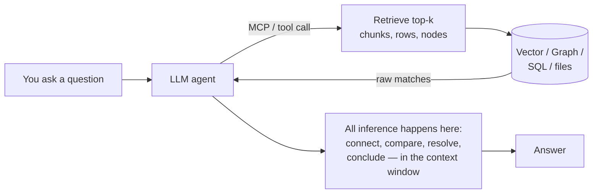
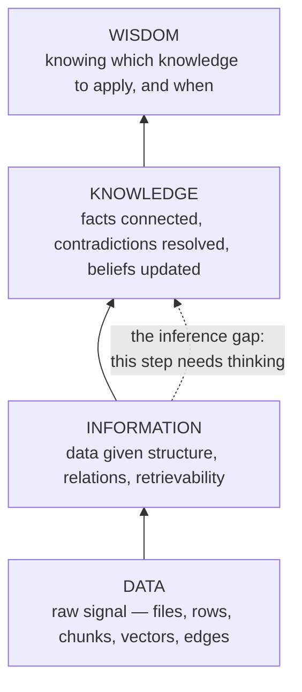
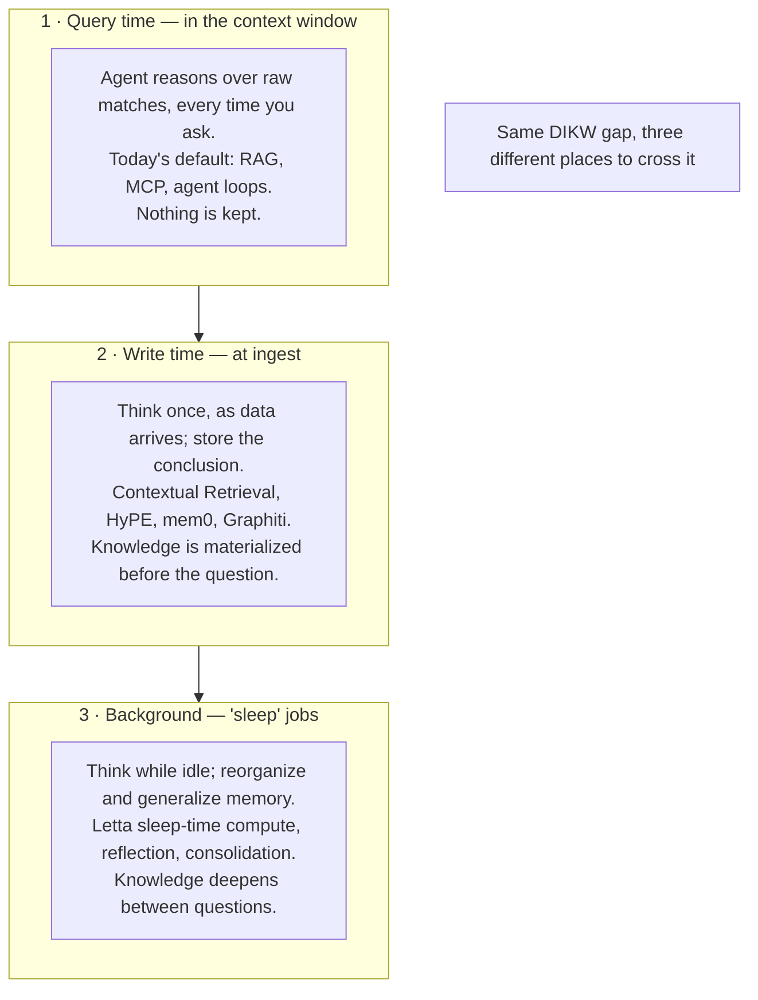
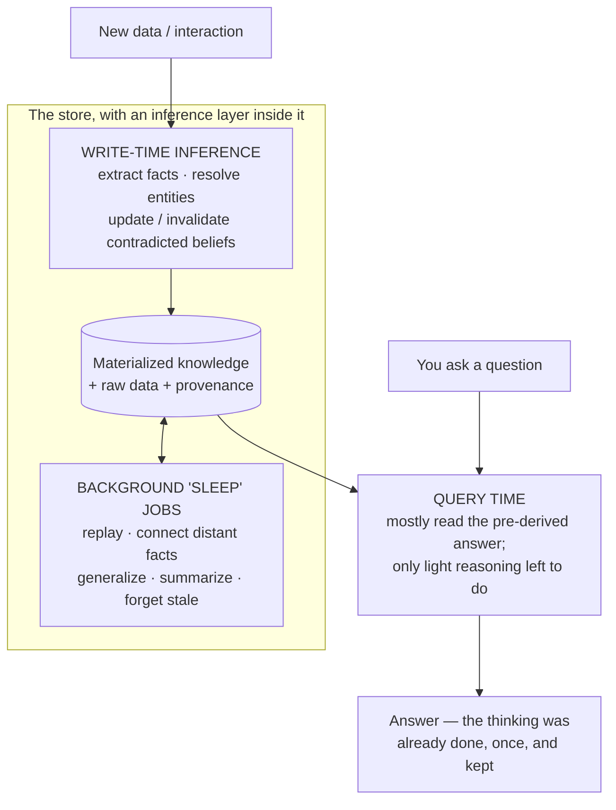
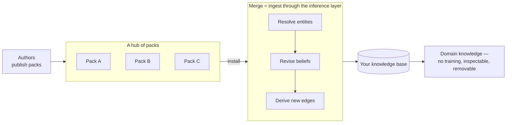
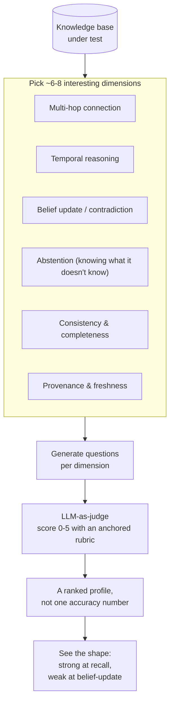

Everyone building with AI right now is quietly building a knowledge base. You give the agent a folder of markdown, or a vector index, or a graph of your codebase, and you call it "memory." I did the same. Then I spent a while asking a simpler question. *Is any of this really a knowledge base? Or is it just a tidy pile of stuff I still have to think about myself?* This post is where I landed. The short version: **most of what we call a knowledge base is storage, and storage is the easy half.** The hard half is the thinking, and almost nobody puts the thinking where it belongs.

## Far far ago

Before the vector database, before RAG, before any of it, two people already had the whole idea.

The first is [Donald Hebb](https://en.wikipedia.org/wiki/Donald_O._Hebb) (1904–1985), the man often called the father of neuropsychology. In *The Organization of Behavior* (1949) he wrote the sentence that neuroscience has been chewing on ever since: *"When an axon of cell A is near enough to excite a cell B and repeatedly or persistently takes part in firing it, some growth process or metabolic change takes place in one or both cells such that A's efficiency, as one of the cells firing B, is increased."* The short version you've heard — *"neurons that fire together, wire together"* — is a later paraphrase, not his words, but it captures the point. In biology, memory is not a stored symbol sitting in a slot. It is a **strengthened connection**. The basic unit is the *link*. (One detail is easy to skip: A must fire *first* and help *cause* B. The rule is about causal order, not coincidence. The lab didn't confirm that timing detail until about 50 years later, when it was named spike-timing-dependent plasticity.)

Hebb didn't stop at the rule. He built the whole book *up* from it, and every floor he added is something we are now rebuilding in software. When neurons keep firing together they bind into a **cell assembly** — a team that acts as one unit and holds a single concept. (The old word for such a stored trace, coined by Richard Semon back in 1904, is an *engram*. Keep that word, it comes back.) Because the team is wired to itself, lighting up *part* of it re-lights the *whole*. A scrap of a cue brings back the whole memory, which is just associative recall by another name. One assembly can then trigger the next, and the next: a **phase sequence**, which Hebb argued *is* a train of thought. Hold that phrase. A chain of linked memories firing in order is exactly Bush's *trail* below, and exactly a path through a graph. The two founders were describing one thing from two directions.

He even had a theory of *time*. Before a connection sets, Hebb said, activity keeps **looping** around the assembly, holding the pattern alive. If the loop runs long enough it drives the slow physical change that makes the memory permanent. Short-term memory becoming long-term memory: an early sketch of what we now call **consolidation**. His version only makes a trace *stick*; it isn't a machine that reasons over its traces. But he already had the *shape* of the idea a later section of this post leans on hard: write it down when it fires, then reprocess it later while offline. The background "sleep" jobs further down are not a metaphor I reached for. They are Hebb's looping, grown up.

And there is one crack in the rule that turns out to be the most important thing in this whole post. Pure "fire together, wire together" is **unstable**. A strong link fires together more, which strengthens the link, which fires them together even more. It is a runaway loop that ends with everything wired to everything and nothing able to tell anything apart. Biology's fix, and every artificial version since (Oja's rule, the BCM theory, homeostatic plasticity), does the same thing: it makes some connections *weaker* and caps the total. Neuroscience even names the downstroke: long-term *depression*, the mirror of potentiation. **The lesson, eighty years early: a memory that only ever adds destroys itself. Forgetting is not decay to be kept small — it is half of the machine.** Pocket that too. Later we reach the systems that resolve contradictions and let stale facts fade on purpose, and the reason merging two knowledge bases by plain union makes them *worse*. This is why.

The second is [Vannevar Bush](https://en.wikipedia.org/wiki/Memex). In 1945, in *As We May Think*, he described the **Memex** — a desk that stored your documents on microfilm and, most importantly, let you build **associative trails** between them. The name is "memory" plus "index." Bush flatly rejected the alphabetical, hierarchical filing of a library as "artificial," and proposed retrieval "by association... as we may think." His basic unit, too, is the link.

Sit with that for a second, because it sets up everything below. Eighty years ago the two founding visions of machine memory both agreed the unit was the **association** — the edge between two things. And that is *exactly* what a graph database's edges and a vector database's nearest-neighbors are. We built Hebb's synapse and Bush's trail. We nailed it.

But here is the part nobody quotes: **neither of them described a machine that thinks.** The Memex stores and links. It does not read your trails and tell you what they mean. Hebb's synapse strengthens on its own; there is no separate engine sitting on top drawing conclusions. Both men gave us the storage layer and stopped there, because in 1945 and 1949 that was the entire dream. We inherited the dream, and eighty years later we are *still* mostly stopping there too.

## The current state of knowledge base

Look at what we actually reach for today when we say "knowledge base." Four things:

- **File-based LLM wikis** — plain markdown, wikilinks, a `CLAUDE.md` or a folder of notes the agent reads. The "database" is a filesystem.
- **Structured DBs** — Postgres, SQLite: rows, columns, foreign keys.
- **Vector DBs** — Qdrant, Chroma, FAISS, pgvector: text chunked, embedded, retrieved by cosine similarity.
- **Graph DBs** — Neo4j, FalkorDB, Kuzu: entities and the typed edges between them.

Every one of these is genuinely good at its job. And every one of them is **storage**. Ask any of them a question and the honest answer is the same: *"here are the rows / chunks / nodes that look relevant — you figure out the answer."* The figuring-out doesn't happen in the database. It happens somewhere else.

Where? In the model's head. The main architecture of 2026 looks like this. The store is dumb, the agent is smart, and all the thinking happens in the context window at the moment you ask:



This works. RAG works, agents work, MCP works. But notice what it *costs* and what it *forgets*. Every single question re-does the thinking from scratch. You ask "who owns this service and has that changed?" The model re-reads the chunks, re-connects the facts, re-settles the contradiction, answers, and then **throws all of that reasoning away.** The next person asks the same question and pays for the same thinking again. The knowledge was never *kept*. Only the raw information was kept. The knowledge lived for one context window and died.

That is the gap I want to talk about. And to name it exactly, we need the old pyramid.

## The pyramid of DIKW

```
Data -> Information -> Knowledge -> Wisdom
```

The DIKW hierarchy is old and a bit corporate, but it splits things exactly where we need it to:



- **Data** is the raw signal — the PDF bytes, the log line, the chunk.
- **Information** is data with structure, so you can find it again — parsed, chunked, embedded, indexed. *This is where every storage engine tops out.*
- **Knowledge** is where facts get **connected** ("these two services share an owner"), where you **generalize** ("this team always ships on Fridays"), where you **resolve contradictions** ("the config said X in Q1 but Y now — Y wins"), and where you **update beliefs** as the world changes.
- **Wisdom** is knowing which knowledge to apply when. Leave that one for the philosophers.

The move from Information to Knowledge is not a bigger index or a better embedding model. **It is an act of inference.** Something has to *think* to cross that line. That's the whole thesis of this post in one sentence: a vector DB, a graph DB, a structured DB, a file wiki — they are all wonderful Data→Information machines, and the reason they are not knowledge bases is that **nothing in them crosses the inference gap.** We bolt the thinking on afterward, in the agent, at query time, and then delete it.

So the real question isn't "which database?" It's "**where do we put the thinking?**"

## Where the thinking happens

There are only three places inference can live. Every memory system ever built picks one or more of them, whether or not it says so out loud.



**Query time** is the architecture we just drew — the default. Cheap to build, expensive to run, and forgetful by design.

**Write time** is more interesting, and it is quietly everywhere already. The trick: do the thinking *once*, as the data comes in, and store the *result* next to the data. A few real examples, because this is the heart of it:

- Anthropic's [Contextual Retrieval](https://www.anthropic.com/engineering/contextual-retrieval) has an LLM read each chunk *in the context of its whole document* and add a sentence up front placing it, **before** embedding. That one write-time inference step cuts top-20 retrieval failures by 35% on its own, 49% with contextual BM25, and 67% with reranking. The thinking that a plain vector DB would push onto the query is instead baked into the index once.
- [HyPE](https://machinelearningplus.com/gen-ai/hype-rag-how-hypothetical-prompt-embeddings-solve-question-matching-in-retrieval-systems/) goes further. At ingest it generates the *possible questions* each chunk could answer, then embeds *those*. Retrieval becomes question-to-question matching. All the LLM work moved to write time; the query is pure vector math.
- [mem0](https://github.com/mem0ai/mem0) is the clearest case. When you add a message, an LLM pulls out the atomic facts. Then a second "memory manager" LLM compares each fact to what's already stored and decides: **ADD, UPDATE, DELETE, or NOOP.** That is contradiction resolution and belief revision — real Knowledge-layer work — running *inside the memory system at write time*, not in your agent at query time.
- [Zep's Graphiti](https://github.com/getzep/zep) makes belief revision a first-class storage feature. Every fact-edge carries a validity window, and when a new fact contradicts an old one, the old edge is **invalidated, not deleted** — so you can ask "what's true now?" *and* "what was true then?" ([paper](https://arxiv.org/abs/2501.13956); it reports 94.8% on Deep Memory Retrieval and up to +18.5% on LongMemEval at about 90% lower latency than stuffing in the full transcript).

**Background inference** is the third place, and it's the one that most closely mirrors how *your own head* works — which brings us to the idea I actually want to pitch.

## An inference layer on the DB layer

Here's the proposal, stated plainly: **stop pushing all the thinking up into the agent. Push an inference layer down onto the database.** Let the store itself derive, connect, resolve, and consolidate — at write time, and in background "sleep" jobs while it's idle — so that by the time a question arrives, the knowledge is already there to be read, not worked out again.

Why "sleep"? Because the best knowledge base we know of already works this way. Your brain does **not** keep raw experience. During sleep it *replays* the day and **restructures** it — throwing away most of the detail and keeping the general pattern. As Singh, Norman & Schapiro put it, consolidation is "not a simple strengthening of individual memories... but a restructuring that acts to **update our internal models of the world** to better reflect the environment over time." That sentence is almost a definition of the Information→Knowledge step, and it writes into Hebb's synapse from the top of this post. The circle closes: the brain stores by association as things happen (write time) *and* re-derives knowledge offline (background). It does not wait for you to ask a question before it understands its day. (Which part of the brain does which job, I come back to below.)

The AI field is, right now, rediscovering this — and it has names for it:



- **Reflection** ([Generative Agents](https://arxiv.org/abs/2304.03442)) — the agent now and then turns its raw observations into higher-level insights and stores *those*, linked back to their sources; derived knowledge stacks up above the raw record.
- **Sleep-time compute** ([Letta](https://github.com/letta-ai/letta)) — a background agent rewrites raw context into "learned context" while the main one is idle, so the expensive thinking is done once and reused for every later question.
- **Index-time graph building** ([HippoRAG](https://arxiv.org/abs/2405.14831)) — an LLM builds the knowledge graph offline, so a cheap graph walk answers multi-hop questions at query time instead of reasoning it all out again from scratch.

Three names, one move: do the expensive thinking in advance, and keep it.

Now — before this sounds like something I invented — **"put inference in the store" is a fifty-year-old idea, built three times.** Each attempt got one piece right and got stuck on another:

| Era | The idea | Got right | Got stuck on |
|---|---|---|---|
| **Symbolic** (1980s–) | logic engines derive new facts from stored ones, by rule | the *engine* — deriving at write or query time, and keeping the derived facts up to date | the rules were hand-written: fragile, closed-world, couldn't generalize |
| **In-DB ML** (2020s) | run the models next to the data instead of shipping data to the models | inference *can* live inside the engine | it worked row-by-row — it produced Information, never *connected* Knowledge |
| **LLM-at-ingest** (2024–) | an LLM builds the graph, summaries, and resolved entities at index time | it finally builds *real* knowledge | cost, staleness, and a ceiling on extraction quality |

So the idea isn't just plausible — it's been *arrived at* from three directions. What nobody has put together yet is the **union**: LLM-grade inference (which fixes the hand-written-rule problem) on an engine that keeps its derived facts up to date with provenance (which the symbolic era got right), able to **revise beliefs** as the world changes — all decided by one choice made per fact: **think now (write time), later (sleep job), or never-until-asked (query time)?** You can watch the field work this out in real time. [GraphRAG](https://github.com/microsoft/graphrag) derived everything eagerly at index time, and Microsoft's own *LazyGraphRAG* pushed much of it back to query time. Eager-vs-lazy isn't a rule to obey — it's the same `index-vs-scan` tradeoff databases have always made, now measured in tokens.

Two warnings, because I don't want to sell a fantasy:

1. **Write-time thinking isn't free.** It adds write latency, and bad consolidation causes *drift* — the store confidently believing something wrong, at machine speed. It's a real tradeoff, not a free lunch: [mem0](https://github.com/mem0ai/mem0) actually *backed away* from write-time updates back to append-only, moving conflict resolution to read time.
2. **Beliefs are hard to unwind.** When a source changes, the engine has to know which *derived* facts to invalidate and re-derive. Classic logic systems solved this for hard rules; nobody has for soft, probabilistic, LLM-derived facts with confidence scores. That's the open problem — and a good one.

## The self-wiring graph

Everything above says *put inference in the store*, but stays vague about how. Here is the most concrete mechanism I know, and it comes straight from the Hebb section at the top of this post.

Picture the difference between a map and a lawn. A normal knowledge graph is a map: someone draws the edges once, and they sit there forever, all equally important, no matter how the graph is used. A lawn is different. Walk the same line across it every day and a path appears — nobody drew it; the walking made it. Stop walking, and the grass grows back. **Make the graph work like the lawn.** Give every edge a *weight*, and let the weight change with use, exactly the way Hebb said a brain's connections do. His four ideas map onto four database operations:

| Hebb's idea | ...in the brain | ...as a graph-DB operation |
|---|---|---|
| **Learning rule** — fire together, wire together | co-active neurons strengthen their link | **Potentiate**: when two nodes are co-activated — retrieved together, cited in the same answer, used to settle one query — bump the weight of the edge between them (create it if it's missing) |
| **Cell assembly** — part of the team re-lights the whole | a cue reactivates the bound group | **Spreading activation**: a query lights a few seed nodes; activation flows along the weighted edges and pulls in the rest of the cluster. The densely-wired clusters *are* your communities |
| **Phase sequence** — a train of thought | assemblies fire in order | **Trails**: paths walked together build up weight and harden into ready-made reasoning chains — Bush's trail, grown from use instead of drawn by hand |
| **Looping → consolidation** | looping activity is later made permanent | **Consolidate & prune** (the sleep job): distill hot, densely-wired subgraphs into higher-level summary nodes; let cold edges fade; drop what falls below a threshold |

Concretely, every edge carries just two extra numbers: a **strength** and a **last-used date**. Two habits keep those numbers honest. When facts are used together and the answer helped, the links between them get stronger — and if a link doesn't exist yet, it is *born*. While the system is idle, everything unused slowly fades, and links that fade below a threshold get deleted. Strengthen with use; fade with disuse. That's the whole trick, and the second half is the part every naive knowledge base forgets to build:

```python
# POTENTIATION — every time a query co-activates a set of nodes
def on_coactivation(graph, nodes, was_useful):
    delta = +LR if was_useful else -LR           # LTP if it helped, LTD if it misled
    for a, b in pairs(nodes):
        e = graph.edge(a, b) or graph.add_edge(a, b, w=0)
        e.w += delta                             # fire together, wire together
        e.last_seen = clock()

# THE SLEEP JOB — decay, prune, consolidate, normalize (runs while idle)
def sleep(graph):
    for e in graph.edges:
        e.w *= exp(-(clock() - e.last_seen) / TAU)   # disuse fades
        if e.w < PRUNE:
            graph.drop(e)                            # forgetting is half the machine
    for hub in dense_communities(graph):             # reverberation -> consolidation
        summary = llm_distill(hub)                   # a higher-order "insight" node
        graph.add(summary, abstracts=hub.members)
    for n in graph.nodes:
        renormalize(n.edges, cap=W_MAX)              # homeostasis: no runaway
```

To see it move, walk one example through it. Say the agent answers questions about your infrastructure.

- **Day 1.** Someone asks *"why is service A slow?"* The agent pulls three nodes — `service A`, `Postgres 14`, `vacuum behavior` — and the answer turns out to be right. So the links between all three get stronger, including `service A ↔ vacuum behavior`, an edge that **existed in no document anywhere**. Nobody ever wrote that fact down. It was born because two nodes were used together in one good answer.
- **Day 8.** Someone asks about service A again. Retrieval lights the `service A` node, and activation flows down the strong edges, pulling in Postgres and vacuum on its own — last week's use made those paths heavy. The store got smarter without anyone editing it. That is the cell-assembly row of the table: touch part of a memory, and the whole memory lights up.
- **Every night.** The sleep job runs. Every edge fades a little, based on how long since it was last used. The edge to `old load-balancer config`, untouched for months, shrinks below the threshold and is deleted. But the service-A cluster is hot — many strong edges — so the LLM compresses it into one new node: *"service A is exposed to Postgres 14 vacuum stalls."* New knowledge, written by the store itself, out of its own usage.

Compare the graph on day 30 to day 1. It has edges nobody wrote, summaries nobody asked for, and it has deleted junk nobody cleaned. That is what "inference in the store" looks like when it is running.

This is the Hebb flaw from the top of the post, now in code. Potentiation feeds on itself, and a graph where everything is strongly wired is useless — like a book with every sentence highlighted. So **decay-and-prune is not a speed tweak; it is the brake that stops strengthening from destroying the graph.** A store that only ever calls `on_coactivation` and never `sleep` is a Hebbian network with the brakes cut — "a memory that only ever adds destroys itself," now with a line number.

But be honest about where the difficulty actually went. The weight arithmetic above is the easy part — add a bit, fade over time. The two calls that *make knowledge* hide behind innocent helper names. `was_useful` asks: did this retrieval help or mislead? Knowing that is the credit-assignment problem, and I simply assumed it as an input. `llm_distill` turns a hot cluster into an insight — a black-box LLM call. I hid the hard 80% behind two function names, which is exactly the sleight-of-hand this post accuses storage vendors of. The graph bookkeeping is real and cheap; the thinking it wraps is neither. The plastic graph is a good *skeleton* for putting inference in the store — it is not, by itself, the inference.

This lands exactly on the three places from earlier: **potentiation** is cheap write/query-time inference, while **decay, pruning, and consolidation** are the background sleep jobs. But be careful about what this mechanism does *not* give you, because it is easy to oversell. Fading kills *unused* facts, not *wrong* ones. Staleness and falsehood are different things. Picture two edges, "Postgres default = X" (old, wrong) and "Postgres default = Y" (new). If people keep asking about the default, *both* get used, so *both* get stronger — the wrong-but-popular fact is reinforced, not pruned. Hebbian dynamics give you forgetting-by-disuse for free; they do **not** give you contradiction detection for free. Real belief revision still needs something that knows X and Y are rival answers to the same question — Graphiti's explicit invalidation, or an `llm_distill` pass that spots the conflict. The plastic graph makes forgetting cheap; it does not make truth automatic.

And, as with every section here, the idea is not mine. Several people are arriving at it, and I owe you the names *and* the reason it isn't already the default. Spreading activation over weighted networks is fifty years old ([Collins & Loftus, 1975](https://en.wikipedia.org/wiki/Spreading_activation)). ACT-R has modeled memory strength with usage-driven decay for decades. And HippoRAG's query-time PageRank (from earlier) is spreading activation wearing a graph-algorithm hat.

The honest part: Hebbian graphs were tried for decades and *lost* to embeddings and attention. They lost partly to the runaway problem above, and partly to **hub dominance**: popular nodes pile up weight and start pulling every query toward themselves — rich get richer — and the self-balancing cap only partly tames it. So this is a *revival*, not a discovery. The open bet is whether the new ingredient changes the outcome this time: an LLM inside the loop, doing the meaning-work the old weighted graphs never could. [HeLa-Mem](https://arxiv.org/abs/2604.16839) (ACL 2026) builds exactly this pairing: a dynamic graph that "evolves through co-activation patterns," plus **Hebbian Distillation**, where a reflective agent finds densely-connected hubs and distills them into reusable semantic knowledge — looping-into-consolidation, built. [Kairos](https://openreview.net/forum?id=EN9VRTnZbK) is even closer to the pseudocode above: edges walked during *validated* reasoning strengthen (an LTP analog), unused edges weaken (LTD), and entities that keep firing together grow **emergent** edges that were in neither the data nor the schema — the born-from-use edge you watched appear on Day 1.

The catch is the catch from everywhere else in this post: these live as frameworks *over* a graph store (Neo4j, FalkorDB), not inside the engine. Nobody has yet made edge plasticity a native storage feature — a `WEIGHT` that fades on a clock, an index that prunes itself, a `CONSOLIDATE` that runs like `VACUUM`. That is the same missing engine from the last section, now wearing Hebb's coat.

## The same idea, in your head

Step back for a second, because everything in this half of the post — the three places to put inference, the self-wiring graph, the sleep job — is one architecture. And it is not new. Your own head runs it, with three memory systems that split the work the exact way a good knowledge base should.

![A schematic mapping a brain to a knowledge base. The neocortex is drawn as the whole outer sheet — the long-term store, slow and generalized — which maps to consolidated, distilled knowledge. The prefrontal cortex is a highlighted region inside that sheet — working memory, held as live activity — which maps to the context window, discarded after each query. The hippocampus is drawn as a separate internal structure that is not part of the neocortex — fast capture of recent, specific facts — which maps to write-time storage with provenance. A dashed "sleep to consolidation" arrow runs from the hippocampus up into the cortex, mapping to the background sleep job that prunes and distills. A note reads: the mapping is by mechanism, activity versus structure, not tidy anatomy.](./how-to-build-knowledgebase/brain-map.svg)

Read it as three stores and one nightly job:

- **Working memory** lives mostly in the prefrontal cortex, and it is held as *activity* — neurons firing right now. It is tiny, and it vanishes the moment the firing stops. That is the LLM's **context window**: alive during one query, gone after. Pure query-time RAG is a mind with only this — it thinks in the moment and keeps nothing.
- **The hippocampus** captures new facts *fast*, in one shot, with all their specifics. That is **write-time** storage — raw facts kept with their provenance as they arrive.
- **The neocortex** is the slow, permanent, *generalized* store. That is your **consolidated knowledge** — the distilled insight nodes, the summaries, the patterns that hold across many facts.
- **Sleep** is the bridge. The hippocampus replays the day and teaches it to the neocortex, dropping the episodic detail and keeping the pattern. That is the **sleep job** — replay the hot clusters, distill them, prune the rest.

Two honest notes. First, the split is by *mechanism*, not neat geography: the prefrontal cortex is itself part of the neocortex — same sheet, different job (activity vs. structure) — so the picture marks it as a region inside, not a separate organ. The hippocampus, though, really is a separate structure. Second, the brain pays for all three for the same reason a knowledge base does. A single fast store that overwrites as it learns wipes out its old memories — neuroscience calls it *catastrophic interference*, the same failure we already met as the runaway loop, and will meet again as the bad union-merge. Fast capture, a slow general store, and an offline job to move one into the other: that is the shape, whether it is built from neurons or from rows.

## A hub of knowledge

Now back to the Memex, because earlier I only told you half of it — and the half I skipped is the reason I'm writing this post at all.

Bush did not stop at private trails. Read [the 1945 essay](https://www.theatlantic.com/magazine/archive/1945/07/as-we-may-think/303881/) to the end and you find he described a whole *economy* of knowledge. He described ready-made knowledge you drop into your own machine: *"Wholly new forms of encyclopedias will appear, ready made with a mesh of associative trails running through them, ready to be dropped into the memex and there amplified."* He described sharing — the owner with a good trail *"sets a reproducer in action, photographs the whole trail out, and passes it to his friend for insertion in his own memex, there to be linked into the more general trail."* He described a market (*"Most of the memex contents are purchased on microfilm ready for insertion"*) and even a job: *"There is a new profession of trail blazers, those who find delight in the task of establishing useful trails through the enormous mass of the common record."*

And then the line that gives me chills: *"The inheritance from the master becomes, not only his additions to the world's record, but for his disciples **the entire scaffolding by which they were erected**."* You don't just inherit the master's conclusions. You inherit the connected structure that produced them.

That is the idea: **once knowledge is built and stored, knowledge is an artifact — and artifacts snap together.** A knowledge base becomes something you can copy, diff, version, sign, publish, *download*, and **merge into a bigger one**. Imagine a hub of knowledge, the way npm is a hub of code and Hugging Face is a hub of weights. Your agent needs to work on Kubernetes networking, so you `install` a **pack** — one domain's knowledge, bundled into a few files so it can be shared — that a trail blazer already built. It merges into your agent's store, and now — without a second of training — the agent can retrieve and reason over that domain's facts *and the connections someone already worked out between them*. Not literally Neo's *"I know kung fu"* — the agent still has to think at query time, and a pack is knowledge to draw on, not skill wired into the weights — but close enough to feel like it, and it's just a JSON file.

Notice what training *cannot* do here. Fine-tuning is per-model, slow, opaque, and permanent — you can't diff it, can't inspect it, can't uninstall it, and it quietly forgets things it wasn't supposed to. A knowledge pack is model-agnostic cargo: plug it into whatever reasoner you run today, swap the reasoner tomorrow, keep the knowledge. And this is already starting to happen: Understand-Anything's committed `knowledge-graph.json` lets teammates *skip the pipeline* entirely; Graphify literally ships a `merge-graphs` command; GitNexus stitches separate repo graphs together across API-contract links; the skills marketplaces hand out procedural knowledge as installable folders. The two giant examples point the way and mark the trap: [Wikidata](https://en.wikipedia.org/wiki/Wikidata) — communal, machine-readable, CC0, over a hundred million items — is the closest thing to a working hub today, while [Cyc](https://en.wikipedia.org/wiki/Cyc) spent four decades hand-writing one proprietary universal knowledge base and never became the base anyone builds on. The bazaar beat the cathedral in software; I'd take the same bet for knowledge.

But here is the catch, and it's the same catch as the whole post. The naive merge — the one I first sketched in my notes as "just concat two graphs" — is one line:

```
merged = (nodes_A ∪ nodes_B,  edges_A ∪ edges_B)
```

Union the nodes, union the edges, done. And what you get is exactly what this post has been warning about — and exactly what Hebb warned about eighty years ago: a system that only ever *adds* destroys itself. A union is a **bigger pile of information, not bigger knowledge.** Three things go wrong, and they should look familiar by now:

1. **Identity.** Graph A has a node `Postgres`, graph B has `PostgreSQL`. The union happily keeps both, and your "bigger" graph is now *worse* — the trails don't connect where they should. Entity resolution is a must (the semantic web spent a decade on `owl:sameAs` learning this).
2. **Contradiction.** A says the service default is X. B, built six months later, says Y. Union keeps both, without a word. Your agent now flips a coin at answer time.
3. **The missing edges.** The real reason to merge at all: the connections that exist in *neither* input. A knows your service runs Postgres 14; B knows Postgres 14 has a particular vacuum behavior. The edge that matters — *your service is exposed to that behavior* — is not in A, not in B, and no union operation will ever produce it. Only inference does — or, over time, the co-activation of the self-wiring graph from the previous section, which grows that edge the first time both facts light up on one query.

Which is the punchline the whole post was building toward: **merging is just a big write.** If your store already has the inference layer, composition comes for free — importing a pack runs the same resolve → revise → derive pipeline, and the sleep job then welds it onto what was already there. Without that layer, you get concatenation. **With it, you get composition.**



A pack is a folder named `<pack>@<version>` (npm-style), and it needs surprisingly little inside — a manifest, the facts, and (the valuable part) the *already-derived* knowledge, so you inherit the scaffolding, not just the record:

```
<pack>@<version>/
  manifest.json      # name, version, license, author, signature,
                     # eval profile (its scorecard — see next section)
  entities.jsonl     # nodes: canonical name, aliases, embedding
  claims.jsonl       # edges: subject, predicate, object,
                     # confidence, valid_at, provenance
  derived/           # the expensive thinking, already done:
                     # summaries, tours, resolved contradictions
```

And the install path is the inference layer wearing a package manager's clothes:

```python
def install(kb, pack):
    verify(pack.signature)                    # trust before truth

    ids = {}
    for e in pack.entities:                   # 1 · identity
        match = kb.resolve(e)                 # exact -> alias -> embedding -> context
        ids[e.id] = match.id if match else kb.add(e, source=pack.name).id

    for c in pack.claims:                     # 2 · belief revision
        c = c.rewrite(ids)
        for old in kb.contradicting(c):
            kb.invalidate(old, superseded_by=c)   # bi-temporal: keep history
        kb.add(c, source=pack.name, trust=pack.trust)

    kb.schedule_sleep(scope=ids.values())     # 3 · the actual point: derive
                                              #     the edges neither graph had
```

Wrap it in the developer tools we already know, and Bush's knowledge economy is suddenly very buildable:

```
kb search "<topic>"           # browse the hub
kb install <pack>@<version>   # download, verify, merge
kb why "<a claim>"            # provenance: which pack claims this?
kb remove <pack>              # try doing THAT to a fine-tune
kb publish ./<pack>           # become a trail blazer
```

A `kb.lock` that pins pack versions and content hashes buys something wild: a **reproducible mind** — or, less dramatically, reproducible *knowledge*. The same facts and derived structure, rebuilt on any machine (the reasoning still comes from whatever model you plug in).

Two notes before I oversell it. First, you don't always want to *download*. Sometimes you want to **link** — leave the pack on someone else's server and query it over MCP when a question comes. That's federation, and it's the eager-vs-lazy choice again: download-and-merge is *eager* (fast, offline, private, but it goes stale and you pay the merge); linking is *lazy* (always fresh, no merge, but slower, and your questions leak to someone else's server). Same axis as before — pick per pack.

Second, a hub of knowledge is a **supply chain**, and supply chains get poisoned. One bad pack — malicious or just wrong — makes your agent confidently, consistently wrong in everything downstream of the merge. Signatures and per-fact provenance are the bare minimum (that's what `kb why` is for). But the real question is: how do you *grade* a pack you didn't build, before you let it into your agent's head? That's the next section. Score every pack on the dimensions that matter and stamp the profile on it, the way an npm package wears its test badge. A hub is a registry of **graded** knowledge — or it's a registry of confident lies.

## How to evaluate

Say you build this. How do you know it's any *good*? This is where I got stuck for a long time, and where I think the standard approach quietly fails.

The naive plan: write a big test set of questions with known answers, run them, count how many come back right. It doesn't scale, for a reason that sounds philosophical but is completely practical. **The number of questions a knowledge base can be asked is basically infinite.** You can't list them all, so any test set you write is a tiny, probably biased, sample. (I'm not the first to notice: a NeurIPS 2025 survey of construct validity found benchmark questions are just "finite sets... drawn from a larger possible set" — and that a quarter of benchmarks simply used whatever questions were on hand.)

So if you can't list all the questions, stop trying to. Do what every serious benchmark *secretly does already*: **sample abilities, not questions.** Pick a handful of things a real knowledge base must be good at, generate questions *per ability*, score each one, and report a **profile — not a single number.**



Almost every *piece* of this already exists — I'd be a fraud not to name the ones who came before:

- **Scoring abilities, not questions, is the norm.** [LongMemEval](https://arxiv.org/abs/2410.10813) grades five memory abilities — extraction, multi-session reasoning, temporal reasoning, knowledge updates, and abstention — and [HELM](https://arxiv.org/abs/2211.09110) reports a whole matrix of metrics instead of one score. Nobody scores "all questions"; everybody scores a profile over a set of categories.
- **Generating questions per ability** already ships in [RAGAS](https://github.com/explodinggradients/ragas), which builds a small graph over your corpus and emits single-hop, multi-hop, and abstract questions in whatever mix you ask for.
- **Scoring each answer 0–5 against a rubric, with an LLM as judge,** is well-worn ground — [FLASK](https://arxiv.org/abs/2307.10928) does exactly this and reports the result as a radar chart.

One warning, because the judge bites back: LLM judges favor longer answers, prefer their own model family, and cluster around the middle of the scale. The fixes are cheap — an anchored rubric, a reference answer, ask for the reasoning *before* the score, use a panel of different model families — and the rule of thumb is blunt: **a so-so rubric applied consistently beats a strong judge with a generic prompt.**

So what's actually *new* here? The **combination.** Every benchmark above grades a *system answering questions*; none grades the **knowledge-base layer itself**, and none crosses the two families of ability a real KB lives or dies by:

- **Inference-side** (from the memory benchmarks): multi-hop connection, temporal reasoning, belief update, abstention.
- **Storage-side** (from the [linked-data quality literature](https://www.semantic-web-journal.net/content/quality-assessment-linked-data-survey)): consistency, completeness, timeliness, provenance.

Cross the two families, generate questions per cell, score them 0–5, and you get a *shape* — a fingerprint that says this store is great at recall but can't revise a belief, or perfectly consistent but stale. That shape is worth far more than one accuracy number. And it maps straight onto the three places inference can live from before: write-time and background inference are exactly what move belief-update, temporal, and consistency — the dimensions pure storage always fails at.

Which is the neat part. **The same dimensions that grade a knowledge base also *define* one.** A store that scores well on connection, contradiction, and freshness isn't a well-graded database — it's a knowledge base. That was the whole point.

### Or: don't grade the answer, grade its consequences

Notice what every method so far has in common: they grade the answer with a **judge** — a rubric, an LLM, a profile. So ask the obvious question for a FAQ agent: in real life, who is the judge? The user who asked. And that is the one person who *can't* grade it — they asked *because* they don't have the answer. A thumbs-up from them measures whether the answer *felt* right — fluent, confident, on-topic — not whether it *was* right. Worse, the bias runs the wrong way: a confident, well-written, wrong answer collects upvotes; a hedged, correct one collects shrugs. User scores measure satisfaction, and satisfaction is a different axis from truth.

So when the asker can't grade the answer, stop asking the asker and ask **reality**. Feed the knowledge base's answer into the next step, and the next, until you reach something you *can* check — code that runs, a total that reconciles, an action whose result is measurable — and grade the whole chain by that verifiable end. If the thing built on top of the answer works, the answer was good enough. This is why code is the easy case (the CodeAct idea from [coding today](/blogs/blog/coding_today/)): running it is a free, honest grader, with no human in the loop. Same shape as the incident loop in that post — the fix either stopped the outage or it didn't, and *that* is the label.

There's a small ladder of what you can actually check, worth keeping straight:

| What you check | Who grades it | Needs the true answer? |
|---|---|---|
| Fluency / helpfulness | the asker (thumbs) | No — but it isn't correctness |
| **Faithfulness** — did the answer come from the KB, and cite it? | automatic (`kb why`, provenance) | **No** — the cheap escape |
| **Correctness** | a verifiable downstream result | Yes — and this is where you get it |

The middle row is the one people skip. Even without the true answer, you can check whether the answer really traced back to a stored fact instead of being invented — that's what `kb why` and per-fact provenance are for (RAGAS calls it *faithfulness*). It doesn't prove the KB is right — garbage in, garbage out — but it cleanly splits "the KB was wrong" from "the model made something up past the KB." The bottom row, real correctness, is what a downstream check buys you when the asker can't hand it to you.

Two caveats, the same as everywhere else in this post. A downstream pass/fail is **coarse**: it tells you the *pipeline* failed, not *which* step — retrieval, reasoning, or step four. (That is the same credit-assignment problem as `was_useful` from the self-wiring section.) And **not every question ends in something checkable** — a policy lookup may have no crisp result for hours. So this doesn't replace the profile; it patches its weakest spot. Grade the answer (the profile) to see *where* the KB is weak; grade what the answer *causes* (the consequence) to know it's actually *right* where it matters. A real evaluation uses both.

### Evaluate in tiers

Step back, and those two — the profile and the consequence — are really the middle and the end of a **four-tier** stack. No single tier is enough: each draws its truth from a different place, and each has a blind spot the others cover. So don't pick one — **layer them**, pairing a *narrow-but-hard* signal with a *broad-but-soft* one:

| Tier | What it is | Where the truth comes from | Answers |
|---|---|---|---|
| **1 · Golden set** | pre-defined questions with known answers, for the critical few | **you** — you already know the must-not-break answers | Did we break something that matters? |
| **2 · Sample audit** | pull real questions from usage, verify the answers | **an expert / oracle**, per sample | How good are we on what people *actually* ask? |
| **3 · Profile** | questions per ability, scored 0–5 by a judge | **a judge** — approximated, no true answer needed | What's the shape, and is it drifting? |
| **4 · Consequence** | feed the answer into a verifiable task; check provenance | **reality** (the outcome) + the **store** (provenance) | Is it actually right where it counts? |

The first two sharpen the "you can't enumerate the questions" rule rather than break it. You can't enumerate *all* the questions — but you can enumerate the **critical few** and pin them with ground truth. That's the golden set: a **regression gate**, not a coverage tool — the payment that must never double-charge, the compliance answer that can't be wrong. The sample audit is the only tier that reads the *real* question distribution (tiers 1 and 3 test questions *you* chose), and its catch is that the grader can't be the asker — it needs an expert.

The shape of the stack: tiers **1 and 4 give hard truth but narrow coverage** (the curated few, the checkable few); tiers **2 and 3 give broad coverage but a softer signal** (a sample, a judge's guess). Run **3 continuously** to watch the shape and catch drift, **1 on every change** as the gate, **2 now and then** to keep the judge and the golden set honest against reality, and **4 wherever a downstream result actually checks out**. Defense in depth — the same discipline the rest of this post asks for, turned on the evaluation itself.

## Something related

The reading and the tools behind everything above — grouped, and where a group is big enough, laid side by side so you can compare.

### Advanced retrieval techniques

Moving inference to *write time* so the query gets cheaper and sharper.

- [HyPE — Hypothetical Prompt Embeddings](https://machinelearningplus.com/gen-ai/hype-rag-how-hypothetical-prompt-embeddings-solve-question-matching-in-retrieval-systems/) — generate each chunk's likely *questions* at ingest, embed those; retrieval becomes question-to-question matching.
- [Anthropic — Contextual Retrieval](https://www.anthropic.com/engineering/contextual-retrieval) — an LLM situates each chunk in its document before embedding; −67% retrieval failures with reranking. The cleanest "inference at ingest" case.
- [Claude Cookbook — Contextual Embeddings guide](https://platform.claude.com/cookbook/capabilities-contextual-embeddings-guide) — the runnable version, with Pass@k numbers over 9 codebases.

### Agent memory frameworks

Where the "inference layer beside the store" is already shipping. The columns to watch are the ones this whole post is about: *where* each one thinks, and what it does when two memories disagree.

| Framework | Storage | Where it thinks | When memories conflict | Pick it when |
|---|---|---|---|---|
| [claude-mem](https://github.com/thedotmack/claude-mem) | SQLite + FTS5 (optional Chroma vectors) | **Background, at ingest** — an async worker LLM-compresses sessions into typed observations | Nothing — observations stay isolated; connecting them is left to the reading agent | You live in Claude Code and want cheap session recall; its whole pitch is token economics (~10× savings via progressive disclosure) |
| [mem0](https://github.com/mem0ai/mem0) ([paper](https://arxiv.org/abs/2504.19413)) | Vector (Qdrant default) + optional graph + SQLite history log | **Write time** — an LLM extracts facts, then picks ADD / UPDATE / DELETE / NOOP against what's already stored | The textbook belief revision, at write time — though v3 backed away to append-only, resolving at read | You want a general-purpose memory API over stores you choose |
| [cognee](https://github.com/topoteretes/cognee) | Graph + vector + relational — can run entirely on one Postgres | **Write time** (`cognify` builds the graph) *and* **background** (`improve`/`memify` enrich it) | Partial — LLM entity consolidation merges fragmented, conflicting descriptions | You want a semantic knowledge graph derived from any kind of data, self-hosted |
| [Zep / Graphiti](https://github.com/getzep/zep) ([paper](https://arxiv.org/abs/2501.13956)) | Temporal graph on Neo4j / FalkorDB / Neptune | **Write time** — entity resolution, fact extraction, temporal dating | The best story here — bi-temporal edges: contradicted facts are *invalidated, never deleted*; "true now" and "true then" both queryable | Your facts change over time and you need to know *when* |
| [Letta](https://github.com/letta-ai/letta) ([paper](https://arxiv.org/abs/2504.13171)) | Postgres + vectors, organized as memory blocks | **Background** — a dedicated *sleep-time agent* rewrites memory while the main one is idle | Via consolidation — the sleep agent cleans, merges, and reorganizes | You're building stateful agents; this is the "sleep jobs" place, literally named |
| [engram](https://github.com/Gentleman-Programming/engram) | One Go binary, one SQLite file — FTS5 only, no embeddings (named after Hebb's word for a stored memory trace, from the top of this post) | **Write time, by the agent itself** — it decides what's worth saving; conflict scans run on demand | Explicit — an LLM judges conflicts into a relations table (`conflicts_with`, `supersedes`) | You want zero-dependency, local-first memory for coding agents |
| [Maximem (Synap)](https://www.maximem.ai/) | Hosted; mixed vector + graph + files | **Write time** (multi-stage ingestion) *and* **background** consolidation cycles modeled on sleep | Contradiction detection, retraction processing, decay, deliberate forgetting | You'd rather pay than operate — vendor benchmarks, take with salt (as they themselves advise) |

### Code-as-knowledge-graph

Already-built inference over a codebase — build the knowledge once, query it cheaply forever. The interesting split in this group is *how much of the deriving is an LLM* versus plain algorithms.

| Tool | How the graph is built | Where the LLM is | Output & query | Pick it when |
|---|---|---|---|---|
| [Understand-Anything](https://github.com/Lum1104/Understand-Anything) | Tree-sitter for structure, LLM agents for meaning — summaries, layers, guided tours | **Build time**, plus git-hook incremental updates (zero tokens on cosmetic changes) | A committable `knowledge-graph.json`; chat greps it; the dashboard needs no LLM at all | You want a codebase that *teaches* — onboarding, tours, and teammates who skip the pipeline |
| [GitNexus](https://github.com/abhigyanpatwari/GitNexus) | Deterministic end-to-end: Tree-sitter + graph algorithms — Leiden clustering, call-flow tracing, impact scoring | **Nowhere in the pipeline** — "Precomputed Relational Intelligence"; an LLM only *reads* the results | Embedded graph DB (WASM — runs fully in-browser); 17 MCP tools, raw Cypher | You want hard structure for agent tooling — "what breaks if I change this?" — on code that never leaves the machine |
| [Graphify](https://github.com/safishamsi/graphify) | Tree-sitter for code (36 grammars, $0); every edge tagged `EXTRACTED` vs `INFERRED` | **At ingest, only for non-code** (docs, PDFs, media); `reflect` does deterministic, time-decayed belief updating | `graph.json` + optional Neo4j / FalkorDB; `merge-graphs` for composition | Mixed folders — code plus docs plus PDFs — and it publishes real LOCOMO / LongMemEval numbers, which is rare honesty |

### Research

- [MEMO: Memory-Augmented Model Context Optimization](https://arxiv.org/abs/2603.09022) (ICML 2026) — a self-play framework that boils game trajectories down into a memory bank via CRUD-style consolidation and feeds them back in as priors; roughly *doubles* win rates and, notably, uses **TrueSkill ratings** to score under an infinite state space — the "rank along dimensions" idea applied to evaluation itself.

### Tools and frameworks

The Data→Information front-end. Necessary, and — the point of this whole post — *not where the thinking is*. The "thinking inside" column proves it: at most you get perception models (layout, OCR), never knowledge-making.

| Tool | Input | Output | Thinking inside | Pick it when |
|---|---|---|---|---|
| [Docling](https://www.docling.ai/) (IBM) | PDF, Office, images, audio | Structured `DoclingDocument` → Markdown / JSON | Perception only — layout models, TableFormer, OCR | Complex PDFs where table structure and reading order matter |
| [MarkItDown](https://github.com/microsoft/markitdown) (Microsoft) | Office files, ZIP, EPub, even YouTube URLs | LLM-ready Markdown | Optional — an LLM can caption images | You want one lightweight converter in front of a model |
| [Unstructured](https://github.com/Unstructured-IO/unstructured) | 25+ document types | Typed elements (Title, Table, …) plus chunking and embedding | Perception — layout detection in hi-res mode | Production ETL pipelines feeding vector stores |
| [PyMuPDF](https://pymupdf.io) / [PyMuPDF4LLM](https://github.com/pymupdf/PyMuPDF4LLM) | PDF (Office with Pro) | Text, tables, one-liner Markdown | None — "no GPU, no cloud, no tokens" | Speed, and extraction that stays local |
| [python-pptx](https://python-pptx.readthedocs.io/en/latest/) / [openpyxl](https://openpyxl.readthedocs.io/en/stable/) | PPTX / XLSX | Python object models — read *and write* | None — pure parsing | You need to *generate* decks and spreadsheets, not just read them |

And one that doesn't fit the table because it isn't a parser at all:

- [anthropics/skills](https://github.com/anthropics/skills) — knowledge as folders of `SKILL.md` + scripts, loaded by progressive disclosure. Human-written knowledge, turned into files — a hand-made knowledge pack, if you've read this far.

### Claude-native primitives

The opposite bet from this whole post: keep the store dumb (grep-able markdown), push *all* inference up into the agent's context window.

- [Claude Code memory](https://code.claude.com/docs/en/memory) — `CLAUDE.md` hierarchy plus auto-memory, where Claude writes its own learnings to disk during a session. The one place it climbs the pyramid — but in the live context window, with no background consolidation and no contradiction resolution.
- [Claude Cookbook — Contextual Embeddings guide](https://platform.claude.com/cookbook/capabilities-contextual-embeddings-guide) — the write-time counter-move: pay an LLM once at ingest so retrieval stays sharp.

---

If there's one thing to carry out of here: **a database stores information; a knowledge base derives knowledge.** The difference is an act of inference, and the only real question is *where you put it* — in the agent every time you ask (forgetful and expensive), or down in the store, once, at write time and in its sleep (kept, and cheap forever). Eighty years after Hebb and Bush handed us the storage layer, the interesting work left is the layer they never built: the one that thinks. Build that, and Bush's other prophecy comes free — the trail, photographed out, passed to a friend, and *linked into the more general trail*. Not just a knowledge base. An exchange.
