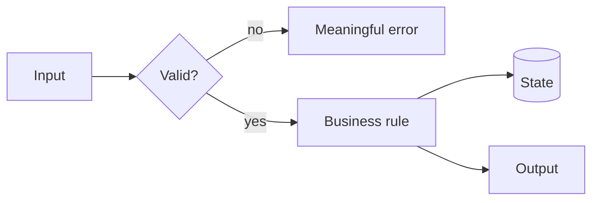
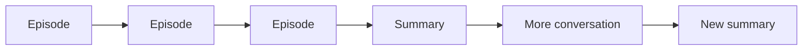
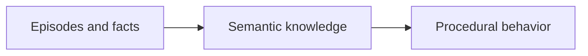
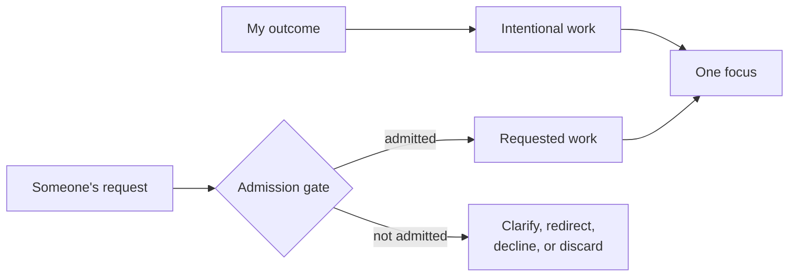
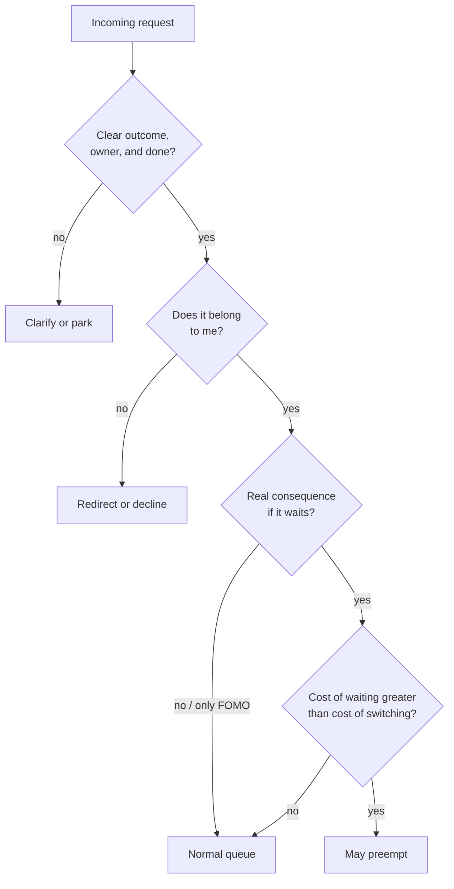
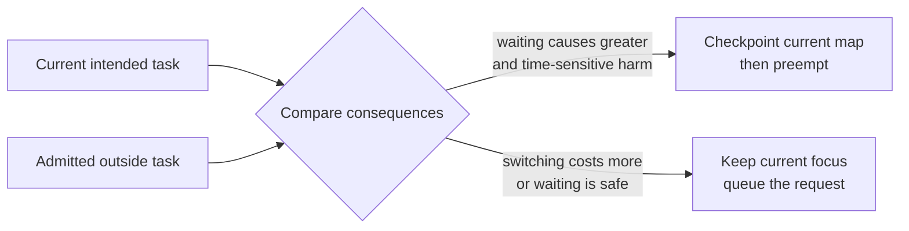

I ended [Through a Senior's Eyes](/blogs/blog/through_a_seniors_eyes/) with one line: **stay on the seat, holding a map.** The seat is the place where the final decision gets made. But what is the map?

It is the structure you carry while the details change: what the system is for, which parts exist, how they connect, what must remain true, where you are now, and where you are trying to go.

Without that map, AI feels smarter than you because it always has a next token. It can explain, propose, and continue without hesitation. You begin by asking it for help and end by following a path you never chose.

The problem is not that the agent generated bad directions. The problem is that you stopped knowing where the directions were taking you.

---

## New things need somewhere to land

We adapt to a new idea faster when we can attach it to a structure already inside us.

A new framework is easier when you can ask: where is the entry point, where does state live, how does data move, and which component owns failure? A new business domain is easier when you can identify its actors, rules, transactions, and boundaries. The names change. The shapes are often familiar.

This is the connection to [Memory Is Not Intelligence](/blogs/blog/memory_is_not_intelligence/). An isolated fact is an episode: *this happened*. Knowledge appears when the fact finds relationships: *this belongs here, differs from that, and changes this rule*.

That is what a map does. It gives new information somewhere to land.

But the map is not the territory, and it should not become a prison. Sometimes the new thing does not fit because your map is wrong. That is useful. A contradiction tells you exactly where understanding has to change.

> **Lesson:** learning is not collecting more points. It is placing each point into a structure—and redrawing the structure when it no longer fits.

---

## Do not follow the tokens

AI makes passivity unusually comfortable. Every answer sounds like a continuation. Every continuation makes the previous one feel more established. After twenty messages, you may have a detailed solution without being able to say which decision produced it.

Do not confuse a fluent path with your path.

The agent can generate options, trace code, challenge assumptions, and do the mechanical work. Your job is to keep imposing the map on the conversation. Ask actively:

- Where are we on the plan?
- Which assumption does this step depend on?
- What changed in our model of the system?
- Which boundary or invariant does this touch?
- Why this path instead of the other one?
- What evidence would make us turn back?

These questions are not prompts for better prose. They are checkpoints against surrendering direction.

When an answer arrives, do not merely ask for the next answer. Place it. Does it extend the map, contradict it, or reveal a missing region? If you cannot place it, stop. More tokens will usually make the fog larger, not smaller.

> **Lesson:** the agent proposes the next step. You decide whether that step still belongs to the journey.

---

## Code from a picture, not from a cursor

Before writing a function, class, or module, you should be able to see its small map.

For a function: what enters, what must be true, what can fail, and what leaves. For a class: what state it owns and which transitions are legal. For a module: which boundary it protects, whom it calls, and who may call it.

It does not need to be a formal design document. A rough Mermaid diagram is enough:

If you cannot draw the change, you probably do not understand its shape yet. Coding immediately may still produce something that runs, especially with an agent filling the gaps. But now the code becomes the first place where the design exists. You can only discover the architecture by reading the implementation that accidentally created it.

The diagram also keeps the agent honest. Its proposed class or abstraction must occupy a place, own a responsibility, and connect through a visible edge. "Create another service" is no longer free. You can ask what boundary it serves and why that boundary was missing.

Holding the map does not mean keeping all of this in your head. Put it in a diagram, a plan, or a short decision note. Externalize the state; retain ownership of the structure.

> **Lesson:** code should be the expression of a picture you can already see, not the tool you use to discover that a picture was needed.

---

## A summary is still an episode

Most agent memory today looks like this:

The context becomes too long, so the system compresses it and continues. This is useful, but it is not the full learning loop. A summary is a shorter record of what happened. It does not automatically become a general rule, and a rule does not automatically become behavior.

The missing path is:

The first arrow asks: across many cases, what remains true? The second asks: how does that truth change what the agent does next time without being reminded?

For a coding agent, semantic knowledge might be: *all writes in this repository pass through the domain service because audit events are emitted there.* Procedural behavior is stronger: the agent checks that path automatically, implements through it, and rejects a shortcut during review. The knowledge has moved from something written in the history to something expressed in action.

Conversation summaries mostly preserve the trail. A map should improve the traveler.

That requires consolidation: compare episodes, remove accidents, extract the invariant, then encode it into a test, rule, workflow, or architecture. Otherwise the agent remembers more sessions while repeating the same mistake in each one.

> **Lesson:** a shorter history is not yet knowledge. Knowledge is what survives across histories, and procedure is what changes because of it.

---

## The art of spending focus

None of this works if you cannot think. A map is held by focus, and focus is the one resource in the whole system that does not copy — that was the point of [You Can't Fork Yourself](/blogs/blog/you_cant_fork_yourself/). So the last skill is not drawing or placing. It is protecting the hand that holds the map.

I used to describe a busy day as a computer handling interrupts. People ping; I prioritize, mask, batch, and periodically poll the queue. The metaphor was useful, but I carried it too far. I am not a processor, and repeatedly asking *is there something more important now?* is not focus. It is a reliable way to make my own mind generate an interrupt storm.

Before discussing priority, I need to separate two kinds of focus:

- **Intentional focus:** work I chose because it moves an outcome I care about. I enter it with a map.
- **Requested focus:** work that arrives from another person. It may matter, but it arrives carrying their intention, not mine.

Both require the same single seat, but they should not enter through the same door. Intentional work owns my attention by default. An outside request is not automatically a task, and a task is not automatically an interrupt. It is first a candidate asking for admission.

### The gate before priority

The most important gate comes before the preemption decision. It protects me from work that feels urgent without yet being real: FOMO, a vague message, an unowned problem, or a request that gains weight only because I know the person asking.

I ask:

1. **Is there a clean request?** What outcome is wanted, what does done mean, and when is it actually needed? "Can you take a quick look?" is not clean enough to prioritize.
2. **Does it belong to me?** Knowing the sender does not make me the owner. If another person has the context, authority, or responsibility, route it there.
3. **What happens if it waits?** Urgency needs a concrete consequence: harm continues, a fixed deadline is lost, production remains broken, or several people stay blocked. Anxiety and visibility are not consequences.
4. **Is it worth displacing the work already in my hands?** Starting the request does not create free time. It spends the position I have built in the current task.

This gate is deliberately unfriendly to vagueness. A vague request cannot prove that it is urgent, because I cannot compare an unknown outcome with the known work it would replace. Clarifying it is not bureaucracy. It is how I prevent someone else's uncertainty from becoming my emergency.

### The priority mechanism

Priority is not a property that arrives attached to a message. It is a comparison between the consequences of two choices: **continue what I intended, or stop it for this request?**

My mechanism is asymmetric. Intentional work keeps the foreground unless the outside task crosses a high bar. I compare requests in this order:

1. **Immediate harm or irreversible loss.** Is a person, production system, security boundary, or fixed deadline currently at risk?
2. **Time sensitivity.** Will acting now materially change the outcome, or will the request be just as solvable at the next review point?
3. **People blocked.** Is one person waiting for convenience, or is a whole path of work unable to move?
4. **Existing commitment.** What did I already promise, and to whom?
5. **Value and direction.** Which task contributes more to the outcome that matters?
6. **Switching cost.** How much context and unfinished structure will be destroyed by leaving the current task now?

The first meaningful difference decides the order. Arrival time, message volume, seniority of the sender, and whether I know them are not priority signals by themselves.

Most admitted requests do not preempt. They wait for a boundary I chose: after the current unit is complete, at a review window, or when I plan the next day. This is how I balance intended and outside work. My intention owns the schedule; legitimate external work gets a place on it; only a true emergency takes the schedule away.

### When urgent becomes a mode

Sometimes there is not one urgent request but a pile of them. My old answer was to keep working while looking up every thirty minutes to see whether the order had changed. That keeps every task half-present in my head. The queue becomes the work, and nothing finishes.

My current answer is simpler: **stop all intentional work and enter urgent mode.** First I write the position of the intended task on its map — where I stopped, what remains open, and the next step. Then every admitted urgent item goes onto one visible todo list. I order the list by immediate harm, time sensitivity, people blocked, and commitment. Then I finish exactly one item.

New requests may join the list, but they do not enter my head. I reconsider the order when an item is finished, not every few minutes. Only a new request involving greater immediate harm may interrupt the urgent item already in progress.

```mermaid
stateDiagram-v2
    [*] --> IntentionalMode
    IntentionalMode --> UrgentMode: true urgent work accumulates
    UrgentMode --> SaveMap: checkpoint intended work
    SaveMap --> BuildQueue: collect and order urgent todo
    BuildQueue --> DoOne: choose highest priority item
    DoOne --> BuildQueue: finished; urgent items remain
    DoOne --> RestoreMap: urgent queue is empty
    RestoreMap --> IntentionalMode
```

Urgent mode is not multitasking with a more serious name. It is still WIP = 1. The difference is that I have consciously changed which queue I am serving. When the urgent queue is empty, I reload the saved map and return to the intentional task instead of drifting toward whatever message happens to arrive next.

After a storm, I still ask why it formed. Repeated requests may reveal a missing document, permission, tool, decision, or owner. Fixing that cause turns episodes into knowledge and prevents the next storm. But prevention happens after the urgent work is finished; it should not become another live thread during the storm.

The same rule applies to agents. They should report at meaningful boundaries — done, blocked, or genuinely surprised — not continuously ask for attention. Many things may run at once. Only one may be in my hands.

The map is what makes all of this possible. Before I switch, I write where I am, the open question, and the next step. Re-entry becomes reading rather than reconstructing. The goal is not to behave more like a machine. It is to stop forcing a human mind to poll, rehearse, and remember every competing demand.

> **Lesson:** protect intentional focus with an admission gate. Make outside work become clear before it becomes important, and make it prove the cost of waiting before it may preempt. When real urgency piles up, freeze the intended queue, write down your position, order the urgent work, and finish one thing at a time.

---

## How to hold it

Before the work, draw the smallest useful map: the outcome, the components, the boundaries, and the current path.

During the work, make every proposal locate itself on that map. Accept it, reject it, or redraw the map deliberately.

After the work, do not preserve only the conversation. Extract what became true. Then push that truth into behavior: a test, a checklist, a design rule, a reusable tool, or a habit you no longer need to recite.

This is how the three ideas join. [You cannot fork yourself](/blogs/blog/you_cant_fork_yourself/), so your one seat cannot chase every generated branch. Memory alone is not intelligence, so saving every branch does not solve the problem. Seniority is seeing structure behind the visible task, so the scarce work is maintaining the structure while agents race through the details.

The agent can walk many paths. Let it.

You hold the map.
