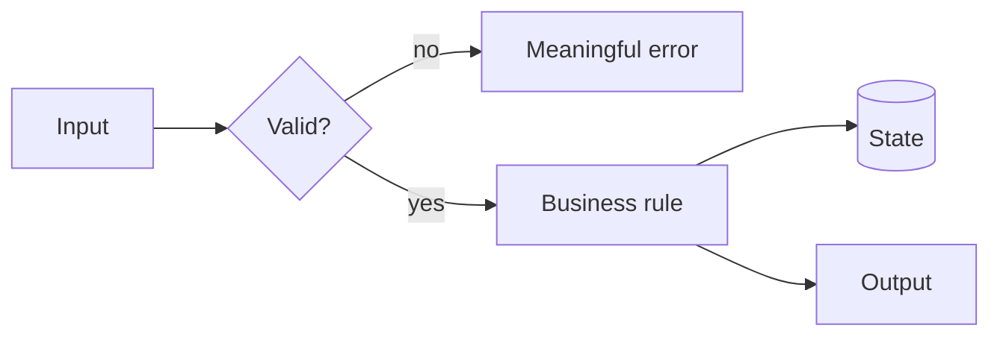
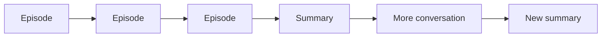
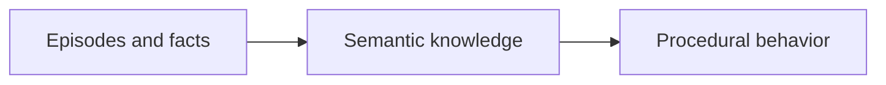
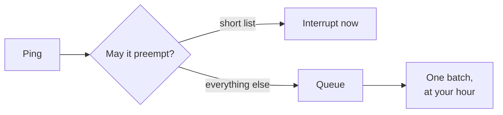

I ended [Through a Senior's Eyes](/blogs/blog/through_a_seniors_eyes/) with one line: **stay on the seat, holding a map.** The seat is the place where the final decision gets made. But what is the map?

It is the structure you carry while the details change: what the system is for, which parts exist, how they connect, what must remain true, where you are now, and where you are trying to go.

Without that map, AI feels smarter than you because it always has a next token. It can explain, propose, and continue without hesitation. You begin by asking it for help and end by following a path you never chose.

The problem is not that the agent generated bad directions. The problem is that you stopped knowing where the directions were taking you.

---

## New things need somewhere to land

We adapt to a new idea faster when we can attach it to a structure already inside us.

A new framework is easier when you can ask: where is the entry point, where does state live, how does data move, and which component owns failure? A new business domain is easier when you can identify its actors, rules, transactions, and boundaries. The names change. The shapes are often familiar.

This is the connection to [Memory Is Not Intelligence](/blogs/blog/memory_is_not_intelligence/). An isolated fact is an episode: *this happened*. Knowledge appears when the fact finds relationships: *this belongs here, differs from that, and changes this rule*.

That is what a map does. It gives new information somewhere to land.

But the map is not the territory, and it should not become a prison. Sometimes the new thing does not fit because your map is wrong. That is useful. A contradiction tells you exactly where understanding has to change.

> **Lesson:** learning is not collecting more points. It is placing each point into a structure—and redrawing the structure when it no longer fits.

---

## Do not follow the tokens

AI makes passivity unusually comfortable. Every answer sounds like a continuation. Every continuation makes the previous one feel more established. After twenty messages, you may have a detailed solution without being able to say which decision produced it.

Do not confuse a fluent path with your path.

The agent can generate options, trace code, challenge assumptions, and do the mechanical work. Your job is to keep imposing the map on the conversation. Ask actively:

- Where are we on the plan?
- Which assumption does this step depend on?
- What changed in our model of the system?
- Which boundary or invariant does this touch?
- Why this path instead of the other one?
- What evidence would make us turn back?

These questions are not prompts for better prose. They are checkpoints against surrendering direction.

When an answer arrives, do not merely ask for the next answer. Place it. Does it extend the map, contradict it, or reveal a missing region? If you cannot place it, stop. More tokens will usually make the fog larger, not smaller.

> **Lesson:** the agent proposes the next step. You decide whether that step still belongs to the journey.

---

## Code from a picture, not from a cursor

Before writing a function, class, or module, you should be able to see its small map.

For a function: what enters, what must be true, what can fail, and what leaves. For a class: what state it owns and which transitions are legal. For a module: which boundary it protects, whom it calls, and who may call it.

It does not need to be a formal design document. A rough Mermaid diagram is enough:

If you cannot draw the change, you probably do not understand its shape yet. Coding immediately may still produce something that runs, especially with an agent filling the gaps. But now the code becomes the first place where the design exists. You can only discover the architecture by reading the implementation that accidentally created it.

The diagram also keeps the agent honest. Its proposed class or abstraction must occupy a place, own a responsibility, and connect through a visible edge. "Create another service" is no longer free. You can ask what boundary it serves and why that boundary was missing.

Holding the map does not mean keeping all of this in your head. Put it in a diagram, a plan, or a short decision note. Externalize the state; retain ownership of the structure.

> **Lesson:** code should be the expression of a picture you can already see, not the tool you use to discover that a picture was needed.

---

## A summary is still an episode

Most agent memory today looks like this:

The context becomes too long, so the system compresses it and continues. This is useful, but it is not the full learning loop. A summary is a shorter record of what happened. It does not automatically become a general rule, and a rule does not automatically become behavior.

The missing path is:

The first arrow asks: across many cases, what remains true? The second asks: how does that truth change what the agent does next time without being reminded?

For a coding agent, semantic knowledge might be: *all writes in this repository pass through the domain service because audit events are emitted there.* Procedural behavior is stronger: the agent checks that path automatically, implements through it, and rejects a shortcut during review. The knowledge has moved from something written in the history to something expressed in action.

Conversation summaries mostly preserve the trail. A map should improve the traveler.

That requires consolidation: compare episodes, remove accidents, extract the invariant, then encode it into a test, rule, workflow, or architecture. Otherwise the agent remembers more sessions while repeating the same mistake in each one.

> **Lesson:** a shorter history is not yet knowledge. Knowledge is what survives across histories, and procedure is what changes because of it.

---

## The art of spending focus

None of this works if you cannot think. A map is held by focus, and focus is the one resource in the whole system that does not copy — that was the point of [You Can't Fork Yourself](/blogs/blog/you_cant_fork_yourself/). So the last skill is not drawing or placing. It is protecting the hand that holds the map.

My day looks like a broker's desk. People ping me all day. Each message is small, polite, and reasonable, and together they make deep thought impossible. For a long time I treated this as a discipline problem — my discipline. It is a design problem, and computing solved it in the 1950s.

The earliest computers **polled**: the processor asked every device, again and again, "do you need anything?" — and wasted itself asking. The **interrupt** fixed that. A device could now tap the processor on the shoulder. It also created a new disease: the interrupt storm, a machine that spends all its cycles being tapped and none of them working. That is a broker's desk. So every operating system since ships the same three defenses, and they translate directly:

- **Priority.** Not every device may preempt the processor. Decide in advance, in writing, the short list that may break your deep work. Production down: yes. "Quick question": no.
- **Masking.** Inside a critical section, the kernel switches interrupts off, because a delicate thing half-done is corruption. Your critical section is the hour you hold the map. Go dark for it, visibly. Messages queue; they do not evaporate.
- **Batching.** A network card does not raise one interrupt per packet; it collects a burst and raises one. Answer your queue in batches, at hours you chose. Twenty pings handled at 11:00 cost one switch. Twenty pings handled on arrival cost twenty.

That is control. Distribution is the other half, and it has the same shape. With agents running across several codebases, the question is not whether you can switch — you must — but what a switch costs. When an operating system pauses a process, the switch is cheap for one reason: nothing lives in the processor. The process's whole position sits in a small record — the process control block — and resuming is loading it back.

Your switches are expensive because your position lives in your head. The fix is this entire post: **the map is your process control block.** Before leaving a codebase, write your position onto its map — where we are, the open question, the next step. Re-entry becomes reading, not remembering. That is what makes several codebases and a handful of agents possible for one head.

And hold the agents to the same interrupt discipline as people: they report at boundaries — done, blocked, or surprised — never for progress. Many things may run at once. Only one may be in your hands.

This is not office advice. It is the same art at every scale. A single conversation is a stream of tiny interrupts — that was "do not follow the tokens." A day is a stream of pings. A season is a stream of codebases. The same three moves each time: choose what may preempt, mask while you hold the map, batch the rest.

> **Lesson:** focus is not a mood; it is a scheduler. Decide what may preempt you, mask the rest, handle the queue in batches — and write your position on the map, so a switch costs a read instead of a rebuild.

---

## How to hold it

Before the work, draw the smallest useful map: the outcome, the components, the boundaries, and the current path.

During the work, make every proposal locate itself on that map. Accept it, reject it, or redraw the map deliberately.

After the work, do not preserve only the conversation. Extract what became true. Then push that truth into behavior: a test, a checklist, a design rule, a reusable tool, or a habit you no longer need to recite.

This is how the three ideas join. [You cannot fork yourself](/blogs/blog/you_cant_fork_yourself/), so your one seat cannot chase every generated branch. Memory alone is not intelligence, so saving every branch does not solve the problem. Seniority is seeing structure behind the visible task, so the scarce work is maintaining the structure while agents race through the details.

The agent can walk many paths. Let it.

You hold the map.
