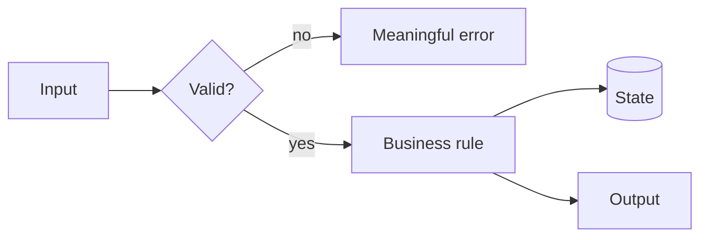
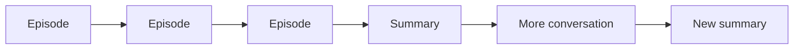
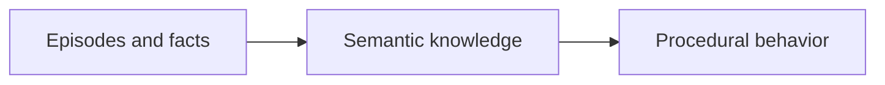

I ended [Through a Senior's Eyes](/blogs/blog/through_a_seniors_eyes/) with one line: **stay on the seat, holding a map.** The seat is the place where the final decision gets made. But what is the map?

It is the structure you carry while the details change: what the system is for, which parts exist, how they connect, what must remain true, where you are now, and where you are trying to go.

Without that map, AI feels smarter than you because it always has a next token. It can explain, propose, and continue without hesitation. You begin by asking it for help and end by following a path you never chose.

The problem is not that the agent generated bad directions. The problem is that you stopped knowing where the directions were taking you.

---

## New things need somewhere to land

We adapt to a new idea faster when we can attach it to a structure already inside us.

A new framework is easier when you can ask: where is the entry point, where does state live, how does data move, and which component owns failure? A new business domain is easier when you can identify its actors, rules, transactions, and boundaries. The names change. The shapes are often familiar.

This is the connection to [Memory Is Not Intelligence](/blogs/blog/memory_is_not_intelligence/). An isolated fact is an episode: *this happened*. Knowledge appears when the fact finds relationships: *this belongs here, differs from that, and changes this rule*.

That is what a map does. It gives new information somewhere to land.

But the map is not the territory, and it should not become a prison. Sometimes the new thing does not fit because your map is wrong. That is useful. A contradiction tells you exactly where understanding has to change.

> **Lesson:** learning is not collecting more points. It is placing each point into a structure—and redrawing the structure when it no longer fits.

---

## Do not follow the tokens

AI makes passivity unusually comfortable. Every answer sounds like a continuation. Every continuation makes the previous one feel more established. After twenty messages, you may have a detailed solution without being able to say which decision produced it.

Do not confuse a fluent path with your path.

The agent can generate options, trace code, challenge assumptions, and do the mechanical work. Your job is to keep imposing the map on the conversation. Ask actively:

- Where are we on the plan?
- Which assumption does this step depend on?
- What changed in our model of the system?
- Which boundary or invariant does this touch?
- Why this path instead of the other one?
- What evidence would make us turn back?

These questions are not prompts for better prose. They are checkpoints against surrendering direction.

When an answer arrives, do not merely ask for the next answer. Place it. Does it extend the map, contradict it, or reveal a missing region? If you cannot place it, stop. More tokens will usually make the fog larger, not smaller.

> **Lesson:** the agent proposes the next step. You decide whether that step still belongs to the journey.

---

## Code from a picture, not from a cursor

Before writing a function, class, or module, you should be able to see its small map.

For a function: what enters, what must be true, what can fail, and what leaves. For a class: what state it owns and which transitions are legal. For a module: which boundary it protects, whom it calls, and who may call it.

It does not need to be a formal design document. A rough Mermaid diagram is enough:

If you cannot draw the change, you probably do not understand its shape yet. Coding immediately may still produce something that runs, especially with an agent filling the gaps. But now the code becomes the first place where the design exists. You can only discover the architecture by reading the implementation that accidentally created it.

The diagram also keeps the agent honest. Its proposed class or abstraction must occupy a place, own a responsibility, and connect through a visible edge. "Create another service" is no longer free. You can ask what boundary it serves and why that boundary was missing.

Holding the map does not mean keeping all of this in your head. Put it in a diagram, a plan, or a short decision note. Externalize the state; retain ownership of the structure.

> **Lesson:** code should be the expression of a picture you can already see, not the tool you use to discover that a picture was needed.

---

## A summary is still an episode

Most agent memory today looks like this:

The context becomes too long, so the system compresses it and continues. This is useful, but it is not the full learning loop. A summary is a shorter record of what happened. It does not automatically become a general rule, and a rule does not automatically become behavior.

The missing path is:

The first arrow asks: across many cases, what remains true? The second asks: how does that truth change what the agent does next time without being reminded?

For a coding agent, semantic knowledge might be: *all writes in this repository pass through the domain service because audit events are emitted there.* Procedural behavior is stronger: the agent checks that path automatically, implements through it, and rejects a shortcut during review. The knowledge has moved from something written in the history to something expressed in action.

Conversation summaries mostly preserve the trail. A map should improve the traveler.

That requires consolidation: compare episodes, remove accidents, extract the invariant, then encode it into a test, rule, workflow, or architecture. Otherwise the agent remembers more sessions while repeating the same mistake in each one.

> **Lesson:** a shorter history is not yet knowledge. Knowledge is what survives across histories, and procedure is what changes because of it.

---

## How to hold it

Before the work, draw the smallest useful map: the outcome, the components, the boundaries, and the current path.

During the work, make every proposal locate itself on that map. Accept it, reject it, or redraw the map deliberately.

After the work, do not preserve only the conversation. Extract what became true. Then push that truth into behavior: a test, a checklist, a design rule, a reusable tool, or a habit you no longer need to recite.

This is how the three ideas join. [You cannot fork yourself](/blogs/blog/you_cant_fork_yourself/), so your one seat cannot chase every generated branch. Memory alone is not intelligence, so saving every branch does not solve the problem. Seniority is seeing structure behind the visible task, so the scarce work is maintaining the structure while agents race through the details.

The agent can walk many paths. Let it.

You hold the map.
