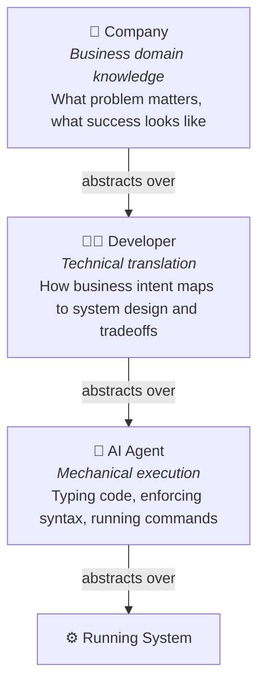
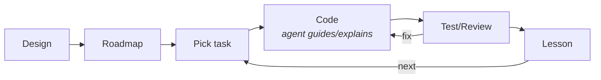
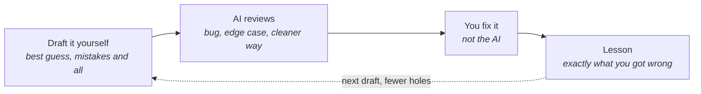

## First thing before learning

Confucius say we can gain knowledge in three ways:

1. By reflection, which is the highest.

2. By imitation, which is the easiest.

3. By experience, which is the bitterest.

Beautiful, isn't it? Wise, balanced, easy to remember. There is just one problem: **Confucius never said this.**

Go looking in the *Analects* and you won't find it. As [Warp, Weft, and Way](https://warpweftandway.com/time-sensitive-question-re-confucius-quote/), a group blog by scholars of Chinese philosophy, has traced, the line goes back to Rev. James Wood's *Dictionary of Quotations* (1893); from there it spread across the internet — quote sites, posters, LinkedIn captions — each one copying the last, not one of them checking the source. Repeated a million times, a fake starts to wear the face of the truth.

And that is the first lesson, the one that comes before all three: **qualify what you learn before you learn it.** Check the source. Question the authority. A famous name stamped on an idea is not proof — it is just a louder lie. Because here is the trap: you can *reflect* deeply on something false and only become confidently wrong; you can *imitate* a bad teacher and inherit their mistakes; you can pay for the wrong lesson with bitter *experience*. Garbage in, garbage out. All three roads to knowledge assume you started from something true.

So before you learn anything — including everything I write below — verify it first. I just fooled you with one fake quote to prove a real point. Now you know the cost of trusting a source you never checked.

## How to learn in AI era?

As I mentioned in my previous post [The Skills That Actually Matter in AI Assistance Era](https://www.linkedin.com/feed/update/urn:li:activity:7385524291850846208/), as AI becomes more powerful, a lot of work can be handed off to it. I call this **"abstraction"**: you no longer have to worry about the low-level details — checking logs, debugging, and so on. Delegate those tasks to the AI and focus on what really matters: business problem-solving, creativity, and critical thinking. But in this section I want to talk about a different aspect — the **token**. Everybody is about to get hungry for tokens. For example, now that [GitHub is moving Copilot from request-based billing to usage-based billing](https://www.reddit.com/r/GithubCopilot/comments/1ttd1hl/end_of_an_era_june_1_2026_github_copilot_models/), a developer can burn through a whole month's budget in just a few days.

So let's dig deeper into tokens.

When you pay for AI, you pay per **token** — and every token is either something going *into* the model or something coming *out* of it. That's the whole game. So there are two families to understand: input tokens and output tokens.

### Input tokens (and the cache)

Input is everything you feed *into* the model on each turn: the system prompt, the list of tools it's allowed to use, every file you opened, every command output — and the big one, the **entire conversation history**. The model has no memory; the whole chat is re-sent on every single turn.

That sounds wasteful, and it would be, except for **caching**. Input is split into three prices:

- **cache write** (~1.25× the base price) — the first time a chunk of text is seen.
- **cache read** (~10% of the base price) — every time that same chunk is reused afterwards.
- **fresh input** (1× the base price) — anything new that isn't cached yet.

Watch what happens in a long session — every turn drags the whole history along with it:

|Turn|What gets re-sent as input|
|---|---|
|1|system prompt + tools + your first message|
|5|all of the above + turns 1-4 (every message, file, and command output)|
|20|all of the above + turns 1-19 — this can be *huge*|

This is why a long chat gets expensive even when your own messages are short — you are re-paying for the context every time. And it's exactly why the **cache read** price matters so much: that re-sent history is read at ~10% instead of full price. Without the cache, a long session would cost a fortune.

### Output tokens — there are 4 kinds

Output is everything the model *generates*, and it's the expensive side — usually around **5× the price of input**.

Most people only count the part they can see: how many lines of code it wrote, how many lines of content it produced. But that visible deliverable is just **one** kind of output. There are actually **four**:

1. **Direct output** — the deliverable you asked for: the code, the file, the answer. This is the part everyone counts.
2. **Intermediate output** — the tool calls the model makes to get there: read this file, run this command, search that folder. You didn't ask for these directly, but each one is generated, and each one costs.
3. **Thinking** — the model reasoning to itself before it acts. Even when the tool hides the thinking from you, it still happened — and **you still paid for it.**
4. **Explanation** — the part where it talks back to you: brainstorming, summarizing, explaining what it just did.

So when you see "20 lines of code" come back, that was maybe a quarter of what you actually paid for. The other three kinds — the tool calls, the thinking, the chit-chat — are invisible on the screen but very visible on the bill.

### The value the bill can't see

But here is my real point: **direct output is good for your work; thinking and explanation are good for your brain.**

Your boss sees only two numbers — how many lines of code you and the AI produced, and how much it cost. That is the whole of his accounting. But I am the kind of person who needs to understand the *logic* behind the code, not just copy and paste it and pray. So I ask the AI to explain, to give me examples, to show the evidence. I will open Claude Code inside a codebase, prompt it for an hour, and walk away **without generating a single file** — and that hour was not wasted. Often it was the most valuable hour of my day.

This is the part the billing can never see. They measure the cost of the output, but they never measure the *value* of what you understood. And how would they? How do you put a price on knowledge? When you don't know something and the AI teaches it to you properly, that lesson is yours forever — you carry it to the next file, the next project, the next company. Direct output doesn't travel like that: the code it writes only works for the codebase you're sitting in right now. **The lesson works everywhere.**

So don't let the line-count fool you into thinking output is the only thing worth paying for. Sometimes a single token — one "Yes" or "No," landing at the right moment in the right place — saves you days of walking down the wrong road. You will never find that on an invoice.

### AI is an amplifier

Here is the principle underneath all of this: **AI doesn't fix your work, it amplifies it.** Automation has always been a multiplier, never a cure. If your work is a mess — no understanding, no structure, copy-paste on top of copy-paste — AI just produces a bigger, faster mess, and now you're paying tokens for the privilege. But if your work is lean — you understand the problem, you know what you're asking for, you can tell a good answer from a plausible one — then AI multiplies *that*, and your productivity compounds.

This is exactly why the thinking and explanation tokens matter. They are what keep your side of the equation lean. The more you understand, the more leverage every token of output gives you. Garbage in, garbage out — amplified. Clarity in, clarity out — amplified. The AI is the same in both cases; the difference is you.

## How to learn English?

English is the lingua franca of the modern world, which means the latest knowledge and information are most likely available in English first. And with English, you can communicate widely with people from all over the world.

One more fact: **ACCENT DOES MATTER!!!** Even though people say "you don't need to worry about your accent," in reality they lie (the world runs on money, power, and lies) — your accent can affect your communication. For example, if you have a strong accent, people may not understand you clearly. Another lie I used to believe is that if you're strong in your technical skills, you don't need to worry about your English skills.

I am a 30-year-old man with a strong Vietnamese accent. I have been learning English for over 15 years, counting from primary school and university, but I still struggle with interviews in English — what a shame!

One of the biggest mistakes I've realized: in Vietnamese, a word is a single sound, but in English, multiple sounds can combine into a single word. English actually works on three levels — **sounds, words, and sentences** — and each level has its own rules I had been ignoring.

At the **word level**, three things matter:

- **final sounds** — and the difference between **content words** (nouns, verbs, adjectives, spoken fully) and **function words** (articles, prepositions, auxiliaries, which get squeezed). Vietnamese mostly drops final sounds, but in English they carry meaning (*ride* vs. *right*).
- **stress** — every English word has a stressed syllable, and putting it in the wrong place can make the word unrecognizable.
- **the schwa** — the lazy "uh" that unstressed syllables collapse into. It's everywhere in English, but it isn't a habit in Vietnamese.

At the **sentence level**, we have:

- **intonation** — the rise and fall in pitch that signals a question, a statement, or emotion.
- **linking** — words flow into each other (*an apple* sounds like *anapple*).
- **sentence stress** — only the important words get emphasized; the rest are de-emphasized.
- **sound reduction** — weak words and syllables shrink (*going to* → *gonna*).

So before, I tried to break an English word into multiple sounds and reproduce each one with something similar in Vietnamese. That was wrong — and that's exactly why my accent never improved. Instead, I should learn to perform a single, complex mouth action *correctly in English*. This video made it click for me: [ Learn everything about ENGLISH PRONUNCIATION.](https://www.youtube.com/watch?v=LiR1ijwO6J0).

This also taught me the difference between **pronunciation** and **articulation**. Pronunciation is *what* the correct sounds are — the right vowels, the right stress, the right intonation. Articulation is *how* clearly your mouth physically produces them — the tongue, lips, and jaw doing the work. You can know the correct pronunciation and still sound mumbled, because your articulation is lazy. For a Vietnamese speaker like me, this is the part that gets skipped: I was so focused on hitting the right sound that I never trained my mouth to actually *move* the English way.

The fix is almost embarrassingly simple. Vinh Giang teaches a 3-step exercise to improve your articulation:

1. Grab a book.
2. Read out loud for 5 minutes.
3. **Overdo** the mouth movement — exaggerate every sound, open wide, push your lips and tongue further than feels natural.

The exaggeration is the point: when you overdo it in practice, normal speech comes out crisp and clear by comparison. See: [EASY 3-Step Exercise To INSTANTLY Improve Your Articulation!](https://www.youtube.com/watch?v=S5f0FKhPax0).

I think certificates like IELTS, TOEFL, and TOEIC are a plus; most students need them to get a job or study abroad. But real work needs you to be fluent in English, not just to pass a test.

My most hated question is: **"Can you introduce yourself?"** I don't answer it as well as interviewers expect. Maybe it's because I don't like talking about myself, but I can't deny the fact that my speaking skill is really bad. Still, I think that next time, when someone asks me that question, I will tell them my success story of learning English — what I have learned, what my abilities are, what problems I have faced, and how I overcame them. Everyone loves to hear a story.

I love English. I don't want to learn it just to pass a test; I feel like when you can talk and think in a different language, you become a different person.

My reading and listening skills are good — I can actually understand most English content, because I'm a programmer and most programming documentation is in English. So I can read and understand most English content, including technical English. I love to listen to English content on YouTube, as well as TV series. But my speaking and writing skills are bad.

### What do I need?

1. **Confidence.** That is the most important thing, but you don't get confidence just by believing in yourself; **you get it by seeing your progress and improvement bit by bit over time**.

2. **Vocabulary** — but not too much. You don't need to learn every word in the dictionary. For everyday conversation, **you only need about 3,000 words**; for comfortable conversation, about 5,000. And if you can learn 10 words per day, you will have 5,000 words in 500 days, which is about 1.5 years. The problem is that learning 10 words in one day is achievable, but learning 10 words every day is not. One more problem: **in a sentence of 10 words, if you don't know 1 or 2 keywords, you will actually lose the meaning of the whole sentence**. And if you lose some sentences, you will lose the meaning of the whole paragraph. So vocabulary is important — it is the atom, the brick for building a house.

3. **Grammar.** Does it sound boring? YES — but grammar is the set of rules of a language. I mean, you can't speak English without grammar; it's like you can't build a house without a drawing. Grammar helps you build sentences correctly. For example, if you have the words "I", "am", "very", "happy", do you know how many sentences you can make just by swapping their order? 24 — but only one is correct.

4. **Practice, practice, practice.** You need to practice speaking and writing English every day! And what makes you practice every day? The love for English. Every day, you must find a reason to love English, **because only love is the real fuel to keep you practicing**. For me, I love English because it helps me keep up with the latest knowledge, and keeping up helps me stay in the technology world, with more opportunities to earn more money. I don't know why, but a lot of people, just by translating English into Vietnamese, act like they actually invented or discovered something new. Someone else teaches that knowledge, and people think they are so smart — but actually, knowledge is free, and you can find it everywhere. If you wait for a translated version, you might wait for months, and there are often mistakes in the translation.

So, to sum up, I believe that if I can achieve the above four points, I can improve my English significantly — not for tests, but for real-life communication and professional growth.

### Introduce my learning method 3W ("Watch, Write, Workout")

After defining the key necessities for learning English, I am proud to introduce my learning method: 3W ("Watch, Write, Workout"). I don't think there is a perfect method, but this one works for my situation. I work full-time, so I don't have much time to study English; spending one or two hours per day is the maximum I can dedicate to it. And that is also the maximum cost of this method — one or two hours per day is enough. You don't have to waste a lot of money on a training center or an online course, you don't need to buy expensive books or materials, and you don't need to seek out fancy tools or apps. Just focus on the content and practice.

So my method is simple: Watch, Write, Workout.

First, I start by watching a short video — YouTube is my best friend for this step: it's free, has rich content, and you can turn on subtitles. After that, I collect a list of new words and phrases that I don't know and search for their meanings. Next, I write something about the content of the video — it can be a summary, a review, or just my thoughts, but it must include the new words and phrases that I learned. Finally, I practice speaking based on what I wrote, repeating it until I can say it fluently (or half-fluently) without reading the text.

|Step|Time |Action|Goal|Note|
|---|---|---|---|---|
|1|10-15 min|Watch the video without subtitles|Try to understand the content and identify the sounds you don't understand|A **5-minute YouTube video** is enough; the key is to choose content suitable for you — not too hard to understand, not boring, etc.|
|2|20-30 min|Watch the video again with subtitles|Collect new words and write them down|I use a **sticky-note app** on my phone — it's quite convenient, I can easily review them later, and the **Google Translate** integration helps me quickly look up meanings and pronunciation just by tapping a word. From a 5-minute video, I can collect 10-20 new words.|
|3|20-40 min|Write|Write something about the content of the video, BUT include the new words and phrases you learned|With 20 new words, you can write about **2 A5-sized pages** of notes. That is enough — not too much, not too little.|
|4|10-20 min|Practice speaking|Speak the content of the video aloud|Practice until you can repeat it fluently, or half-fluently, without reading the text. I use my phone's **voice recorder** to record myself speaking — that is how I realized my pronunciation is terrible. You don't need to be perfect; just practice until your speech is smooth and natural, and don't hate your voice.|

So with this method, you can gain:

- 10-20 new words
- improved writing, and improved grammar along with it
- speaking practice, better pronunciation, and more confidence (talking about content you already understand makes your confidence grow)
- the knowledge and insight from the content itself

#### How to "Watch"?

I choose a 5-10 minute YouTube video that suits me. It's not only about the length — by my estimate, a 5-minute video gives me 10-20 new words, and that is quite enough for a day. Another reason I choose YouTube is that you can save videos in your playlist for later review.

The other thing that matters is the content. These are the channels I subscribe to:

**News, economy & the wider world**

- [CNBC](https://www.youtube.com/@CNBC) — US business and financial news.
- [Bloomberg](https://www.youtube.com/bloomberg) — global business, finance, and markets coverage.
- [Economy Media](https://www.youtube.com/@EconomyMedia) — the US economy, jobs, the Federal Reserve, and personal finance.
- [DW News](https://www.youtube.com/@dwnews) — Germany's international English-language news (Deutsche Welle).
- [Vietnam Today](https://www.youtube.com/@vietnamtodayinternational) — VTV's English-language channel covering Vietnam for a global audience (familiar topics make it easier to follow).

**Ideas, culture & film**

- [The School of Life](https://www.youtube.com/@theschooloflifetv) — short videos on philosophy, psychology, and emotional intelligence.
- [The Cult Movies](https://www.youtube.com/@TheCultMoviesEN) — movie recaps and film storytelling in English.

**Pronunciation & accent**

- [Speech Modification](https://www.youtube.com/@SpeechModification) — American accent and pronunciation training, run by a speech-language pathologist.

**Tech & interview prep**

- [LearnThatStack](https://www.youtube.com/@LearnThatStack) — software-engineering concepts and tech-interview questions explained.
- [Hello Interview](https://www.youtube.com/@hello_interview) — software-engineering and system-design interview preparation.

But my favorite channel is [CNA Insider](https://www.youtube.com/cnainsider) — it has a lot of content about the daily lives of people around the world, explaining different cultures and traditions, economic systems, and social issues. And there is a lesson inside each video, which makes them very meaningful and helpful for learning.

I really dislike BBC and CNN — they always talk about politics and social issues in a biased way, and they are too formal and boring. TED is recommended by many people, but it doesn't match my taste: one person talking about a topic they're an expert in, without the rich images or stories that would make it more engaging.

The story that helps you remember vocabulary — I don't know whether it works for everyone, but it works for me. Learning a list of words without context is boring and hard to remember. That sounds backwards, right? **How can you remember better by taking in more information?** For me, when I learn a word that appears in a story, I can remember the context it appears in, who says it, and what the story is about. That somehow makes the word more meaningful and easier to remember.

The core idea of this method is that the word never comes alone: along with the meaning, I pick up how it sounds, the words it sits next to, and the kind of situation a real person would use it in. That is the whole difference — **a word learned from a list is one you'll recognize; a word learned from a story is one you can actually use.**

#### How to "Workout"?

"Workout" is where the real effort happens — this is the step that **turns passive recognition into active recall**.

**The power of the repetition loop.** I keep a note with the new words and the short piece I wrote, and I've realized that the simple act of writing them down already helps me remember the words better. Speaking is the next layer: each time I say the piece again, the words come back more easily. **The loop — write, speak, review, repeat — is what makes recall faster every round.**

**A tip for remembering vocabulary.** I write the English word and its Vietnamese meaning in two separate columns. When I want to test myself, I cover the Vietnamese column and try to recall the meaning from the English alone (and sometimes the other way around). It's a simple, fast self-test.

**Let AI generate practice material from your own words.** Recently YouTube added an "Ask Gemini" feature, and since Gemini can read the video's transcript, I use it to speed things up a lot. I give it the list of words and phrases I just collected and ask it to write a few paragraphs about the video that use them. Because it already knows the content, the paragraphs stay on-topic and the new words land in a context I actually understand — which is exactly the kind of material the "Write" and "Workout" steps need. I read it, tweak it into my own words, then practice speaking it. It saves me the slow part of staring at a blank page while still forcing the new vocabulary into real sentences.

**Beat the forgetting curve.** New words fade quickly if you never revisit them — that's the [forgetting curve](https://en.wikipedia.org/wiki/Forgetting_curve). The fix is cheap: short review sessions of just 4-5 minutes a day are enough to keep what you learned before from slipping away.

**How I improved my accent.** Record yourself speaking. The first time I recorded my voice and played it back, it felt like my ear had been hit by a hammer — but that discomfort is exactly the point. You can't fix what you can't hear, and the recording shows you precisely where your pronunciation goes wrong.

### Final thoughts

Habit is the key. None of this works as a one-time burst — the method only pays off when it becomes something you do almost without thinking, a little every day. The good news is that it asks for very little: a phone, a short video, and a few minutes. That's why it travels with me anywhere, and why I can keep it up even with a full-time job. Pick content you love, run the loop, review a little each day — and trust that the progress, bit by bit, will add up.

## How to learn coding?

Do we still need to learn fundamentals with agentic tools like Claude Code, Codex, and Cursor? **Yes — more than before.**

The AI abstracts the mechanical layer: typing code, enforcing syntax, generating DDL. What it cannot abstract is the layer above — the *why* and *what*. Take a database: AI writes the DDL in seconds, but it cannot decide your ERD, your access patterns, your consistency guarantees, your backup strategy. Those live in your understanding, not in the prompt. Feed it a weak model of what you need and it builds that, fast.

The fundamentals that matter have shifted. Syntax recall and API memorization belong to the AI now. What you need more of:

- **Mental models of tradeoffs** — *why* eventual vs. strong consistency, not how to configure it
- **Domain understanding** — what the data *means*, not how to persist it
- **Verification ability** — you can only catch AI mistakes if you know what correct looks like
- **Design judgment** — AI fills in a design you specify; it cannot choose the design

Think of it as a chain of abstraction:

The developer's value is in that middle layer. Lose the fundamentals and you collapse into the company above you — passing vague intent downward and hoping something useful comes back. The AI will oblige, and build you exactly what you described. If what you described was wrong, you won't know until it breaks. So here are my tips for studying software:

### Learning Tips

**The chain of simplification.** Here is my tip for learning something new — a concept, a framework, a dense paper. I call it the *chain of simplification*. First I read it myself. If I don't understand, I hand it to the AI and ask for a simpler version: less jargon, more analogy, a concrete example, explain it like I'm five (that holy prompt still works today). If the first pass doesn't land, I simplify again — and again — looping until it clicks.

Here is a real example. Yann LeCun's recent paper, [When Does LeJEPA Learn a World Model?](https://arxiv.org/pdf/2605.26379). First read:

> *A representation that scrambles the true degrees of freedom of the world cannot support reliable planning or compositional generalization. We prove that LeJEPA (alignment plus Gaussian regularization) linearly recovers the world's latent variables from nonlinear observations, a property known as linear identifiability, in a broad class of worlds where latents evolve under stationary, additive-noise transitions. Our main result is that among all such worlds, the Gaussian is the unique latent distribution for which this guarantee holds...*

My honest first reaction: *"Am I stupid?"* But don't quit. Feed it to Opus 4.8, ask for the simple version, and it comes back with something that actually clicks:

> Imagine a robot arm with a camera. If you only look at the raw pixels, you are seeing shadows of the real thing. What *actually* drives the motion are hidden factors — the joint angles — and those never appear directly in the image. They live behind the pixels. A good representation should recover those hidden factors from the pixels alone.

And that was it. Stripped of the spectral decompositions and the identifiability proofs, the paper makes one clean claim: **the world has hidden factors that drive what you observe, and this particular self-supervised recipe provably recovers them** — with the Gaussian being the special distribution that makes the guarantee hold. Once I had the robot-arm picture, I could go back to that dense abstract and every term had a home.

That is the whole method: don't bounce off the hard version and conclude you are not smart enough. Lower the rung until you can reach it, stand on it, then climb back up to the original.

**Reproduce.** The other way to learn is to reproduce. Learning a new programming language? Start typing it, instead of just reading it. Learning how a bigger system works? Build it from scratch.

Does typing it yourself still matter when the agent can do it for you? It does. The rebuilt artifact is not the prize — the understanding you earn producing it is. When the AI reproduces it, the *code* exists; when you reproduce it, the *knowledge* exists, and the knowledge is what travels to the next project. Letting the agent do the reps for you is like watching someone else lift your weights: the barbell still goes up, but you don't get any stronger. There is also muscle memory in this — type the syntax enough times and your hands stop asking your brain for permission. The patterns sink below conscious thought, and that frees your attention for the problem instead of the keystrokes.

And building from scratch is a technique we have used to learn software for a long, long time — the AI does not retire it, it makes it faster. You still do the rebuilding, but now you have a tutor beside you the whole way, ready to explain anything the moment you get stuck. Want to learn how your editor talks to a language server? Build one: [LSP From Scratch](https://www.youtube.com/watch?v=p0Vlz66AFNw&list=PLq5tGLDKHlW-owkJWZrueldeR6mbqBvOg).

But from-scratch has a limit: it does not scale to large scope. Rebuild a toy language server and you learn how the protocol works; try to rebuild VS Code and you will drown before you learn anything. The bigger the target, the more time you spend wrestling plumbing that teaches you nothing. So keep the scope small. Reproduce the *one idea* you are trying to understand — the smallest version that still contains the lesson — and leave the rest out. From-scratch is a scalpel, not a bulldozer; point it at the concept, not the whole product.

**Learn from open source.** When you pick up a new language — Go, Rust, whatever — a tutorial teaches you the syntax, but it can't teach you how the language is actually *written*. Every language has its own idioms, its own conventions, its own "this is how we do it here," and you only absorb those by watching real practitioners. That is what open source is for: find a well-regarded project in the language you're learning and read how experienced developers structure it — how they handle errors, name things, lay out a package, reach for the idiom instead of the clumsy translation from whatever language you came from. Skip this and you end up writing Rust like a Python programmer: syntactically fine, idiomatically wrong. And when a chunk of it makes no sense, the agent is right there to explain why they did it that way.

**The teaching-coding loop.** Recently I found another way to learn coding: use the agent as a *teacher* instead of a worker. It sounds backwards — why hold a tool that can write the whole thing and choose to write it yourself? But that is exactly the point. Once I have finalized the design of a repository, I ask the agent to lay out an implementable roadmap — each step small enough to code and test on its own. Then I write the code myself, following the roadmap, and lean on the agent whenever I get stuck. The agent guides; I do the typing. When a test fails or a review turns up something wrong, I bring it back — ask the agent to explain *why*, then fix it myself. That inner loop between testing and correcting is where most of the actual learning happens.

And honestly? This is the most fun I have had coding in years. There is a real thrill to it — you hit a wall, ask, get the *aha*, and write the line yourself, over and over. It feels less like grinding through a ticket and more like pair-programming with someone who knows everything and never gets tired of your questions. Every small task ends with a little win and something new in your head. Learning is supposed to feel like that, and somewhere along the way most of us forgot.

The trap to avoid is the "I am the boss" mindset. A lot of people pick up an agent and immediately start barking orders, as if their job is only to delegate. But think about it honestly: if I am a beginner learning TypeScript, the agent is flat-out better at TypeScript than I am. Why would I order around the most knowledgeable person in the room instead of learning from them? Drop the boss act. Treat the agent as the senior engineer sitting next to you — one with infinite patience, who will explain the same thing five different ways until it lands. You are not here to command it; you are here to get good.

This flips the usual loop. The "boss" loop is *prompt → accept output → move on*, and you end the day with code you cannot explain. The teaching loop is *plan → attempt → get corrected → understand*, and you end the day a little better than you started. Same tool, same tokens — the only thing that changed is who is supposed to be learning.

If you want to try this mode directly, I built [Veronica](https://github.com/locchh/veronica) — an armor manager CLI for Claude Code. The idea: instead of running every plugin at once, you define named armors for specific phases of a project and activate only the one you need. The coaching armor (`mod-03`) implements exactly the teaching loop above — it instructs Claude to explain one step, wait for you to write it, review your attempt line by line, and quiz you on what you just built. Same principle, wired into the tool so it cannot slip back into boss mode.

**Draft first, correct later.** The lazy path is to ask the AI for the answer and then grade it. Flip the order: write your own version *first* — the clumsy function, the messy schema, your best honest guess — and only then hand it over and ask what's wrong. It feels worse than being handed the solution, and that feeling is the whole point. When you commit to an attempt before you see the answer, your brain builds a hook; the correction catches on that hook instead of sliding straight off. So tell the agent not to rewrite it but to *review* it — the bug, the edge case you skipped, the cleaner approach — and then fix it yourself. You come away having learned exactly the things you personally got wrong, which is the most efficient lesson there is: no one wastes your time teaching you what you already knew.

**Use the agent as a knowledge checker.** Reading something and *knowing* it are not the same thing — and the gap between them is invisible until someone tests you. So let the agent test you. After I study a topic, say AWS S3, I ask it to quiz me: generate ten multiple-choice questions, A/B/C/D, wait for my answers, then score me and explain every one I missed. Suddenly the parts I only *thought* I understood show up as wrong answers.

This works because it flips the direction of the conversation. Most of the time you pull answers out of the agent; here you make it pull answers out of *you*. That reversal is the whole point — recalling something under test burns it into memory far deeper than reading it ever will, and the questions you fail map out exactly where to study next. Ask for harder questions as you improve, have it focus on the corners you keep getting wrong, and keep going until the score stops embarrassing you.

A quiz also closes the loop on everything above. The chain of simplification gets a concept *in*; reproducing it and reading real code put it to *use*; the teaching loop and drafting-then-fixing build it into real work — and the quiz checks that it actually stuck. Cheap to run, brutally honest, and the one part of learning the AI can grade for you.