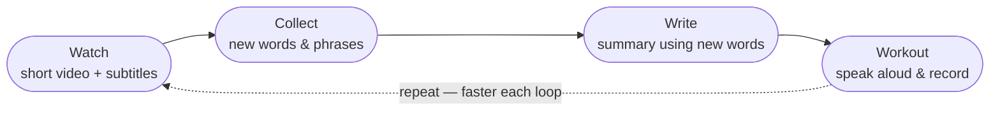

## How to learn English

English is the lingua franca of the modern world, which means the latest knowledge and information are most likely available in English first. And with English, you can communicate widely with people from all over the world.

One more fact: **ACCENT DOES MATTER!!!** Even though people say "you don't need to worry about your accent," in reality they lie (the world runs on money, power, and lies) — your accent can affect your communication. For example, if you have a strong accent, people may not understand you clearly. Another lie I used to believe is that if you're strong in your technical skills, you don't need to worry about your English skills.

I am a 30-year-old man with a strong Vietnamese accent. I have been learning English for over 15 years, counting from primary school and university, but I still struggle with interviews in English — what a shame!

I think certificates like IELTS, TOEFL, and TOEIC are a plus; most students need them to get a job or study abroad. But real work needs you to be fluent in English, not just to pass a test.

My most hated question is: **"Can you introduce yourself?"** I don't answer it as well as interviewers expect. Maybe it's because I don't like talking about myself, but I can't deny the fact that my speaking skill is really bad. Still, I think that next time, when someone asks me that question, I will tell them my success story of learning English — what I have learned, what my abilities are, what problems I have faced, and how I overcame them. Everyone loves to hear a story.

I love English. I don't want to learn it just to pass a test; I feel like when you can talk and think in a different language, you become a different person.

My reading and listening skills are good — I can actually understand most English content, because I'm a programmer and most programming documentation is in English. So I can read and understand most English content, including technical English. I love to listen to English content on YouTube, as well as TV series. But my speaking and writing skills are bad.

### What do I need?

1. **Confidence.** That is the most important thing, but you don't get confidence just by believing in yourself; **you get it by seeing your progress and improvement bit by bit over time**.

2. **Vocabulary** — but not too much. You don't need to learn every word in the dictionary. For everyday conversation, **you only need about 3,000 words**; for comfortable conversation, about 5,000. And if you can learn 10 words per day, you will have 5,000 words in 500 days, which is about 1.5 years. The problem is that learning 10 words in one day is achievable, but learning 10 words every day is not. One more problem: **in a sentence of 10 words, if you don't know 1 or 2 keywords, you will actually lose the meaning of the whole sentence**. And if you lose some sentences, you will lose the meaning of the whole paragraph. So vocabulary is important — it is the atom, the brick for building a house.

3. **Grammar.** Does it sound boring? YES — but grammar is the set of rules of a language. I mean, you can't speak English without grammar; it's like you can't build a house without a drawing. Grammar helps you build sentences correctly. For example, if you have the words "I", "am", "very", "happy", do you know how many sentences you can make just by swapping their order? 24 — but only one is correct.

4. **Practice, practice, practice.** You need to practice speaking and writing English every day! And what makes you practice every day? The love for English. Every day, you must find a reason to love English, **because only love is the real fuel to keep you practicing**. For me, I love English because it helps me keep up with the latest knowledge, and keeping up helps me stay in the technology world, with more opportunities to earn more money. I don't know why, but a lot of people, just by translating English into Vietnamese, act like they actually invented or discovered something new. Someone else teaches that knowledge, and people think they are so smart — but actually, knowledge is free, and you can find it everywhere. If you wait for a translated version, you might wait for months, and there are often mistakes in the translation.

So, to sum up, I believe that if I can achieve the above four points, I can improve my English significantly — not for tests, but for real-life communication and professional growth.

### Introduce my learning method 3W ("Watch, Write, Workout")

After defining the key necessities for learning English, I am proud to introduce my learning method: 3W ("Watch, Write, Workout"). I don't think there is a perfect method, but this one works for my situation. I work full-time, so I don't have much time to study English; spending one or two hours per day is the maximum I can dedicate to it. And that is also the maximum cost of this method — one or two hours per day is enough. You don't have to waste a lot of money on a training center or an online course, you don't need to buy expensive books or materials, and you don't need to seek out fancy tools or apps. Just focus on the content and practice.

So my method is simple: Watch, Write, Workout.

First, I start by watching a short video — YouTube is my best friend for this step: it's free, has rich content, and you can turn on subtitles. After that, I collect a list of new words and phrases that I don't know and search for their meanings. Next, I write something about the content of the video — it can be a summary, a review, or just my thoughts, but it must include the new words and phrases that I learned. Finally, I practice speaking based on what I wrote, repeating it until I can say it fluently (or half-fluently) without reading the text.

|Step|Time |Action|Goal|Note|
|---|---|---|---|---|
|1|10-15 min|Watch the video with subtitles|Try to understand the content and identify the sounds you don't understand|A **5-minute YouTube video** is enough; the key is to choose content suitable for you — not too hard to understand, not boring, etc.|
|2|20-30 min|Watch the video again with subtitles|Collect new words and write them down|I use a **sticky-note app** on my phone — it's quite convenient, I can easily review them later, and the **Google Translate** integration helps me quickly look up meanings and pronunciation just by tapping a word. From a 5-minute video, I can collect 10-20 new words.|
|3|20-40 min|Write|Write something about the content of the video, BUT include the new words and phrases you learned|With 20 new words, you can write about **2 A5-sized pages** of notes. That is enough — not too much, not too little.|
|4|10-20 min|Practice speaking|Speak the content of the video aloud|Practice until you can repeat it fluently, or half-fluently, without reading the text. I use my phone's **voice recorder** to record myself speaking — that is how I realized my pronunciation is terrible. You don't need to be perfect; just practice until your speech is smooth and natural, and don't hate your voice.|

So with this method, you can gain:

- 10-20 new words
- improved writing, and improved grammar along with it
- speaking practice, better pronunciation, and more confidence (talking about content you already understand makes your confidence grow)
- the knowledge and insight from the content itself

#### How to "Watch"?

I choose a 5-10 minute YouTube video that suits me. It's not only about the length — by my estimate, a 5-minute video gives me 10-20 new words, and that is quite enough for a day.

The other thing that matters is the content. These are the channels I subscribe to:

**News, economy & the wider world**

- [CNBC](https://www.youtube.com/@CNBC) — US business and financial news.
- [Bloomberg](https://www.youtube.com/bloomberg) — global business, finance, and markets coverage.
- [Economy Media](https://www.youtube.com/@EconomyMedia) — the US economy, jobs, the Federal Reserve, and personal finance.
- [DW News](https://www.youtube.com/@dwnews) — Germany's international English-language news (Deutsche Welle).
- [Vietnam Today](https://www.youtube.com/@vietnamtodayinternational) — VTV's English-language channel covering Vietnam for a global audience (familiar topics make it easier to follow).

**Ideas, culture & film**

- [The School of Life](https://www.youtube.com/@theschooloflifetv) — short videos on philosophy, psychology, and emotional intelligence.
- [The Cult Movies](https://www.youtube.com/@TheCultMoviesEN) — movie recaps and film storytelling in English.

**Pronunciation & accent**

- [Speech Modification](https://www.youtube.com/@SpeechModification) — American accent and pronunciation training, run by a speech-language pathologist.

**Tech & interview prep**

- [LearnThatStack](https://www.youtube.com/@LearnThatStack) — software-engineering concepts and tech-interview questions explained.
- [Hello Interview](https://www.youtube.com/@hello_interview) — software-engineering and system-design interview preparation.

But my favorite channel is [CNA Insider](https://www.youtube.com/cnainsider) — it has a lot of content about the daily lives of people around the world, explaining different cultures and traditions, economic systems, and social issues. And there is a lesson inside each video, which makes them very meaningful and helpful for learning.

I really dislike BBC and CNN — they always talk about politics and social issues in a biased way, and they are too formal and boring. TED is recommended by many people, but it doesn't match my taste: one person talking about a topic they're an expert in, without the rich images or stories that would make it more engaging.

The story that helps you remember vocabulary — I don't know whether it works for everyone, but it works for me. Learning a list of words without context is boring and hard to remember. That sounds backwards, right? **How can you remember better by taking in more information?** For me, when I learn a word that appears in a story, I can remember the context it appears in, who says it, and what the story is about. That somehow makes the word more meaningful and easier to remember.

#### How to "Workout"?

"Workout" is where the real effort happens — this is the step that **turns passive recognition into active recall**.

**The power of the repetition loop.** I keep a note with the new words and the short piece I wrote, and I've realized that the simple act of writing them down already helps me remember the words better. Speaking is the next layer: each time I say the piece again, the words come back more easily. **The loop — write, speak, review, repeat — is what makes recall faster every round.**

**A tip for remembering vocabulary.** I write the English word and its Vietnamese meaning in two separate columns. When I want to test myself, I cover the Vietnamese column and try to recall the meaning from the English alone (and sometimes the other way around). It's a simple, fast self-test.

**Beat the forgetting curve.** New words fade quickly if you never revisit them — that's the [forgetting curve](https://en.wikipedia.org/wiki/Forgetting_curve). The fix is cheap: short review sessions of just 4-5 minutes a day are enough to keep what you learned before from slipping away.

**How I improved my accent.** Record yourself speaking. The first time I recorded my voice and played it back, it felt like my ear had been hit by a hammer — but that discomfort is exactly the point. You can't fix what you can't hear, and the recording shows you precisely where your pronunciation goes wrong.

## Final thoughts

Habit is the key. None of this works as a one-time burst — the method only pays off when it becomes something you do almost without thinking, a little every day. The good news is that it asks for very little: a phone, a short video, and a few minutes. That's why it travels with me anywhere, and why I can keep it up even with a full-time job. Pick content you love, run the loop, review a little each day — and trust that the progress, bit by bit, will add up.