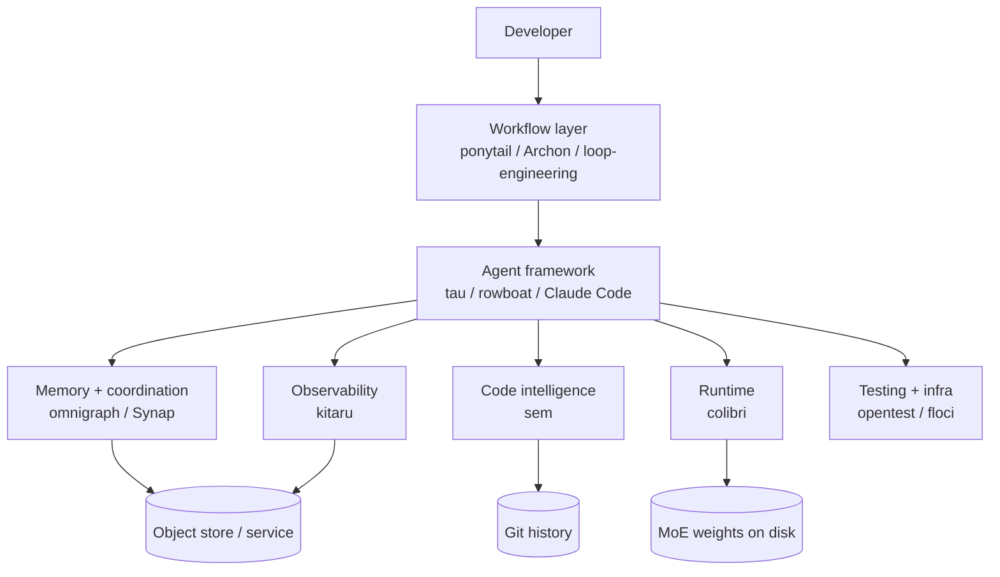

[Two months ago](/blogs/blog/trending_tools_may_2026/) I walked through twelve projects and argued the agent stack was starting to look like the web stack circa 2012 — layers that only make sense once you've seen them all at once. Those layers haven't changed much. What I keep finding has: the May batch was about *new capability*; this batch is about **operating the stack once you have it** — running the model, restraining the agent, scheduling it, diffing and replaying what it did, letting a fleet share one graph without collisions.

Thirteen tools this time, in eight groups: frameworks, workflow, code intelligence, memory and coordination, observability, runtime, one full application built from all of it, and a testing-and-infrastructure coda with no AI in it at all. They're grouped by the job they do — where two tools do the same job, I end with a one-line **pick**. Not the loudest README; the one that fits the gap you're feeling.

---

## 1. Agent frameworks — the minimal and the ambient

*Two opposite answers to "what is an agent application?" — strip it to the studs, or wrap it around your whole day.*

- **[tau](https://github.com/huggingface/tau)** — a terminal coding agent from Hugging Face that doubles as a *teaching tool*. It's a real TUI agent (read/write/edit/shell tools, sessions saved to disk, `AGENTS.md`, talks to OpenAI, Anthropic, OpenRouter, Hugging Face, or a local endpoint), but deliberately small and layered so you can read it end-to-end and finally see what a coding agent *is* underneath. *Best for:* learning how agents work, or a hackable provider-neutral shell.
- **[rowboat](https://github.com/rowboatlabs/rowboat)** — a local-first desktop "AI coworker" that lives across your email, meetings, and chats and *remembers* them. The core is the **Brain**: an Obsidian-style, backlinked Markdown knowledge graph on your own machine — no cloud, no cold start. Bring your own model (hosted, or local through Ollama or LM Studio) and swap it without losing the memory. *Best for:* an always-on private assistant with durable memory.

**Pick:** tau to read and learn; rowboat to live in.

---

## 2. Workflow and skill layer — the process the agent follows

*In May this was where methodology became installable (superpowers). Two months on it's splitting three ways — teach the agent to write less, make a single run repeatable, or design the loops that run it for you.*

- **[ponytail](https://github.com/DietrichGebert/ponytail)** — makes your agent "think like the laziest senior dev in the room." Before it writes anything, it walks a **decision ladder**: does this need to exist at all? Already in the codebase? In the standard library? A platform feature? A dependency? A one-liner? *Only then* — minimal code. Installs as a skill across roughly twenty agents, with strictness dials and diff audits; on their own benchmark it roughly halved the code written (take the number with salt). **The best code is the code you never wrote** — the first tool I've seen that makes an agent believe it. *Best for:* curbing over-engineering and token cost.
- **[Archon](https://github.com/coleam00/Archon)** — a "harness builder" whose whole pitch is making AI coding **deterministic and repeatable**. Instead of hoping the agent remembers to plan, test, and review, you encode the process as a YAML workflow — planning → implementation → validation → review → PR — and the agent fills in the intelligence *inside* those guardrails. It ships close to twenty ready-made workflows (fix a GitHub issue, build a feature, review a PR, refactor), runs each in its own **git worktree** so several fixes go in parallel without colliding, and adds loop nodes and human approval gates so you can fire one off and come back to a finished, reviewed PR. TypeScript/Bun, SQLite or Postgres, a CLI and a web dashboard, driven mostly through Claude Code. *Best for:* turning ad-hoc agent coding into a process you can run the same way twice.
- **[loop-engineering](https://github.com/cobusgreyling/loop-engineering)** — a toolkit for *not being in the loop at all*. The thesis, via Peter Steinberger: stop prompting agents, design the **loops** that prompt them — scheduled, stateful systems that trigger, orchestrate, remember, and re-run, with budget and safety baked in. Scaffold a pattern with one `npx` command; it ships seven named patterns (daily triage, a PR babysitter, a CI sweeper, and more), each tagged with cadence, autonomy, and cost. It's the [SDD idea](/blogs/blog/coding_today/) pushed up a level: not the process inside a task, but what decides when the agent runs at all. *Best for:* running agents on autopilot.

**Pick:** ponytail to make one task *smaller*, Archon to make one run *repeatable*, loop-engineering to make many runs *scheduled*.

---

## 3. Code intelligence — version control that speaks in functions

*May indexed code into a graph (GitNexus, graphify). This month rebuilds git itself around meaning.*

- **[sem](https://github.com/ataraxy-labs/sem)** — semantic version control. Git diffs, blames, and greps in lines, but nobody thinks in lines. `sem` parses your code with tree-sitter (roughly two dozen-plus languages) and works at the *entity* level: `sem diff` shows which functions changed, `sem blame` blames a method, `sem impact` traces what a change ripples out to across files, and `sem context` hands an agent a token-budgeted slice instead of whole files. Fast Rust CLI plus an MCP server for Claude Code, Cursor, and others. The bet: line- and file-level views are the wrong resolution for an agent, and structure is the right one. *Best for:* agents (and humans) that need to reason about *change*, not text.

---

## 4. Memory and coordination — the shared graph

*May was single-agent memory (claude-mem, mem0, cognee). The new question is how MANY agents share one store without corrupting it — and who runs the infrastructure.*

- **[omnigraph](https://github.com/ModernRelay/omnigraph)** — a graph database that borrows git. Every agent gets its own **branch**, works in isolation, and merges only after a three-way review, so hundreds can write in parallel with a full audit trail of who committed what. It runs directly on object storage (S3, R2, MinIO) with no server to babysit; graph, vector, and full-text search in a single call; reachable over MCP. Early (pre-1.0), but the clearest picture yet of what *multi-agent* memory infrastructure wants to be. *Best for:* governed memory shared by a fleet.
- **[Synap](https://www.maximem.ai/)** (by Maximem) — the opposite deployment story: run nothing. A hosted long-term memory service behind an SDK — ingest conversations, it extracts structured knowledge, resolves entities, and hands back scoped, ranked context. Its framing is sharp: bigger context windows and plain vector search retrieve what's *similar*, not what's currently *true*. It leans hard on benchmark numbers (they cite around 92% on LongMemEval) — treat vendor benchmarks with the usual caution, but the bet is coherent. *Best for:* shipping production memory fast without running a vector DB.

**Pick:** omnigraph if relationships and audit matter and you'll self-host; Synap if you just want your agent to stop forgetting this quarter. (Storage was never the hard part — see [the inference a real knowledge base needs](/blogs/blog/how_to_build_knowledgebase/).)

---

## 5. Observability — recording what the agent did

*A layer May's stack didn't have at all, and its absence was a real gap.*

- **[kitaru](https://github.com/zenml-io/kitaru)** — record-replay-improve for agents, from the ZenML team. Decorate your Python functions with `@flow` and `@checkpoint` (no graph DSL, just normal control flow) and it records every step — model calls, tool calls, decisions — as typed, versioned, replayable checkpoints. When a run fails in production you don't guess: you **replay the actual run** against the actual code, swap a model or a parameter, and watch what changes before you ship. It'll even resume a crashed run from the last good checkpoint. Framework-agnostic, self-hosted with its own dashboard, and it has an MCP server. *Observe every execution from day one* — you can't improve a loop you can't see. *Best for:* debugging and safely iterating on agents in production.

---

## 6. Runtime — running the model at all

*The floor under everything, the one May and this post kept skipping: not which model, but whether it runs on your hardware. MoE made frontier models huge in total size but sparse in what fires per token — and that fact turns out to be exploitable.*

- **[colibri](https://github.com/JustVugg/colibri)** — a pure-C inference engine (zero dependencies, CUDA or Apple Metal optional) that runs a 744B-parameter mixture-of-experts model on consumer hardware by **streaming experts from disk**. It treats VRAM, RAM, and disk as one memory hierarchy and *learns* which experts your workload routes to, pinning the hot ones to the fast tiers so it speeds up as you use it — the same inference path runs whether an expert loads from the GPU or off disk. `./coli chat`, or `./coli serve` for an OpenAI-compatible API. It's the MoE trick from [*What Comes After the Transformer?*](/blogs/blog/what_comes_after_transformer/) turned into a serving strategy: only a few experts fire per token, so the rest can wait on disk. Fractions of a token per second on a thin laptop, a few per second on a big multi-GPU box — the headline isn't speed, it's that a frontier-size model runs *at all*. *Best for:* running a huge MoE locally when you have more disk than VRAM.

---

## 7. The application — the whole stack, pointed at one problem

*Every entry so far is a layer. This is what you get when one person stacks them into a single shipped tool — and it shows off half the themes in this post at once.*

- **[ai-job-search](https://github.com/MadsLorentzen/ai-job-search)** — a complete job-search assistant built entirely out of Claude Code slash commands and skills. Fork it, load your profile (`/setup`), search the boards (`/scrape`), then `/apply <url>` runs the pipeline: judge the fit, draft a tailored CV and cover letter in LaTeX, compile to PDF, and check the result against ATS parsing. The interesting part is *how* it drafts — a **drafter-reviewer** split: one agent writes, a second one with fresh context researches the employer and tears the draft apart, then the first revises, with a rule that every claim is checked against your real profile so it owns gaps instead of inventing them. That's the multi-agent coordination theme from below, wired into a real workflow. Two more notes: it runs entirely on your machine and treats job postings as **untrusted input** (no obeying instructions hidden in a posting, no fetching its links), and the author says he used it to land a job — 69 applications, 20 first interviews, a signed offer. Honest limits: those injection defenses are instruction-level, not sandboxed, and the search skills are tuned for the Danish market (swappable per board). *Best for:* job hunting — and as a worked example of a whole vertical app built from nothing but agent skills.

---

## 8. Testing and infrastructure — the parts with no AI in them

*The last two have nothing to do with agents — no LLM, no MCP, no skills. I'm including them anyway; the title of this post is the excuse. The plumbing your agent's output runs on still matters — more now that an agent can generate ten times the code that has to be tested and run somewhere.*

- **[opentest](https://github.com/mcdcorp/opentest)** — a mature, open-source functional test-automation framework (McDonald's built it): keyword-driven YAML over Selenium, Appium, and HTTP, with a sync server running test actors across machines so a single test can span web, mobile, and API. Its last release was 2022 and there's no AI anywhere in it — yet it keeps surfacing on "agent" lists, because it marks a hole nobody has filled. Agents write unit tests all day, but end-to-end functional testing still has no agent-native shape. This is what that layer looked like *before* agents. *Best for:* seeing the empty seat at the table.
- **[floci](https://github.com/floci-io/floci)** — a local AWS emulator: point your AWS SDKs, the AWS CLI, or Terraform at `localhost:4566` and it answers like the real thing, no account and no bill. It's the maintained, MIT-licensed replacement for LocalStack's now-frozen free edition — dozens of services, with real Docker containers behind the stateful ones. A native binary a fraction of LocalStack's size that starts in milliseconds, small enough to spin up fresh for every test run in CI. *Best for:* running the AWS-touching parts of an agent's output locally and free.

---

## How the layers fit together

Each tool is useful alone; the picture is the stack.

Read it top-down — the direction the work flows:

- **Workflow** decides *what process* the agent follows — ponytail keeps it lean, Archon makes each run repeatable, loop-engineering schedules it.
- **Framework** runs the loop — tau, rowboat, Claude Code.
- **Memory + code intelligence** decide *what it knows* — the shared graph or service, and the entity-level view of the code.
- **Observability** records *what it actually did* so the next run is better — kitaru.
- **Runtime** decides whether the model runs on your hardware at all — colibri.
- **Testing + infra** — no AI in it — decides whether any of it works, and where it runs — opentest, floci.

And **ai-job-search** sits above all of it — not a layer but a *product*: the whole stack assembled and aimed at one task.

A reasonable "operate it" stack today, on the May foundation:

- **Claude Code** or **tau** as the shell
- **ponytail** to stop over-engineering, **Archon** to make a run repeatable, **loop-engineering** to run on a schedule
- **sem** to diff and reason in functions, not lines
- **omnigraph** for fleet memory, or **Synap** for managed recall
- **kitaru** to replay and debug production runs
- **colibri** to run a big MoE on your own hardware
- **floci** to run the AWS-touching parts locally and free

---

## What I'm watching next

1. **Git semantics are eating the agent stack.** sem rebuilds diff and blame at the entity level; omnigraph gives graph data branches and three-way merges; loop-engineering and Archon isolate each run in its own worktree. Version control is becoming the agent's native language for change.
2. **Multi-agent coordination is the new frontier.** May's stack was built for one agent; this month keeps assuming *fleets* — omnigraph's branches, loop-engineering's sub-agents, kitaru's replay. The problem moved from "make one agent good" to "make many not collide."
3. **Restraint is a feature now.** ponytail is the counter-current to a year of more autonomy, more code, more tools. The winning move is teaching the agent to write *less* — the smallest correct diff, not the most impressive one.
4. **Memory is splitting into self-host vs. managed** — omnigraph and Synap, the two ends — exactly the way routing split into arbitrage vs. operations in May.
5. **MoE's sparsity is becoming a *serving* trick, not just a training one.** colibri streams experts from disk because only a few fire per token. The same sparsity that made frontier models cheap to run in the cloud is starting to make them runnable on a laptop.
6. **The most solid tools this month have no AI in them.** opentest and floci both surfaced on "agent" lists, and neither is an agent tool. The plumbing that proves the code works and gives it somewhere to run is still plain, un-hyped infrastructure.
7. **Agents are starting to treat their own input as hostile.** ai-job-search reads job postings as *untrusted* — it won't obey instructions hidden in a posting or fetch its links. As agents act on text pulled off the open web, prompt-injection defense stops being optional. Expect "treat the input as an attacker" to become a default, not a feature.

May was about *assembling* the stack — seeing which layers exist. July is about *operating* it — running the model, restraining, scheduling, versioning, coordinating, replaying. Seeing the layers was the hard part; running them without the whole thing catching fire is turning out to be the next one. Pick the ones that fit the gap you're feeling — and, as always, not the ones with the loudest README.
