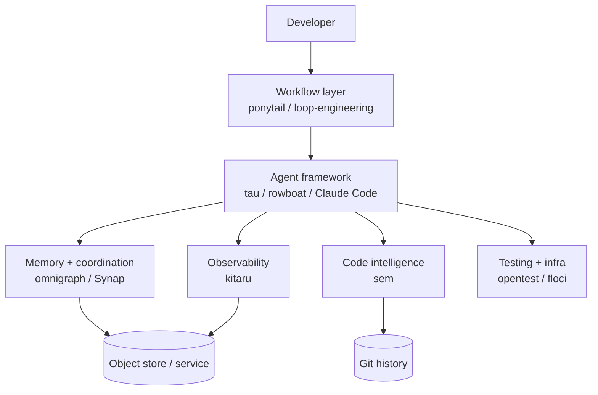

[Two months ago](/blogs/blog/trending_tools_may_2026/) I walked through twelve projects and argued the agent stack was starting to look like the web stack circa 2012 — a set of layers that only make sense once you've seen all of them at once. Routing, frameworks, workflow, codebase intelligence, memory.

The layers haven't changed much since. What I keep finding has. The May batch was mostly about *new capability* — here's a memory plane, here's a knowledge graph, here's a proxy. This July batch is about something quieter and, I think, more telling: **how you actually operate the stack once you have it.** How you stop the agent over-engineering. How you run it on a schedule instead of babysitting it. How you diff and replay what it did. How hundreds of agents share one graph without stepping on each other.

Ten this time, in six groups: frameworks, workflow, code intelligence, memory and coordination, observability, and a testing-and-infrastructure coda with no AI in it at all. As before, each multi-tool section ends with a short comparison so you can pick the one that fits your situation — not the one with the loudest README.

---

## 1. Agent frameworks — the minimal and the ambient

Two projects, two opposite answers to the question "what is an agent application?" One strips it down to the studs so you can read it. The other wraps it around your whole working day.

### [tau](https://github.com/huggingface/tau)

Hugging Face's `tau` is a terminal coding agent that doubles as a *teaching tool*. It's a real, usable TUI agent — read, write, edit, and shell tools, sessions saved to disk, project instructions from `AGENTS.md`, and it talks to OpenAI, Anthropic, OpenRouter, Hugging Face, or any local OpenAI-compatible endpoint. But the point isn't the feature list. The point is that the codebase is small and layered on purpose, so you can read it end-to-end and finally understand what a coding agent *is* underneath.

The layers are clean: a provider-neutral streaming layer, an agent layer that owns the message loop and tools, and a coding layer that's the actual app. Most agents hide this. `tau` shows it to you. If you've ever wanted to build your own agent but bounced off a giant production framework, this is where to start.

### [rowboat](https://github.com/rowboatlabs/rowboat)

Rowboat is the opposite instinct. It's a local-first desktop "AI coworker" that lives across your email, meetings, and chats and *remembers* them. The core idea is what they call the **Brain** — an Obsidian-style, backlinked knowledge graph of your work, stored on your machine as plain Markdown you can open and edit yourself. No cloud, no proprietary store, no cold start every session.

Around that memory it stacks the things an ambient assistant needs: an email client that drafts replies, background agents that run on a trigger or a schedule, local meeting transcription, and a code mode that farms work out to Claude Code or Codex. You bring your own model — hosted or a local one through Ollama or LM Studio — and can swap it without losing the memory. Where `tau` is a tool you open, rowboat is an assistant that's always on.

| | tau | rowboat |
|---|---|---|
| Shape | Terminal coding agent | Local-first desktop coworker |
| Stack | Python + Textual TUI | TypeScript desktop app |
| Memory | Session files on disk | Backlinked Markdown "Brain" |
| Killer feature | Small, readable, hackable | Durable memory across your work |
| Best for | Learning how agents work | An always-on private assistant |

---

## 2. Workflow and skill layer — teaching the agent restraint

In May I flagged this as the layer where methodology becomes installable — process you `install`, not process you describe. Superpowers was the example. Two months on, the trend has sharpened into something more specific: teaching the agent *what not to do*.

### [ponytail](https://github.com/DietrichGebert/ponytail)

Ponytail's pitch is the best one-liner in this whole post: it makes your agent "think like the laziest senior dev in the room." Agents love to write code. Ask for a small feature and they'll invent a helper, a config option, and an abstraction you didn't ask for. Ponytail injects a **decision ladder** the agent has to walk before it writes anything: Does this need to exist at all? Is it already in the codebase? In the standard library? A native platform feature? An installed dependency? A one-liner? *Only then* — the minimum viable code.

It installs as a skill or plugin across roughly twenty agents (Claude Code, Codex, Copilot, Cursor, and the rest), with dials for how strict to be and commands to audit a repo or flag over-engineering in a diff. On their own benchmark it cut the amount of code written by about half — up to 94% on the worst over-building cases — while keeping validation, security, and accessibility intact. Take the number with the usual salt, but the direction is right. **The best code is the code you never wrote**, and this is the first tool I've seen that makes an agent believe it.

### [loop-engineering](https://github.com/cobusgreyling/loop-engineering)

If ponytail is about restraint inside one task, loop-engineering is about not being in the loop at all. Its thesis, borrowed from Peter Steinberger: *you shouldn't be prompting coding agents anymore — you should be designing the loops that prompt them.* A loop is a scheduled, stateful system that triggers an agent, orchestrates it, remembers what happened, and re-runs — with budget and safety guardrails baked in.

It ships this as a real toolkit, not just an essay. You scaffold a pattern with one `npx` command, then estimate token cost and audit readiness before you turn it on. It comes with seven named production patterns — daily triage, a PR babysitter, a CI sweeper, a dependency sweeper, and more — each tagged with a cadence, an autonomy level, and a cost tier. It's the [SDD idea I keep coming back to](/blogs/blog/coding_today/) pushed one level up: not "what process does the agent follow inside a task," but "what system decides when the agent runs at all." Loop engineering as a *concept* has been a buzzphrase for a while — this is what it looks like once it's actual code you can run.

| | ponytail | loop-engineering |
|---|---|---|
| Scope | Inside a single task | Across scheduled runs |
| Form | Installable skill / ruleset | CLI toolkit + patterns |
| The lesson | Reuse before you write | Design the loop, don't prompt it |
| Guardrails | Intensity dials, diff audits | Budget, autonomy, denylists |
| Best for | Curbing over-engineering + cost | Running agents on autopilot |

---

## 3. Code intelligence — version control that speaks in functions

In May the codebase-intelligence story was about **graphs over code** — GitNexus and graphify indexing a repo once so the agent could query structure instead of re-grepping. This month's entry comes at the same problem from a different door: not a graph beside git, but git *rebuilt* around meaning.

### [sem](https://github.com/ataraxy-labs/sem)

`sem` is semantic version control. Git diffs, blames, and greps in lines. But nobody thinks in lines — we think in functions, methods, and classes. `sem` parses your code with tree-sitter (roughly two dozen-plus languages) and does its git operations at the *entity* level instead. `sem diff` tells you which functions changed, not which lines. `sem blame` blames a method. `sem impact` traces what a change ripples out to across files. And `sem context` assembles a token-budgeted slice of exactly the code an agent needs, so you're not dumping whole files into the window.

It's a fast Rust CLI with an entity cache, and — the part that matters for agents — it ships an MCP server for Claude Code, Cursor, and others, exposing those same operations as tools. The through-line with May is clear: GitNexus and graphify taught the agent to *read* a codebase as structure; `sem` teaches it to *track change* as structure. Both are the same bet — that line-level and file-level views are the wrong resolution for an agent, and structure is the right one.

| | GitNexus / graphify (May) | sem |
|---|---|---|
| What it models | Structure of the code now | How the code changes over time |
| Built on | Knowledge graph | Git, at the entity level |
| Agent interface | MCP tools over a graph | MCP tools over git |
| Answers | "What is this codebase?" | "What changed, and what does it hit?" |

---

## 4. Memory and coordination — the shared graph

May's memory section was three tools, three philosophies: claude-mem, mem0, cognee. The two entries this month push past single-agent memory into a newer question — how do *many* agents share one store without corrupting it, and who's willing to run the infrastructure?

### [omnigraph](https://github.com/ModernRelay/omnigraph)

Omnigraph is a graph database with a striking design choice: it borrows git. When many agents write to one shared knowledge graph, they collide — and there's no history to untangle it. Omnigraph gives every agent its own **branch**, lets it work in isolation, and only merges after review, three-way, like code. Hundreds of agents can work in parallel and you keep an audit trail of who committed what.

The other half is where it stores all this: nowhere special. It runs directly on object storage — S3, R2, MinIO — in a columnar format, with no database server to babysit. You declare graphs, schemas, and access policies as code, query graph, vector, and full-text search in a single call, and reach it from Claude Code or Codex through an MCP server. It's early (pre-1.0), but it's the clearest picture I've seen of what *multi-agent* memory infrastructure wants to look like: versioned, governed, and object-storage-native.

### [Synap](https://www.maximem.ai/) (by Maximem)

Synap is the opposite deployment story: don't run anything. It's a hosted long-term memory service you reach through an SDK. You ingest conversations, it extracts structured knowledge, resolves entities, compacts without losing facts, and hands back scoped, ranked context — no vector database to tune, no retrieval pipeline to build. Its framing is sharp: bigger context windows and plain vector search aren't memory, because they retrieve what's *similar*, not what's currently *true*.

It leans hard on its numbers — topping the long-memory benchmarks (they cite around 92% on LongMemEval, well ahead of the usual names) at very low recall latency, with an eval harness they say is reproducible. Treat vendor benchmarks with the usual caution, but the product bet is coherent: memory as a managed plane you call, tuned for production support, sales, and voice agents. It plugs into the whole zoo of agent frameworks, the Claude Agent SDK included.

This is the same split I flagged in the routing layer in May. There, cost arbitrage and operations pulled apart into two different products. Here, memory is pulling apart into **the graph you self-host and version** (omnigraph) and **the service you call and forget** (Synap). If relationships and audit matter, you run the graph. If you just want your agent to stop forgetting and to ship this quarter, you call the service. This connects to the [inference layer I argued a real knowledge base needs](/blogs/blog/how_to_build_knowledgebase/) — storage was never the hard part.

| | omnigraph | Synap |
|---|---|---|
| Model | Graph DB on object storage | Hosted memory SDK |
| Run it? | Self-host, declared as code | Managed service, call it |
| Standout | Git-style branching for agents | Structured, current-fact recall |
| Coordination | Built for agent fleets | Per-agent / per-user scoping |
| Best for | Governed shared memory | Ship production memory fast |

---

## 5. Observability — recording what the agent did

Here's a layer the May stack didn't have at all, and its absence was a real gap. You can give an agent a workflow, a memory, and a graph — and still have no idea *why* it did what it did in production, or any safe way to change it without holding your breath.

### [kitaru](https://github.com/zenml-io/kitaru)

Kitaru, from the ZenML team, is record-replay-improve for agents. You decorate your Python functions with `@flow` and `@checkpoint` — no graph DSL, just normal control flow — and it records every step of a run: the model calls, the tool calls, the decisions, as typed, versioned, replayable checkpoints. When a run fails in production, you don't guess. You **replay the actual run** against the actual code, swap the model or a parameter, and watch what changes — before you ship it. It'll even resume a crashed run from the last good checkpoint using cached outputs.

It's framework-agnostic (PydanticAI, the OpenAI and Claude Agent SDKs, LangGraph, and plain Python all work), self-hosted with its own dashboard so there's no mandatory SaaS in the middle, and it has an MCP server so a coding agent can dig through runs too. The name for the pattern it wants you to adopt is worth stealing: *observe every execution from day one.* You can't improve a loop you can't see.

---

## 6. Testing and infrastructure — the parts with no AI in them

These last two have nothing to do with agents — no LLM, no MCP, no skills. I'm including them anyway, and the title of this post is the excuse: they're *interesting things I found*, not *agent tools*. The plumbing your agent's output runs on still matters — arguably more now that an agent can generate ten times the code that has to be tested and run somewhere.

### [opentest](https://github.com/mcdcorp/opentest)

I'll be honest about this one, because the honest read is the interesting part. Opentest is a mature, open-source functional test-automation framework — McDonald's built it to unify testing across a lot of teams. It's keyword-driven YAML over Selenium, Appium, and HTTP, with a sync server orchestrating test actors across machines so a single test can span web, mobile, and API. It's solid engineering.

Its last release was back in 2022, and there's no LLM or agent anywhere in it — yet it keeps surfacing on "agent tooling" lists. I think that's because it points at a hole nobody has filled. Agents will happily write unit tests all day. But end-to-end functional testing — drive a real browser, tap through a real app, assert across a real API — still has no agent-native shape. Opentest is what that layer looked like *before* agents: a distributed, source-controlled, low-code runner you could point an agent at. The gap isn't that opentest is old. The gap is that nobody has built the agent-native version of it yet.

### [floci](https://github.com/floci-io/floci)

Floci is a local AWS emulator. You point your AWS SDKs, the AWS CLI, or Terraform at `http://localhost:4566` and it answers like the real thing — no account, no bill. If that sounds like LocalStack, that's exactly the point: LocalStack's free Community edition stopped getting updates this year, and floci showed up as the maintained, MIT-licensed replacement. It covers dozens of services — S3, Lambda, DynamoDB, RDS, SQS, and on down the list — and where fidelity matters it backs the stateful ones with real Docker containers instead of shallow mocks.

What makes it *interesting* rather than merely useful is the engineering diet. It's a native binary a fraction of LocalStack's size that starts in milliseconds and idles on a few megabytes of memory — small and fast enough to spin up fresh for every test run in CI without thinking about it. It has nothing to do with AI. But every agent that writes code touching a bucket or a queue needs somewhere cheap and honest to run it, and right now this is the best free answer to that.

---

## How the layers fit together

Same exercise as last time. Each project is a tool on its own; the picture is what happens when you stack them.

Read it top-down this month, because that's the direction the work flows. The workflow layer decides *when and how restrained* the agent runs — loop-engineering schedules it, ponytail keeps it honest. The framework runs the loop. Memory and code intelligence decide *what it knows* — the shared graph or service, and the entity-level view of the code. Observability records *what it actually did* so the next run is better. And the testing-and-infra layer — no AI in it at all — is still what decides whether any of the above actually works, and where it runs.

A reasonable "operate it" stack today, on top of the May foundation:

- **Claude Code** or **tau** as the agent shell
- **ponytail** so it stops over-engineering, **loop-engineering** so it runs on a schedule
- **sem** so it diffs and reasons in functions, not lines
- **omnigraph** if a fleet of agents shares memory, or **Synap** if you just want managed recall
- **kitaru** so you can replay and debug what happened in production
- **floci** to run the AWS-touching parts locally and in CI, for free

---

## What I'm watching next

A few patterns from this batch:

1. **Git semantics are eating the agent stack.** `sem` rebuilds diff and blame at the entity level. Omnigraph gives graph data branches and three-way merges. Loop-engineering isolates work in worktrees. Version control is quietly becoming the agent's native language for change — not a thing beside the work, but the shape of the work.
2. **Multi-agent coordination is the new frontier.** May's stack was built for one agent. This month keeps assuming *fleets* — omnigraph's whole pitch is hundreds of agents on branches, loop-engineering orchestrates sub-agents, kitaru replays them. The interesting problems have moved from "make one agent good" to "make many agents not collide."
3. **Restraint is a feature now.** Ponytail is the counter-current to a year of "more autonomy, more code, more tools." The winning move turns out to be teaching the agent to write *less*. Expect more of this — the smallest correct diff, not the most impressive one.
4. **Memory is splitting into self-host vs. managed**, exactly the way routing split into arbitrage vs. operations in May. Omnigraph and Synap are the two ends. They probably won't merge into one product either.
5. **The most solid tools this month have no AI in them.** Opentest and floci both surfaced on "agent" lists, and neither is an agent tool — one's a decade-old test runner, the other a local AWS emulator. That's the tell. We have agents that write code, remember, and get observed, but the plumbing that proves the code works and gives it somewhere to run is still plain, un-hyped infrastructure. Someone will make the testing half agent-shaped; the infra half may just quietly keep being good.

May was about *assembling* the stack — seeing which layers exist. July is about *operating* it — restraint, scheduling, semantic version control, coordination, replay. The layers were the hard part to see. Running them without the whole thing catching fire is turning out to be the hard part to build. Pick the ones that fit the gap you're feeling — and, as always, not the ones with the loudest README.
