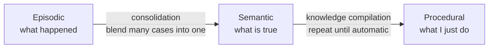
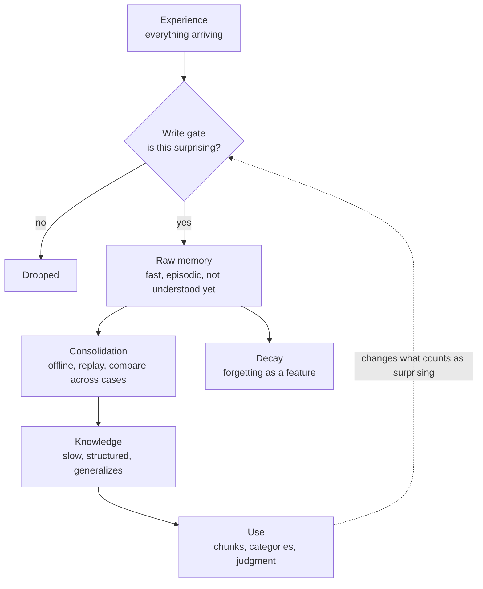

A line has been going around for a while now: **memory ability is intelligence**. Build a model that remembers more, and you get a model that thinks better.

I think that's backwards. And the [Google memory papers](/blogs/blog/what_comes_after_transformer/) — Titans, Hope, and the sleep paper — say so themselves, if you read what they actually do.

Here's the thought that started this post. Some people hold information for a long time without understanding it yet. They keep it raw, reuse it as-is, and turn it into knowledge much later — sometimes years later. Other people can't do that at all. They have to understand something before it will stay in their head. Same task, opposite order.

So the real question isn't "is memory intelligence?" It's an **ordering** question:

> Does understanding have to come *before* storage, or can storage come first and the structure arrive later?

Both answers turn out to be defensible. Working out *when* each one is right is what this post is about.

---

## The man who could not forget

Start with the strongest counter-example, because it settles the headline claim in one move.

In 1942 Borges published ["Funes the Memorious"](https://en.wikipedia.org/wiki/Funes_the_Memorious). Ireneo Funes falls from a horse and wakes up unable to forget anything. Every leaf of every tree he has ever seen. Every shape of every cloud, and the memory of remembering it. He can reconstruct a whole day — but reconstructing it takes him a whole day.

And Funes cannot think. Borges is blunt about why:

> "To think is to forget differences, generalize, make abstractions."

Funes is annoyed that the word *dog* covers both the dog seen from the side at 3:14 and the dog seen from the front at 3:15. To him those are plainly two different things. He is right, in a way. And being right that way makes thought impossible. **A mind that keeps every difference can never form a category.**

That's fiction, but it has a real counterpart. In [*The Mind of a Mnemonist*](https://en.wikipedia.org/wiki/Solomon_Shereshevsky) (1968), the neuropsychologist Alexander Luria describes thirty years of studying a man known as S. — Solomon Shereshevsky — whose memory had no measurable limit. Luria could never find the edge of it. Shereshevsky had extreme synesthesia: every word arrived with a taste, a color, a texture. That was the storage mechanism, and it worked terrifyingly well.

He also struggled badly with abstraction, categorizing, metaphor, and generalizing. The concrete images were so vivid that they crowded out the point. He remembered everything and grasped less than the people testing him.

Two men, one imagined and one real, with the thing the headline says is intelligence. Neither could think.

> **Lesson:** perfect storage isn't a superpower with the thinking added on. It's a missing step.

---

## Memory science had to invent meaningless words

Here's the detail I find most telling, and it's from the very beginning of the field.

When Hermann Ebbinghaus set out to measure memory scientifically in **1885**, he started with fragments of poetry. It didn't work. The poetry kept triggering associations — meaning, rhythm, images he already had — and those made some lines far easier to learn than others. His measurements were contaminated by everything he already knew.

So he invented the **nonsense syllable**: WUX, CAZ, BOK. Meaningless by construction. Only then could he get clean numbers, and get the forgetting curve we still teach.

Sit with that. **To study memory at all, the founder of memory science first had to strip out meaning** — because when meaning is present, you are no longer measuring memory. You're measuring knowledge doing the memory's work. He noticed the size of the gap too. Meaningful material — a poem — was far easier for him to learn than his own nonsense lists. The figure usually repeated from his work is about **ten times** easier; I've only ever seen it second-hand, so take the number loosely and the direction seriously.

Two later results say the same thing in sharper form.

**[Miller, 1956](https://psychclassics.yorku.ca/Miller/).** The famous "seven, plus or minus two" is the part everyone quotes, and it's the least interesting part. Miller's real point was a distinction: immediate memory is limited by the **number of chunks**, not the amount of information. And a chunk can hold as much as you can pack into it. `FBICIAIBM` is nine letters if you don't know the acronyms, three chunks if you do. The span never changed. **Your knowledge changed what fits in a slot.** Miller called this recoding, and treated it as the main way humans beat the limit.

**[Chase & Simon, 1973](https://www.sciencedirect.com/science/article/abs/pii/0010028573900042).** Building on de Groot's earlier work: show a chess master a real game position for five seconds and they can rebuild it almost perfectly. A novice can't get close. This is the classic evidence for "experts have amazing memory." Then comes the twist — **scramble the pieces into a random arrangement, and most of the master's advantage disappears.** Same board, same pieces, same five seconds. The memory was never a bigger container. It was structure, and the structure only fires on positions that could actually happen.

The honest counter, and it matters: [Gobet & Simon (1996)](https://link.springer.com/article/10.3758/BF03200937) found strong players do keep a *small* edge even on random boards, because a random board still contains a few accidental fragments that look like chess. The effect is smaller than the story usually told, not absent.

> **Lesson:** most of what looks like a big memory is a good structure wearing a memory's clothes.

---

## So which comes first?

Now the ordering question, with a serious argument on each side.

**Understanding first.** The clearest statement is David Ausubel's, from 1968:

> "The most important single factor influencing learning is what the learner already knows. Ascertain this and teach him accordingly."

His distinction is between **rote** learning and **meaningful** learning. Meaningful learning attaches a new idea to a structure you already have. Rote learning attaches it to nothing, so it sits there alone and decays. This matches Ebbinghaus's ten-to-one, Miller's chunks, and Chase & Simon's chess masters. It also matches ordinary experience: the fact you understand is the fact you don't have to memorize.

**Storage first.** But the brain plainly does the opposite, and we've known the design for thirty years. [McClelland, McNaughton & O'Reilly (1995)](https://pubmed.ncbi.nlm.nih.gov/7624455/) asked why we have two memory systems instead of one, and answered: because one system can't do both jobs. The **hippocampus** writes fast, keeps individual episodes separate, and doesn't care whether they mean anything yet. The **neocortex** learns slowly, blending across many episodes to pull out the pattern that runs through them. Fast raw capture first. Structure extracted later, gradually, mostly offline.

Why split it? Because if you wrote every new episode straight into the slow structure at full strength, you'd wreck what's already there. That's **catastrophic forgetting**, and the two-system design exists to dodge it. Storing raw isn't laziness. It's the safe holding area.

And neural networks show the same order, visibly. In [grokking](https://arxiv.org/abs/2201.02177) (Power, Burda, Edwards, Babuschkin & Misra, 2022), a small network is trained on algorithmic tasks like modular arithmetic. It memorizes the training set completely — perfect training accuracy — while performing at chance on held-out data. It sits there, an obvious overfit, for a very long time. Then, long *past* the point where any sane person would have stopped training, held-out accuracy suddenly climbs to near perfect. It generalizes. **The memorization came first, and the understanding arrived much later out of the same weights.**

So both sides have real evidence. The resolution, I think, is that they're answering under different conditions:

- **When you already have the structure, understand first.** It's cheaper. The new fact snaps into a slot that exists, and it costs you almost nothing to keep.
- **When you don't have the structure yet, you have no choice but to store first.** A new field, a new language, a new codebase. You cannot abstract from one example. The pattern only becomes visible across a pile of cases, so you have to be *holding* the pile before the pattern can show up.

Which means what looks like two kinds of people is closer to two **phases**, and people differ in which phase they can tolerate sitting in. Some are comfortable carrying material they don't understand yet, trusting it will resolve. Others find that unbearable and refuse to hold anything until it makes sense.

Each style has its own failure, and both are common:

- **Store-first fails when consolidation never comes.** The pile just grows. This is the wall I ran into writing about [knowledge bases](/blogs/blog/how_to_build_knowledgebase/): storage without inference is dead data. A memory that only ever adds becomes a junk drawer, and a junk drawer feels like wealth right up until you need something out of it.
- **Understand-first fails when it refuses the pile.** If you only keep what you can already explain, you never accumulate the raw cases the next abstraction has to be built from. You stay fluent inside the structure you have and can't grow a new one.

> **Lesson:** understanding first is cheaper when you already have the structure. Storing first is the only option when you don't. The mistake is picking one and using it everywhere.

---

## The machines make exactly this mistake

The confusion isn't only about people. Look at how we judge models.

In [*Understanding deep learning requires rethinking generalization*](https://arxiv.org/abs/1611.03530) (Zhang, Bengio, Hardt, Recht & Vinyals, ICLR 2017), the authors took standard image networks and trained them on **randomly shuffled labels**. The networks fit them perfectly. Then they replaced the images with pure noise. The networks fit that too. There is no pattern in random labels — nothing to understand — and capacity alone drove training error to zero anyway.

That's Funes, in a network. **The ability to store is effectively unlimited and tells you nothing about whether anything was understood.**

Which is why the way we score models keeps embarrassing us:

- **Benchmarks.** A model that has seen the test set answers it beautifully. I wrote about a piece of this in [why models hallucinate](/blogs/blog/why_model_hallucinate/) — when the test becomes the target, it stops measuring. Contamination turns memory into a score and the score gets reported as reasoning.
- **Long context.** The popular "needle in a haystack" test hides a sentence in a million tokens and asks the model to find it. That measures **retrieval**. It gets read as intelligence. They aren't the same claim, and the second one doesn't follow.
- **What actually ships.** Nearly every production system today keeps the weights frozen and bolts a store on the outside — retrieval, notes, scratchpads, memory files. That's the honest summary of the whole [frozen-model landscape](/blogs/blog/what_comes_after_transformer/): we shipped the storage half and left the transform half in the lab. When an agent "learns" today, it almost always means it **took better notes**.

> **Lesson:** capacity to store proves nothing. Every interesting property lives in the transform.

---

## What Google's papers actually build

Now back to the claim that started this. Read Google's memory papers for what their mechanisms *do*, and the pattern is impossible to miss — almost none of it is about storing more.

- **[Titans](https://arxiv.org/abs/2501.00663)** writes to long-term memory based on **surprise** — how badly the input violated the model's expectation. That's a filter. It exists to *not* store most things. And it pairs with a **decay gate**, deliberate forgetting, because a memory that only adds eventually drowns.
- **[Nested Learning / Hope](https://arxiv.org/abs/2512.24695)** points out that a transformer has only two update speeds: every token, or never again. Its proposal is to fill in the middle with many update frequencies. That's not more capacity. That's a schedule for **converting** fast memory into slow structure.
- **[The sleep paper](https://arxiv.org/abs/2606.03979)** makes it explicit. Its NREM stage **distills** what's sitting in fast memory into the model's own weights. Its REM stage has the model generate its own practice data and train on the useful parts. Both stages take material that is already stored and turn it into something else.

Every one of those is a **transform step, not a storage step**. Surprise-gating decides what's worth keeping. Decay throws things away. Consolidation converts episodes into weights. If memory alone were intelligence, none of this machinery would need to exist — you'd just make the buffer bigger.

The biology agrees about forgetting being a feature rather than a defect. [Richards & Frankland (2017)](https://www.cell.com/neuron/fulltext/S0896-6273(17)30365-3) argue that forgetting is there on purpose: dropping detail keeps old information from dominating current decisions, and stops the system overfitting to specific past events. Forgetting *promotes* generalization. Funes's condition, in one sentence of neuroscience.

So the papers and the slogan say opposite things. The slogan says memory is intelligence. The papers say memory is the raw material, and spend all their design effort on what happens to it afterward.

---

## The taxonomy everyone uses has no arrows

If you build agents, you've met this table. It's from the [LangChain memory docs](https://docs.langchain.com/oss/python/concepts/memory), and the split comes from [CoALA](https://arxiv.org/abs/2309.02427) (Sumers, Yao, Narasimhan & Griffiths, 2023), which borrowed it from cognitive science:

| Memory type | What is stored | Human example | Agent example |
|---|---|---|---|
| Semantic | Facts | Things I learned in school | Facts about a user |
| Episodic | Experiences | Things I did | Past agent actions |
| Procedural | Instructions | Instincts or motor skills | Agent system prompt |

It's a good table, and the categories are real ones — Tulving separated episodic from semantic memory back in 1972. But look at what kind of table it is. It classifies memory by **what is stored**. Three boxes and no arrows. Nothing in it says how an experience turns into a fact, or how a fact turns into an instinct.

In people, those three are not three boxes. They are **one thing at three ages.**

**Episodic becomes semantic.** That's consolidation — the hippocampus-to-neocortex transform from earlier in this post. You know that Paris is the capital of France, and you have no memory of learning it. That fact used to be an episode. The episode wore away and left the fact behind.

**Semantic becomes procedural.** That's practice. [John Anderson's account](https://www.semanticscholar.org/paper/Acquisition-of-cognitive-skill.-Anderson/eb324f42d42dc29d9f89e044a76516227e4e2c66) (1982), built on Fitts & Posner's three stages of skill learning (1967): a skill starts as declarative facts you rehearse to yourself — *clutch in, then first gear* — passes through what he calls **knowledge compilation**, and comes out procedural. Fast, automatic, and no longer able to explain itself. The information didn't move to a different drawer. It changed form, and paid for the speed by losing its words.

That these really are separate systems has one piece of evidence nobody forgets. After surgery in 1953 removed much of his hippocampus, the patient known as **H.M.** could form almost no new lasting memories. In 1962 Brenda Milner sat him down to trace a five-pointed star while seeing only its reflection in a mirror — an awkward task nobody is good at first. He improved within each session, and he improved across days, eventually finishing far faster than on his first attempt. And every single day, Milner had to introduce herself again and explain the task from scratch. **The skill was being learned while the record of learning it never formed.**

Put the two men side by side and you have the argument in full. Funes stored everything and could form nothing. H.M. stored nothing and still learned. Whatever intelligence is, it isn't the size of the store.

Now look at the agent column again. In almost every agent I've built or read, all three rows are **written by hand or appended by a tool, and nothing ever moves between them.** And to be clear about what I'm complaining about: the pile of episodes is fine. That's phase one, and this post already argued you can't skip it. The problem is that phase two never runs. Episodes pile up in a log. Facts get pulled out by a summarizing prompt that runs once, on one conversation. The system prompt is edited by a human being, on purpose, in a text editor. There's no job that reads a thousand episodes and writes down the one rule that covers them, and no loop that turns a rule the agent has to *read* into behavior it just *has*.

The fair counter: this is starting to change. Prompt-optimizing memory layers — LangMem is the clearest example — let an agent rewrite its own system prompt from accumulated experience, which is exactly the semantic-to-procedural arrow. It's the most interesting thing in that stack, and it's still the exception. The other arrow, many episodes slowly blending into one fact, is mostly still a prompt that says "summarize this conversation," which is a summary, not a consolidation. Summarizing one episode compresses it. Consolidation needs many episodes compared against each other, and that's the part nobody runs.

> **Lesson:** the three memory types aren't three boxes, they're one thing at three ages. Every agent memory I've built had the boxes and none of the arrows.

---

## The two things, side by side

The dotted line is the part people miss. What you already understand decides what is worth storing next — which is Ausubel's sentence, drawn as a loop.

| | Memory | Knowledge |
|---|---|---|
| What it holds | Specific cases, as they happened | The pattern running across cases |
| Cost to add one | Cheap — just write it | Expensive — has to be integrated |
| Good at | Exact recall, detail, reuse as-is | Categories, transfer, judgment on new cases |
| Fails by | Piling up until nothing can be found | Smoothing away the detail that mattered |
| In the brain | Hippocampus — fast, keeps episodes apart | Neocortex — slow, blends across episodes |
| In machines today | Retrieval stores, notes, context files | The frozen weights, set at training time |
| The gap between them | \- | Consolidation — and it mostly runs offline |

---

## What I actually do with this

**For learning.** Taking notes is not learning; it's the staging area. The step that counts is the one where you go back over the pile and ask what runs through it — and that step needs its own time on the calendar, because nothing forces it. This is why re-reading feels productive and does so little. It's also permission to hold things you don't understand yet, which I used to treat as failure. It isn't. It's phase one, and when the structure doesn't exist yet, phase one is the only way in. (More on the mechanics in [how I learn](/blogs/blog/how_to_learn/).)

**For agents.** Almost every agent memory I've seen is append-only, and append-only is the junk drawer. If Titans is right about the shape, a real agent memory needs four parts, and storage is the easy one: a **write gate** so only surprising things get in, a **decay rule** so stale entries lose weight, a **background consolidation job** that turns many episodes into one rule — the missing arrow from the section above — and only then retrieval. I argued for the same four from the brain's side in the [knowledge base post](/blogs/blog/how_to_build_knowledgebase/) before I knew Google was building them into the weights.

The uncomfortable version: **an agent that remembers everything from every session is not smarter. It's Funes.** More recall, more retrieved noise, more confident wrong context. I've watched a memory feature make an agent worse, and this is why.

---

## Where this leaves us

Memory is not intelligence. But there is no intelligence without it, and that's the part the slogan gets half-right.

Funes had the storage and nothing else, and it paralyzed him. Ausubel described the structure, but structure can't start from nothing — you need a pile of unexplained cases before there's anything to abstract. Neither end works alone. What we call understanding is the machine that runs between them: a gate that decides what's worth keeping, a decay that lets go, and a slow process that turns a heap of specific events into one rule that covers all of them.

That process is the expensive part. It's the part we haven't shipped. And it mostly runs while nothing else is happening — which is a strange thing to learn from a paper about making language models sleep.

---

## Sources

**Perfect memory, no thought:**
- Jorge Luis Borges, ["Funes the Memorious"](https://en.wikipedia.org/wiki/Funes_the_Memorious) (*La Nación*, 1942; collected in *Ficciones*, 1944)
- A. R. Luria, *The Mind of a Mnemonist* (1968) — the case of [Solomon Shereshevsky](https://en.wikipedia.org/wiki/Solomon_Shereshevsky)

**Memory is structure:**
- Hermann Ebbinghaus, *Über das Gedächtnis* (1885) — nonsense syllables and the forgetting curve
- George Miller, [The Magical Number Seven, Plus or Minus Two](https://psychclassics.yorku.ca/Miller/) (*Psychological Review*, 1956) — chunks, not bits
- Chase & Simon, [Perception in Chess](https://www.sciencedirect.com/science/article/abs/pii/0010028573900042) (*Cognitive Psychology*, 1973) · the counter: Gobet & Simon, [Recall of random and distorted chess positions](https://link.springer.com/article/10.3758/BF03200937) (*Memory & Cognition*, 1996)

**Which comes first:**
- David Ausubel, *Educational Psychology: A Cognitive View* (1968) — meaningful vs. rote learning
- McClelland, McNaughton & O'Reilly, [Why there are complementary learning systems in the hippocampus and neocortex](https://pubmed.ncbi.nlm.nih.gov/7624455/) (*Psychological Review*, 1995)
- Power, Burda, Edwards, Babuschkin & Misra, [Grokking: Generalization Beyond Overfitting on Small Algorithmic Datasets](https://arxiv.org/abs/2201.02177) (2022)

**The three memory types, and the arrows between them:**
- Endel Tulving, "Episodic and Semantic Memory," in *Organization of Memory* (1972) — the original split
- Sumers, Yao, Narasimhan & Griffiths, [Cognitive Architectures for Language Agents (CoALA)](https://arxiv.org/abs/2309.02427) (2023) · the taxonomy as agent builders meet it: [LangChain memory docs](https://docs.langchain.com/oss/python/concepts/memory)
- Brenda Milner's mirror-drawing studies of [patient H.M.](https://en.wikipedia.org/wiki/Henry_Molaison) (1962) — skill learning with no memory of learning
- John Anderson, [Acquisition of Cognitive Skill](https://www.semanticscholar.org/paper/Acquisition-of-cognitive-skill.-Anderson/eb324f42d42dc29d9f89e044a76516227e4e2c66) (*Psychological Review*, 1982) — knowledge compilation, building on Fitts & Posner (1967)

**Machines:**
- Zhang, Bengio, Hardt, Recht & Vinyals, [Understanding deep learning requires rethinking generalization](https://arxiv.org/abs/1611.03530) (ICLR 2017)
- Behrouz et al., [Titans](https://arxiv.org/abs/2501.00663) (2024) · [Nested Learning](https://arxiv.org/abs/2512.24695) (NeurIPS 2025) · [Language Models Need Sleep](https://arxiv.org/abs/2606.03979) (2026)
- Richards & Frankland, [The Persistence and Transience of Memory](https://www.cell.com/neuron/fulltext/S0896-6273(17)30365-3) (*Neuron*, 2017)
