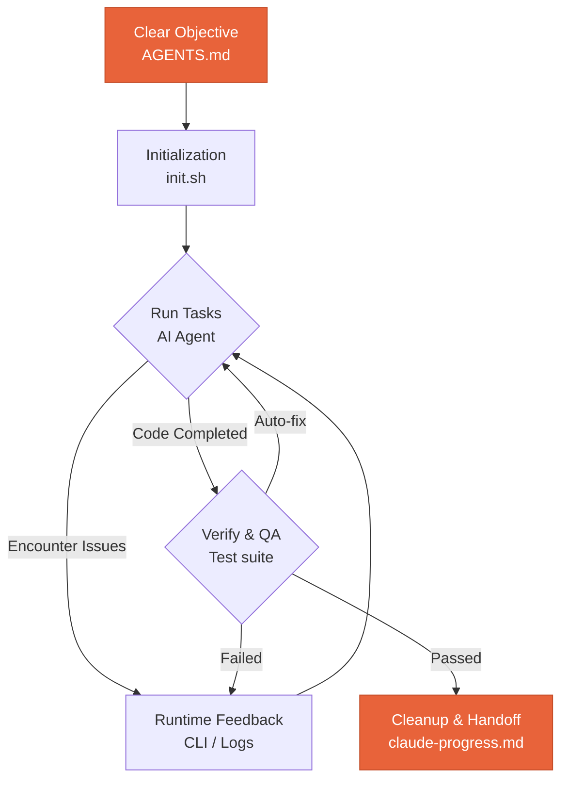
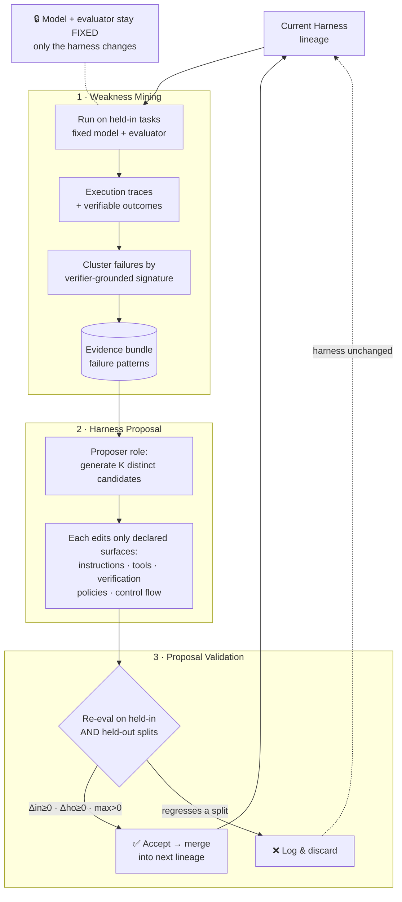
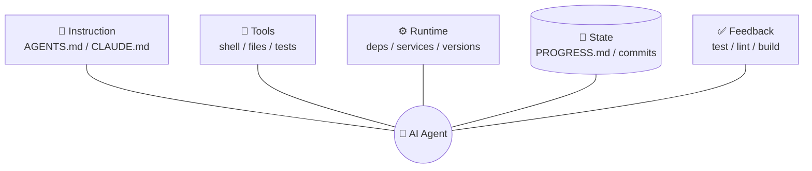
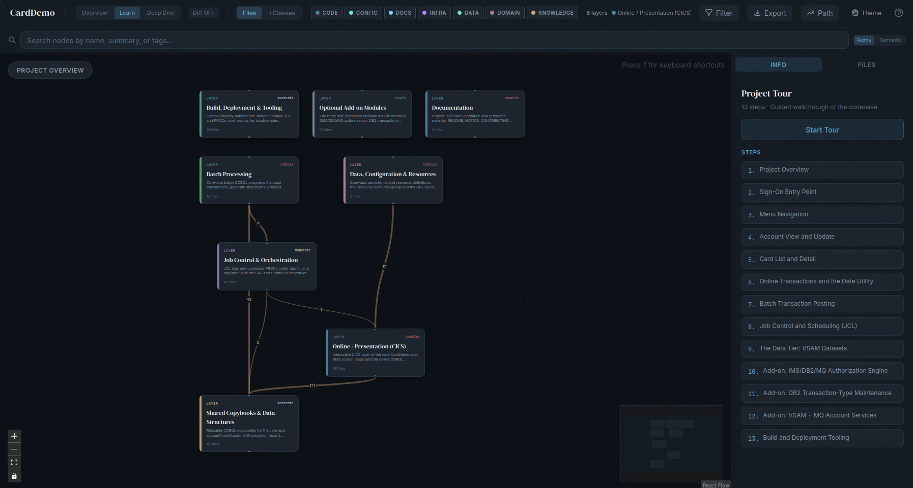

## Introduction

In my [previous blog](https://locchh.github.io/blogs/blog/coding_today/), I shared some thoughts about migration. Recently I've had hands-on experience with a migration project, and gained some insights that I want to share.

The main pitfall is thinking that with an AI-powered solution, you can put legacy code in and get a modernized system out. That thinking is naive, because migration is not a one-time task you can do with AI. It is a long-term process that requires both human expertise and AI assistance. The ultimate goal is to keep your system running and hand it off safely to the next generation without breaking the business.

## Something About Migration

### The 7 R's

Before you write a single line of new code, you have to decide *what to do* with each piece of the old system. The mistake is treating "migration" as one decision applied to everything. It isn't. Every application has its own architecture, dependencies, and business value, so you evaluate each one individually and pick the path that best balances speed, cost, and long-term value.

The [7 R's framework](https://www.ibm.com/think/insights/7-rs-cloud-migration) names the seven options:

| Strategy | What it means | When to use it | Trade-off |
|---|---|---|---|
| **Rehost** (lift-and-shift) | Move the app as-is, no code changes | Tight deadlines, datacenter exits, low-risk workloads | Fastest and cheapest to move, but you carry the old inefficiencies with you |
| **Relocate** | Move a whole environment (VMs, containers) without new hardware or a new ops model | Large estates you want shifted wholesale with minimal disruption | Even less change than rehost — inherits every existing limitation |
| **Replatform** (lift-tinker-shift) | Move with a few targeted optimizations (e.g. swap a self-managed DB for a managed one) | When small tweaks unlock real value without a rebuild | A middle ground: modest benefit, modest effort and risk |
| **Refactor / Re-architect** | Significantly rewrite to be cloud-native | Apps that need scale, agility, or features the old design can't deliver | Highest cost, effort, and risk — but the highest long-term payoff |
| **Repurchase** (drop-and-shop) | Replace with a different product, usually SaaS | When a commercial option beats maintaining your own | Less control and customization; data migration and retraining cost |
| **Retire** | Decommission the app entirely | Usage data shows it's barely used, or its capability is duplicated elsewhere | Saves money and shrinks the surface area — but you need confidence it's truly dead |
| **Retain** (revisit) | Leave it where it is, for now | Recently upgraded, stable, or blocked by unresolved compliance/dependencies | Defers the decision instead of forcing a bad migration |

In practice you don't pick one. Most enterprises apply *different* R's to different components — a hybrid strategy is the expected, healthy outcome, not a sign of indecision. The 7 R's are the decision layer. The rest of this post is about *how* you execute the hard ones (refactor and re-architect) without breaking the business.

### The Strangler Fig and the Seam

A strangler fig germinates up in the branches of a host tree, grows its roots down to the ground, and slowly becomes self-sustaining until the original tree dies away — leaving the fig standing in its shape. [Martin Fowler's Strangler Fig pattern](https://martinfowler.com/bliki/StranglerFigApplication.html) borrows that image: you grow the new system *around* the old one, shifting behavior piece by piece, until the legacy code can be removed.

Why not just rewrite everything at once? Because big-bang rewrites tend to fail. Users can't wait years for the new system, the old behavior is hard to replicate exactly, much of the legacy functionality isn't even wanted (so rebuilding it is pure waste), and the whole effort is long and risky. The strangler approach changes the *economics*: investment and returns are spread out, value arrives early, and you're never one deploy away from catastrophe.

But you can only strangle a system you can take apart. That's where the **seam** comes in. Michael Feathers defines it as *"a place where you can alter behavior in your program without editing in that place."* The classic example: a `calculatePrice` function that calls a slow, expensive external shipping service. You can't test it cheaply — until you introduce a seam that lets you redirect the dependency to a test double, **without touching `calculatePrice` itself**. Every seam has an *enabling point*: you edit the code once to create the seam, and afterward all the variation happens there.

Seams are how you decompose a legacy system into stranglable pieces ([more from Fowler here](https://martinfowler.com/bliki/LegacySeam.html)). Find the seams, route behavior through them, then swap implementations one at a time. When a façade can't intercept traffic — for deeply embedded components — the same idea scales up as **Branch by Abstraction**: introduce an abstraction layer and switch implementations behind it incrementally.

### The phases of migration

Strategy and patterns are necessary but not sufficient. You also need a *workflow* — a sequence with checkpoints, so that "modernize this system" doesn't collapse into an unbounded mess. The [CoreStory code modernization playbook](https://docs.corestory.ai/playbooks/code-modernization) frames it as six phases, with human-in-the-loop (HITL) gates between them. Its core thesis is sharp: **modernization fails not because teams can't read the legacy code, but because they can't prove the new code does what the old code did.**

Across those phases, CoreStory plays three distinct roles — they're the "Role" column in the table below, so it's worth defining them up front:

- **Expert** — explains *how the system works*: behavior, architectural patterns, dependency chains, and data flows across the whole codebase. Most active in Phase 1 (Assessment) and Phase 3 (Target Architecture), where deep understanding drives strategy.
- **Navigator** — points to *where the work is*: the specific files, methods, and code paths where business logic, coupling, and risk live. It translates the Expert's architectural picture into concrete locations to change, primarily in Phase 4 (Decomposition) and Phase 5 (Execution).
- **Verifier** — proves *the new code matches the old*: it compares legacy and modernized implementations to confirm behavioral equivalence against the Phase 2 business rules. This is the whole of Phase 6.

The split maps cleanly onto the harness idea from earlier — *understand → locate → verify* — and notice none of them decides anything. They inform; the human at each HITL gate commits.

| Phase | Name | Purpose | Role | Sub-Playbook |
|---|---|---|---|---|
| 1 | Codebase Assessment | Evaluate modernization readiness: architecture, dependencies, tech debt, coupling, risk — including non-code artifacts (JCL, configuration, data stores) | Expert | Codebase Assessment |
| 2 | Business Rules Inventory | Extract, catalog, and validate all business rules the modernized system must preserve | Expert + Navigator | Business Rules Extraction |
| 3 | Target Architecture & Strategy | Select modernization pattern (7 R's), define target architecture, human approval gate | Expert | Target Architecture |
| 4 | Decomposition & Sequencing | Identify service boundaries, map dependencies, produce an ordered migration plan, push to Jira/Linear | Navigator | Decomposition & Sequencing |
| 5 | Iterative Execution | Transform → Coexist → Eliminate per component, using Strangler Fig / Branch by Abstraction | Expert + Navigator | Spec-Driven Development + architecture-to-architecture variants |
| 6 | Behavioral Verification | Prove modernized components preserve the business rules from Phase 2 | Verifier | Behavioral Verification |
| 7 | Cutover | Switch live traffic from the legacy system to the new one, and monitor closely | Navigator + Verifier | Cutover & Rollback |
| 8 | Decommission | Retire the legacy system — only after the new one has proven stable in production | Expert | Decommission |

CoreStory's playbook stops at Phase 6, because behavioral equivalence is the part AI can meaningfully drive. But verification proves a component is *ready*; it doesn't make it *live*. Phases 7 and 8 are the system-level endgame — the moment the strangler fig finally takes over and the host tree comes down.

**How the phases connect.** They form a dependency chain with an iterative loop at the end:

- **Phase 1** produces the assessment that informs **Phase 3** — you can't choose a pattern without understanding what you're modernizing.
- **Phase 2** produces the behavioral contract that **Phase 6** verifies against. The business-rules inventory *is* the definition of "correct." Skipping it is the most common way migrations fail.
- **Phase 3** selects the pattern that determines which **Phase 5** variant you run — monolith-to-microservices executes very differently from mainframe-to-cloud.
- **Phase 4** produces the sequenced work plan that **Phase 5** executes, each package with its own dependencies and acceptance criteria.
- **Phases 5 and 6 are iterative** — each component cycles through execution and verification. A component isn't done until its behavioral equivalence is confirmed.
- **Phases 7 and 8 are the cutover and the kill.** Only once a verified component is carrying real traffic *and* holding up do you decommission its legacy counterpart. Cutover is reversible (you can route traffic back); decommission is not — which is exactly why it comes last and waits for stability.


Notice what the gates are doing: AI does the heavy lifting at every phase, but **AI informs, humans commit.** Go/no-go, architecture approval, sequence approval, equivalence sign-off — these are the points where someone is accountable for an organizational decision the model shouldn't make alone.

Reading the per-phase playbooks (linked from the diagram) surfaced a few things I'd underrated:

- **Tribal knowledge is the silent killer.** Engineers who've known a system for years still miss the utility seven services quietly depend on, or the batch job that runs once a month. And 30–50% of mainframe business logic hides in non-code artifacts (JCL, copybooks, config). A formal assessment exists to surface exactly what humans forget — under-scoping from these blind spots is what sinks projects.
- **Data is the real constraint, not code.** Splitting a shared database across service boundaries is consistently the hardest part of any migration. The rule is *don't break the monolith's database on day one* — start with schema ownership, move to database-per-service only once the boundary is proven. (This is why "data first" below matters so much.)
- **Sequencing optimizes the wrong thing if you optimize per-component.** The best order **minimizes total temporary integration burden** across the whole migration — every coexistence phase needs real adapters, façades, and data sync. And you extract the *easiest* service first on purpose: the goal isn't speed, it's building the pipeline, monitoring, and team muscle memory on a safe case.
- **Verification is tiered, and not every difference is a bug.** Static rule-tracing → golden-master tests → shadow traffic → data reconciliation. Crucially, *classify before remediating*: differences are intentional improvements, acceptable deviations, or real regressions. The dangerous regressions are the invisible ones — default values, ordering guarantees, error-message formats — that no documented business rule covers.
- **The façade is infrastructure, not architecture** — and distributed transactions are the hidden tax. Once a single-database operation spans two services it loses ACID, so you pay for it with saga patterns. Underinvesting in the routing layer (percentage rollout, circuit breaking, request mirroring) is what makes "gradual" migrations stop being gradual.

There's also a deeper thread running through CoreStory's *bug-resolution* and *feature-implementation* playbooks: both split the work into an **Expert phase** (how the system works) and a **Navigator phase** (where to change it), insist on **tests before implementation**, and **persist each investigation as institutional knowledge**. That's the same harness shape applied to everyday work — which is exactly the argument of the next section.

### Migrate data first, logic follows

One hard-won ordering rule: **move the data before the logic.** Data outlives code. Schemas, formats, and the meaning of fields are the most durable thing in any legacy system — and the logic only makes sense in terms of the data it operates on. If you try to port logic onto a data model you haven't settled yet, every business rule you migrate sits on shifting ground, and you re-do the work each time the schema moves.

Get the data migrated and stable first, then you have a fixed target to write against. The Strangler Fig grows downward to the ground before it strangles the trunk; migrations work the same way — root yourself in the data, then let the logic follow.

## First look at Harness

```
Harness = Instructions + Tools + Environment + State + Feedback
```

A harness doesn't "make the model smarter"; rather, it establishes a closed-loop working system *around* the model. The model is fixed — what changes is the environment it operates in, the instructions it reads, the tools it can reach, the memory it carries across sessions, and the feedback that tells it whether it actually succeeded. [Learn Harness Engineering](https://walkinglabs.github.io/learn-harness-engineering/en/) frames reliability as emerging from four dimensions — environment design, state management, verification, and control — wired into a loop:



The point of the loop: the model never "declares victory" on its own word. It acts, the environment changes, verification judges the result, and that judgment — plus what's worth remembering — feeds the next turn. Take the loop away and you're back to one-shot prompting.

OpenAI and Anthropic have both converged on this same idea — that the leverage for making agents run *longer and better* is in the harness, not just the model:

- **OpenAI** ([Harness engineering](https://openai.com/index/harness-engineering/)) encodes *"golden principles"* directly into the repository, treats plans as first-class versioned artifacts, and runs background tasks that scan for deviations and open refactoring PRs. The framing: you give the agent the same onboarding context — architecture maps, quality grades, operating principles — you'd give a new teammate, rather than overwhelming it with ad-hoc instructions.
- **Anthropic** ([effective harnesses](https://www.anthropic.com/engineering/effective-harnesses-for-long-running-agents)) tackles the cross-session problem with an *initializer + coding agent* split, a JSON feature list, a progress file, and guardrails that stop the agent from prematurely calling a project "done."
- **Anthropic** ([harness design](https://www.anthropic.com/engineering/harness-design-long-running-apps)) adds the strongest lever of all: **separate the agent that does the work from the agent that judges it** (planner → generator → evaluator). Agents are poor self-evaluators, so an independent grader catches what a lone agent misses. And keep the harness as simple as possible — stress-test its assumptions as models improve, because components that were once load-bearing often stop being so.

Recently the paper [Self-Harness: Harnesses That Improve Themselves](https://arxiv.org/html/2606.09498v1) classified harness improvement into three kinds:

- **Human harness engineering** — human engineers manually inspect and revise the agent's harness.
- **Meta-Harness** — a stronger external agent optimizes the harness of a weaker target agent, treating harness design as a searchable space.
- **Self-Harness** — the agent improves its *own* operating harness, with no external guidance.

### The Evolution of Enhancement

The field has moved through three stages, each widening the surface we engineer:

```
Prompt engineering -> Context engineering -> Harness engineering
```

- **Prompt engineering** — crafting the wording of a single input so the model produces the output you want: instructions, examples, role framing, chain-of-thought. It treats the model as a function you tune one string at a time. *(Canonical reference: the [Prompt Engineering Guide](https://www.promptingguide.ai/).)*
- **Context engineering** — curating the *whole* set of tokens the model sees at inference: retrieved documents, tool results, memory, system state — deciding what to include, compress, or drop so the limited context window holds the right information at the right time. *(Canonical reference: Anthropic's [Effective context engineering for AI agents](https://www.anthropic.com/engineering/effective-context-engineering-for-ai-agents).)*
- **Harness engineering** — designing the entire closed-loop system the model runs inside: environment, tools, verification, memory, and control flow, sustained across many turns and sessions. Prompt and context become just two components of it. *(Canonical references: the OpenAI and Anthropic posts above.)*

Each stage doesn't replace the previous one — it *contains* it. A harness is full of prompts and managed context; it just no longer stops there.

*For a conscious being, to exist is to change, to change is to mature, to mature is to go on creating oneself endlessly.*
*—Henri Bergson, Creative Evolution*

That line is the whole promise of self-improving agents: a harness that doesn't just run the model, but keeps re-creating itself. A few concrete techniques point this way — [Nous Research's Hermes agent](https://github.com/nousresearch/hermes-agent) and the [self-improving "Claude Skills 2.0"](https://medium.com/@reliabledataengineering/claude-skills-2-0-the-self-improving-ai-capabilities-that-actually-work-dc3525eb391b) pattern, where the agent accumulates and refines its own reusable skills.

The **Self-Harness** paper makes the mechanism precise. The key constraint: the **model and evaluator stay fixed** — only the *harness* changes, so any improvement is attributable to harness edits alone. The agent edits only declared *editable surfaces* (system instructions, tool definitions, verification guidance, runtime policies, control structures), never model weights. It runs as a bounded, evidence-driven loop:

1. **Weakness Mining** — run the current harness over a held-in task set, collect execution traces with verifiable outcomes, then cluster the *failures* by **verifier-grounded failure signature** (terminal cause + contributing behavior + reusable mechanism). This turns scattered failures into a structured *evidence bundle* of patterns that admit a common fix.
2. **Harness Proposal** — the same fixed model, in a *proposer* role, reads the evidence bundle and generates **K distinct candidate edits**. Each must target one failure mechanism and touch only the minimal harness surface, leaving unrelated behavior intact.
3. **Proposal Validation** — re-evaluate each candidate on **both** a held-in and a held-out split. Accept only if it improves at least one split without regressing the other (Δin ≥ 0, Δho ≥ 0, max > 0). The held-out split is a regression gate ensuring the fix *generalizes*. Accepted edits merge into the next harness lineage; rejected ones are logged but discarded.



Because the loop is grounded in each model's *own* failure signatures, the harness it converges on is **model-specific** — the paper shows MiniMax-, Qwen-, and GLM-class models each accreting different edits (early-artifact creation, dependency prechecking, preserving shell environment state, breaking unproductive tool-use loops). There is no single best harness; there's the best harness *for this model on these tasks*.

### Fundamental of Harness

The clearest treatment I've found of *how* to build one is the [Learn Harness Engineering](https://walkinglabs.github.io/learn-harness-engineering/en/) course, which synthesizes the OpenAI and Anthropic guidance into a working model. The rest of this section follows its framing.

```
Harness = Instruction + Tools + Runtime + State + Feedback
```

#### Where agents actually get stuck

The [specific failure modes](https://walkinglabs.github.io/learn-harness-engineering/en/lectures/lecture-01-why-capable-agents-still-fail/) really come down to just a handful:

- **Vague requirements — the agent can only guess.** "Add a search feature" — that sentence means almost nothing. Search what? Full-text or structured queries? Should results be paginated? Highlighted? You didn't spell it out, so the agent has to guess. A correct guess is luck; a wrong one means rework that costs several times more than being specific would have in the first place.
- **Implicit conventions not written down — the agent has no way to comply.** Your whole team uses the new SQLAlchemy 2.0 syntax, but the agent writes 1.x code by default. All API endpoints must go through OAuth 2.0 authentication, but that rule only exists in your head and a Slack message from three months ago. The agent has no idea — it's not that it doesn't want to comply, it literally has never seen the rule.
- **Incomplete environment setup — the agent spends energy fixing the environment.** Incomplete dev setup, missing dependencies, wrong tool versions — the agent burns precious context window on `pip install` errors and Node version conflicts instead of doing the actual work you gave it.
- **No verification methods — the agent calls it done when it feels done.** No tests, no lint, or verification commands that were never communicated to the agent. The agent writes code, looks it over, decides it seems fine, and declares completion. Anthropic also observed an interesting phenomenon: when agents sense their context is running low, they rush to finish, skip verification steps, and choose a simple solution over the optimal one. They call this *"context anxiety."*
- **Cross-session state loss — every new session starts from scratch.** All discoveries from the previous session are lost. Every new session has to re-explore the project structure and re-understand the code organization. Agents without persistent state see failure rates spike sharply on tasks exceeding 30 minutes.

The central principle: **when things fail, don't swap the model first — check the harness.**

#### Core concepts

- **What is a harness:** everything in the engineering infrastructure outside the model weights. OpenAI distills the engineer's core job into three things: designing environments, expressing intent, and building feedback loops. Anthropic directly calls their Claude Agent SDK a *"general-purpose agent harness."*
- **The repo is the single source of truth:** anything the agent cannot see, for all practical purposes, does not exist. OpenAI treats the repo as the *"system of record"* — all necessary context must live there, delivered through structured files and clear directory organization.
- **Give a map, not a manual:** OpenAI's experience is that `AGENTS.md` should be a directory page, not an encyclopedia. Around 100 lines is enough. If it does not fit, split it into a `docs/` directory and let the agent read on demand.
- **Constrain, don't micromanage:** a good harness uses executable rules to constrain the agent, rather than enumerating instructions one by one. OpenAI says *"enforce invariants, don't micromanage implementation"*; Anthropic found that agents confidently praise their own work, and the solution is to separate "the person who does the work" from "the person who checks the work."
- **Remove one at a time and observe:** to quantify each harness component's marginal contribution, remove them one at a time and see which removal causes the biggest performance drop. This tells you which components are most valuable right now, and it also reveals which ones are not yet contributing meaningfully. Anthropic used this method and discovered that as models get stronger, some components stop being critical — but new critical components always emerge.

#### The five-subsystem harness model

Back to the analogy. A [harness has five subsystems](https://walkinglabs.github.io/learn-harness-engineering/en/lectures/lecture-02-what-a-harness-actually-is/), all wired around the agent:



- **Instruction subsystem:** create `AGENTS.md` (or `CLAUDE.md`) containing a project overview and purpose, tech stack and versions, first-run commands, non-negotiable hard constraints, and links to more detailed documentation.
- **Tool subsystem:** ensure the agent has sufficient tool access. Do not disable shell for "security reasons" — if the agent cannot even run `pip install`, how is it supposed to get anything done? But do not open everything either — follow the principle of least privilege.
- **Environment subsystem:** make the environment state self-describing. Use `pyproject.toml` or `package.json` to lock dependencies, `.nvmrc` or `.python-version` to specify runtime versions, and Docker or devcontainers to make the environment reproducible.
- **State subsystem:** long tasks must have progress tracking. Use a simple `PROGRESS.md` file recording what is done, what is in progress, and what is blocked. Update before each session ends; read when the next session starts.
- **Feedback subsystem:** this is the highest-ROI subsystem. Explicitly list verification commands in `AGENTS.md`:

```
Verification commands:
- Tests: pytest tests/ -x
- Type check: mypy src/ --strict
- Lint: ruff check src/
- Full verification: make check (includes all above)
```

Missing any one of the five subsystems means an incomplete harness, and the agent will always feel awkward to use.

**Quantifying harness component value.** Use a "controlled variable exclusion test." Keep the model fixed, remove the five subsystems one at a time, and see which subsystem's removal causes the biggest performance drop. The component with the largest drop has the highest marginal contribution for the current task and is worth prioritizing. Whether to strengthen it depends on failure attribution, not just the size of the drop. Components with near-zero impact should not be dismissed outright: they may be redundant, poorly designed, or simply not exercised by the current task. This experiment answers "which component is most valuable right now" — it cannot, by itself, prove "where the bottleneck is." To truly locate a bottleneck, you must first examine failure records and attributions: was the task unclear, was context insufficient, was the environment unreproducible, was verification feedback missing, or was state management broken? Component ablation results can only serve as supporting evidence.

#### Common pitfalls

Beyond the bloated-instruction trap above, the course names a handful of recurring failure patterns. Each is a *harness* problem, not a model problem — and each has a harness-level fix.

- **Knowledge visibility gap (finite context windows).** No matter what window size is claimed (128K, 200K, 1M), [long tasks will eventually exhaust it](https://walkinglabs.github.io/learn-harness-engineering/en/lectures/lecture-05-why-long-running-tasks-lose-continuity/). After exhaustion, either compaction (losing information) or reset (starting a new session) is required — both lose something. The fix is to externalize state into the repo (`PROGRESS.md`, decision logs, commits) so nothing critical lives only in the window.

- **Context anxiety.** A phenomenon observed by Anthropic — agents exhibit rushed finish behavior when approaching context limits, ending tasks early to avoid information loss. At its core, it's an irrational resource anxiety, and it makes an agent skip verification and pick the simple solution over the right one.

- **Overreach and under-finish.** [Attention is a finite resource](https://walkinglabs.github.io/learn-harness-engineering/en/lectures/lecture-07-why-agents-overreach-and-under-finish/) — and this isn't a metaphor, it's math. Assume the agent's context capacity is *C* and it activates *k* tasks simultaneously; each task gets an average of *C/k* reasoning resources. When *C/k* drops below the minimum threshold needed to complete a single task, none of them get finished. The fix is a **WIP = 1** workflow: one active task at a time, finished and verified before the next begins.

- **Declaring victory too early.** [Premature completion](https://walkinglabs.github.io/learn-harness-engineering/en/lectures/lecture-09-why-agents-declare-victory-too-early/) comes from confidence calibration bias and the assumption that *passing unit tests = task complete* (they don't — mocks hide cross-component failures). The fix is a **verification–validation dual gate**: the first layer (verification) checks whether the code correctly implements the specified behavior; the second (validation) checks whether system-level behavior meets end-to-end requirements. Both must pass before the task is considered complete.

- **Missing observability.** Agents don't know what they don't know. [They won't proactively record signals](https://walkinglabs.github.io/learn-harness-engineering/en/lectures/lecture-11-why-observability-belongs-inside-the-harness/) they don't realize they need. Without harness-level constraints, agents only log what they think is important — and what they think is important is usually not enough. Build runtime signal collection into the harness rather than relying on the agent to do it.

- **"Clean up later" means never clean up.** [Clean state](https://walkinglabs.github.io/learn-harness-engineering/en/lectures/lecture-12-why-every-session-must-leave-a-clean-state/) isn't simply "the code compiles." Building without errors is the most basic requirement — the next session shouldn't have to fix build errors first. All tests must pass too, including tests that existed before the session; the session is responsible for not breaking existing functionality, and this should be verified in CI, not just "works on my machine." But that's still not enough. Current progress must be recorded in machine-readable artifacts: completed subtasks with their passing criteria, in-progress subtasks with current state, and not-yet-started subtasks — good progress records cut session startup diagnostic time by 60–80%. Temporary artifacts — debug logs, temporary files, commented-out code, TODO markers — must also be cleaned up, because they increase cognitive load for the next session. And the standard startup path must remain functional: can the next session start working without manual intervention? Environment initialization, codebase loading, context acquisition, task selection — none of these paths can be broken.

## Migration is a Harness

### Why not just use skill?

- Structure of folder

- Workflow

### The Price

- The price of Fable 5

- Cost and time, but if you use an outdated model, you will waste both


### Other important aspects

- One more important thing that is how we can split and accumulate the work for each migration task

## Some other useful tools

### Understand Anything

https://github.com/Egonex-AI/Understand-Anything?ref=geeek.org

https://github.com/aws-samples/aws-mainframe-modernization-carddemo



### Playwright

https://playwright.dev/