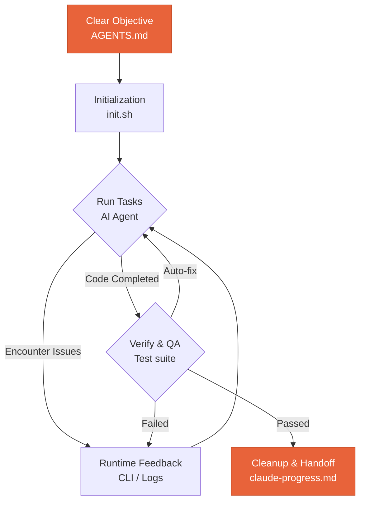
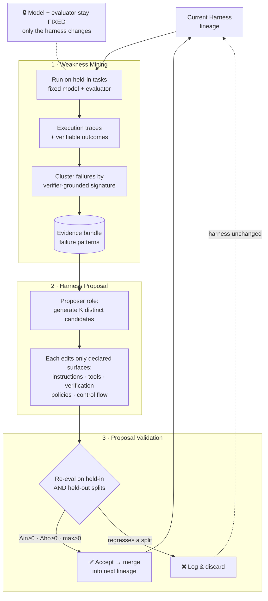
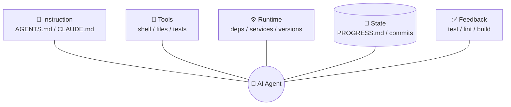
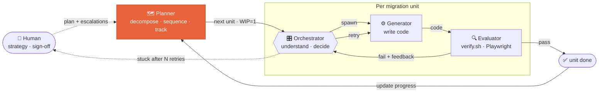
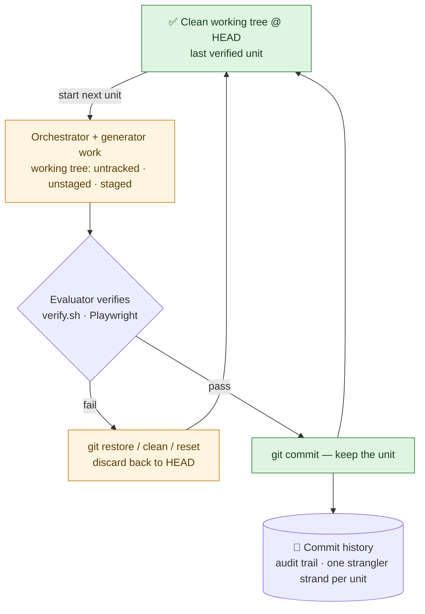

## Introduction

In my [previous blog](https://locchh.github.io/blogs/blog/coding_today/), I shared some thoughts about migration. Recently I've had hands-on experience with a migration project, and gained some insights that I want to share.

The main pitfall is thinking that with an AI-powered solution, you can put legacy code in and get a modernized system out. That thinking is naive, because migration is not a one-time task you can do with AI. It is a long-term process that requires both human expertise and AI assistance. The ultimate goal is to keep your system running and hand it off safely to the next generation without breaking the business.

## Something About Migration

### The 7 R's

Before you write a single line of new code, you have to decide *what to do* with each piece of the old system. The mistake is treating "migration" as one decision applied to everything. It isn't. Every application has its own architecture, dependencies, and business value, so you evaluate each one individually and pick the path that best balances speed, cost, and long-term value.

The [7 R's framework](https://www.ibm.com/think/insights/7-rs-cloud-migration) names the seven options:

| Strategy | What it means | When to use it | Trade-off |
|---|---|---|---|
| **Rehost** (lift-and-shift) | Move the app as-is, no code changes | Tight deadlines, datacenter exits, low-risk workloads | Fastest and cheapest to move, but you carry the old inefficiencies with you |
| **Relocate** | Move a whole environment (VMs, containers) without new hardware or a new ops model | Large estates you want shifted wholesale with minimal disruption | Even less change than rehost — inherits every existing limitation |
| **Replatform** (lift-tinker-shift) | Move with a few targeted optimizations (e.g. swap a self-managed DB for a managed one) | When small tweaks unlock real value without a rebuild | A middle ground: modest benefit, modest effort and risk |
| **Refactor / Re-architect** | Significantly rewrite to be cloud-native | Apps that need scale, agility, or features the old design can't deliver | Highest cost, effort, and risk — but the highest long-term payoff |
| **Repurchase** (drop-and-shop) | Replace with a different product, usually SaaS | When a commercial option beats maintaining your own | Less control and customization; data migration and retraining cost |
| **Retire** | Decommission the app entirely | Usage data shows it's barely used, or its capability is duplicated elsewhere | Saves money and shrinks the surface area — but you need confidence it's truly dead |
| **Retain** (revisit) | Leave it where it is, for now | Recently upgraded, stable, or blocked by unresolved compliance/dependencies | Defers the decision instead of forcing a bad migration |

In practice you don't pick one. Most enterprises apply *different* R's to different components — a hybrid strategy is the expected, healthy outcome, not a sign of indecision. The 7 R's are the decision layer. The rest of this post is about *how* you execute the hard ones (refactor and re-architect) without breaking the business.

### The Strangler Fig and the Seam

A strangler fig germinates up in the branches of a host tree, grows its roots down to the ground, and slowly becomes self-sustaining until the original tree dies away — leaving the fig standing in its shape. [Martin Fowler's Strangler Fig pattern](https://martinfowler.com/bliki/StranglerFigApplication.html) borrows that image: you grow the new system *around* the old one, shifting behavior piece by piece, until the legacy code can be removed.

Why not just rewrite everything at once? Because big-bang rewrites tend to fail. Users can't wait years for the new system, the old behavior is hard to replicate exactly, much of the legacy functionality isn't even wanted (so rebuilding it is pure waste), and the whole effort is long and risky. The strangler approach changes the *economics*: investment and returns are spread out, value arrives early, and you're never one deploy away from catastrophe.

But you can only strangle a system you can take apart. That's where the **seam** comes in. Michael Feathers defines it as *"a place where you can alter behavior in your program without editing in that place."* The classic example: a `calculatePrice` function that calls a slow, expensive external shipping service. You can't test it cheaply — until you introduce a seam that lets you redirect the dependency to a test double, **without touching `calculatePrice` itself**. Every seam has an *enabling point*: you edit the code once to create the seam, and afterward all the variation happens there.

Seams are how you decompose a legacy system into stranglable pieces ([more from Fowler here](https://martinfowler.com/bliki/LegacySeam.html)). Find the seams, route behavior through them, then swap implementations one at a time. When a façade can't intercept traffic — for deeply embedded components — the same idea scales up as **Branch by Abstraction**: introduce an abstraction layer and switch implementations behind it incrementally.

### The phases of migration

Strategy and patterns are necessary but not sufficient. You also need a *workflow* — a sequence with checkpoints, so that "modernize this system" doesn't collapse into an unbounded mess. The [CoreStory code modernization playbook](https://docs.corestory.ai/playbooks/code-modernization) frames it as six phases, with human-in-the-loop (HITL) gates between them. Its core thesis is sharp: **modernization fails not because teams can't read the legacy code, but because they can't prove the new code does what the old code did.**

Across those phases, CoreStory plays three distinct roles — they're the "Role" column in the table below, so it's worth defining them up front:

- **Expert** — explains *how the system works*: behavior, architectural patterns, dependency chains, and data flows across the whole codebase. Most active in Phase 1 (Assessment) and Phase 3 (Target Architecture), where deep understanding drives strategy.
- **Navigator** — points to *where the work is*: the specific files, methods, and code paths where business logic, coupling, and risk live. It translates the Expert's architectural picture into concrete locations to change, primarily in Phase 4 (Decomposition) and Phase 5 (Execution).
- **Verifier** — proves *the new code matches the old*: it compares legacy and modernized implementations to confirm behavioral equivalence against the Phase 2 business rules. This is the whole of Phase 6.

The split maps cleanly onto the harness idea from earlier — *understand → locate → verify* — and notice none of them decides anything. They inform; the human at each HITL gate commits.

| Phase | Name | Purpose | Role | Sub-Playbook |
|---|---|---|---|---|
| 1 | Codebase Assessment | Evaluate modernization readiness: architecture, dependencies, tech debt, coupling, risk — including non-code artifacts (JCL, configuration, data stores) | Expert | Codebase Assessment |
| 2 | Business Rules Inventory | Extract, catalog, and validate all business rules the modernized system must preserve | Expert + Navigator | Business Rules Extraction |
| 3 | Target Architecture & Strategy | Select modernization pattern (7 R's), define target architecture, human approval gate | Expert | Target Architecture |
| 4 | Decomposition & Sequencing | Identify service boundaries, map dependencies, produce an ordered migration plan, push to Jira/Linear | Navigator | Decomposition & Sequencing |
| 5 | Iterative Execution | Transform → Coexist → Eliminate per component, using Strangler Fig / Branch by Abstraction | Expert + Navigator | Spec-Driven Development + architecture-to-architecture variants |
| 6 | Behavioral Verification | Prove modernized components preserve the business rules from Phase 2 | Verifier | Behavioral Verification |
| 7 | Cutover | Switch live traffic from the legacy system to the new one, and monitor closely | Navigator + Verifier | Cutover & Rollback |
| 8 | Decommission | Retire the legacy system — only after the new one has proven stable in production | Expert | Decommission |

CoreStory's playbook stops at Phase 6, because behavioral equivalence is the part AI can meaningfully drive. But verification proves a component is *ready*; it doesn't make it *live*. Phases 7 and 8 are the system-level endgame — the moment the strangler fig finally takes over and the host tree comes down.

**How the phases connect.** They form a dependency chain with an iterative loop at the end:

- **Phase 1** produces the assessment that informs **Phase 3** — you can't choose a pattern without understanding what you're modernizing.
- **Phase 2** produces the behavioral contract that **Phase 6** verifies against. The business-rules inventory *is* the definition of "correct." Skipping it is the most common way migrations fail.
- **Phase 3** selects the pattern that determines which **Phase 5** variant you run — monolith-to-microservices executes very differently from mainframe-to-cloud.
- **Phase 4** produces the sequenced work plan that **Phase 5** executes, each package with its own dependencies and acceptance criteria.
- **Phases 5 and 6 are iterative** — each component cycles through execution and verification. A component isn't done until its behavioral equivalence is confirmed.
- **Phases 7 and 8 are the cutover and the kill.** Only once a verified component is carrying real traffic *and* holding up do you decommission its legacy counterpart. Cutover is reversible (you can route traffic back); decommission is not — which is exactly why it comes last and waits for stability.

```mermaid
flowchart TD
    Start([🚀 Start]) --> P1

    P1[Phase 1: Codebase Assessment<br/>Expert · Readiness scoring]
    P2[Phase 2: Business Rules Extraction<br/>Expert · Behavioral inventory]
    P1 --> P2

    P2 --> G1{👤 HITL<br/>Go / No-go}
    G1 -->|Approved| P3

    P3[Phase 3: Target Architecture<br/>Expert + Navigator · Strategy selection]
    P3 --> G2{👤 HITL<br/>Architecture approval}
    G2 -->|Approved| P4

    P4[Phase 4: Decomposition & Sequencing<br/>Navigator · Work packages]
    P4 --> G3{👤 HITL<br/>Sequence approval}
    G3 -->|Approved| P5

    P5[Phase 5: Iterative Execution<br/>Navigator · Transform + Coexist]
    P5 --> P6[Phase 6: Behavioral Verification<br/>Verifier · Equivalence proof]

    P6 --> G4{👤 HITL<br/>Verification sign-off}
    G4 -->|Needs remediation| P5
    G4 -->|Verified| P7

    P7[Phase 7: Cutover<br/>Navigator + Verifier · Switch traffic, monitor]
    P7 --> G5{📈 Stable in<br/>production?}
    G5 -->|Issues| P7
    G5 -->|Stable| P8

    P8[Phase 8: Decommission<br/>Expert · Retire legacy system]
    P8 --> Done([✅ Component Modernized])

    P5 -.->|Iterative: each component cycles through<br/>execution and verification| P6

    click P1 "https://docs.corestory.ai/playbooks/modernization/codebase-assessment" "Codebase Assessment playbook" _blank
    click P3 "https://docs.corestory.ai/playbooks/modernization/target-architecture" "Target Architecture playbook" _blank
    click P4 "https://docs.corestory.ai/playbooks/modernization/decomposition-sequencing" "Decomposition & Sequencing playbook" _blank
    click P5 "https://docs.corestory.ai/playbooks/modernization/monolith-to-microservices" "Monolith-to-Microservices playbook" _blank
    click P6 "https://docs.corestory.ai/playbooks/modernization/behavioral-verification" "Behavioral Verification playbook" _blank
```



Notice what the gates are doing: AI does the heavy lifting at every phase, but **AI informs, humans commit.** Go/no-go, architecture approval, sequence approval, equivalence sign-off — these are the points where someone is accountable for an organizational decision the model shouldn't make alone.

Reading the per-phase playbooks (linked from the diagram) surfaced a few things I'd underrated:

- **Tribal knowledge is the silent killer.** Engineers who've known a system for years still miss the utility seven services quietly depend on, or the batch job that runs once a month. And 30–50% of mainframe business logic hides in non-code artifacts (JCL, copybooks, config). A formal assessment exists to surface exactly what humans forget — under-scoping from these blind spots is what sinks projects.
- **Data is the real constraint, not code.** Splitting a shared database across service boundaries is consistently the hardest part of any migration. The rule is *don't break the monolith's database on day one* — start with schema ownership, move to database-per-service only once the boundary is proven. (This is why "data first" below matters so much.)
- **Sequencing optimizes the wrong thing if you optimize per-component.** The best order **minimizes total temporary integration burden** across the whole migration — every coexistence phase needs real adapters, façades, and data sync. And you extract the *easiest* service first on purpose: the goal isn't speed, it's building the pipeline, monitoring, and team muscle memory on a safe case.
- **Verification is tiered, and not every difference is a bug.** Static rule-tracing → golden-master tests → shadow traffic → data reconciliation. Crucially, *classify before remediating*: differences are intentional improvements, acceptable deviations, or real regressions. The dangerous regressions are the invisible ones — default values, ordering guarantees, error-message formats — that no documented business rule covers.
- **The façade is infrastructure, not architecture** — and distributed transactions are the hidden tax. Once a single-database operation spans two services it loses ACID, so you pay for it with saga patterns. Underinvesting in the routing layer (percentage rollout, circuit breaking, request mirroring) is what makes "gradual" migrations stop being gradual.

There's also a deeper thread running through CoreStory's *bug-resolution* and *feature-implementation* playbooks: both split the work into an **Expert phase** (how the system works) and a **Navigator phase** (where to change it), insist on **tests before implementation**, and **persist each investigation as institutional knowledge**. That's the same harness shape applied to everyday work — which is exactly the argument of the next section.

### Migrate data first, logic follows

One hard-won ordering rule: **move the data before the logic.** Data outlives code. Schemas, formats, and the meaning of fields are the most durable thing in any legacy system — and the logic only makes sense in terms of the data it operates on. If you try to port logic onto a data model you haven't settled yet, every business rule you migrate sits on shifting ground, and you re-do the work each time the schema moves.

Get the data migrated and stable first, then you have a fixed target to write against. The Strangler Fig grows downward to the ground before it strangles the trunk; migrations work the same way — root yourself in the data, then let the logic follow.

## First look at Harness

```
Harness = Instructions + Tools + Environment + State + Feedback
```

A harness doesn't "make the model smarter"; rather, it establishes a closed-loop working system *around* the model. The model is fixed — what changes is the environment it operates in, the instructions it reads, the tools it can reach, the memory it carries across sessions, and the feedback that tells it whether it actually succeeded. [Learn Harness Engineering](https://walkinglabs.github.io/learn-harness-engineering/en/) frames reliability as emerging from four dimensions — environment design, state management, verification, and control — wired into a loop:



The point of the loop: the model never "declares victory" on its own word. It acts, the environment changes, verification judges the result, and that judgment — plus what's worth remembering — feeds the next turn. Take the loop away and you're back to one-shot prompting.

OpenAI and Anthropic have both converged on this same idea — that the leverage for making agents run *longer and better* is in the harness, not just the model:

- **OpenAI** ([Harness engineering](https://openai.com/index/harness-engineering/)) encodes *"golden principles"* directly into the repository, treats plans as first-class versioned artifacts, and runs background tasks that scan for deviations and open refactoring PRs. The framing: you give the agent the same onboarding context — architecture maps, quality grades, operating principles — you'd give a new teammate, rather than overwhelming it with ad-hoc instructions.
- **Anthropic** ([effective harnesses](https://www.anthropic.com/engineering/effective-harnesses-for-long-running-agents)) tackles the cross-session problem with an *initializer + coding agent* split, a JSON feature list, a progress file, and guardrails that stop the agent from prematurely calling a project "done."
- **Anthropic** ([harness design](https://www.anthropic.com/engineering/harness-design-long-running-apps)) adds the strongest lever of all: **separate the agent that does the work from the agent that judges it** (planner → generator → evaluator). Agents are poor self-evaluators, so an independent grader catches what a lone agent misses. And keep the harness as simple as possible — stress-test its assumptions as models improve, because components that were once load-bearing often stop being so.

Recently the paper [Self-Harness: Harnesses That Improve Themselves](https://arxiv.org/html/2606.09498v1) classified harness improvement into three kinds:

- **Human harness engineering** — human engineers manually inspect and revise the agent's harness.
- **Meta-Harness** — a stronger external agent optimizes the harness of a weaker target agent, treating harness design as a searchable space.
- **Self-Harness** — the agent improves its *own* operating harness, with no external guidance.

### The Evolution of Enhancement

The field has moved through three stages, each widening the surface we engineer:

```
Prompt engineering -> Context engineering -> Harness engineering
```

- **Prompt engineering** — crafting the wording of a single input so the model produces the output you want: instructions, examples, role framing, chain-of-thought. It treats the model as a function you tune one string at a time. *(Canonical reference: the [Prompt Engineering Guide](https://www.promptingguide.ai/).)*
- **Context engineering** — curating the *whole* set of tokens the model sees at inference: retrieved documents, tool results, memory, system state — deciding what to include, compress, or drop so the limited context window holds the right information at the right time. *(Canonical reference: Anthropic's [Effective context engineering for AI agents](https://www.anthropic.com/engineering/effective-context-engineering-for-ai-agents).)*
- **Harness engineering** — designing the entire closed-loop system the model runs inside: environment, tools, verification, memory, and control flow, sustained across many turns and sessions. Prompt and context become just two components of it. *(Canonical references: the OpenAI and Anthropic posts above.)*

Each stage doesn't replace the previous one — it *contains* it. A harness is full of prompts and managed context; it just no longer stops there.

Henri Bergson, in *Creative Evolution*, framed conscious life as something that endlessly re-creates itself. That idea is the whole promise of self-improving agents: a harness that doesn't just run the model, but keeps re-creating itself. A few concrete techniques point this way — [Nous Research's Hermes agent](https://github.com/nousresearch/hermes-agent) and the [self-improving "Claude Skills 2.0"](https://medium.com/@reliabledataengineering/claude-skills-2-0-the-self-improving-ai-capabilities-that-actually-work-dc3525eb391b) pattern, where the agent accumulates and refines its own reusable skills.

The **Self-Harness** paper makes the mechanism precise. The key constraint: the **model and evaluator stay fixed** — only the *harness* changes, so any improvement is attributable to harness edits alone. The agent edits only declared *editable surfaces* (system instructions, tool definitions, verification guidance, runtime policies, control structures), never model weights. It runs as a bounded, evidence-driven loop:

1. **Weakness Mining** — run the current harness over a held-in task set, collect execution traces with verifiable outcomes, then cluster the *failures* by **verifier-grounded failure signature** (terminal cause + contributing behavior + reusable mechanism). This turns scattered failures into a structured *evidence bundle* of patterns that admit a common fix.
2. **Harness Proposal** — the same fixed model, in a *proposer* role, reads the evidence bundle and generates **K distinct candidate edits**. Each must target one failure mechanism and touch only the minimal harness surface, leaving unrelated behavior intact.
3. **Proposal Validation** — re-evaluate each candidate on **both** a held-in and a held-out split. Accept only if it improves at least one split without regressing the other (Δin ≥ 0, Δho ≥ 0, max > 0). The held-out split is a regression gate ensuring the fix *generalizes*. Accepted edits merge into the next harness lineage; rejected ones are logged but discarded.



Because the loop is grounded in each model's *own* failure signatures, the harness it converges on is **model-specific** — the paper shows MiniMax-, Qwen-, and GLM-class models each accreting different edits (early-artifact creation, dependency prechecking, preserving shell environment state, breaking unproductive tool-use loops). There is no single best harness; there's the best harness *for this model on these tasks*.

### Fundamental of Harness

The clearest treatment I've found of *how* to build one is the [Learn Harness Engineering](https://walkinglabs.github.io/learn-harness-engineering/en/) course, which synthesizes the OpenAI and Anthropic guidance into a working model. The rest of this section follows its framing.

#### Where agents actually get stuck

The [specific failure modes](https://walkinglabs.github.io/learn-harness-engineering/en/lectures/lecture-01-why-capable-agents-still-fail/) really come down to just a handful:

- **Vague requirements — the agent can only guess.** "Add a search feature" — that sentence means almost nothing. Search what? Full-text or structured queries? Should results be paginated? Highlighted? You didn't spell it out, so the agent has to guess. A correct guess is luck; a wrong one means rework that costs several times more than being specific would have in the first place.
- **Implicit conventions not written down — the agent has no way to comply.** Your whole team uses the new SQLAlchemy 2.0 syntax, but the agent writes 1.x code by default. All API endpoints must go through OAuth 2.0 authentication, but that rule only exists in your head and a Slack message from three months ago. The agent has no idea — it's not that it doesn't want to comply, it literally has never seen the rule.
- **Incomplete environment setup — the agent spends energy fixing the environment.** Incomplete dev setup, missing dependencies, wrong tool versions — the agent burns precious context window on `pip install` errors and Node version conflicts instead of doing the actual work you gave it.
- **No verification methods — the agent calls it done when it feels done.** No tests, no lint, or verification commands that were never communicated to the agent. The agent writes code, looks it over, decides it seems fine, and declares completion. Anthropic also observed an interesting phenomenon: when agents sense their context is running low, they rush to finish, skip verification steps, and choose a simple solution over the optimal one. They call this *"context anxiety."*
- **Cross-session state loss — every new session starts from scratch.** All discoveries from the previous session are lost. Every new session has to re-explore the project structure and re-understand the code organization. Agents without persistent state see failure rates spike sharply on tasks exceeding 30 minutes.

The central principle: **when things fail, don't swap the model first — check the harness.**

#### Core concepts

- **What is a harness:** everything in the engineering infrastructure outside the model weights. OpenAI distills the engineer's core job into three things: designing environments, expressing intent, and building feedback loops. Anthropic directly calls their Claude Agent SDK a *"general-purpose agent harness."*
- **The repo is the single source of truth:** anything the agent cannot see, for all practical purposes, does not exist. OpenAI treats the repo as the *"system of record"* — all necessary context must live there, delivered through structured files and clear directory organization.
- **Give a map, not a manual:** OpenAI's experience is that `AGENTS.md` should be a directory page, not an encyclopedia. Around 100 lines is enough. If it does not fit, split it into a `docs/` directory and let the agent read on demand.
- **Constrain, don't micromanage:** a good harness uses executable rules to constrain the agent, rather than enumerating instructions one by one. OpenAI says *"enforce invariants, don't micromanage implementation"*; Anthropic found that agents confidently praise their own work, and the solution is to separate "the person who does the work" from "the person who checks the work."
- **Remove one at a time and observe:** to quantify each harness component's marginal contribution, remove them one at a time and see which removal causes the biggest performance drop. This tells you which components are most valuable right now, and it also reveals which ones are not yet contributing meaningfully. Anthropic used this method and discovered that as models get stronger, some components stop being critical — but new critical components always emerge.

#### The five-subsystem harness model

Back to the analogy. A [harness has five subsystems](https://walkinglabs.github.io/learn-harness-engineering/en/lectures/lecture-02-what-a-harness-actually-is/), all wired around the agent:



- **Instruction subsystem:** create `AGENTS.md` (or `CLAUDE.md`) containing a project overview and purpose, tech stack and versions, first-run commands, non-negotiable hard constraints, and links to more detailed documentation.
- **Tool subsystem:** ensure the agent has sufficient tool access. Do not disable shell for "security reasons" — if the agent cannot even run `pip install`, how is it supposed to get anything done? But do not open everything either — follow the principle of least privilege.
- **Environment subsystem:** make the environment state self-describing. Use `pyproject.toml` or `package.json` to lock dependencies, `.nvmrc` or `.python-version` to specify runtime versions, and Docker or devcontainers to make the environment reproducible.
- **State subsystem:** long tasks must have progress tracking. Use a simple `PROGRESS.md` file recording what is done, what is in progress, and what is blocked. Update before each session ends; read when the next session starts.
- **Feedback subsystem:** this is the highest-ROI subsystem. Explicitly list verification commands in `AGENTS.md`:

```
Verification commands:
- Tests: pytest tests/ -x
- Type check: mypy src/ --strict
- Lint: ruff check src/
- Full verification: make check (includes all above)
```

Missing any one of the five subsystems means an incomplete harness, and the agent will always feel awkward to use.

**Quantifying harness component value.** Use a "controlled variable exclusion test." Keep the model fixed, remove the five subsystems one at a time, and see which subsystem's removal causes the biggest performance drop. The component with the largest drop has the highest marginal contribution for the current task and is worth prioritizing. Whether to strengthen it depends on failure attribution, not just the size of the drop. Components with near-zero impact should not be dismissed outright: they may be redundant, poorly designed, or simply not exercised by the current task. This experiment answers "which component is most valuable right now" — it cannot, by itself, prove "where the bottleneck is." To truly locate a bottleneck, you must first examine failure records and attributions: was the task unclear, was context insufficient, was the environment unreproducible, was verification feedback missing, or was state management broken? Component ablation results can only serve as supporting evidence.

#### Common pitfalls

Beyond the bloated-instruction trap above, the course names a handful of recurring failure patterns. Each is a *harness* problem, not a model problem — and each has a harness-level fix.

- **Knowledge visibility gap (finite context windows).** No matter what window size is claimed (128K, 200K, 1M), [long tasks will eventually exhaust it](https://walkinglabs.github.io/learn-harness-engineering/en/lectures/lecture-05-why-long-running-tasks-lose-continuity/). After exhaustion, either compaction (losing information) or reset (starting a new session) is required — both lose something. The fix is to externalize state into the repo (`PROGRESS.md`, decision logs, commits) so nothing critical lives only in the window.

- **Context anxiety.** A phenomenon observed by Anthropic — agents exhibit rushed finish behavior when approaching context limits, ending tasks early to avoid information loss. At its core, it's an irrational resource anxiety, and it makes an agent skip verification and pick the simple solution over the right one.

- **Overreach and under-finish.** [Attention is a finite resource](https://walkinglabs.github.io/learn-harness-engineering/en/lectures/lecture-07-why-agents-overreach-and-under-finish/) — and this isn't a metaphor, it's math. Assume the agent's context capacity is *C* and it activates *k* tasks simultaneously; each task gets an average of *C/k* reasoning resources. When *C/k* drops below the minimum threshold needed to complete a single task, none of them get finished. The fix is a **WIP = 1** workflow: one active task at a time, finished and verified before the next begins.

- **Declaring victory too early.** [Premature completion](https://walkinglabs.github.io/learn-harness-engineering/en/lectures/lecture-09-why-agents-declare-victory-too-early/) comes from confidence calibration bias and the assumption that *passing unit tests = task complete* (they don't — mocks hide cross-component failures). The fix is a **verification–validation dual gate**: the first layer (verification) checks whether the code correctly implements the specified behavior; the second (validation) checks whether system-level behavior meets end-to-end requirements. Both must pass before the task is considered complete.

- **Missing observability.** Agents don't know what they don't know. [They won't proactively record signals](https://walkinglabs.github.io/learn-harness-engineering/en/lectures/lecture-11-why-observability-belongs-inside-the-harness/) they don't realize they need. Without harness-level constraints, agents only log what they think is important — and what they think is important is usually not enough. Build runtime signal collection into the harness rather than relying on the agent to do it.

- **"Clean up later" means never clean up.** [Clean state](https://walkinglabs.github.io/learn-harness-engineering/en/lectures/lecture-12-why-every-session-must-leave-a-clean-state/) isn't simply "the code compiles." Building without errors is the most basic requirement — the next session shouldn't have to fix build errors first. All tests must pass too, including tests that existed before the session; the session is responsible for not breaking existing functionality, and this should be verified in CI, not just "works on my machine." But that's still not enough. Current progress must be recorded in machine-readable artifacts: completed subtasks with their passing criteria, in-progress subtasks with current state, and not-yet-started subtasks — good progress records cut session startup diagnostic time by 60–80%. Temporary artifacts — debug logs, temporary files, commented-out code, TODO markers — must also be cleaned up, because they increase cognitive load for the next session. And the standard startup path must remain functional: can the next session start working without manual intervention? Environment initialization, codebase loading, context acquisition, task selection — none of these paths can be broken.

## Migration is a Harness

### Why not just use skill?

Instruction has steadily grown from a single line of text into a structured, reusable subsystem. It starts with the **prompt** — one instruction typed into chat, alive only for that turn. Then come [**rules**](https://code.claude.com/docs/en/memory#organize-rules-with-claude/rules/) (`CLAUDE.md` and `.claude/rules/`), which persist across sessions and define what the agent must *always* comply with — facts and constraints loaded into context every time, optionally scoped to certain file paths. Next are [**commands**](https://devin.ai/blog/windsurf-wave-8-cascade-customization-features#custom-workflows) and [**skills**](https://code.claude.com/docs/en/skills): both are step-by-step instructions for accomplishing a specific task, invoked with `/name`. Skills are the more advanced of the two — custom commands have in fact been folded into them — because they follow the **progressive-disclosure principle**: only a skill's name and description are loaded up front, while its body (`SKILL.md`) and any bundled files load on demand, the moment the skill is actually invoked or judged relevant. A long procedure therefore costs almost nothing in context until it's needed, and Claude can pull one in automatically. Most recently, Claude Code added [**workflows**](https://code.claude.com/docs/en/workflows), which push instruction one step further: instead of the model deciding what to do turn by turn, the *plan itself becomes code* — a script that orchestrates dozens or hundreds of subagents, keeps intermediate results in script variables rather than the context window, and can be saved and rerun. That makes them a natural fit for exactly the kind of large, repeatable work a migration is.

On my migration project, I watched a team use skills and agents as the migration *engine*. Once they had the strategy, they broke the work into smaller migration units, and for each unit they wrote a skill or an agent to handle it. For low-complexity units with few dependencies, this looked fine. But as they scaled, the output stopped matching expectations. So they did the natural thing: they improved the skill — more instructions, more checklists for both the AI and the humans to comply with. The skill grew and grew, past 500 lines, until they were squarely inside the [vicious cycle](https://walkinglabs.github.io/learn-harness-engineering/en/lectures/lecture-04-why-one-giant-instruction-file-fails/#the-vicious-cycle-at-the-root). Realizing the single skill had become unmanageable, they split it into more skills — generate, review, refine — until they were drowning in a sea of skills and ad-hoc instructions.

I think the key problems were these:

- **One playbook applied to everything.** They tried to define deterministic, fixed steps and run them on every unit. But migration units don't share a shape — a script that fits a leaf module falls apart on a tangled, high-coupling one. Determinism is the wrong tool for genuinely varied work.
- **State trapped in the session.** Intermediate outputs lived in the agent's working context, so they evaporated when the window filled or the session reset. Every new unit re-discovered the same ground — the [knowledge visibility gap](#common-pitfalls) again. This is exactly what externalized state (and why workflows keep results in script variables, not the window) is meant to prevent.
- **No completion gate.** Nothing stopped an agent from declaring victory too early, or from overreaching and under-finishing. Without a verification–validation gate and a WIP = 1 discipline, "done" stayed subjective.
- **Silent contradictions.** As the skills and ad-hoc instructions piled up, they began to conflict — and because no human was holding the whole set in their head, nobody noticed. The agent just picked one arbitrarily.

And even if a team somehow survives a project this way, the work they produced — the skills, the piles of ad-hoc instructions — can't be reused on the next one. It's all glued to the specifics of this codebase and this set of mistakes.

When I joined the project, I studied how their setup worked and then made a few changes. In hindsight, each one was me adding a missing harness subsystem.

- **Build the environment and the feedback loop first.** I set up the environment and installed the dependencies — [Java SDK](https://www.oracle.com/java/technologies/javase/jdk17-archive-downloads.html), [Ant](https://github.com/apache/ant), [Tomcat](https://tomcat.apache.org/) — and wrote reusable `verify.sh` and `preview.sh` scripts the agent could run after any migration task: type-checking, build, [SpotBugs](https://www.baeldung.com/spotbugs-detect-bugs-code), and so on. I also added the Playwright MCP so the agent could *actually see* the result of its migration in a browser, not just assume it worked. Together these give the agent a real feedback loop — concrete signals it can act on — which is what stops it from declaring done too early.

- **Separate the doer from the checker with a multi-agent pattern.** Instead of one maximally capable agent doing everything, I used three: an **orchestrator** (the main agent — Opus 4.8 or Fable 5), a **generator** (Sonnet 4.6), and an **evaluator** (Sonnet 4.6). The orchestrator understands the skills and spawns the generator to write code, then spawns the evaluator to review, validate, and verify it. If the evaluator reports errors, the orchestrator spawns the generator again to fix them, looping until the evaluator passes. Separating the evaluator from the generator keeps the judgment independent (an agent grading its own work is the [declare-victory-too-early](https://walkinglabs.github.io/learn-harness-engineering/en/lectures/lecture-09-why-agents-declare-victory-too-early/) trap) and keeps each agent's context from blowing past its window. Crucially, the orchestrator doesn't just route work — it makes decisions from the evaluation results and can go back to the *as-is* source to find and resolve the hidden things a deterministic skill never anticipated. So I never had to keep editing the existing skills: a skill is just the *happy path* the orchestrator can reference, not a script it must obey. Its `CLAUDE.md` looks roughly like this:

```
You are the orchestrator responsible for a migration task.

You can spawn a generator to write code, and an evaluator to review, validate, and verify the work.

The skills for a specific migration task are a happy path you may reference. They provide the
know-how, not exact steps you must follow blindly. While working, if something seems off, go back
to the as-is source code and find and resolve the hidden things the deterministic skills missed.

When you receive a migration task, you must:

- Study and understand the requirement and the expected output.
- Study the provided skills to learn the know-how.
- Study the related components in the as-is source code until you have a crystal-clear
  understanding of its structure and logic.
- Study any incomplete work from a previous session (if it exists) — your staged or unstaged
  changes — to see where you left off and what still needs to be done.
- Make a plan.
- Spawn the generator to write the code.
- Spawn the evaluator to review, validate, and verify the work.
- If the evaluator reports errors, spawn the generator again to fix them — loop until it passes.
- If the evaluator passes, return the result.

Always evaluate the final result with appropriate methods (build it, run verify.sh, run the
review script, etc.).

When finished, clean up all intermediate files and artifacts.
```

- **Externalize state, then clean it up.** Finally, I encouraged the agents to write intermediate files and artifacts to track progress, debug, and record what was verified — and to clean them up once the task was done. Writing state to disk offloads the context window and keeps progress persistent and consistent across sessions; cleaning up afterward keeps the next session starting from a clean state instead of wading through the last one's debris.

After these changes the migration process became noticeably more reliable, consistent, and efficient. The output was good enough that I no longer had to sit and watch it run — I turned on [auto mode](https://code.claude.com/docs/en/auto-mode-config) and let the orchestrator work while I went for a coffee. That was the moment it clicked: I hadn't replaced the skills, I had **built a harness around them**.

### Structure of the folder

So what is my actual output? It's a repository that follows the [`.claude` directory](https://code.claude.com/docs/en/claude-directory) convention — the harness itself, version-controlled. It looks roughly like this:

```
harness/
├── README.md           # human-facing: what this harness is and how to run it
├── CLAUDE.md           # the orchestrator's instructions, loaded every session
├── .mcp.json           # project-scoped MCP servers (e.g. Playwright), shared with the team
├── .claude/
│   ├── settings.json   # enforced permissions & hooks (not just guidance, like CLAUDE.md is)
│   ├── rules/          # topic-scoped instructions, optionally gated by file path
│   ├── skills/         # the "happy path" know-how the orchestrator can reference
│   ├── commands/       # slash-command shortcuts (now the same mechanism as skills)
│   ├── agents/         # the subagents: generator and evaluator, each with its own context
│   └── workflows/      # dynamic workflow scripts that orchestrate many subagents
├── docs/               # detailed reference the lean CLAUDE.md links to (reveal-on-demand)
├── scripts/            # verify.sh, preview.sh — the feedback-loop commands agents reuse
├── assets/             # reference material: diagrams, schemas, golden outputs, screenshots
├── ASIS/               # the legacy source — what we migrate from
├── TARGET/             # the modernized output — what we migrate to
└── .gitignore          # ignores ASIS/, TARGET/, and other generated/local artifacts
```

Two of these earn special mention.

**`settings.json` is where the guardrails actually live.** This is the distinction that matters: `CLAUDE.md` is *guidance* — the model reads it and tries to comply, but nothing forces it to. `settings.json` is *enforced*, whether the model cooperates or not. Its `permissions` key allows, denies, or prompts before specific tools and commands; its `hooks` key runs your own scripts at fixed points (before a tool call, after a file edit). So the reversibility principle from the guardrails section isn't a polite request here — `permissions.deny` blocks the dangerous command outright, and a `PreToolUse` hook can gate anything touching shared state. For an agent running in auto mode while I'm getting coffee, that enforced boundary *is* the safety net.

**`workflows/` is where the orchestration becomes reusable code.** My three-agent loop started as orchestrator logic living in `CLAUDE.md`. A [workflow](https://code.claude.com/docs/en/workflows) lets that loop become a script — the plan codified, intermediate results kept in script variables instead of the context window, and the whole thing saved and rerun on the next batch of units. It's the natural home for the doer/checker loop once it stabilizes.

The plain directories pull their weight too, and each one is an earlier principle made concrete. `scripts/` holds `verify.sh` and `preview.sh` — the feedback loop, kept as committed commands so every agent and every session runs the *same* checks. `docs/` is the "map, not a manual" payoff: the lean `CLAUDE.md` stays short and links here, so detail is revealed on demand instead of bloating the context window. And `assets/` holds the reference material the verifier leans on — schemas, diagrams, and especially **golden outputs**, which is where you'd put the behavioral-equivalence fixtures that prove the new code does what the old code did.

The important property of the whole layout is that **everything that *is* the harness lives in version control, while the code being migrated does not.** `ASIS/` and `TARGET/` are gitignored, so the repo carries only the reusable machinery — instructions, enforced settings, skills, subagents, workflows, verification scripts, docs, and reference assets. That's the answer to the reusability problem from earlier: clone this repo onto the next project, drop in a different `ASIS/`, adjust the skills, and the orchestration transfers intact. The skills were glued to one codebase; the harness isn't.

### The multi-agent pattern

The three agents I described — orchestrator, generator, evaluator — are enough to get *one* migration unit done well. But a migration isn't one unit; it's hundreds, executed over weeks against a sequenced plan. Running that long-term process needs a fourth role: a **planner**.

The four roles split cleanly along the *understand → locate → verify* line, plus one more axis — *who holds the long-running plan*:

- **Planner** — owns the migration *across* units. It takes the strategy and the Decomposition & Sequencing output, breaks the system into units, orders them (easiest-first, dependency-respecting), and hands the orchestrator **one unit at a time** (WIP = 1). As each unit passes, it records progress and advances the schedule. The planner is the harness's long-running state and control: it's what makes the process survive across sessions and lets me come back the next morning to a plan that knows exactly where it is.
- **Orchestrator** — owns a *single* unit. It studies the requirement, the relevant skills (the happy path), and the as-is source, then drives the generate-and-verify loop, makes decisions from the evaluator's feedback, and escalates to a human when a unit won't converge.
- **Generator** — writes the code. The doer.
- **Evaluator** — reviews, validates, and verifies against real signals (`verify.sh`, Playwright), independent of the generator so it can't rubber-stamp its own work.



Read left to right: the planner feeds the orchestrator one unit, the orchestrator loops generator and evaluator until the unit verifies (or escalates if it can't), and the result flows back to the planner, which marks the unit done and releases the next. The inner loop is the *doer/checker* split that keeps any single unit honest; the outer loop is the *planner* that keeps the whole migration moving — and recoverable. Notice the human sits outside both loops, touched only twice: once to set strategy and sign off, and again when a unit genuinely needs judgment. That's the WIP = 1 discipline and the HITL gate from earlier, wired into agents.

### The price

The model is the one part of the harness you don't engineer — you rent it. So the real question is *which tier goes where*. Anthropic's lineup, at the time of writing, spans a 10× price range (per million tokens):

| Model | Input | Output | Where it fits in the harness |
|---|---|---|---|
| **Fable 5** | $10 | $50 | The hardest long-horizon reasoning — a deeply tangled unit the orchestrator can't crack at Opus tier |
| **Opus 4.8** | $5 | $25 | The orchestrator and planner — judgment, recovery, reading the as-is source, deciding what the skills missed |
| **Sonnet 4.6** | $3 | $15 | The generator and evaluator — high-volume, well-scoped code generation and verification |
| **Haiku 4.5** | $1 | $5 | Cheap mechanical sub-tasks — formatting, simple lookups, boilerplate |

That table *is* the economics of the multi-agent pattern. You pay top-tier rates only where judgment lives — the orchestrator and planner, which run relatively few tokens making decisions — and you run the token-hungry roles (generator, evaluator, looping until green) on Sonnet, which is a third of Opus's price and more than capable for scoped work. Spending Opus tokens to write a getter, or Sonnet tokens to make an architectural call, are both mistakes in opposite directions.

There's a caching reason to keep the split too: **switching models mid-session invalidates the prompt cache** (the cache is per-model). Because each role lives in its own subagent with its own model, each one's cache stays warm across the loop — the tiering is cache-friendly by construction, not just budget-friendly.

But the sharper point is the one in the heading my draft started with: **a cheap or outdated model wastes both cost *and* time.** Migration is verification-bound, not generation-bound — a unit isn't done when code is written, it's done when the evaluator passes it. A weaker model doesn't just produce worse code; it produces more *rejected* attempts, so each unit takes more generate-and-verify loops. More loops means more wall-clock *and* more tokens. So the model with the lowest per-token price can easily be the most expensive end to end, because rework dominates the bill. You pay for weakness twice — once in tokens, once in the days it adds to the schedule.

And there's a third cost that doesn't show up on the pricing page: a model too weak to *adapt to the harness* — to read the as-is source, recover from a tool error, follow the loop without hand-holding — keeps kicking work back to the human, the most expensive resource in the whole system. A capable model can even improve its own harness as it goes; a weak one needs you to keep patching it. The cheapest migration is the one that finishes, and choosing the model is itself a harness decision: match the tier to the role, and don't let a cut-rate model turn a one-pass unit into a five-loop one.

### Splitting and accumulating the work

The last piece is how work *accumulates* — how hundreds of finished units add up to a migration without the whole thing turning to mush. The answer is the most boring tool in the stack: **git**.

A unit boundary should be a commit boundary. While the orchestrator works, its output lives in the working tree as **untracked, unstaged, and staged** changes — the churn of an in-progress attempt. A **commit** is something else entirely: a unit that *passed verification* and is now kept. The loop is simple:

1. Orchestrator finishes a unit → evaluator passes it → **commit.**
2. The working tree is now clean — a known-good baseline for the next unit.
3. If the next unit goes wrong, it's contained: `git restore` / `git clean` / `git reset` wipe the failed attempt back to the last commit, and nothing good is lost.



This is why the orchestrator's "study your staged and unstaged changes" step works at all: the diff against `HEAD` *is* the record of what this session was in the middle of. Git is the harness's externalized state and its undo button at the same time — the clean-state discipline from earlier, made concrete. Commit-per-verified-unit is literally how you leave a clean state for the next session.

It also closes the loop with everything before it. Each commit is one more strand of the strangler fig grown around the legacy system, and the commit history is the migration's audit trail — the thing the planner reads to know what's done, and the thing that makes cutover and decommission (phases 7 and 8) granular: you can revert *one* unit without unwinding the whole batch. **Migrate data first, strangle unit by unit, verify before you keep, commit what passed.** That cadence — not the AI — is what carries a system safely to the next generation.

### The same harness, at a million lines

I'm not the only one who landed on this shape. [Anthropic published](https://x.com/ClaudeDevs/status/2079654423828304282) the official, industrial-scale version of the exact same pattern — and reading it was equal parts relief and proof I wasn't making this up. Two artifacts matter here: a proof and a reusable kit.

**The proof: Bun's Zig-to-Rust port.** Jarred Sumner [rewrote Bun from Zig to Rust](https://bun.com/blog/bun-in-rust) — about a million lines in eleven days — with dozens of Claude agents running around the clock, about 64 at the peak, spread across four workflows. It's the multi-agent pattern from earlier, scaled up: many implementer agents writing code, separate **adversarial reviewers** that see only the diff and are told to find how it's wrong, the compiler's ~16,000 errors turned into a work queue, and one git commit per verified piece. It cost about $165,000 in tokens. The alternative — three engineers for a year, blocking every bug fix and feature in the meantime — is why that number is a bargain, not a splurge.

The part I keep coming back to is *why Rust*. Bun's crashes came from mixing garbage-collected JavaScript with hand-managed memory, and Sumner's point is that you can't fix that class of bug with a style guide, because a style guide is only as good as its enforcement. Rust turns those same mistakes into **compiler errors** — a feedback loop no reviewer can wave through. That's the feedback subsystem argument, pushed all the way down into the language itself: the type system *is* the verifier. Robin Milner gave this its slogan back in [1978](https://en.wikipedia.org/wiki/Robin_Milner): *"well-typed programs cannot go wrong."* His "wrong" was narrow — one provable class of runtime error, not every bug — but that class is exactly the one that was crashing Bun. For nearly fifty years the slogan read like a type theorist's boast. Run a million lines through dozens of tireless agents, and it turns out to be economics: the compiler is the one reviewer whose attention never runs out.

**The reusable version: the [code migration kit](https://github.com/anthropics/code-migration-kit-with-claude-code).** Anthropic then generalized the process into an open repo of prompts, templates, and scripts for a six-step migration. Reading it felt like reading my own folder layout back to me, only sharper:

- **The rulebook** is the "happy path" skill made rigorous: *"if two agents could answer differently, it goes in the rulebook"* — and it's read-only inside every loop, so the graded agent can never relax its own grader.
- **"Queues live on disk."** A unit is done only when its output file exists, never when an agent claims it is. That's externalized state stated as a hard rule.
- **Bans are configuration, not requests.** A `settings.json` denies the expensive commands inside loops — the compiler, mutating git, long test runs. *"If a denied command blocks you, that is the design working."* Exactly the enforced-versus-guidance line from the folder section.
- **The judge.** Before any code is translated, you build a harness that runs the *old* and *new* code through the same public surface and diffs them — and you validate the judge itself against deliberately broken code, to prove it can actually fail. *"No judge, no exit condition."* This is the behavioral-equivalence check I was reaching for with Playwright, done properly.
- **Model tier by blast radius, not prestige.** The rulebook is written by the largest model because one mistake there replicates into every translated file; the high-volume implementers run cheaper. Same economics as [the price](#the-price).

Two ideas there I didn't have and wish I had. First: **ban the compiler inside the translation loop** — not just to save money, but because an agent that *can* compile starts writing code to please the compiler instead of following the rulebook, playing it safe and translating less. That's [Goodhart's law](https://en.wikipedia.org/wiki/Goodhart%27s_law) in action — give the worker a measure and it will optimize the measure, not the goal — so the kit takes the measure away until the work is done. Second, the rule that governs the whole kit: *"you don't fix the code — you fix the process that produced the code."* A failure you see once, a fixer patches. A failure you see three times means a *rule* is wrong — so you amend the rule and regenerate everything it touched. That's the self-improving-harness idea from earlier, run by hand, one amendment at a time. And it's older than software. [Deming](https://en.wikipedia.org/wiki/W._Edwards_Deming) taught factories the same rule in the 1950s: don't rely on inspection to catch bad products at the end, and don't blame the worker — fix the process, because the process is the only thing you control. Swap "worker" for "agent" and the kit reads like his lecture notes.

One honest caveat the kit is careful about, and so should I be: this mechanical, repeatable process assumes a **structure-preserving** migration — same architecture, new language, translated piece by piece. The moment you *redesign* as you migrate, the rulebook becomes a design document and some of the machinery stops meaning anything. Much of this post is about the redesign case, which is the harder one. But the lesson holds in both: **the harness is the deliverable, and the process that writes the code matters more than any single file it produces.**

## Some other useful tools

So where can this harness get *better*? Two places, and they map onto the two roles that carry the most risk:

- **Understand the as-is source more deeply** — strengthen the *Expert*. The orchestrator is only as good as its grasp of the legacy system, and the hardest legacy systems (mainframe COBOL/JCL/CICS) are exactly where understanding is scarcest.
- **Improve how we evaluate the output** — strengthen the *Verifier*. Recall the gap from earlier: `verify.sh` proves the new code *builds and is clean*, not that it *behaves* like the old. Closing that gap needs a tool that can actually drive the running app.

One tool for each.

### Understand Anything

To understand the as-is system, a code **knowledge graph** beats grepping around: it parses the codebase into nodes (files, functions, tables, jobs) and edges (imports, calls, data flow), so the agent can ask "what depends on this?" instead of guessing. A few tools do this; here's how they compare:

| | [Graphify](https://github.com/safishamsi/graphify) | [GitNexus](https://github.com/abhigyanpatwari/GitNexus) | [Understand-Anything](https://github.com/Egonex-AI/Understand-Anything) |
|---|---|---|---|
| **Extraction** | tree-sitter (36 grammars) for code; LLM for docs/PDF/media | tree-sitter (14 languages) | tree-sitter (structure) **+ LLM agents** (semantics) |
| **Clustering** | Leiden communities | Leiden communities | Louvain communities (batching) |
| **Storage / query** | `graph.json` (+ Neo4j/FalkorDB export); MCP + CLI query | LadybugDB (graph + vector); Cypher + 16 MCP tools | `knowledge-graph.json`; interactive dashboard + `/understand-*` commands |
| **Where it runs** | inside AI assistants (Claude Code, Cursor, …) | CLI + MCP, or fully in-browser via WASM | inside AI assistants; Vite dashboard |
| **Distinctive strength** | broadest inputs — code *and* docs, images, video; git-native (commit the graph) | agent-facing precomputed tools (impact, rename, context in one call) | **architectural layering + guided tours + business-domain flows**; broad language coverage incl. mainframe |

They've converged on the same shape — tree-sitter + community detection + a graph served to agents over MCP. The differences are emphasis: Graphify ingests the widest range of artifacts, GitNexus optimizes for an agent calling precomputed graph tools, and Understand-Anything adds the layer that matters most for migration — it assigns every file to an **architectural layer** and builds a **guided tour** through the system, which is exactly the "what is this and how is it organized?" an Expert needs on day one.

**How it works.** Understand-Anything runs a multi-phase pipeline (orchestrator + specialized subagents), hybrid by design: tree-sitter extracts deterministic structure (imports, definitions, call sites); LLM agents add the semantics tree-sitter can't (plain-English summaries, layer assignments, domain flows). Roughly: *scan* (discover files, detect languages, build an import map) → *batch* (group files into cohesive analysis units via community detection) → *analyze* (a file-analyzer subagent per batch, run in concurrent waves, emitting nodes + edges) → *merge* into one graph → *architecture* (assign every node to one layer) → *tour* (an ordered, dependency-respecting narrative) → *validate* → *save*. The result lands in `.understand-anything/knowledge-graph.json` — committable, so teammates skip the run — and incremental updates re-analyze only the files a `git diff` says changed.

**The output, on a real mainframe.** I pointed it at AWS's [CardDemo](https://github.com/aws-samples/aws-mainframe-modernization-carddemo) — a reference COBOL/CICS credit-card system, the archetypal migration target. From **245 files** of COBOL, copybooks, JCL, BMS maps, DB2 DDL, IMS DBD/PSB, CICS CSD, and Assembler, it produced a graph of **242 nodes and 433 edges**, organized into **8 architectural layers** (Online/Presentation (CICS), Batch Processing, Job Control & Orchestration, Shared Copybooks & Data Structures, Data/Config/Resources, Build & Deployment Tooling, Optional Add-on Modules, Documentation) with a **13-step guided tour** from the sign-on screen through to batch posting and JCL scheduling. That's the kind of map that turns "nobody here fully understands the mainframe" into something an agent — and a new engineer — can navigate.

![The Understand-Anything dashboard showing AWS CardDemo as a knowledge graph: a dark-themed, force-directed map of the COBOL/CICS system with nodes grouped and colored by architectural layer (online presentation, batch processing, job control, data, add-on modules), filterable by the layer chips along the top. The right-hand "Project Tour" panel lists the 13 ordered steps — Project Overview, Sign-On Entry Point, Menu Navigation, Account View and Update, … through Batch Transaction Posting, Job Control and Scheduling (JCL), and Build and Deployment Tooling — a dependency-ordered walkthrough of the legacy system.](./migration-is-a-harness/carddemo-knowledge-graph.png)

### Playwright

If Understand-Anything strengthens the Expert's grip on the *input*, [Playwright](https://playwright.dev/) strengthens the Verifier's grip on the *output*. It's a cross-browser automation framework (Chromium, Firefox, WebKit) built for reliable end-to-end testing — **auto-waiting** for elements before acting, **retrying assertions** until they hold, **test isolation** per run, and **semantic locators** (`getByRole`, `getByLabel`) that survive cosmetic markup changes instead of breaking on brittle CSS selectors.

Two surfaces matter for a migration harness:

- **The CLI.** `codegen` records a human clicking through the app and emits a runnable test; the **trace viewer** replays a run as a full timeline — DOM snapshots, network requests, console logs, and screenshots at every step. Record the golden flows against the *legacy* app, then replay them against the *modernized* one: that's a behavioral-equivalence check, not a compile check.
- **The MCP server.** This is what lets the *agent itself* see the app. Crucially it drives the browser through the **accessibility tree, not screenshots** — structured, deterministic, and token-efficient, so the evaluator gets semantic element references instead of guessing at pixels. It can navigate, click, type, fill forms, snapshot the page, and read the network and console — 50+ tools in all.

That second point is the one that closes the verification gap. Wiring the Playwright MCP into the evaluator means it doesn't just read the generated code and declare it correct — it **opens the migrated screen, exercises the flow, and confirms the result**, the way a human tester would. Combined with golden traces captured from the legacy system, it's the closest thing to the *parallel-run / behavioral-equivalence* check the CoreStory playbook calls for: the difference between "it builds" and "it does what the old code did." That's the half of the harness a build script alone can't give you.

## What's next

The harness in this post is hand-built and human-tuned. The research frontier is pushing each piece to improve *itself* — five directions I'd try next:

- **A self-evolving playbook (planner).** [Agentic Context Engineering](https://arxiv.org/abs/2510.04618) (ICLR 2026) evolves the *context* into a refined playbook from execution feedback while resisting "context collapse" — the context-layer sibling of Self-Harness. Let the planner refine a migration playbook after each unit instead of leaning on static skills.
- **Auto-generated guardrails.** AutoHarness (arXiv:2603.03329) *synthesizes* a code harness that blocks illegal agent actions — generate the domain validators instead of hand-writing them.
- **A verifier that debates.** [Multi-agent debate for LLM judges](https://openreview.net/forum?id=Vusd1Hw2D9) (NeurIPS 2025) provably beats majority voting, and agent-as-judges run code rather than read it — swap the lone evaluator for a debate panel with adaptive stopping on the high-risk units.
- **Cross-unit memory.** Trajectory-informed memory mines *typed* lessons from execution traces and retrieves them later — so unit 47 benefits from what unit 12 learned, closing the cross-unit gap.
- **Behavioral oracles.** Independent of the AI hype, practitioners keep landing on the same primitives — seams, characterization tests, and fitness functions ([iSAQB](https://www.isaqb.org/blog/ai-agents-dont-modernize-legacy-code-on-their-own)) — the concrete tooling that closes the "verify behavior, not the build" gap.

The pattern across all five: the parts we still hand-tune — playbook, guardrails, verifier, memory — are exactly the parts the next wave makes self-improving.

## Final thoughts

I started with the naive picture: feed legacy code into an AI, get a modernized system out. Everything since has been an argument against it — not because the models are weak, but because the model was never the hard part. A migration is hundreds of small, verifiable steps sustained over months against a live system the business depends on. What carries that work isn't the model's intelligence in any single turn; it's the **loop you build around it** — the environment, the instructions, the tools, the verification, the memory, and the control flow that turn a brilliant one-shot answer into a process that survives across sessions and doesn't quietly drift off the rails. That loop is the harness, and *building it* is the job.

The reframe that took me a while to see: the model is the part you **rent**, and the harness is the part you **own**. Models change every few months — you swap `claude-sonnet-4-6` for the next one, re-tune a prompt, and the orchestration is unchanged. The harness is what persists: version-controlled, reusable across projects, model-agnostic, and increasingly able to improve itself. The skills a team wrote were glued to one codebase; the harness around them wasn't. If you take one practical thing from this post, let it be where you spend your effort — not on a cleverer prompt, but on the environment, the feedback loop, and the gates around the model.

And those gates are the whole reason it's safe to let the thing run while you get a coffee. **AI informs; humans commit.** Autonomy isn't a property of the model — it's a property of the harness: behavioral verification that won't let an agent declare victory early, guardrails that block the irreversible command, git that makes every failed attempt a clean `reset` away from gone, and human sign-off at the moments that actually matter — the cutover, the decommission, the production deploy. Get those right and "I went for coffee" isn't recklessness; it's the system working as designed. The cadence underneath it all is simple: *understand the as-is, migrate the data first, strangle the system unit by unit, verify behavior rather than just the build, commit what passed, and cut over only once it holds.*

> *To exist is to change, to change is to mature, to mature is to go on creating oneself endlessly.*

Bergson was writing about conscious beings, but it's the right note to end on. A migration isn't a one-time event you survive; it's how a system keeps existing — shedding the parts that no longer serve it and growing the ones that do, without ever stopping. The harness is what makes that continuous rather than catastrophic. It's also the real deliverable: long after this migration is done and this model is retired, the harness — and the understanding of the system encoded in it — is what you hand to the next generation. That, in the end, is the point. Not to replace the engineer with an AI, but to build the thing that lets a system, and the people who tend it, keep creating themselves — safely, one verified commit at a time.