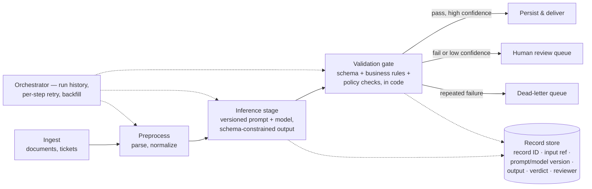

A few months ago, I gave a demo to a big client of my company about how applying AI agents could increase their productivity.

I didn't work with the client directly — I worked with a business unit of my company that did. But they didn't transfer the requirements to me clearly enough (or maybe they didn't want to).

> **Lesson 1:** The effort you spend studying the business requirements and the technical requirements is never wasted.

So I lacked their business domain. Even though I understood how to build and apply AI agents, I could not build a demo that proved it would improve *their* productivity.

> **Lesson 2:** Never accept a game you cannot win.

And when I asked for their real data, they said they didn't have it — it lives in the production environment, and using it requires the customer's permission. So the easiest way was MOCK data. Sounds genius — but at the first demo the customer said: *"Wait, are we talking about our business? This data looks so strange..."* — and I had to rework everything.

> **Lesson 3:** Data first. You cannot do anything without the real data, even in the study phase — the real data will look different from your imagination, or from anything on the internet.

So the connector finally gave me some screenshots.

> **Lesson 4:** The real thing is always better, even just a little of it — and you can use AI to generate more from it.

> **Lesson 5:** Never trust your broker — they work for their own benefit.

OK — the second demo did align with their business. But today, when I look back, I think I could have done better.

Like when someone asked how I observe the agent and make its inference explainable. I said: I use [Langfuse](https://langfuse.com/) — just log all your AI inference there, and you can trace everything. But that is not a senior answer; we don't trace every AI completion like that. In the real business, "just log everything and trace it" collapses the moment you ask two questions: *who* is reading the trace, and *why*.

Think about who actually asks the explainability question in that room. It is never a developer — a developer would just open the logs. It is the client's compliance officer, their operations manager, or my own delivery lead. And each of them is really asking a different question wearing the same words:

- Compliance is asking: *"How do you **guarantee** the agent never does the forbidden thing?"*
- Operations is asking: *"When it fails, how fast do we know **what kind** of failure it was?"*
- The delivery lead is asking: *"How do we know it's actually **good** — and where exactly is it weak?"*

A trace viewer answers none of those three questions. And I finally see the real mistake in my Langfuse answer: it treats the AI as the system. It is not. **In real business, the model call is one stage in a data pipeline — and observability is a property of the pipeline, not of the model.**

Think about how the client already runs everything they trust: as orchestrated pipelines. Ingest → transform → validate → persist → deliver. Nobody "traces every function call" of the billing system to explain an invoice — they query the invoice's *records*, because every stage writes records with IDs, timestamps, and versions. That is the treatment AI inference has to earn. Not a special AI dashboard on a projector. The same boring discipline as every other component in their stack:

Put the model inside a pipeline like this, and the things you can monitor and inspect come for free, at three levels of *individual*:

1. **The individual record.** Every case that flows through gets an ID and lineage: the input snapshot, which prompt version, which model version, the raw structured output, the validation verdict, the confidence, who reviewed it. *"Why did claim #123 come out null?"* is a SQL query, not an afternoon in a trace viewer. And because stages are idempotent, you can **replay that one record through that one stage** and watch it fail in isolation.

2. **The individual stage.** Each stage has a contract: defined input, defined output, and a gate in code on the way out. The schema check, the business-rule check ("line items must sum to the total"), the policy check (a refund above $500 does not pass the gate — not "the prompt forbids it"; the gate *rejects* it). Failures at a gate are **typed** — transient / validation / policy — so handling is per type instead of one generic apology. Poison records go to a dead-letter queue instead of poisoning the whole run.

3. **The individual run.** The orchestrator — Airflow, Temporal, Prefect, the engine matters less than having one — keeps the run history: which step ran, on which batch, what failed, what retried, what was backfilled. Yesterday's failed records can be re-run *alone*. That run history **is** the audit trail, in a form the client's own engineers already know how to read.

So monitoring is not reading traces. Monitoring is **data-quality engineering on the pipeline**: throughput, typed-error rate per stage, schema-failure rate, drift in field distributions — and accuracy **stratified** per document type and per field, computed from the validation records the pipeline is already writing. Only when a gate fires do you pull the expensive thing: the deep trace of that *one* record at the inference stage. That is where Langfuse actually belongs — inside one stage, sampled, mostly for the dev loop. The business answer lives in the pipeline's own tables.

Notice that each person in that room now gets their answer from the same machinery: compliance gets the gates ("the forbidden action cannot pass — here is the code"), operations gets the typed failures and the run history ("we know the failure class the moment the gate fires"), and the delivery lead gets the stratified numbers ("here is which document type is weak, at which field"). One pipeline, three answers.

And the hard questions in a client Q&A are never abstract. They arrive as production stories with numbers in them. These are the six I now prepare for — and for each one, the junior instinct reaches for a bigger prompt or a bigger dashboard, while the senior move is always a property of the pipeline:

| The concern | The production story | The junior instinct | The senior move |
|---|---|---|---|
| **The numbers** | Extraction hits **97% overall**, so the team wants to drop human review. Hidden inside the average: one claim type at **85%**. Split by format: tables **94%**, prose **72%**. | Quote the aggregate. Celebrate. | Stratify by case type and field *before* automating — the validation records already contain the data. Fix the weak stratum with few-shot examples **of that stratum** (prose-format numbers, ambiguous clauses). Calibrate confidence on labeled data before it routes a single case. |
| **Traceability** | The final report says *"AI adoption reached 45% in 2024"* — and nobody can say where that number came from. The intermediate outputs were summarized away. | Add a "sources consulted" list at the end. | Lineage columns on every record: input ref, source excerpt, prompt and model version. A claim in the report points to a record ID; the record points to its source. Provenance is data in a table, not decoration in a paragraph. |
| **Monitoring** | The search API goes down. The stage returns `{"results": [], "status": "success"}`. The report ships with a whole section silently missing. | Increase the timeout. | An access failure is not an empty result — the stage contract distinguishes them (`isError`). The gate refuses "empty success," the run is marked partial, and the orchestrator decides: retry, reroute, or deliver with the gap *declared*. |
| **Inspection** | A claim type that extracted fine last month starts failing today. What changed — the documents, the prompt, or the model? | Re-run it and hope. | Every record stores its prompt, model, and schema versions. Diff last month's record against today's, replay the same input through both versions in isolation, and the answer falls out. No versions in the records — no answer, ever. |
| **Explainability** | The stage that generated a 200-line module also reviews it: *"looks good."* A human finds the logic bug in minutes. Meanwhile the security review flags **60% of PRs** and developers stop reading it. | Tell it to "review carefully" and "only report high-confidence findings." | Generation and QA are **separate pipeline stages with separate contexts** — the reviewer never inherits the generator's reasoning. Findings carry the *pattern that triggered them*, judged against explicit criteria (reportable vs acceptable, with code examples), so the false-positive rate per pattern is measurable from the findings table — and prunable. |
| **Error handling** | Fraud detection blocks a refund. The system reads it as a glitch and retries **three times** — firing three fraud alerts into compliance. | Catch everything, apologize, end the chat. | Errors are typed at the gate: transient / validation / policy, each with `isRetryable`. Policy blocks stop and explain. Validation failures retry once **with the specific error attached** ("line items sum to X, total says Y"). Same field fails three times → dead-letter queue, and check whether the data is even *in* the document before anyone schedules retry four. |

> **Lesson 6:** When a client asks "how do you observe your agent?", never answer with a tool name — and do not answer with more AI either. Answer with the discipline every system they already trust is built on: **a pipeline of versioned stages, gates in code, records with lineage, stratified numbers — and a deep trace only for the record that failed.** The dashboard goes in the appendix.

There is one pattern behind all six rows of that table, and it is the last thing this presentation taught me — about what "senior" actually means.

A junior engineer (me, at that demo) enjoys one thing: turning the idea into code. And that part *is* genuinely fun — the model answers, the demo runs, everyone claps. But idea-into-code is the smallest part of the job. A senior spends their effort on everything around the code, in a specific order:

- **Before failure — the kinds of error.** Not "errors" as one bucket, but a taxonomy: **transient** errors (the network hiccuped — safe to retry), **validation** errors (the output is malformed — retry once, *with the error attached*), **business** errors (fraud blocked the refund — do *not* retry; explain), and **coding** errors (our own bug — no retry will ever fix it). The taxonomy is the real design decision; everything else follows from it.

- **At failure — the handling.** A policy per kind, not one global `try/catch` with an apology: when to retry and how many times, when to back off, when to fall back to a simpler path or a human queue, and when to stop and say so honestly.

- **After failure — the debugging.** Logs that carry *meaning*, not noise: record ID, stage name, error type, prompt and model version — so the log line itself tells you which kind of failure hit which record at which stage. Semantic errors make debugging a query. `"Operation failed"` makes it archaeology.

- **At scale — the operations.** How it deploys, how it scales, how you roll it back, and how you know it's healthy: **numbers first** (throughput, error rate per type, stratified accuracy), **inspection second** (drill into the one record that broke). If you cannot answer "how do we roll this back?", it is not finished.

The uncomfortable summary: the happy path is the demo; the unhappy paths are the product.

> **Lesson 7:** Turning the idea into code is the fun 20% — the senior work is the other 80%: the kinds of failure, the handling of each kind, the meaning in the logs, and the numbers that prove it runs. Code that works is the beginning. **A system that fails well is the job.**

And still — none of those seven lessons touch the two things that scared me most in that room. The system questions I could study for. What actually made me sweat was much simpler: speaking English, and making the slides.

**The English.** I am a Vietnamese engineer presenting to an international client, and here is the uncomfortable truth I already wrote about in [How to learn?](https://locchh.github.io/blogs/blog/how_to_learn/): accent *does* matter. People who say it doesn't are being polite. And there is a cruel asymmetry hiding in it: **your accent doesn't matter to you — it matters to everyone else.** You understand yourself perfectly; it is the room that pays the cost. In a presentation, that cost is paid live: every word the client doesn't catch is a fact they never received, and unlike a demo, a spoken sentence cannot be reworked afterwards. The fix is not confidence tips — it is treating speech as a trainable system (sounds, words, sentences; pronunciation *and* articulation), which is exactly the part of that post I keep going back to.

> **Lesson 8:** Your presentation is delivered through your English before it is delivered through your slides. The system can be senior — but if the delivery is junior, the room only hears the delivery. Train it like a skill, not a hope.

**The deck.** My other nightmare. Hours of drag, drop, click, align, resize — and after all of it, the *content* still isn't done, because all the effort went into the mouse. So recently I built a tool to make that nightmare go away: [deck-maker](https://github.com/iteam1/deck-maker). You tell Claude Code what the deck is about; it *writes* the deck as HTML — a medium an AI agent is actually fluent in — you review it in the browser, and on your OK it converts into a real, editable PowerPoint: native text, tables, charts, shapes. Not screenshots. No drag, no drop, no clicking.

The interesting part is the mechanism, because it is [loop engineering](https://addyosmani.com/blog/loop-engineering/) applied to a boring problem: every deck you keep gets archived into a corpus, and the next deck starts from your closest past one — it can even `inspect` an existing `.pptx` and pull out the color palette, fonts, and type scale to match the company template. Author → convert → archive → seed the next. The tool gets more on-brand every time you use it, and what remains of "making slides" is the part that was always the real job: deciding what to say.

> **Lesson 9:** When a skill is important but the work is a nightmare, the senior move is neither avoiding it nor grinding through it — it is building a loop around it. The deck was always important. The clicking never was.

One more lesson, and it is the one I will need for the longest.

Everything above is still an engineer talking about engineering — the system, the pipeline, the delivery. But look around the room in a client demo and notice who actually decides anything. They are not judging your architecture. They are deciding whether to **invest**. And if you want to become a key member, a tech lead, or a PM — if you want a career longer than the current technology wave — caring about the technical side is not enough. The questions that decide the meeting are these:

- **Feasibility.** Not "does the demo work" — can this work with *their* data, *their* permissions, *their* legacy systems, *their* people? (Looking back, Lessons 1–5 were all feasibility lessons; I just didn't know the word yet.)
- **Cost.** To build, and to run: cost per case, per month, per retrain — against the cost of the process it replaces. The pipeline already knows this number from its own records; a senior quotes it before being asked.
- **Risk.** What happens on the 3% it gets wrong? Who is liable? What data leaves the building? What if the model or the vendor changes next year? The error taxonomy from Lesson 7 *is* the risk register, written in an engineer's language.
- **Resources and human infrastructure.** Who builds it — and who *operates* it? The human-review queue in the pipeline is not free: someone staffs it, someone owns the prompts, someone reads the numbers every Monday morning. If the client has no such people yet, then hiring or training them is part of the project, and it belongs in the proposal.
- **Plan and timing.** Phases, not a big bang: a pilot on one document type, a stratified evaluation gate, then scale. When does value arrive, and which milestone proves it? "In six months, measured like this" is a plan. "Soon" is a wish.

The quiet trick is that a well-designed system already contains most of these answers — the record store prices a case, the error taxonomy names the risks, the review queue names the people. The engineering questions and the business questions are the same questions at different altitudes.

> **Lesson 10:** Technology waves change every few years; feasibility, cost, risk, people, and timing never do. If you can only answer the technical questions, you are hired for the wave. If you can answer both, you stay in the room after it passes. That is the difference between *writing* the system and *owning* it — and the career is in the owning.

## The ten lessons

1. **Study the business** — effort spent on business and technical requirements is never wasted.
2. **Never accept a game you cannot win.**
3. **Data first** — nothing works without real data, even in the study phase.
4. **The real thing is always better** — even a little of it; AI can generate more from it.
5. **Never trust your broker** — they work for their own benefit.
6. **Observability is a property of the pipeline** — not a tool name, and not more AI.
7. **A system that fails well is the job** — code that works is only the beginning.
8. **Your English delivers the presentation** before your slides do — train it like a skill.
9. **Build a loop around the nightmare** — the deck was always important; the clicking never was.
10. **Answer the business questions too** — that is how you stay in the room after the wave passes.
