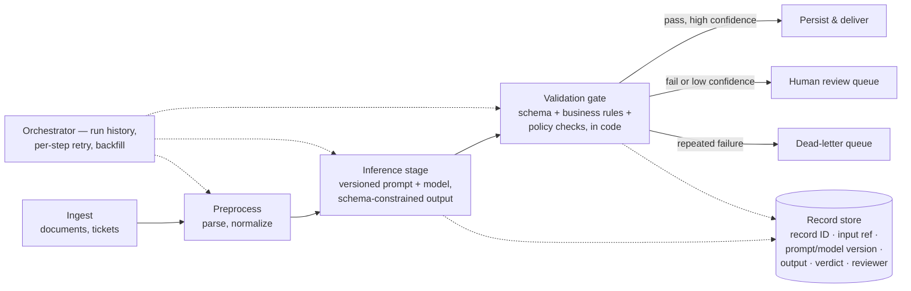

A few months ago, I gave a demo to a big client of my company. The demo showed how AI agents could make them more productive. It taught me more than any project since. And almost none of what it taught me was about AI. It was my first real lesson that a demo is not judged by its engineering. It would not be the last.

I didn't work with the client directly. I worked with a business unit of my company that did. But they didn't pass the requirements to me clearly enough. (Or maybe they didn't want to.)

> **Lesson 1:** The effort you spend studying the business requirements and the technical requirements is never wasted.

So I didn't know their business well enough. I understood how to build and use AI agents. But I could not build a demo that proved it would improve *their* productivity.

> **Lesson 2:** Never accept a game you cannot win.

And when I asked for their real data, they said they didn't have it. It lives in the production system, and using it needs the customer's permission. So the easy path was MOCK data. Sounds smart. But at the first demo the customer said: *"Wait, are we talking about our business? This data looks so strange..."* So I had to redo everything.

> **Lesson 3:** Data first. You cannot do anything without the real data, even while you are still studying the problem. The real data looks different from what you imagine, and from anything on the internet.

So the connector finally gave me some screenshots.

> **Lesson 4:** The real thing is always better, even just a little of it — and you can use AI to generate more from it.

> **Lesson 5:** Never trust your broker — they work for their own benefit.

OK, the second demo matched their business. But one question in the room deserves a better answer than the one I gave. Someone asked how I make the agent's thinking explainable. I reached for a tool: *use [Langfuse](https://langfuse.com/) — log every AI completion and trace it.* That answer falls apart the moment you ask two questions: *who* is reading the trace, and *why*?

Think about who actually asks the explainability question in that room. It is never a developer. A developer would just open the logs. It is the client's compliance officer, their operations manager, or my own delivery lead. And each of them is really asking a different question behind the same words:

- Compliance is asking: *"How do you **guarantee** the agent never does the forbidden thing?"*
- Operations is asking: *"When it fails, how fast do we know **what kind** of failure it was?"*
- The delivery lead is asking: *"How do we know it's actually **good** — and where exactly is it weak?"*

A trace viewer answers none of those three questions. Not because it is a bad tool, but because it is a single service. And a single service is never the answer to a real business problem: **the model call is one stage in a data pipeline. Observability is a property of the whole pipeline, not of any single service inside it.**

Think about how the client already runs everything they trust: as managed pipelines. Ingest → transform → validate → persist → deliver. Nobody "traces every function call" of the billing system to explain an invoice. They query the invoice's *records*, because every stage writes records with IDs, timestamps, and versions. That is the treatment AI inference has to earn. Not a special AI dashboard on a projector. The same plain discipline as every other part of their stack:

Put the model inside a pipeline like this, and observability stops being a feature you add on top. It is just what the pipeline already produces. Every record carries an ID and a history of where it came from. So *"why did claim #123 come out null?"* is a SQL query, not an afternoon in a trace viewer. And you can replay that one record through that one stage on its own. Every stage has a gate in code. A refund above $500 does not *pass*, not because "the prompt forbids it" but because the gate rejects it. And failures come out **typed** instead of as one generic apology. And the orchestrator's run history (which step ran, what failed, what was retried) *is* the audit trail, in a form the client's own engineers already read.

So monitoring is not reading traces. Monitoring is **data-quality engineering on the pipeline**: throughput, typed-error rate per stage, schema-failure rate, drift in field values, and accuracy **broken down** per document type and per field. All of it computed from the validation records the pipeline is already writing. Only when a gate fires do you pull the expensive thing: the deep trace of that *one* record at the inference stage. That is where Langfuse actually belongs. Inside one stage, sampled, mostly for the dev loop. The business answer lives in the pipeline's own tables.

Notice that each person in that room now gets their answer from the same machinery. Compliance gets the gates ("the forbidden action cannot pass — here is the code"). Operations gets the typed failures and the run history ("we know the kind of failure the moment the gate fires"). And the delivery lead gets the broken-down numbers ("here is which document type is weak, at which field"). One pipeline, three answers.

And the hard questions in a client Q&A are never abstract. They come as production stories with numbers in them. These are the six I now prepare for. For each one, the junior instinct reaches for a bigger prompt or a bigger dashboard. The senior move is always a property of the pipeline:

| The concern | The production story | The junior instinct | The senior move |
|---|---|---|---|
| **The numbers** | Extraction hits **97% overall**, so the team wants to drop human review. Hidden inside the average: one claim type at **85%**. Split by format: tables **94%**, prose **72%**. | Quote the average. Celebrate. | Break the numbers down by case type and field *before* automating. The validation records already hold the data. Fix the weak group with few-shot examples **from that group** (prose-format numbers, unclear clauses). Tune the confidence score on labeled data before it routes a single case. |
| **Traceability** | The final report says *"AI adoption reached 45% in 2024"* — and nobody can say where that number came from. The steps in between were summarized away. | Add a "sources consulted" list at the end. | Add history columns to every record: input ref, source excerpt, prompt and model version. A claim in the report points to a record ID; the record points to its source. The source trail is data in a table, not decoration in a paragraph. |
| **Monitoring** | The search API goes down. The stage returns `{"results": [], "status": "success"}`. The report ships with a whole section quietly missing. | Increase the timeout. | An access failure is not an empty result. The stage contract tells them apart (`isError`). The gate refuses "empty success," the run is marked partial, and the orchestrator decides: retry, reroute, or deliver with the gap *stated out loud*. |
| **Inspection** | A claim type that extracted fine last month starts failing today. What changed — the documents, the prompt, or the model? | Re-run it and hope. | Every record stores its prompt, model, and schema versions. Compare last month's record against today's, replay the same input through both versions on their own, and the answer falls out. No versions in the records means no answer, ever. |
| **Explainability** | The stage that wrote a 200-line module also reviews it: *"looks good."* A human finds the logic bug in minutes. Meanwhile the security review flags **60% of PRs** and developers stop reading it. | Tell it to "review carefully" and "only report high-confidence findings." | Writing and review are **separate pipeline stages with separate contexts** — the reviewer never sees the writer's reasoning. Findings carry the *pattern that triggered them*, judged against clear rules (report this vs. let this pass, with code examples). So the false-alarm rate per pattern can be measured from the findings table — and trimmed. |
| **Error handling** | Fraud detection blocks a refund. The system reads it as a glitch and retries **three times** — firing three fraud alerts into compliance. | Catch everything, apologize, end the chat. | Errors are typed at the gate: transient / validation / policy, each with `isRetryable`. Policy blocks stop and explain. Validation failures retry once **with the exact error attached** ("line items sum to X, total says Y"). Same field fails three times → dead-letter queue, and check whether the data is even *in* the document before anyone schedules retry four. |

> **Lesson 6:** Look down that table — six different questions, six different answers, and not one of them is a tool. *That* is the lesson, and it reaches far past observability. When someone asks **"how do you do X?"** — observe it, secure it, make it reliable, guarantee it — naming a framework ("we use Langfuse", "we use Kafka") is the junior reflex. The senior answer is never a tool. It is a **mechanism you can defend**. And it is a **different answer every time**, because it depends on who is asking and what they actually need: compliance wants a guarantee, operations wants a kind of failure, the delivery lead wants a number. The tool is only where the mechanism happens to live. It is never the answer to "how."

There is one pattern behind all six rows of that table. It is the last thing this presentation taught me, about what "senior" actually means.

A junior engineer (me, at that demo) enjoys one thing: turning the idea into code. And that part *is* genuinely fun. The model answers, the demo runs, everyone claps. But here is what took me too long to accept: **turning the idea into code is the smallest part of the job, and it is the part a senior enjoys least.** Not because they can't do it, but because they have learned the code is not where the software lives or dies. Everything that actually decides whether it survives contact with the business sits *around* the code. This is the checklist a senior carries, and not one line of it is "which framework":

- **Solution architecture — design the system before you build it.** The senior's first output is not code. It is a *design*: the stages the work flows through, the boundaries between them, where state lives, which part owns which job, and the contract each one shows the next. These decisions are expensive to change later. So a senior makes them first, on purpose, instead of stumbling into them by accident three weeks in.

- **Error handling — with a real list of error kinds.** "Errors" is not one bucket, and treating it as one is the junior tell. There are at least four kinds, and each is handled differently: **transient / transition** errors (the network hiccuped, a service was briefly down — safe to retry); **validation** errors (the output is malformed or breaks a rule — retry once, feeding the exact error back); **business** errors (fraud blocked the refund, the policy said no — do *not* retry, explain and stop); and **logic / coding** errors (our own bug — no retry will *ever* fix it; it needs a human and a code change). Naming the kind is the real design decision. The handling follows from the name.

- **Handing off — when to pass a case up, and to whom.** A system that cannot hand off fails silently, the worst way to fail. So the path is designed in advance: a human review queue, the on-call engineer, the compliance desk, each with its own trigger. And the trigger is the **acceptable rate**: the error rate or confidence floor below which the system must stop and ask a human. That number is *not* an engineering choice. The business sets it, near-zero for a payment and generous for a product recommendation. (An explicit "let me talk to a person" hands off *right away*, no matter how confident the system is.)

- **Observability and monitoring — already built.** These are not a separate checklist to add on top. They *are* the pipeline from Lesson 6. Explainable, reliable, and traceable are properties you get from records that carry their history and from typed gates. They are not words you promise. That is the whole reason the pipeline was worth building.

- **Deployment and scale.** How it ships, how it **rolls back** (if you cannot answer "how do we undo this?", it is not finished), how it holds up when the load is 100× the demo, and how it stays healthy with nobody watching. The demo runs once, on one machine, with you standing over it. Production runs forever, on many machines, alone. Those are two different programs, and the second one is what you deliver.

The uncomfortable summary: the happy path is the demo; the unhappy paths are the product.

> **Lesson 7:** Turning the idea into code is the fun 20%. The senior 80% is everything around it: the **architecture** you design first, the **kinds of errors** you name, the **hand-off** path and the **acceptable rate** that triggers it, the **observability** that is the pipeline itself, and a **deploy you can roll back** and scale. Code that works is the beginning. **A system that fails well is the job.**

And still, none of those seven lessons touch the two things that scared me most in that room. The system questions I could study for. What actually made me sweat was much simpler: speaking English, and making the slides.

**The English.** I am a Vietnamese engineer presenting to an international client. And here is the hard truth I already wrote about in [How to learn?](https://locchh.github.io/blogs/blog/how_to_learn/): accent *does* matter. People who say it doesn't are being polite. And there is a cruel twist hidden in it: **your accent doesn't matter to you — it matters to everyone else.** You understand yourself perfectly. It is the room that pays the cost. In a presentation, that cost is paid live. Every word the client doesn't catch is a fact they never received. And unlike a demo, a spoken sentence cannot be reworked afterwards. The fix is not confidence tips. It is treating speech as a skill you can train (sounds, words, sentences; both how you pronounce and how clearly you speak). That is exactly the part of that post I keep going back to.

> **Lesson 8:** Your presentation is delivered through your English before it is delivered through your slides. The system can be senior — but if the delivery is junior, the room only hears the delivery. Train it like a skill, not a hope.

**The deck.** My other nightmare. Hours of drag, drop, click, align, resize. And after all of it, the *content* still isn't done, because all the effort went into the mouse. So recently I built a tool to make that nightmare go away: [deck-maker](https://github.com/iteam1/deck-maker). You tell Claude Code what the deck is about. It *writes* the deck as HTML, a format an AI agent is actually fluent in. You review it in the browser, and on your OK it converts into a real, editable PowerPoint: native text, tables, charts, shapes. Not screenshots. No drag, no drop, no clicking.

The interesting part is the mechanism, because it is [loop engineering](https://addyosmani.com/blog/loop-engineering/) applied to a boring problem. Every deck you keep gets saved into a collection, and the next deck starts from your closest past one. It can even `inspect` an existing `.pptx` and pull out the colors, fonts, and text sizes to match the company template. Author → convert → archive → seed the next. The tool gets more on-brand every time you use it. And what remains of "making slides" is the part that was always the real job: deciding what to say.

> **Lesson 9:** When a skill matters but the work around it is a nightmare, the senior move is neither to avoid it nor to grind through it by hand. It is to go **find or build the tool** that carries the nightmare for you, and to lean on AI for the mechanical part. Spend your attention on the work that was always the real work; let tooling eat the rest. The deck was always important. The clicking never was.

One more lesson, and it is the one I will need for the longest.

Everything above is still an engineer talking about engineering: the system, the pipeline, the delivery. But look around the room in a client demo and notice who actually decides anything. They are not judging your architecture. They are deciding whether to **invest**. And if you want to become a key member, a tech lead, or a PM, if you want a career longer than the current technology wave, caring about the technical side is not enough. The questions that decide the meeting are these:

- **Feasibility.** Not "does the demo work." Can this work with *their* data, *their* permissions, *their* legacy systems, *their* people? (Looking back, Lessons 1–5 were all feasibility lessons; I just didn't know the word yet.)
- **Cost.** To build, and to run: cost per case, per month, per retrain, against the cost of the process it replaces. The pipeline already knows this number from its own records; a senior quotes it before being asked.
- **Risk.** What happens on the 3% it gets wrong? Who is liable? What data leaves the building? What if the model or the vendor changes next year? The list of error kinds from Lesson 7 *is* the risk register, written in an engineer's language.
- **Resources and people.** Who builds it, and who *runs* it? The human-review queue in the pipeline is not free: someone staffs it, someone owns the prompts, someone reads the numbers every Monday morning. If the client has no such people yet, then hiring or training them is part of the project, and it belongs in the proposal.
- **Plan and timing.** Phases, not a big bang: a pilot on one document type, an evaluation gate that checks each group, then scale. When does value arrive, and which milestone proves it? "In six months, measured like this" is a plan. "Soon" is a wish.

The quiet trick is that a well-designed system already holds most of these answers. The record store prices a case, the list of error kinds names the risks, the review queue names the people. The engineering questions and the business questions are the same questions at different levels.

But there is a deeper version of this, and it is the thing I most want to keep. Notice that none of those five questions are about *frameworks*. A senior does not think in React and Kafka and Postgres. Those are broad, shallow, and they change with every wave. A senior thinks in the client's own nouns: **payment, extraction, customer support, voting, authentication, continuous update.** And each of those nouns quietly decides *which* property is the one that can get you fired. The parts barely change; the meaning does:

| The same generic parts | The business noun | What actually matters most | What "failure" means here |
|---|---|---|---|
| API + DB + queue | **Payment** | idempotency (a repeated request must not charge twice), matching the books, audit trail | a double-charge, money lost |
| API + model + DB | **Extraction** | accuracy broken down by group, a human in the loop on low confidence | one wrong figure shipped as fact |
| API + LLM + tools | **Customer support** | tuning when to hand off, policy enforced in code | an unauthorized action taken |
| API + ledger | **Voting** | anonymity *and* one-vote-per-person *and* tamper-evidence | a vote changed or double-counted |
| API + token store | **Authentication** | least privilege, revoking access, limiting the blast radius | account takeover |
| pipeline + scheduler | **Continuous update** | re-runs that are safe to repeat, backfill, no double-apply | stale or corrupted state |

One layer up sits the industry, and it decides *which failure is not allowed at all* — which is not an engineering choice you get to make:

- **Regulated** — banking, insurance, healthcare, fintech, gambling: the acceptable error rate is a compliance floor, not a dial you turn. Here "97% accurate" can be *illegal*.
- **Throughput and cost** — ecommerce, warehouse, logistics, industry: the failure is about money, not a courtroom. Here 97% is fine if it is cheap and fast.

The same phrase — "acceptable rate" — means a regulator in one column and a profit margin in the other. A senior knows which column they are standing in before writing a line.

But the cost of failure is only half of what an industry hands you. The other half is a whole **vocabulary** you have to learn before you can even name the right services. It is the part that never shows up on a résumé's skills list:

| Industry | The vocabulary you actually have to learn | The flow that decides everything | The constraint that rules it |
|---|---|---|---|
| **Healthcare** | PHI, EHR, HL7/FHIR, ICD/CPT codes, prior authorization | patient → encounter → claim → adjudication → payout | HIPAA — a leaked record is a fine, not a bug report |
| **Ecommerce** | cart, SKU, inventory, fulfillment, RMA, chargeback | browse → cart → checkout → fulfill → return | conversion and fraud — a second of latency is revenue |
| **Fintech / banking** | ledger, double-entry, reconciliation, settlement, KYC/AML | authorize → capture → settle → reconcile | it must balance to the cent, and stay auditable |
| **Insurance** | policy, premium, underwriting, claim, adjuster, actuarial | quote → underwrite → bind → claim → adjust | pricing is regulated; the claim decision can be disputed |
| **Logistics** | WMS, SKU, pick/pack/ship, routing, last-mile | inbound → store → pick → pack → ship → track | throughput per hour — one mis-pick causes trouble all the way down the line |

Read across any row and you feel it: knowing "REST + Postgres" tells you nothing here. Knowing that a *chargeback* is not a *refund*, or that a *claim* is not an *invoice*, is the whole game. It is also the exact difference between a demo that sounds like the customer's business and one that makes them squint and say *"this data looks so strange"* — which, if you remember Lesson 3, is exactly the wall I walked into.

Put all of that together and you get the stack a senior actually holds in their head. Not files and functions, but **business → service → module → infrastructure → deployment**. Ask one about the payment system and watch them move straight down it: the domain (regulated fintech), the service (payment — so idempotency and matching the books matter most), the module (the nightly reconciliation job), the infrastructure (the ledger DB, the queue), the deployment (blue-green, because you cannot drop a charge mid-rollout). That fluency top to bottom on a single business noun is the senior tell. A junior can talk about any one layer; a senior can walk the whole column without changing the subject.

And the asset that lasts is not any one of these domains. A banker who cannot move industries is still narrow. It is the *habit* of thinking in the business's nouns instead of the framework's, plus knowing how to pick up a new domain fast: interview the experts, read the *real* data, map each service to the property that matters most for it. Which is Lessons 1 and 3 again, wearing a suit. Because domain knowledge is exactly the thing AI cannot hand you. It is not on the internet. It lives in *their* production database and *their* regulator's rulebook. That is where your value builds up, and why it outlasts the wave.

> **Lesson 10:** Technology waves change every few years; feasibility, cost, risk, people, and timing never do — and neither does the business's own vocabulary. Learn to think in the client's nouns (payment, claim, order, vote), not your frameworks, because each noun decides which failure gets you fired and each industry decides which failure is even allowed. If you can only answer the technical questions, you are hired for the wave. If you can answer both — in their language — you stay in the room after it passes. That is the difference between *writing* the system and *owning* it, and the career is in the owning.

I've been collecting the long version of this last lesson in my [software handbook](https://locchh.github.io/sw-handbook/software/basics/becoming_senior/): the failure kinds sorted by *owner*, the SLI/SLO/error-budget math, the questions you should reflexively ask of your own designs. The one idea from it I'd carve into a desk: **seniority is not measured by what you deliver, but by what you can be handed.** A junior is handed *tasks*; a mid-level engineer, *features*; a senior, *problems* — open-ended, and yours to shape; a staff engineer, pure *uncertainty*. The jump is never "more code, faster." It is a change in what you accept as the thing you deliver. And if you want the whole self-study path behind it — the books, the postmortems, the practice drills — that lives in [the senior curriculum](https://locchh.github.io/sw-handbook/software/basics/senior_curriculum/).

## The ten lessons

1. **Study the business** — effort spent on business and technical requirements is never wasted.
2. **Never accept a game you cannot win.**
3. **Data first** — nothing works without real data, even in the study phase.
4. **The real thing is always better** — even a little of it; AI can generate more from it.
5. **Never trust your broker** — they work for their own benefit.
6. **"How do you do X?" is never answered with a tool** — name the mechanism you can defend, not the framework; and the answer changes with who is asking.
7. **A system that fails well is the job** — code that works is only the beginning.
8. **Your English delivers the presentation** before your slides do — train it like a skill.
9. **Find or build a tool for the nightmare work** — lean on tooling and AI; the deck was always important, the clicking never was.
10. **Answer the business questions too — in the business's own vocabulary** — think in the client's nouns (payment, claim, vote), not your frameworks; that is how you stay in the room after the wave passes.
