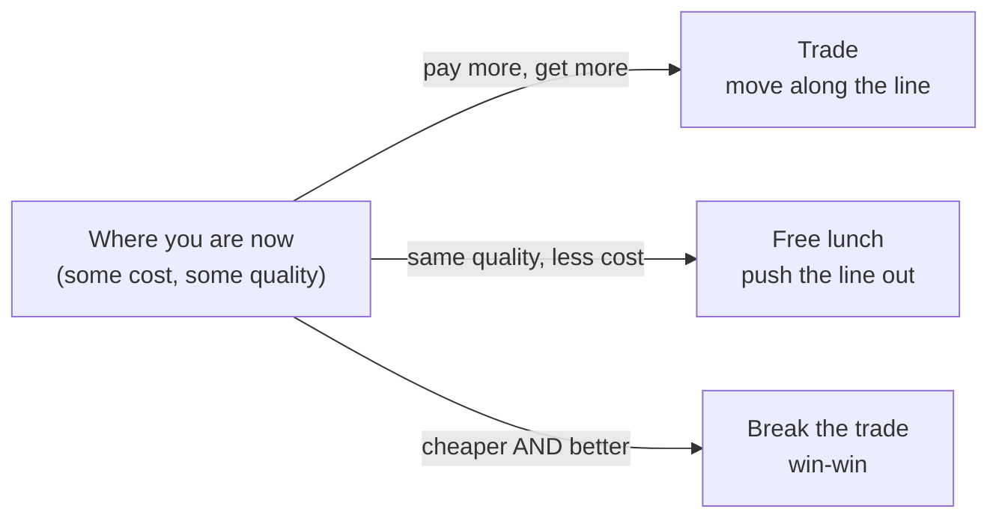

Every agent you run costs money and returns quality. You want it cheaper and better at the same time, and people have found about a dozen ways to get there. The trouble is that nobody tells you the *order* to try them in. So the mistake I keep seeing is teams reaching for the biggest, slowest fix first — "let's fine-tune a model" — when the fix that would have helped by tonight was one config flag away.

This post is my attempt to lay the fixes out in the order I'd actually try them: cheapest and fastest first, heaviest and slowest last.

## First, the shape of the problem

Cost and quality trade off. That idea is older than computers. Around 1896 the economist Vilfredo Pareto studied how you can't make one thing better without making something else worse, and we still call the best-you-can-do line the [Pareto frontier](https://en.wikipedia.org/wiki/Pareto_efficiency). For agents, the frontier is simple: at any price, there's a best quality you can reach, and vice versa.

Most people picture only one move on this line — pay more, get more. A swarm of sub-agents can burn about 15× the tokens of a plain chat, and on [Anthropic's own research task](https://www.anthropic.com/engineering/multi-agent-research-system) it beat a single agent by about 90%. That's real. But it's only one of **three** moves, and it's the least interesting:

- **Trade** — move along the line. Pay more, get more. Honest, but you only ever swap one for the other.
- **Free lunch** — push the whole line outward. Same quality, less money. You give up nothing.
- **Break the trade** — cheaper *and* better at once. This sounds impossible until you remember that more is not always better.

That last point is the one to hold onto. On the research task above, more tokens helped a lot. But [Chroma tested 18 models](https://www.trychroma.com/research/context-rot) and found every single one gets *worse* as its input grows — even when the answer is sitting right there in the context. The frontier rises, then bends back down. Extra tokens help only when they're **signal**. When they're **noise**, they bury the goal and quality drops. So "spend more" and "spend less" aren't really enemies. Both are chasing the same thing: **more signal per token**. That even explains the swarm above: it's a blunt way to spend more, but a smart one — it runs many small, fresh windows instead of one bloated one, so it dodges the rot instead of feeding it.

Keep that in mind, because the fixes below are sorted by effort, not by which move they make. Some of the cheapest ones are the win-wins.

## The cheap end: things you can do today

### 1. Right-size the model, and the output

Before any clever fix, ask the dull question: are you using more than you need? Two parts. First, the **model** — teams reach for the biggest one by habit, but a lot of jobs ("reformat this JSON", "sort these tickets") pass fine on a model a fraction of the price. Pick the smallest model that clears your bar, and measure. Second, the **output** — output tokens usually cost several times more than input, so "answer only, no preamble" cuts the pricier half of the bill for nothing.

**Real result:** this is the cheapest lever there is, and the easiest to skip. Anthropic's advice on [context engineering](https://www.anthropic.com/engineering/effective-context-engineering-for-ai-agents) is to find "the smallest set of high-signal tokens" — and that rule points at the answer as much as the prompt. Downgrading the default model and trimming the reply cost nothing to try, and often lose nothing in quality.

### 2. Turn on prompt caching

Your system prompt and tool list are the same on every single turn, and you pay to re-read them every single turn. Caching stops that. The model stores what it already computed for the stable part of your prompt and reuses it.

This is the oldest trick in computing wearing new clothes. In 1968 Donald Michie called it [memoization](https://en.wikipedia.org/wiki/Memoization) — remember a result so you never compute it twice — and the whole memory hierarchy in your laptop is built on the same idea: keep the hot stuff close. **Real result:** on a long, reused prompt, [prompt caching](https://platform.claude.com/docs/en/build-with-claude/prompt-caching) cuts the cost of the cached part by roughly 90% and gets the first token out much faster. The one catch: writing to the cache costs a little more than a plain read, and the cache expires — so it pays when your prefix is stable and reused, which in an agent loop it almost always is. Close to a free lunch, and usually one flag.

### 3. Turn up the thinking (when the problem is the right kind of hard)

Most runtimes let you dial how much the model thinks before it answers. Turn it up and problems the model was close on start getting solved. This is the one cheap move that *spends more*, not less — a trade, not a free lunch — so aim it carefully.

**Real result:** work on [scaling test-time compute](https://arxiv.org/abs/2408.03314) found that on medium-hard problems, giving a small model more time to think can beat a much bigger model. But it has a ceiling. On easy questions it buys almost nothing, and on the very hardest ones you're better off reaching for a bigger model than piling on more thinking. Dial it up for the middling cases, not the extremes.

### 4. Trim the context, and remind the agent of the goal

This is the win-win that surprises people. Because of the context rot above, cutting junk out of the window doesn't just save money — it makes the answers *better*. Herbert Simon [saw this in 1971](https://en.wikipedia.org/wiki/Attention_economy): "a wealth of information creates a poverty of attention." A goal stated on turn one is buried by turn one hundred, sitting exactly where the model reads worst.

So do two small things: throw out stale tool output, and re-state the goal as the run gets long. I wrote a whole post on why the agent [can't do this for itself](/blogs/blog/the_seat_needs_a_watcher/) — it has no spare attention to notice its own goal fading, so you build a watcher outside it. **Real result:** in Chroma's study, a short focused prompt beat the same facts buried in junk, on every model. Less context, better answers. Cheaper too.

### 5. Give the agent a "do less" rule

Agents over-reach. Asked to fix one thing, they refactor five, and finish none. A small rule that tells the agent to write the least code that works fixes a shocking amount of this. The tool named [ponytail](https://github.com/DietrichGebert/ponytail) is nothing but this one discipline — "the best code is the code you never wrote" — packed into a single instruction file.

The idea is borrowed from the factory floor. Kanban's rule is *finish what you started before you start something new*; keep the work-in-progress low and each job leaves faster. **Real result:** ponytail reports around half as much code generated. And a [harness-engineering course](https://walkinglabs.github.io/learn-harness-engineering/en/lectures/lecture-07-why-agents-overreach-and-under-finish/) makes the sharper claim: agents told to take one small next step finish far more often than agents handed a broad goal. Doing less is how they finish.

### 6. Compress what the tools hand back

When an agent runs the tests or a build, it does not need all 4,000 lines of output. It needs to know it passed, or the one stack trace where it didn't. A thin layer that squashes tool output before it reaches the model saves a lot for almost no work — a drop-in tool like [RTK](https://github.com/rtk-ai/rtk) sits in front of your shell commands and does exactly this.

**Real result:** RTK claims 60–90% fewer tokens on common developer commands. And it's the same mechanism as trimming context: less junk in the window means not just a smaller bill but sharper answers — a win-win, with only a small install cost.

## The middle: build some scaffolding

These cost real engineering time — days, not minutes — but they're where the durable wins live.

### 7. Let tools do what tools do better

Never make the model do work that a plain program does perfectly. Comparing two images pixel by pixel? That's `cv2.absdiff`, exact and instant — not the model squinting at pixels and guessing. Arithmetic, sorting, checking a constraint: hand it to code. This is just [the Unix philosophy](https://en.wikipedia.org/wiki/Unix_philosophy) that Doug McIlroy wrote down decades ago — small tools, each doing one thing well — pointed at agents. The model runs the show; plain code does the computing.

**Real result:** one framework that hands the workflow to plain, [deterministic code](https://arxiv.org/abs/2508.02721) roughly doubled the success rate of a strong baseline on a hard planning task. And it's cheaper, because that work never becomes tokens. Cheaper *and* more correct — another win-win. It just costs you the effort of writing and wiring the tools, and Anthropic has a good guide on [writing tools for agents](https://www.anthropic.com/engineering/writing-tools-for-agents): done badly, tools are worse than none.

### 8. Build the loop that checks and retries

A raw model tries once and dies. A **harness** wraps it in a loop: act, check, and if the check fails, feed the error back and try again. If the type-check passes the agent hears nothing; if it fails, the error text goes straight back into the loop and the agent fixes it before you ever see it. This is the difference between an agent that flails and one that finishes — I've written more on treating a whole [migration as a harness](/blogs/blog/migration_is_a_harness/).

**Real result:** [Reflexion](https://arxiv.org/abs/2303.11366) — where the agent writes a short note on why it failed and retries with that note in hand — reached 91% on a coding benchmark where the plain model scored 80%. That's a double-digit gain from healing its own mistakes, no bigger model required. It isn't free — every retry spends more tokens — but a finished task beats a failed one, so the spend earns out. The catch: cap the retries, or a confused agent loops forever, burning money on the same wrong idea.

### 9. Route easy work to a cheap model

You don't need your best, most expensive model for "reformat this JSON." Send easy jobs to a small cheap model and only send the hard ones up to the big one. A little router out front decides which is which. (This is the medium-effort version of fix #1 — instead of picking one model for everything, you pick per job.)

**Real result:** this is the idea behind [FrugalGPT](https://arxiv.org/abs/2305.05176), which matched a top model's quality at up to **98% lower cost** by moving from cheap to expensive only when needed — or, at the same budget, scored a few points *higher*. That's the frontier pushed way out. The work is in building and tuning the router that decides "is this one hard?"

### 10. Give the agent a memory

Without memory an agent re-derives the same facts every session, and re-reads the same files. A memory — notes it can write, revise, and look up later — stops the waste and gives it continuity across runs. The shift people are making now is from *retrieval only* (read from static documents) to a real **write path**: the agent records what it learned, not just what it was given. I went deep on this in [how to build a knowledge base](/blogs/blog/how_to_build_knowledgebase/), and on why [the state matters more than the agent](/blogs/blog/agents_arent_the_point_state_is/).

**Real result:** this is the one fix without a tidy benchmark number, and that's the point — memory buys *continuity*, which no single test captures well. What has changed is the hard question itself: it moved from "how do I find the right chunk?" to "what should the agent write down, and when should it forget?" Beware: a bad write poisons every future turn, so a memory needs pruning as much as writing.

## The heavy end: only when you've earned it

### 11. Store the lessons, not just the facts

A memory (fix #10) remembers facts. This goes one step further: after the agent solves something hard, make it write down the *lesson* — the pattern, the rule, the trick that worked — and file it where the next run can find it. Facts answer "what is true here?" Lessons answer "what worked last time?"

This is one of the oldest moves in AI. In the 1980s it was called [case-based reasoning](https://en.wikipedia.org/wiki/Case-based_reasoning): **retrieve** a similar past case, **reuse** its solution, **revise** it for the new problem, **retain** the result back into the case base. Four steps, and the last one is the whole trick — every solved problem makes the base smarter. I sketched the same loop for incident response in [an earlier post](/blogs/blog/coding_today/): check the knowledge base for a match, fix on a miss, and deposit the resolution back in, so every closed ticket makes the next one cheaper.

**Real result:** [Voyager](https://arxiv.org/abs/2305.16291) played Minecraft with an ever-growing **skill library** — every solved challenge stored as code it could call again — and hit key milestones up to 15× faster than the best prior agent. Dropped into a brand-new world, it reused the library to solve fresh tasks while others started from zero. [ExpeL](https://arxiv.org/pdf/2308.10144) did the language version: it extracts plain-language rules from its own successes *and failures*, stores them, and injects the most similar past wins into new tasks — no fine-tuning needed. The store itself can be humble: SQLite if the lessons are flat, a small graph database like [LadybugDB](https://ladybugdb.com/) if they link to each other.

The caveat is the one from #10, sharpened: a stale rule is worse than no rule. Minecraft never refactors itself; your codebase does. So the library needs the *revise* step as much as the *retain* one — check the lesson still holds before trusting it.

### 12. Fine-tune or distill a model

Here's the one everybody reaches for first and should reach for last. [**Distillation**](https://arxiv.org/abs/2505.17612) takes thousands of traces from your big, expensive agent and trains a small cheap model to copy it. In a way it's fix #11 taken to the extreme: instead of writing the lessons into a library the agent reads, you burn them into the weights. [**Crystallization**](https://arxiv.org/abs/2607.07052) goes further still: once a path is proven, it freezes into fixed code, so there's no model call at all.

**Real result:** distilling into a small model can cut cost per run by more than 10× while keeping most of the quality — one report shrank a large model to a fraction of its size at around 90% of the planning quality. Those are great numbers. But look at what it costs *you*: thousands of high-quality traces, a training run, and validation — and it only works once your task is **stable and high-volume**. If your prompts are still changing every week, you'll distill a snapshot that's out of date before it ships.

That's why it's last. If you want a better agent tonight, this is the worst possible first move. It's the reward for having already done the other eleven — you distill a system that already works, not one you're still figuring out.

## The ladder, in one table

Two things matter when you pick what to try: how much **effort** it takes to build, and how long until it **pays off**. Here they are, cheapest and fastest at the top.

| # | Fix | Effort to build | Time to pay off | What you get |
|---|-----|-----------------|-----------------|--------------|
| 1 | Right-size the model & output | Tiny (config + prompt) | Instant | Free lunch |
| 2 | Prompt caching | Tiny (a flag) | Instant | Free lunch |
| 3 | More thinking on medium-hard tasks | Tiny (a setting) | Instant | Trade — spend more |
| 4 | Trim context + remind the goal | Small | Instant | Win-win |
| 5 | A "do less" rule | Small | Fast | Win-win |
| 6 | Compress tool output | Small (drop-in tool) | Fast | Win-win |
| 7 | Offload to real tools | Medium | Days | Win-win |
| 8 | The check-and-retry loop | Medium | Days | Trade — finishing beats failing |
| 9 | Route easy work to a cheap model | Medium | Days–weeks | Free lunch |
| 10 | A memory with a write path | Medium–large | Weeks | Continuity |
| 11 | A lesson library (rules + skills) | Large | Weeks | Compounds over time |
| 12 | Fine-tune / distill | Large | Weeks–months | Cheap once it's stable |

## Work down from the top

There is no single "optimize" button. And it isn't honest to call all of this "saving cost" — some of these fixes spend *more* on purpose. The best ones do both at once: save money and raise quality. The one thing they all share is the real goal underneath: **make every token earn its place.**

The trap is skipping straight to the bottom of the ladder. Fine-tuning feels like the serious answer, so people burn a month on it while a smaller model, a caching flag, a shorter prompt, and a retry loop were sitting right there, ready by tonight. Work down from the top instead. Take the free lunches first, add the scaffolding when the cheap wins run out, and only distill a system once it already works.

> **Lesson:** cost and quality trade off, but the smartest moves don't trade at all — they push the line out or break it. Sort every fix by effort, start at the cheap end, and treat fine-tuning as the reward for a system that already works, never the first thing you try.
