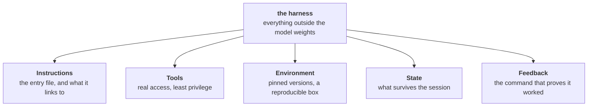
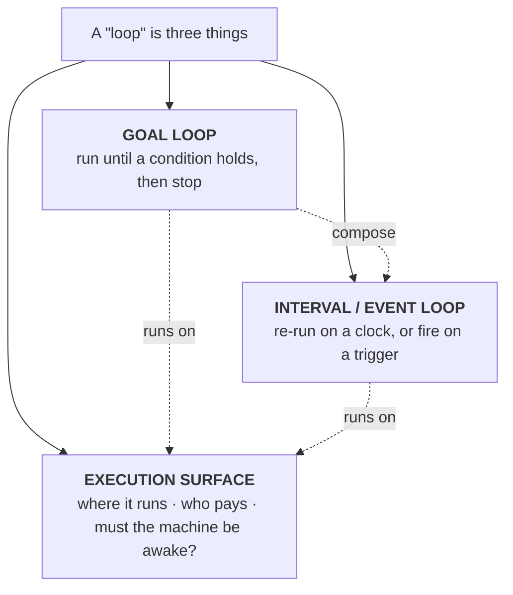
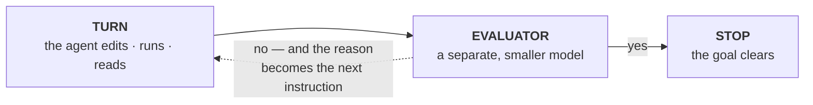
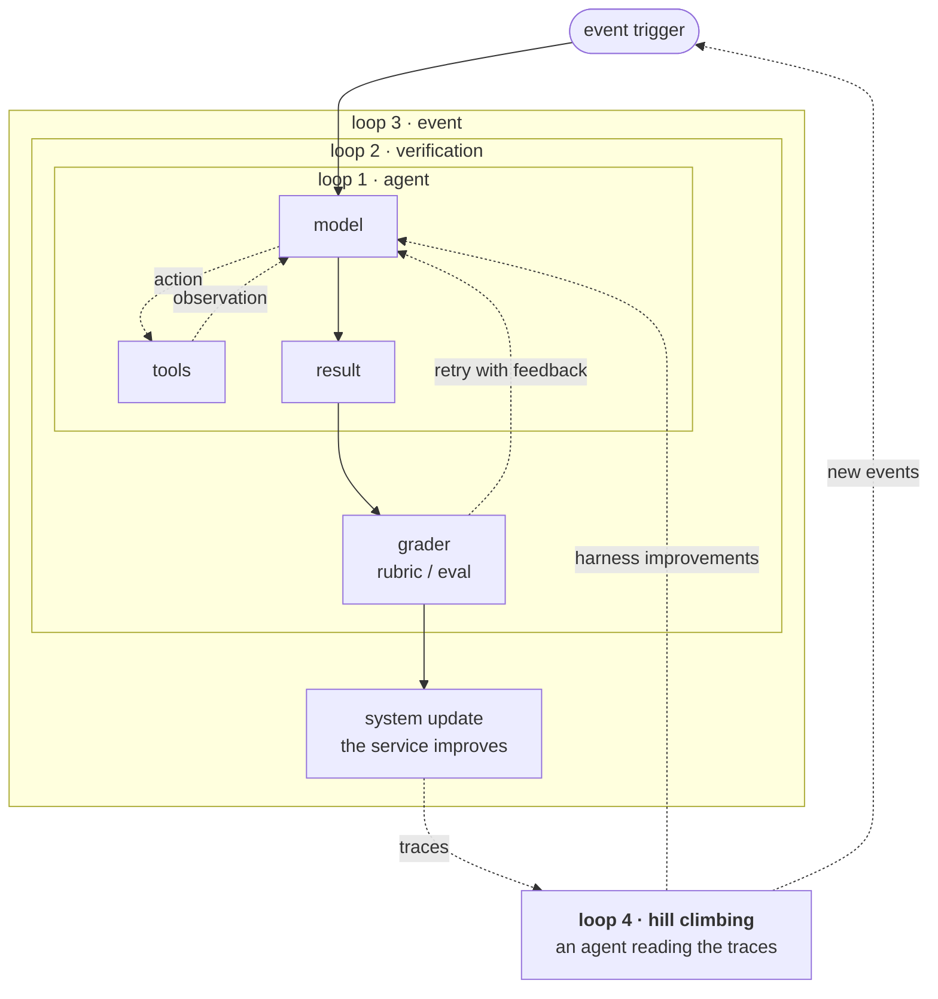
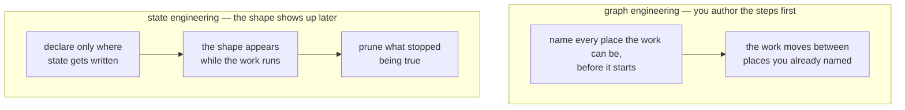
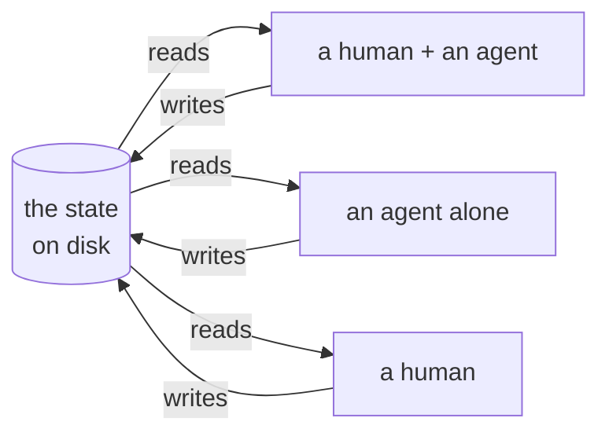
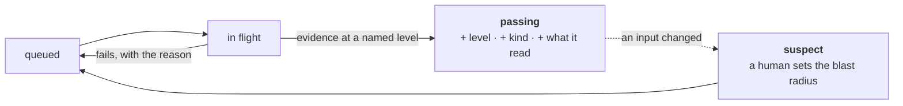

## Introduction

From the end of 2025 to now, we've been handed a new **x-engineering** every few months. Prompt. Context. Harness. Loop. Graph. Each one arrives with a course, a blog post from a lab, and someone on LinkedIn saying the last one is dead.

They're not dead. They stack. I [wrote about that ladder already](/blogs/blog/agents_arent_the_point_state_is/), so I won't re-argue it here. The short version: every rung takes something that used to live inside the agent and puts it somewhere outside.

| Rung | What moves out of the actor |
| --- | --- |
| Prompt engineering | the instructions — out of your head |
| Context engineering | the knowledge — out of the weights |
| Harness engineering | the tools and checks — out of the model |
| Loop engineering | the revision — out of a single pass |
| Graph engineering | the state — out of the session |

What I want to do here is different. I went and studied the *best* resource for each rung. Not the SEO blogs, the real ones. Then I pulled out what each actually teaches. Finally, I want to argue with my last post about that fifth row.

Because I think "graph engineering" is the wrong name for it.

The name I want is **state engineering**: *deciding what a piece of work knows about itself, no matter who or what is working on it right now.* The idea underneath is old. Last time I traced it back to Petri nets and 1970s blackboards, and I'm not going to pretend I invented that. But as far as I can tell nobody is using this name for the rung yet, so I'm taking it. The rest of this post is the argument for why it's the better one.

## The highlights

### Prompt engineering

The [Prompt Engineering Guide](https://www.promptingguide.ai/) is still the reference. What's funny is that it has outgrown its own title: it now carries whole sections on agents, on function calling, and on context engineering. The standard prompt guide absorbed the next two rungs instead of being replaced by them. That's the stacking showing up in a table of contents.

The craft itself settled into a shape most frameworks agree on: **role, instruction, context, example**. Tell the model who it is, what to do, what it needs to know, and show it one. Everything after this rung is about the third item getting too big to type.

### Context engineering

LangChain's [context engineering post](https://www.langchain.com/blog/context-engineering-for-agents) gives the four verbs I keep coming back to. Almost every later article is a reshuffle of these:

- **Write** — put information outside the window so it survives: scratchpads during a task, memories across sessions.
- **Select** — pull the right piece back in when it's needed.
- **Compress** — keep only the tokens that still earn their place. Summarize, trim.
- **Isolate** — split context across separate agents or a sandbox so no single window has to hold everything.

Anthropic's [companion guide](https://www.anthropic.com/engineering/effective-context-engineering-for-ai-agents) supplies the reason all four are necessary: context is finite, and not in the way you think. Models suffer **context rot** — accuracy falls as the window fills, and it starts falling long before you hit the limit. So the goal isn't "fit everything in." It's to find the *smallest* set of high-signal tokens that gets the outcome.

The field report I'd read next is [Manus](https://manus.im/blog/Context-Engineering-for-AI-Agents-Lessons-from-Building-Manus), because one of its lessons is genuinely counterintuitive: **keep the wrong stuff in.** Leave failed actions and error traces in the context. The model learns from them and stops repeating the mistake. Naive compaction deletes exactly that.

### Harness engineering

[Learn Harness Engineering](https://walkinglabs.github.io/learn-harness-engineering/en/) is a free thirteen-lecture course, and it's the best structured thing on this rung. Every lecture is named after a *failure mode*, not a technique — which tells you what kind of discipline this is.

Its definition is the cleanest I've found:

> Harness: Everything outside the model — instructions, tools, environment, state management, verification feedback. If it's not model weights, it's harness.

And it names five subsystems. Five, not six: permissions live inside Tools, rather than in a separate guardrail layer.

The course's rule is that missing any one of the five gives you an incomplete harness, and the agent "will always feel awkward to use." Its diagnostic advice is the line I'd put on a wall:

> When things fail, don't swap the model first — check the harness.

The lectures I'd read even if you skip the rest:

- **The repository must become the system of record.** The agent can't ask people. It sees system prompts, repo files, and tool output — and nothing else. Slack, Confluence, and your head are invisible to it. So: *"The repo has the final say — nowhere else counts."* With a warning attached: *"Out-of-date documentation is more dangerous than no documentation at all."*
- **One giant instruction file fails.** Everyone's `CLAUDE.md` grows 50 → 300 → 600 lines and gets worse the whole way. The entry file is a router, not an encyclopedia. The fix I liked most: every instruction should carry a source, a condition where it applies, and **a condition where it expires**.
- **Agents overreach and under-finish.** They start more than they finish, and the two are the same disease — context split across too many tasks means none get enough. The fix is WIP=1 and a completion ratio you actually track.
- **Agents declare victory too early.** The diagnosis is not that the model is dishonest. It's structural: *"The same model both generates and evaluates, so it is inherently inclined to be generous with itself."* You don't fix that with a better prompt. You separate the worker from the checker.
- **Observability belongs inside the harness.** Not a feature you bolt on later. Without it you can't tell "correct" from "looks correct," evaluation becomes taste, and retries become guessing. I built a version of this idea into [one of my own modules](https://github.com/locchh/veronica/tree/main/armors/mod-04). It never writes code itself. It hands out one item at a time, and marks it done only when a separate evaluator pastes output it ran itself.
- **Every session must leave a clean state.** Five conditions at session end: build passes, tests pass, progress recorded, no stale artifacts, startup path available. Miss one and the session isn't done. The framing is entropy: *"'Clean up later' equals never cleaning up."*

### Loop engineering

The best applied resource here is [Claude Code Loops](https://claude.ai/public/artifacts/11bdc800-3d82-4cd1-8a05-a82ae516f8cb), a coursebook published as a public artifact. (It's user-generated, so treat it as a well-organized practitioner's notebook rather than a lab's word.)

Its first move is the useful one: **"loop" is one word doing three jobs.** Keep them apart and everything else gets easier.

You have three real questions. *Does it stop on its own? Where do I put it? What does it cost?* Each one is about one of those three. And the basic goal loop underneath is small enough to draw:

The evaluator is a *different* model from the one doing the work. That's what stops the agent grading its own homework. And look at the dashed line: a "no" doesn't re-send the original prompt — **the failure reason becomes the next instruction.**

The evaluator only sees the transcript. It can't run commands or read files. That one constraint dictates how you write every condition: name an observable end state, and make the work print its own proof. "All tests pass" works because the runner's output lands in the conversation. "The code is clean" never will.

A complete production loop breaks into six parts:

| Primitive | Job |
| --- | --- |
| Discovery / scheduling | find work on a cadence |
| Goal-conditioned execution | work until a stop condition holds |
| Verification | a separate agent grades the result |
| Memory / state | persist across runs |
| Parallelism / isolation | many agents, no collisions |
| Safety / circuit-breakers | stop a runaway |

If you remember one sentence from that book, it's this one: **an unattended loop without a verifier is a machine that ships bugs with high confidence.**

Then loops stack. LangChain's [four-loop version](https://www.langchain.com/blog/the-art-of-loop-engineering) wraps the agent loop in a verification loop, that in an event loop, and all of it in a hill-climbing loop that reads production traces and edits the harness itself:

Watch the outermost arrow. It doesn't loop back to the top — it reaches *inside* and rewrites the loop below it. That's a loop that edits its own instructions, which is a wonderful idea and a dangerous one. I built [a module around exactly this](https://github.com/locchh/veronica/tree/main/armors/mod-05). What makes it safe isn't the writing, it's the gate. The agent writes one general rule per run, and the rule is kept only if a score it cannot edit goes up. Reflection without that gate isn't hill-climbing. It's drift, and after twenty runs you have a file full of confident superstition that every future run reads.

Set a cap on every loop — turns, or time, or cost. All three if you can.

**Where loops go wrong.** The coursebook's catalogue is seven: runaway, confident conveyor belt, un-verifiable goal, primitive mismatch, cost blowout, skill decay, ungated prod. I'd compress it differently. Each anti-pattern is one move skipped:

| Move skipped | What you get |
| --- | --- |
| Discovery | a **blind** loop — it never finds the work |
| Handoff | a **tangled** loop — agents stomping each other |
| Verification | a **nodding** loop — it agrees with itself |
| Persistence | an **amnesiac** loop — it relearns everything each run |
| Scheduling | a **manual** loop — you're still the trigger |

And the costs land in two places. On the machine: **context rot** and **cost bloat**, because every cycle re-sends the window. On you: **verification debt** (checks you stopped running), **comprehension rot** (code you no longer understand), and **cognitive surrender** (you stopped reading it at all).

The whole point of a loop is that it should **accumulate progress**. A loop that doesn't is just a script you're paying more to run.

## State engineering

Here's where I want to argue with myself.

In my last post I called the fifth rung **graph engineering**, because that's what LangChain called it. Then I spent the last paragraph of that post quietly taking it back. I want to say why properly now.

### A graph means you already knew the steps

I have to be careful here, because the obvious version of this argument is wrong.

The obvious version says: if you can draw the graph, the states are fixed, so you must have known them all in advance. That isn't true. Add a cycle, a conditional edge, or one value that varies, and a small graph describes an enormous space of situations. I said as much in [my last post](/blogs/blog/agents_arent_the_point_state_is/): an FSM is a graph, and Petri nets exist precisely because one finite graph can hold many truths at once. A graph is not a list of states.

What a graph does fix is smaller, and it's still the whole problem. **You have to name every place the work can be, and the rules for moving between them, before the work starts.** The nodes are authored up front even when the states aren't.

And that's the cost, because **you don't know the steps of a piece of work when you start working.** You find out what they were somewhere in the middle, usually right after you've already been through three of them.

AI has scar tissue here. [STRIPS](https://ai.stanford.edu/~nilsson/OnlinePubs-Nils/PublishedPapers/strips.pdf) (Fikes and Nilsson, 1971) is the ancestor of every planner since. It doesn't list states either — it declares predicates and operators and generates the rest, which is the clever part. What it can't survive is its other assumption: the **closed world**, where anything not written down is false. It plans beautifully inside what you declared. It has nothing to say the moment the world contains a fact nobody declared, which in real work is about turn two.

Nineteen years later, Rodney Brooks made the opposite bet in ["Elephants Don't Play Chess"](https://people.csail.mit.edu/brooks/papers/elephants.pdf) (1990) — stop maintaining the internal model at all:

> The world is its own best model. It is always exactly up to date. It always contains every detail there is to be known.

Change one word and you have the harness course's third lecture. **The repo is its own best state.** It's always exactly up to date, it holds every detail there is to know, and the trick is to read it often enough. The agent shouldn't carry the state of the work. It should read it off the artifact.

So a graph is one *encoding* of state, and a good one — the encoding whose cost is paid up front. State engineering is the larger job, and it lets you defer that payment.

Which is the whole reason I wanted a different name at the top of this post, and it's worth restating now that it's earned:

> **State engineering** is deciding what a piece of work knows about itself, no matter who or what is working on it right now.

### Why we need the rung at all

Look at what the four rungs below it optimize. The prompt is what the actor is told. The context is what the actor sees. The harness is what the actor can do and gets checked by. The loop is how many times the actor runs. **All four take the actor as the unit, and all four die when the run dies.**

State is the only one whose object is the work rather than the worker. That's not a nicer way of saying the same thing — it changes who can pick the work up.

### What the vendor can't ship you

Here's the part I keep chewing on. Nearly every big lab has converged on **one general-purpose agent** — one node that fits all. Claude Code, Codex, and the open clones are all the same bet: a session, a context window, a tool loop, pointed at anything.

I don't think that's a technical conclusion. I think it's an economic one. One general agent scales **horizontally**: the same product serves every use case and every user, and each extra customer costs almost nothing. That is an extremely good business. It scales **vertically** much worse, and the reason isn't effort — it's [context rot](https://www.trychroma.com/research/context-rot). The session is the only state a general agent has, and a session degrades as it fills. A bigger window doesn't rescue it, because the accuracy was already falling well before the window was full.

The database people had this fight twenty years ago. Stonebraker and Çetintemel argued in ["One Size Fits All": An Idea Whose Time Has Come and Gone](https://cs.brown.edu/people/ugur/fits_all.pdf) (2005) that the general engine would lose to specialized ones on every workload. They were right about the engineering and wrong about the market — but look at *how* they were wrong. The general engine survived by **absorbing** the specialists. Postgres swallowed JSON, then full-text, then time-series, then vectors.

So I expect absorption here too, and I should be honest that it argues against me. The vendors are already shipping memory, project files, checkpoints, sub-agents. They will keep shipping more.

What they can't ship is the content. **They give you the filing cabinet. Only you can write the files** — because the thing that makes your long work survive is what *your* work knows about itself, and that isn't a feature anyone can ship to everybody. That's why this is a job and not a menu item.

### What's already solved

Give the harness course credit: it doesn't leave state as a vibe. It borrows **ACID** from databases and applies it straight to agent state. Atomicity: one commit per logical operation, all or nothing. Consistency: the invariants still hold after the write. Isolation: concurrent work can't see each other's half-finished writes. Durability: if it isn't written down, it didn't happen.

That's the right instinct, and forty years of hardening for free. But notice what ACID answers — *how to write state safely.* It says nothing about **what** to write, **who** may write it, or **when** to delete it. Those are the open questions.

### The aspects worth studying

Harness engineering organized itself around failure modes. Loop engineering organized itself around primitives. Here's the equivalent list for state. Each row is a question I don't think anyone has settled, paired with what happens when you ignore it:

| Aspect | The question | How it fails |
| --- | --- | --- |
| **Extent** | What belongs in the state at all? | **Bloat** — it only grows, until you've rebuilt context rot on disk. Or **amnesia**, where the real state stayed in the session and died with it. |
| **Discovery** | How do you add state nobody declared up front? | **Fabrication** — an entry that was never true gets written once and believed forever. |
| **Authority** | Who may write which field, and when does it freeze? | **Self-serving writes** — the actor edits the check that grades it. |
| **Merge** | What happens when two permitted writers collide? | **Contradiction** — both entries are in there, and nobody knows which is live. |
| **Decay** | What gets removed, and on what signal? | **Drift** — it was true in March. |
| **Handoff** | How does the next actor resume without re-reading everything? | **Orphaned state** — perfect notes, no next shift. |

Two of those deserve a note.

**Drift is worse than amnesia**, which is not obvious. An empty file makes the next actor go look. A confidently wrong file doesn't. The harness course puts it flatly: *"Out-of-date documentation is more dangerous than no documentation at all."*

**Authority is where I'd start**, because it's the one both good sources reached independently. The harness course, on feature lists: *"State transitions are controlled by the harness, not freely changed by the agent."* A feature moves to passing only when its verification command runs green. When I built my own orchestrator I arrived from the other direction. The field holding an item's check is frozen once written. Weakening a check mid-run is the cheapest way to make the whole system report success, and it feels completely reasonable at the time.

That's the shape of the insight: **state engineering is mostly about write permissions.** Not storage.

Only one failure on that list is solved elsewhere, and the fix is old: orphaned state needs something watching. A checkpoint is worthless without an operator to hand it to. That's the [watcher problem](/blogs/blog/the_seat_needs_a_watcher/), and it's why state outliving its actor is only half of what "durable" means.

The best one-line summary of this rung comes from the harness course. It's almost the line I ended my last post with, and I'll take that as a sign we're looking at the same thing:

> The agent forgets. The repository doesn't.

## The long journey

Everything above is about one session handing off to the next. A migration is different in size, and size changes the problem. You're not resuming a task. You're carrying a number, 500 of 800 units done, for weeks or months. That number is the state, and it has to grow.

I've [written about the mechanics before](/blogs/blog/migration_is_a_harness/): a unit boundary is a commit boundary, the evaluator passes it, you commit. The working tree holds the churn; the commit history holds what survived. That rhythm is the ratchet.

There's a reason a ratchet scales when nothing else does. [Hellerstein's CALM result](https://arxiv.org/abs/1901.01930) stands for consistency as logical monotonicity. It says a problem can be solved without coordination exactly when it's **monotone** — when facts only get added, never retracted.

Be careful with the noun, because I wasn't at first. Monotonicity is a property of the *question you ask*, not of the pile of facts. A commit log is append-only; whether a query over it needs coordination depends on the query. "Unit 412 passed on Tuesday" only ever gets added, so agents can write those facts in parallel and never agree on anything. That half is free. They still have to coordinate on *who takes unit 412* — Bun's sixty-odd agents ran off a shared work queue — because handing out work isn't monotone. Results need no lock. Assignment does.

And the number I opened with is already the wrong kind of question. A count isn't monotone: "500 done" has to be retracted the moment a 501st unit lands. Read it as a floor instead — *at least* 500 have ever passed — and it's monotone again. That reading is the one you get for free, and it's exactly the one the next section destroys.

The trouble starts with the word *passed*.

### What "verified" actually means

A long migration can't use one bar for everything. The harness course stacks verification in three layers, cheapest first:

| | What it asks | Cost |
| --- | --- | --- |
| **Level 1 · static** | does it compile, type-check, lint? | seconds |
| **Level 2 · runtime** | do the relevant tests pass, with real output pasted? | minutes |
| **Level 3 · system** | does it behave right at the boundary a human touches? | expensive |

Level 3 is the rung that needs a name attached, because "the boundary a human touches" means completely different things for different items. When I built my own [orchestrator module](https://github.com/locchh/veronica/tree/main/armors/mod-04) I had to make each item declare its **kind** up front — *logic*, *integration*, or *ui* — because that's what decides whether level 3 means running the unit with real input, driving a real database, or driving the actual screen. One rung, three different bars. You pick at plan time, not when you're tired and grading it.

Here's the part I think people miss. **If your state records only a boolean, your count is a lie of unknown size.** Not because the plan was wrong — because the plan and the outcome can differ. An item planned for level 3 and quietly promoted on a level-1 pass looks identical to one that earned it. Both read `passing`. So "500 done" averages the earned and the waved-through into a number that means nothing, and only the record tells you which is which. The level that actually promoted an item belongs in the state.

### Evidence has a shelf life

Now the harder one, and I don't think anyone has a clean answer.

The harness course says a feature's move to `passing` is **irreversible** — once passing, it can't go back. That's the right instinct for stopping an agent from quietly downgrading its own work. But run it for three months and it becomes false. An item verified in March, against a rulebook amended in May and a dependency replaced in June, is still sitting there marked green. The mark is stale and nothing knows it.

Build systems had the shape of this in 1976. Stuart Feldman's `make` doesn't ask whether a target was ever built — it asks whether the target is **older than its inputs**. If an input changed, the target is out of date, full stop, no matter how green it looked last time. Fifty years later that's still the only honest reading of a verification record: not "this passed," but "this passed *against these inputs*."

Anthropic's migration kit gets to the same place from the practical side, with a rule I keep quoting: *"you don't fix the code — you fix the process that produced the code."* See a failure three times and the rule is wrong, so you amend the rule and regenerate everything it touched. Read that as a build system and it's a `make clean` on a subtree, run by hand, with a human deciding the blast radius.

So the missing piece is a dependency edge. Every verified item should point at the version of the rulebook, the fixtures, and the modules it was checked against.

Two problems with that, and I'd rather name them than pretend.

**The first is who writes those edges.** `make` invalidates against prerequisites *somebody wrote down*, which is the closed-world assumption I spent a whole section rejecting, showing up one level higher in a different hat. Under-declare your dependencies and you're immune to demotion. Over-declare and you can demote whatever you like. That's the **Authority** row again: the dependency list is itself state, so it needs a write rule like any other state.

The good news is that build systems stopped trusting declarations decades ago. `gcc -M`, Bazel, and Nix all capture the *observed* read set instead — what the build actually touched, not what someone promised it would touch. A sandboxed verifier already has that information. Record what it read.

**The second is that invalidation looks like it breaks the ratchet.** "Unit 412 passed on Tuesday" only gets added. But "unit 412 is currently done" can go backward, and going backward is a retraction — exactly the case CALM says you have to coordinate.

Except databases solved this in the 1980s, and I nearly missed it. You don't retract anything. You version the rulebook and ask the question *at a version*: valid against rulebook v7, 412 of 800. Nothing is ever unsaid; what changes is which snapshot you're quoting. That's multi-version concurrency control, older than almost everything else in this post — and it means an honest migration carries **two numbers, not one**:

- **ever passed** — append-only, monotone, free to compute, never goes down.
- **currently valid** — evaluated against today's rulebook and today's dependencies, and it absolutely can go down.

Watching those two diverge is the most useful signal a long migration has. The gap is the distance between what you've done and what still counts.

That resolves the tension with "irreversible," I think, and the rule is simple: **demote by dependency, never by opinion.** An agent may never move an item backward because it disagrees with a verdict. An item moves when something it was checked against has changed, and that's a fact anyone can check rather than a judgement anyone can argue with.

One caution I owe the human in the loop. Auto-invalidation should mark items **suspect**, not re-queue them. A single rulebook amendment can touch five hundred items, and a ratchet that resets itself five hundred steps has stopped being a ratchet. The machine says what's stale. A person still decides the blast radius — which is exactly what Anthropic's kit has a human doing.

The cost shape falls out of this. You can't run level 3 on everything on every cycle; that's the whole reason the cheap levels exist. So run the cheap checks continuously, spend the expensive ones at checkpoints, and let invalidation tell you which expensive checks you actually owe. That's the same trade as [starting at the cheap end](/blogs/blog/start_at_the_cheap_end/) — you're just spending the budget on the units whose ground moved.

All of which reduces to one habit, and it's the habit a long migration lives or dies by: **record not just that something passed, but what it passed against.**

> **Lesson:** you cannot name the steps before you walk them. So declare where the state lives, who may write which part of it, and what makes an entry expire — then let the shape show up while the work runs.

## Related to

- [What Is Loop Engineering? A Complete Guide from Prompt to Harness Engineering](https://tosea.ai/blog/loop-engineering-ai-agents-complete-guide-2026) - The definition I keep coming back to: designing the system that prompts, checks, remembers, and re-runs an agent — with each layer (prompt → context → harness → loop) wrapping the previous one, not replacing it

- [Loop Engineering](https://addyosmani.com/blog/loop-engineering/) - Addy Osmani's essay: "loop engineering is replacing yourself as the person who prompts the agent" — skeptical about token costs, practical about worktrees, and closing with the right warning: build the loop, stay the engineer

- [Loop Engineering: The Anthropic Playbook for Designing Systems That Prompt Your Agents](https://drive.google.com/file/d/1qzKI4DKnyHRpXK1J3ATPqwaqLc0iNu-M/view?trk=public_post_comment-text) - A field study of designing loops that run themselves (PDF on Google Drive)

- [3 Key Loops for Building 0-to-1 Products with AI Agents](https://www.linkedin.com/posts/andrewyng_loop-engineering-is-a-hot-buzzphrase-after-share-7477753882505338880-dBJ-/?utm_source=share&utm_medium=member_android&rcm=ACoAAD9laxkBsmkcAipJMc2HAVrKjjkg5sWujiY) - Andrew Ng's LinkedIn post — "loop engineering is a hot buzzphrase" — naming the three key loops for building 0-to-1 products with AI agents

- [The Art of Loop Engineering](https://www.langchain.com/blog/the-art-of-loop-engineering) - LangChain's four-loop stack, from the core agent loop up to the hill-climbing loop that improves the harness from production traces — their take on swyx's "loopcraft"

- [Claude Code Loops](https://claude.ai/public/artifacts/11bdc800-3d82-4cd1-8a05-a82ae516f8cb) - An applied coursebook on Claude Code loops, published as a public Claude artifact

- [Learn Harness Engineering](https://walkinglabs.github.io/learn-harness-engineering/en/) - A multilingual course on the engineering of AI coding agents — thirteen lectures, each named after a failure mode, plus hands-on projects and copy-ready templates; its core line: a harness doesn't make the model smarter, it builds a closed-loop working system around it

- [Harness Engineering là gì?](https://goonnguyen.substack.com/p/harness-engineering-la-gi) - A Vietnamese explainer by Duy /zuey/ with the best metaphor of the bunch: prompt engineering is writing the email, context engineering is attaching the right file, harness engineering is designing the whole office

- [Harness engineering: leveraging Codex in an agent-first world](https://openai.com/index/harness-engineering/) - OpenAI's field report on building a product from an empty repo to a million lines of code with agents writing every line — "humans steer, agents execute"; the discipline moves out of the code and into the scaffolding

- [The Context Course](https://huggingface.co/learn/context-course/unit0/introduction) - Hugging Face's free six-unit course on context engineering for code agents — skills, MCP, plugins, sub-agents, hooks, and a bonus unit where you build a minimal agent loop from scratch. The structural twin of the harness course

- [Context Engineering](https://www.langchain.com/blog/context-engineering-for-agents) - LangChain's write / select / compress / isolate taxonomy. Four verbs that most later writing on the subject is a reshuffle of

- [Effective context engineering for AI agents](https://www.anthropic.com/engineering/effective-context-engineering-for-ai-agents) - Anthropic's guide to treating context as a finite resource — find "the smallest possible set of high-signal tokens that maximize the likelihood of some desired outcome"

- [Context Engineering for AI Agents: Lessons from Building Manus](https://manus.im/blog/Context-Engineering-for-AI-Agents-Lessons-from-Building-Manus) - Six lessons from shipping a real one, including the least obvious idea in the field: keep the failed actions in the context, because the model learns from them

- [Context Rot](https://www.trychroma.com/research/context-rot) - Chroma's study of every frontier model they could get hold of: all of them degrade as input grows, and the degradation starts long before the window is full. The receipt behind "context is finite"

- [A Survey of Context Engineering for Large Language Models](https://arxiv.org/abs/2507.13334) - A very long survey of the whole field, with a taxonomy separating foundational components from system implementations. The reference, when you want depth rather than a blog post

- [Agentic Context Engineering: Evolving Contexts for Self-Improving Language Models](https://arxiv.org/abs/2510.04618) - The ACE paper: instead of fine-tuning weights, the context itself becomes an evolving artifact that the model keeps improving

- [Prompt Engineering Guide](https://www.promptingguide.ai/) - The reference guide where this all started — and which has since grown whole sections on agents and context engineering, which tells you something about how these rungs relate
