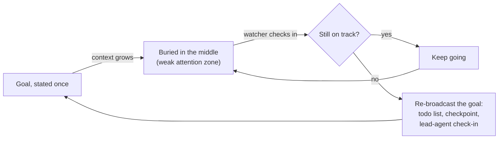

Last time I wrote about [the seat](/blogs/blog/you_cant_fork_yourself/) — the one serial slot in your head that holds exactly one train of thought, while the rest of the brain runs in parallel underneath it. I said the seat is single, and that's why you can't fork yourself the way an agent can. What I didn't say is who decides what actually sits in it. Two things made me go back and look. I sat down to meditate. And I watched an agent's plan quietly dissolve as its context window filled up. Same seat, two very different ways of losing it.

## The seat is won, not owned

Global Workspace Theory, from the last post, says the seat gets filled by whichever "coalition" of signals crosses a threshold first — *ignition*, as Dehaene named it when he carried Baars's theory into the brain scanner. Several candidates compete at once: a stray thought, a sound, the sentence you're halfway through. Whichever one is loudest, or matters most to your current goal, wins the broadcast. Nobody chooses in advance. The winner is decided fresh, every time, by a contest.

That reframes what "distraction" actually is. Your focus didn't slip. Something else won a contest your goal was supposed to be winning. And the loser doesn't disappear — it lingers at a lower strength, still bidding. That lingering bid is what I called **attention residue** last time, and it's most of why switching back to what you were doing costs you 20-odd minutes of recovery. The seat isn't sticky. It has to be re-won, over and over, just to hold one thing.

## Meditation trains the watcher from inside

Sit down and actually watch this happen, and it's exactly what a lot of meditation trains you to notice. Insight meditation, in its plainest form, has you silently label whatever just took the seat — "thinking," "hearing," "itching" — the instant you notice it's there. That's not a mystical trick. It's a running report on which coalition just won. You're building the exact instrument Global Workspace Theory describes, and pointing it at yourself in real time.

Concentration training does something else: it strengthens one coalition on purpose, so it keeps winning against everything else — the breath stays in the seat instead of losing to every stray thought that shows up. And there's a named failure mode too, in Buddhist psychology: mental proliferation, or *papañca*. One thought wins the seat, and instead of being noticed and let go, it triggers the next thought, and the next — the same phase-sequence chaining I wrote about with Hebb, except now running with no brake. "Monkey mind" is what that looks like from inside. It's the mind's version of a knowledge graph where nothing ever decays: everything keeps firing into everything else until you can't tell what mattered.

The deepest version of this practice, the not-self teaching, goes further than Global Workspace Theory strictly needs. It says there's no fixed "you" sitting in the seat at all — just a fast succession of occupants, each one gone by the time you notice it, and "you" is the name for the pattern of succession, not for anything that holds still through it. That's close to what the theory itself already claims: there's no persistent watcher living inside the workspace. There's only whichever content is being broadcast right now.

And here's the part I find genuinely useful: meditation's response to all this is the opposite of my last post's advice. Last time I said defend the seat, decide what's allowed to compete for it. Meditation says loosen your grip on whatever's in it, stop fighting to keep any one thing there. Same mechanism, opposite move — one for getting work done, one for not being run by the contest every waking minute. Most people need both, at different times.

## Agents don't get to meditate

Now the other half of what set this off. Long-running agents have the identical seat problem, in a much duller form. There's no dramatic rival signal stealing the show. The goal you set at the start just quietly loses, because everything piled on top of it since is now closer to where the model's attention is strongest.

There's a name for this, and a real measurement behind it: [Lost in the Middle](https://arxiv.org/abs/2307.03172) showed language models are far better at using information at the start or end of a long context than information buried in the middle — a U-shaped curve, not a flat one. A goal stated once, on turn one of a session that's now a hundred turns deep, sits exactly where the model's attention is weakest. The words are still there in the transcript. They just stopped mattering to the model the way they used to.

Herbert Simon called this in [1971](https://en.wikipedia.org/wiki/Attention_economy): *"a wealth of information creates a poverty of attention."* He was describing managers drowning in memos. It took fifty years and a context window for the same law to catch up with machines.

This is decay with no meditator watching it happen. A human losing the seat at least has the introspective machinery to notice — that's the whole premise of the noting practice above. A model mid-context has no equivalent organ. It cannot sit and notice its own goal fading, because "noticing" would itself have to compete for the same seat that's already losing.

## So you build the watcher outside it

Which is the actual answer to my own question: since the agent can't watch itself, something has to watch it from outside. Not as a nice-to-have — as the only fix, given the model has no introspective option here at all.

Hardware engineers accepted this bargain long ago. A processor that hangs can't notice it hung — the code that would notice is the code that's stuck — so embedded systems ship a [watchdog timer](https://en.wikipedia.org/wiki/Watchdog_timer): a dumb counter outside the CPU that must be reset every few milliseconds, or it reboots the chip. No intelligence, no interpretation, just something *outside* the failure, checking for a pulse. Spacecraft have carried one for decades, because there's nobody out there to press reset.

This is already happening, in pieces, and one example landed while I was writing this very section. Claude Code tracks whether I'm using its task list, and a few turns into a long session it quietly reminded me to update it — a system nudging me because I'd let a piece of state go stale. I couldn't have staged a better example. [MiMo-Code](https://github.com/XiaomiMiMo/MiMo-Code) does the same thing on purpose: it writes its own `checkpoint.md` and `progress.md` as it works, so that something outside the model's own attention can re-state where things stand — the same point I made about [state outliving the actor](/blogs/blog/agents_arent_the_point_state_is/), applied to a run that hasn't crashed at all, just quietly drifted. And Anthropic's own [multi-agent research system](https://www.anthropic.com/engineering/multi-agent-research-system) has a lead agent periodically check each subagent's output against the original plan — a watcher one level up, re-grounding a worker before it wanders too far from the goal it started with.

Trace the mechanism and it's the same one from [the knowledge-base post](/blogs/blog/how_to_build_knowledgebase/): an edge that goes unused decays, and using it again is what re-strengthens it before it's pruned below the threshold that matters. The goal in a long agent run is exactly that edge. The watcher's whole job is to touch it again before the context grows enough to bury it for good.

The most precisely built version of this I've found is Claude Code's experimental [observer agents](https://claudefa.st/blog/guide/agents/observer-agents): a worker and a watcher spawned as a matched pair, the watcher fed only a read-only digest of what the worker just did, silent by default, allowed to send exactly one advisory message if it catches something real — and never allowed to block, pause, or touch anything itself. External, silent unless needed, advisory only. That's this post's watcher, built almost to spec.

One honest difference, though. My watcher exists because the model has no spare attention to notice its own goal decaying — a structural limit, not a choice. The observer's own stated reason is different: **one agent optimizing to finish the task and validating its own honesty is a conflict of interest**, so the fix splits the two jobs across two agents. That's built to catch a worker quietly weakening a test to make it pass, not a goal buried by Lost in the Middle. Different failure, same fix — whatever the reason self-monitoring breaks, the answer is still someone outside, watching, saying as little as possible.

## The two watchers

| | Human | Agent |
|---|---|---|
| The seat | Global workspace, one train of thought | Context window, one active reasoning pass |
| What it loses to | A louder rival signal | Slow burial under everything piled on top |
| Can it notice itself? | Yes — that's what meditation trains | No — noticing would need the same seat that's already losing |
| The fix | An internal watcher, trained over time | An external watcher, built into the harness |
| The goal of watching | Loosen the grip, notice without following | Tighten the grip, re-broadcast before it decays |

Same mechanism, opposite tools. A person can grow a watcher inside their own head, given enough sitting practice, and use it to hold the seat a little more lightly. A model can't, not yet — so the watcher has to live outside it, in a task list, a checkpoint file, a lead agent checking in. Either way the lesson points the same direction, just aimed differently: the seat was never yours to keep. Something has to watch it, or it decides itself.

One last loop worth noticing. Baars didn't invent the workspace metaphor from nothing — he borrowed it from AI's [blackboard systems](https://en.wikipedia.org/wiki/Blackboard_system) of the 1970s, where specialist programs cooperated on one shared board. AI lent cognitive science an architecture to explain the mind; half a century later, we're borrowing the explanation back to build agents. The metaphor has crossed the bridge twice, once in each direction.

> **Lesson:** the seat isn't owned, it's won, over and over, by whatever's loudest or whatever's closest — and it decays the instant nothing tends it. Meditation is the watcher you can grow inside your own head. An agent can't grow one yet, so you build it outside instead. Either way, someone has to watch the seat.
