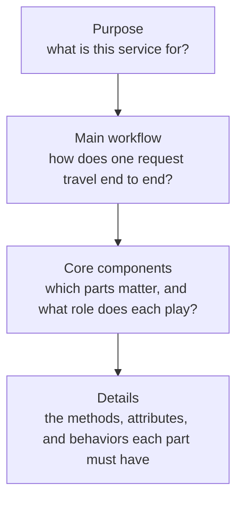

You are a developer. You have ten years of experience. Now look honestly at your daily work: is it entry-level work, done with ten-year-old habits? That is **the trap of peaceful days**. Someone will start after you and grow past you, because they take on a challenge every day — a bigger problem each time. So stay positive, stay hungry, and expect problems to come. (Just not too many big problems at the same time. That's not growth, that's drowning.)

There's an old saying about this: some people have ten years of experience, and some have one year of experience, repeated ten times.

So what do the fast growers actually get for their years? I've been watching the seniors around me, and I don't think the difference is stored facts. It's **what they see**. Same code, same ticket, same design meeting — and different things are visible to them. Here are six of those things.

---

## 1. They see the path before the code

Watch a senior open a codebase they have never seen. Different framework. A language they can barely write. They are not lost. They carry a **thread** in their head, and the thread doesn't depend on the language:

<div align="center">



</div>

Notice where the coding details sit: at the **end** of the thread, not the start. At the "purpose" step you don't need to care about the code at all. Most juniors — me included, for years — start at the bottom, opening file after file, and drown.

This difference was measured, forty years ago. [Soloway and Ehrlich (1984)](https://www.ics.uci.edu/~redmiles/inf233-FQ07/oldpapers/SollowayEhrlich.pdf) studied how expert programmers read code. Experts don't read line by line. They carry **programming plans** — standard shapes like "loop that searches for a value" — and match code against them. The proof is the twist in the study: when the researchers wrote code that deliberately broke those standard shapes, the experts' advantage mostly disappeared. They fell back toward novice performance. Same eyes, same code — the shapes were gone.

> **Lesson:** a senior doesn't read faster. They match code against shapes they already own, and skip what the shape already tells them.

---

## 2. Error-first

Data-first? AI-first? No — **error-first**.

The junior habit (mine too) is to build the happy path first and treat errors as cleanup for later. The senior habit is the opposite, because the happy path is the easy 20%. The errors are the design.

Not all errors are one thing, and each kind wants a different answer:

| Kind of error | Example | The senior question |
|---|---|---|
| Connection | API down, rate limit hit, resources exhausted | Retry, back off, or fail fast? |
| Validation | Input is not what we expected | Reject at the border, with a clear message |
| Coding | A real bug in our own logic | Crash loudly. Never hide it. |
| Business | The rule says no — this order can't ship | Not an exception at all. A normal outcome to model. |

Then three questions to ask of any system. How is each kind handled? Are the errors **meaningful** — a good error says what failed, with what input, and what to do next? And can you **trace** one failing request through the logs after it's gone wrong?

The strongest version of error-first thinking is old. Erlang was built at Ericsson for telephone switches that were not allowed to stop, and Joe Armstrong's thesis title says the whole philosophy: [*Making reliable distributed systems in the presence of software errors*](https://erlang.org/download/armstrong_thesis_2003.pdf) (2003). Not "without errors" — *in the presence of* them. The famous rule, **"let it crash,"** sounds reckless and is the opposite: don't defend every line against every failure; build the system so a part can die and a supervisor restarts it clean. Error handling designed first, at the architecture level — not sprinkled on at the end.

> **Lesson:** juniors handle errors where they happen. Seniors decide where errors are *allowed* to happen.

---

## 3. They see scale as a balance, not a bigger machine

Here is how I've come to think about scaling. It is a **balance between two numbers**: the power of one working unit — how much RAM, CPU, and disk each container gets — and how many units run in parallel. Get the balance wrong in either direction and you pay. Make one unit very powerful while the workload is a flood of small, simple tasks, and you're paying for muscle that stands idle. Make the units tiny while each task is heavy, and they thrash and fail.

That balancing view — not "just add more servers" — is the senior look.

And the oldest result in parallel computing says why the balance can't be escaped. [Amdahl (1967)](https://www3.cs.stonybrook.edu/~rezaul/Spring-2012/CSE613/reading/Amdahl-1967.pdf) pointed out that every job has a part that cannot be split, and that part sets a ceiling on what parallelism can ever give you. If 5% of the work must happen in one place, no army of machines makes the job twenty times faster. So the senior's first scaling question is never "how many replicas?" It's: *which part of this cannot be split?* — and *does the size of my unit match the size of my task?*

> **Lesson:** scaling is not adding power. It's matching the shape of the machine to the shape of the work.

---

## 4. They think in spectrums, not favorites

The junior question is "which tool is best?" The senior sees a **spectrum**, and the position on it matters more than the name on the box.

Take vector similarity search. On one end: Postgres with a vector extension — plenty when vectors are just one feature of your app, and you keep your one boring database. On the other end: dedicated engines like Chroma, Pinecone, or Weaviate — built for the job, worth it when search *is* the product. Neither end is "better." They are different points on the same line.

The same spectrum shows up in how you ship. If your service is useful to many users, run it centralized and charge a subscription. If your resources can't serve everyone — or privacy means the data can't leave the building — ship it self-contained, running on the user's own machine. And notice that Chroma itself spans this spectrum: it has a client–server mode and a local mode. One tool, two positions. Even the tool makers know it's a spectrum.

The version of this I care most about now: **model size against task size.** Classifying the sentiment of incoming emails with a frontier model plus an agent SDK is over-engineering — a professor hired to sort mail. A small open classifier from Hugging Face does that job on a CPU, for free:

```python
from transformers import pipeline

classify = pipeline(
    "sentiment-analysis",
    model="distilbert-base-uncased-finetuned-sst-2-english",
)

print(classify("I love the product, but the delivery was late."))
# [{'label': 'POSITIVE', 'score': 0.99}]
```

That's [DistilBERT fine-tuned for sentiment](https://huggingface.co/distilbert/distilbert-base-uncased-finetuned-sst-2-english) — a small model with one job. For summarization or translation at volume, the same logic points to a small open model self-hosted with llama.cpp and a GGUF file: often far cheaper than paying an API per call.

But a codebase migration, or serious coding work? That's the other end of the spectrum, and honestly where frontier models like Fable 5 belong — because that work needs two things at once: **big internal knowledge** and the ability to **keep executing for a long time**. Those are exactly the two axes the newer benchmarks measure. [SWE-bench](https://arxiv.org/abs/2310.06770) asks whether a model can fix real GitHub issues — real work, not quiz questions. [Humanity's Last Exam](https://arxiv.org/abs/2501.14249) measures the "how smart" axis on the hardest expert questions. And METR's [time-horizon measure](https://arxiv.org/abs/2503.14499) is the "how long" axis: the length of task, counted in human working time, that a model can finish — a horizon that has been doubling roughly every seven months.

So before building anything AI-related, two questions: **how smart does this task actually need the model to be?** And **will that need grow?** Answer wrong in one direction and you burn money. Answer wrong in the other and you rebuild the whole thing next year.

> **Lesson:** don't ask which tool is best. Ask where on the spectrum this problem lives, and pick the tool already standing there.

---

## 5. They see the trade-off inside every choice

Look back at the four sections above. Every one was secretly about a trade-off: detail against overview, safety against speed of writing, unit power against unit count, model ability against model cost. That's not an accident. Fred Brooks made the general claim in [*No Silver Bullet*](https://en.wikipedia.org/wiki/No_Silver_Bullet) (1986): there is no single technique coming that makes the hard parts of software an order of magnitude easier. Everything real costs something. So when someone offers you a choice with no downside, they haven't removed the cost. They've hidden it.

How do seniors actually handle a trade-off? Three moves, as far as I can watch and copy:

1. **Name what you're giving up.** Out loud, in the design doc. If you can't state the downside of your own choice, you haven't found the trade-off yet — you've found marketing.
2. **Decide for *this* problem, not in general.** "Postgres vs Pinecone" has no answer. "Postgres vs Pinecone for our 50k documents and one search box" has an obvious one. The spectrum from section 4 is how you locate the question; the trade-off is how you pay for the answer.
3. **Write the decision down with its reason.** What we chose, what we gave up, and what would make us revisit. One short note. Future maintainers then inherit not just the decision but the *why* — and they'll know when the why has expired.

> **Lesson:** a senior never says "X is better than Y." They say "X is better *here*, and this is what it costs."

---

## 6. They see that the bottleneck is now them

The first five are about the work. This one is about you, and it only appears after you level up.

Section 3 asked the Amdahl question: which part of this cannot be split? Get senior enough and the answer changes. It's you. Requests, meetings, design arguments, the final call — they all route to one desk. Agents write the code now; what they can't do is be the person accountable for the decision. So you become the serial fraction of your own team, and Amdahl's ceiling stops being a fact about machines and becomes a fact about your calendar.

Here is the part I had backwards. Time stopped feeling scarce — I can buy more of it, a Claude Code or Codex subscription, a second and third and sixteenth worker for a flat monthly fee. So why does the day feel worse?

Because I bought the wrong thing. Every agent I add raises how much *arrives*. None of them raises how fast I can *decide*. [Little's Law](https://en.wikipedia.org/wiki/Little%27s_law) (1961) puts it plainly: how long work waits equals the amount in progress divided by the rate you finish it. My finish rate is one seat, and it doesn't move. So doubling what's in flight doesn't double output. It doubles the wait. I didn't buy time. I bought **inventory**, sitting on my desk, going stale.

Which is why the scarce resource was never time. It's **focus** — one problem at a time, and about twenty minutes of tax before your head is really inside a new one. I wrote out the mechanism in [you can't fork yourself](/blogs/blog/you_cant_fork_yourself/): the agent can fork a second reasoner and you can't.

And now read Little's Law backwards, because that's where the rule comes from. You cannot raise the finish rate — that's the one seat. So the only number left to touch is the one in front of it. **WIP = 1.** Not because finishing one thing is virtuous, but because a shorter queue is the only speed-up available to a fixed server. You don't get faster. The waiting gets shorter. And by section 5's rule, name what it costs: starting less means saying no to work that was genuinely worth doing. That's the trade-off in this one, and it's the least comfortable of the six.

The same reversal fixes the question I ask about my week. Not *how do I keep up with all of this?* — that question has no answer, and chasing it is how you end up busy and behind. The reversed one does: *what should never reach me at all?* Every good answer is a subtraction. And it's the only honest measure of a senior — not how much flows through you, but how much stopped needing to.

> **Lesson:** you can buy more workers. You cannot buy a second seat to decide from. So don't ask how to keep up. Ask what should stop arriving.

---

## One year, ten times

Six sections, one skill: seniors see **structure** where juniors see surface. The path under the unfamiliar codebase. The errors under the happy path. The balance under the scaling request. The spectrum under the tool debate. The cost under every benefit. The queue under your own busy week.

There's also one move underneath all six. Every section here is the normal question, turned around. Not code first but purpose first. Not the happy path but the errors. Not how many machines but what can't be split. Not which tool is best but where the problem lives. Not what you gain but what you give up. Not how do I keep up but what should never arrive. The mathematician [Carl Jacobi](https://en.wikipedia.org/wiki/Carl_Gustav_Jacob_Jacobi) gave his students one line of advice: *invert, always invert*. That's the sixth thing, and it's really the first — seniors don't have better answers than you. They turn the question around before they start answering it.

And none of it is talent. Each of these ways of seeing is a pile of solved problems, pressed by repetition into instinct — which is exactly why the trap of peaceful days is so expensive. No new problems means no new shapes, and the eye stops developing while the years keep counting. That's the whole difference between ten years of experience and one year repeated ten times.

The eye is built, not given. So take the slightly-too-big problem. Stay hungry.

---

## Sources

- Soloway & Ehrlich, [Empirical Studies of Programming Knowledge](https://www.ics.uci.edu/~redmiles/inf233-FQ07/oldpapers/SollowayEhrlich.pdf) (*IEEE Transactions on Software Engineering*, 1984) — programming plans, and experts falling to novice level on plan-breaking code
- Joe Armstrong, [Making reliable distributed systems in the presence of software errors](https://erlang.org/download/armstrong_thesis_2003.pdf) (PhD thesis, 2003) — Erlang and "let it crash"
- Gene Amdahl, [Validity of the single processor approach to achieving large scale computing capabilities](https://www3.cs.stonybrook.edu/~rezaul/Spring-2012/CSE613/reading/Amdahl-1967.pdf) (AFIPS, 1967)
- Fred Brooks, [No Silver Bullet](https://en.wikipedia.org/wiki/No_Silver_Bullet) (1986)
- John Little, [Little's Law](https://en.wikipedia.org/wiki/Little%27s_law) (1961) — wait time is work-in-progress divided by finish rate, which is where WIP = 1 comes from
- Carl Gustav Jacob Jacobi, [*man muss immer umkehren*](https://en.wikipedia.org/wiki/Carl_Gustav_Jacob_Jacobi) — "invert, always invert"
- Benchmarks for "how smart" and "how long": [SWE-bench](https://arxiv.org/abs/2310.06770) (2023) · [Humanity's Last Exam](https://arxiv.org/abs/2501.14249) (2025) · METR, [Measuring AI Ability to Complete Long Tasks](https://arxiv.org/abs/2503.14499) (2025)
- The small model in the example: [DistilBERT base uncased, fine-tuned on SST-2](https://huggingface.co/distilbert/distilbert-base-uncased-finetuned-sst-2-english)
