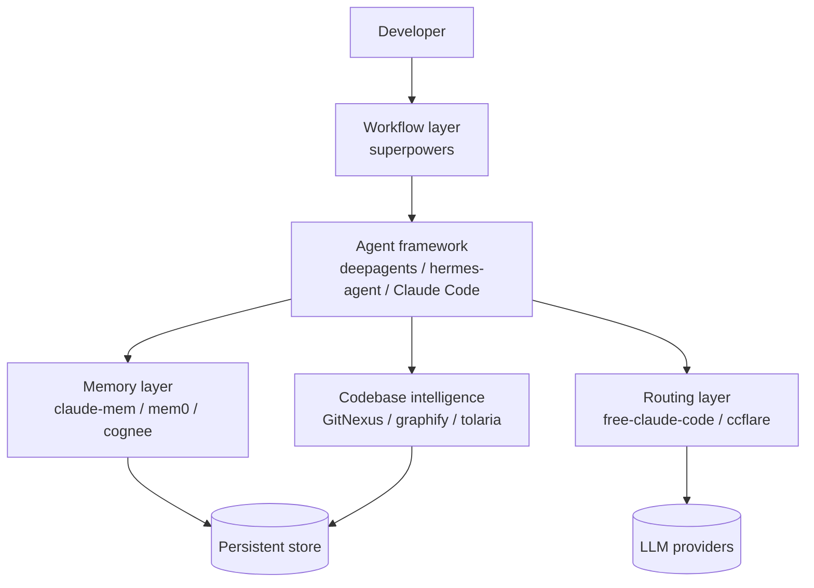

The agent ecosystem moves fast. Every month a new wave of repositories shows up on GitHub trending — proxies, frameworks, memory layers, knowledge graphs — and most of them look interchangeable from the outside. They're not. The interesting question is *which problem* each one is solving, and where it sits in the stack.

This post walks through twelve projects I've been studying recently. They group naturally into five layers: routing, agent frameworks, workflows and skills, codebase intelligence, and memory. Each section ends with a short comparison so you can pick the one that fits your situation, not just the one with the most stars.

---

## 1. Routing layer — getting the right model in front of the agent

The first thing an agent needs is a model. Sounds obvious, but the routing layer has become its own discipline: cost optimization, failover, multi-provider support, and observability all live here.

### [free-claude-code](https://github.com/Alishahryar1/free-claude-code)

A FastAPI proxy that intercepts Anthropic Messages API calls from Claude Code and reroutes them to alternative providers — NVIDIA NIM, OpenRouter, DeepSeek, LM Studio, llama.cpp, or Ollama. The trick is per-tier routing: Opus, Sonnet, and Haiku requests can each go to a different backend, so you can keep premium quality on hard tasks and push easy ones to a free or local model. It also implements `/v1/models` so the Claude Code 2.1.126+ model picker just works.

Best for developers who want to keep the Claude Code interface but escape the per-request bill — or run fully offline against a local model server.

### [ccflare](https://github.com/snipeship/ccflare)

A Bun + TypeScript proxy that takes a different angle: instead of translating between providers, it does **native passthrough** for both Anthropic and OpenAI — `/v1/anthropic/*` and `/v1/openai/*` route directly without payload rewriting. Where it shines is multi-account orchestration: load-balance across accounts, automatically fail over when one rate-limits, and watch every request stream through a built-in dashboard.

If you're a team running multiple keys (or multiple plans) and want one place to see usage, history, and rate-limit pressure, ccflare is the more honest fit. free-claude-code is for cost arbitrage; ccflare is for operations.

| | free-claude-code | ccflare |
|---|---|---|
| Stack | Python / FastAPI | Bun / TypeScript |
| Model translation | Yes (NIM ↔ Anthropic) | No (native passthrough) |
| Killer feature | Per-tier provider routing | Account failover + dashboard |
| Best for | Cost optimization, local models | Multi-account teams |

---

## 2. Agent frameworks — the "ready to run" tier

The second layer is the agent itself: the prompt, the tool loop, the planner, the file system, the sub-agent dispatcher. Two projects worth knowing.

### [deepagents](https://github.com/langchain-ai/deepagents)

LangChain's opinionated, batteries-included agent. Out of the box you get `write_todos` for planning, the standard filesystem trio (`read_file`, `write_file`, `edit_file`), shell execution, sub-agent delegation with isolated contexts, and automatic context summarization. Under the hood it's a compiled LangGraph graph, so streaming, persistence, and checkpointing come free.

What's interesting is that deepagents now ships with its own terminal coding agent — a Claude Code / Cursor-style TUI you install with one command. LangChain has effectively reimplemented the application layer that sits above their orchestration framework, and it is provider-agnostic.

### [hermes-agent](https://github.com/nousresearch/hermes-agent)

Nous Research's contribution is a *self-improving* agent. The pitch is a closed learning loop: the agent curates its own memory, autonomously creates new skills from experience, and refines those skills during use. It implements the [agentskills.io](https://agentskills.io) open standard so skills are portable.

The other distinguishing feature is reach. Hermes runs on CLI, Telegram, Discord, Slack, WhatsApp, Signal, and email through a unified gateway, supports 200+ models, and can spawn sub-agents across six terminal backends (local, Docker, SSH, Modal, etc.). It's designed to live somewhere — a $5 VPS, a serverless function, your laptop — and stay reachable.

| | deepagents | hermes-agent |
|---|---|---|
| Provenance | LangChain | Nous Research |
| Core stack | Python + LangGraph | Python + TypeScript |
| Differentiator | Compiled graph, sub-agent dispatch | Skill self-improvement, multi-platform |
| Best for | Building production agent apps | Always-on personal/research agent |

---

## 3. Workflow and skill layer — methodology, not just tools

A capable agent without a workflow is a fast way to ship bad code. This layer is about the *process* the agent follows.

### [superpowers](https://github.com/obra/superpowers)

Superpowers calls itself "a complete software development methodology for your coding agents." It enforces a seven-stage pipeline before any code gets written:

1. **Brainstorming** — refine requirements with questions
2. **Git Worktrees** — isolated branches per task
3. **Planning** — break work into 2–5 minute tasks
4. **Subagent-Driven Development** — fresh agent per task, review stages
5. **Test-Driven Development** — strict red-green-refactor
6. **Code Review** — systematic review against the plan
7. **Branch Completion** — merge and cleanup

This is essentially the SDD philosophy I [wrote about before](/blogs/blog/coding_today/) compiled into composable skills. It runs on Claude, OpenAI Codex, Cursor, Gemini, and GitHub Copilot via official marketplace installs. At 175k stars it's clearly resonating with people who've felt the pain of "agent jumps straight to code, ships a mess."

### [awesome-claude-code](https://github.com/hesreallyhim/awesome-claude-code)

The canonical curated list for the Claude Code ecosystem — skills, hooks, slash commands, agent orchestrators, plugins, integrations. 42k stars, currently being reorganized as the underlying ecosystem has outgrown its original table of contents. If you're trying to figure out what already exists before building yet another `/review` command, start here.

---

## 4. Codebase intelligence — knowledge graphs over your code

The most interesting trend this year is **pre-computed structural understanding**. Instead of having the agent re-read and re-grep on every session, you index the code into a graph once and let the agent query that.

### [GitNexus](https://github.com/abhigyanpatwari/GitNexus)

A client-side code intelligence engine. It builds an interactive knowledge graph from a GitHub repo or ZIP file using tree-sitter for parsing (14+ languages), LadybugDB for graph + vector storage, and Sigma.js for WebGL visualization. The whole thing runs in the browser via WebAssembly or locally as a CLI.

The differentiator is that it pre-computes relational intelligence at index time — clustering, dependency tracing, confidence scoring — so its 16 MCP tools return complete context in a single query rather than forcing the agent through multiple iterations. It plugs into Cursor, Claude Code, Codex, and Windsurf.

### [graphify](https://github.com/safishamsi/graphify)

Same idea, broader scope. Graphify ingests not just code (25 languages via tree-sitter, plus deterministic SQL parsing) but also PDFs, markdown, images, and audio/video — the latter transcribed locally with Whisper. The output is an interactive HTML graph, a `GRAPH_REPORT.md` highlighting "god nodes" and surprising connections, and a persistent `graph.json` that re-queries don't have to rebuild.

It uses Leiden community detection (no embeddings needed for clustering) and tags every relationship as `EXTRACTED`, `INFERRED`, or `AMBIGUOUS` with a confidence score. The headline number on their README — *71.5x fewer tokens per query vs reading raw files* on a 50+ file mixed corpus — is the strongest argument you'll see for why graph-first agents matter.

### [tolaria](https://github.com/refactoringhq/tolaria)

Different problem, adjacent answer. Tolaria is a Tauri + React desktop app for managing markdown-based knowledge bases — think a local-first, offline, git-backed Obsidian, designed from day one to be readable by Claude Code, Codex CLI, and Gemini CLI. Notes are plain markdown with YAML frontmatter, every vault is a git repo, and there is no cloud, account, or subscription.

Why it sits in this section: in the SDD world you want your specs, mission docs, and architecture notes in one place that *both* you and your agent can read. Tolaria is the curation surface; GitNexus and graphify are the indexing surface.

| | GitNexus | graphify | tolaria |
|---|---|---|---|
| Input | Code repos | Code + docs + media | Hand-authored markdown |
| Output | Interactive graph + MCP tools | HTML graph + report + JSON | Vault of files + git history |
| Storage | LadybugDB (graph + vector) | NetworkX + JSON cache | Plain markdown files |
| Best for | "Understand this codebase" | "Understand this folder of stuff" | "Curate context for my agent" |

---

## 5. Memory layer — making sessions stop forgetting

I covered [memory at length in the previous post](/blogs/blog/coding_today/), so the short version here. Three projects, three philosophies:

- **[claude-mem](https://github.com/thedotmack/claude-mem)** — Claude Code-specific. Hooks into `SessionStart`, `UserPromptSubmit`, `PostToolUse`, etc., compresses tool usage into SQLite + Chroma, retrieves with progressive disclosure (compact index → chronological → full detail). Privacy controls via `<private>` tags. Best when you live in Claude Code and want zero-config continuity.

- **[mem0](https://github.com/mem0ai/mem0)** — Provider-agnostic SDK. Three memory levels (user, session, agent state), hybrid retrieval (semantic + BM25 + entities), and as of April 2026 a single-pass extraction algorithm hitting 91.6 on LoCoMo with 7K tokens and 0.88s latency. Best when you're building your *own* agent and want a memory plane.

- **[cognee](https://github.com/topoteretes/cognee)** — Knowledge graph instead of bag-of-vectors. Four operations (`remember`, `recall`, `forget`, `improve`), auto-routing between vector and graph search, ontology grounding, and enterprise features like tenant isolation and audit trails. Best when relationships matter — timelines, cause-and-effect, contradiction detection.

| Tool | Storage | Tied to | Strength |
|---|---|---|---|
| claude-mem | SQLite + Chroma | Claude Code | Zero-config session continuity |
| mem0 | Vector + BM25 + entities | Any LLM | Generality, fast extraction |
| cognee | Vector + Graph DB | Any LLM | Relationship intelligence |

---

## How the layers fit together

Each project on its own is a tool. The interesting picture is what happens when you stack them:

Read bottom-up: the routing layer decides *which model* responds, the memory and codebase-intelligence layers decide *what context* the model sees, the agent framework decides *how the loop runs*, and the workflow layer decides *what process* the agent follows. Skip any layer and the others have to compensate — agents without memory waste tokens rediscovering, agents without a workflow ship messy code, agents without codebase intelligence keep grepping the same files.

A reasonable starter stack today:

- **Claude Code** as the agent shell
- **superpowers** for the methodology
- **claude-mem** for session continuity
- **GitNexus** or **graphify** for codebase context
- **ccflare** if you're juggling more than one account

Or, if you're building your own agent rather than using Claude Code:

- **deepagents** as the framework
- **mem0** or **cognee** for memory
- **graphify** to index whatever the agent works on
- **free-claude-code** style routing if you want provider flexibility

---

## What I'm watching next

A few patterns are converging:

1. **Pre-computed graphs are eating runtime grep.** The 71.5x token reduction graphify reports isn't a one-off. Agents that index once and query many will outcompete agents that re-read on every turn.
2. **Memory is becoming a graph problem, not a vector problem.** mem0 still uses vectors-plus-BM25, but cognee's graph-first model is closer to how humans actually remember — by relationships, not by similarity.
3. **The routing layer is splitting into two products.** Cost arbitrage (free-claude-code) and operations (ccflare) are different jobs and probably won't merge into one tool.
4. **Workflow methodology is moving from blog posts into code.** superpowers, speckit, and BMAD all bet that the *process* should be installable, not just describable.

The agent stack is starting to look like the web stack circa 2012 — a set of layers that are individually obvious in hindsight, but only legible once you've seen all of them at once. The repos in this post are the layers. Pick the ones that fit the gap you're feeling, not the ones with the loudest README.
