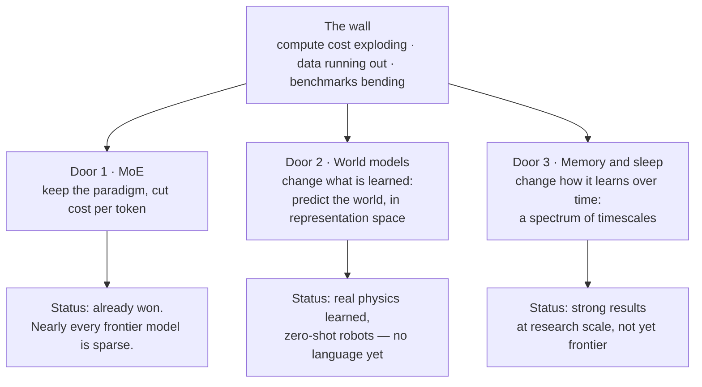

Every frontier lab is quietly saying the same thing: the pure-scaling era is ending. Costs go up like a rocket, quality goes up like a snail. This post is my attempt to sort out what's actually being built as the way out. Three directions, three very different levels of ambition: **MoE**, which makes the current paradigm cheaper; **world models**, which change *what* the model learns; and Google's memory line — **Titans, Hope, and now "sleep"** — which changes *how the model learns over time*.

I'll cite the original papers as we go, because most of what circulates about these ideas is summaries of summaries. Some of it is wrong. (The article that sent me down this hole got the author list and the arXiv ID of its own subject wrong — more on that below.)

---

## The wall

First, is the wall real? Four pieces of evidence, and one honest counter.

**The math says returns must shrink.** [Scaling laws](https://arxiv.org/abs/2001.08361) are power laws: loss falls smoothly as you add compute, but each equal step of quality costs a *multiple* of the last one. That was known in 2020. It's not a surprise, it's a schedule. [Chinchilla](https://arxiv.org/abs/2203.15556) then showed the real lever was data as much as parameters — which leads to the next problem.

**The data is running out.** [Epoch AI estimates](https://arxiv.org/abs/2211.04325) the entire stock of public human text at around 300 trillion tokens, and projects frontier training will consume the usable part of it somewhere between 2026 and 2032. Ilya Sutskever said it plainly at NeurIPS 2024: *"Pre-training as we know it will unquestionably end... we have but one internet."* He calls data the fossil fuel of AI. We are strip-mining it.

**The money says it louder.** Frontier training compute has been growing [4–5x per year](https://epoch.ai/blog/training-compute-of-frontier-ai-models-grows-by-4-5x-per-year). Cost estimates for one GPT-4-class run range from about $40M to over $100M depending on how you count, and [the trend line points at billion-dollar runs by 2027](https://arxiv.org/abs/2405.21015). The industry's answer so far was to move the spending, not remove it: reasoning models shifted compute from training time to *thinking time*, and the bill moved from the lab to every single query.

**And the benchmarks can't be trusted to measure the difference.** I wrote about part of this in [why models hallucinate](/blogs/blog/why_model_hallucinate/): models get optimized for tests, and confident wrong answers score better than honest uncertainty. It goes further. Benchmarks leak into training data. And even without leaks, labs tune for the tests until the number stops meaning anything — when a measure becomes a target, it stops measuring. That's Goodhart's law, now with a GPU budget. When researchers rebuilt a famous math benchmark from scratch with new but equally hard questions, several models dropped sharply. So when a new model claims two more points on an old benchmark, how much is real ability and how much is memorization? Nobody outside the lab can say.

The honest counter: OpenAI leadership still insists the scaling laws hold, and models *do* keep improving. The wall is contested. But watch what the labs **do**, not what they say. Every one of them is funding architecture research that would make no sense if scale alone were enough. Sutskever again, late 2025: the field is leaving the "age of scaling" and returning to the *"age of research... just with big computers."*

So: three doors out. Let's take them in order of ambition.

---

## Door 1: MoE — same brain, fewer neurons firing

**Mixture of Experts** is the least radical answer, which is exactly why it already won. The idea is old — [Jacobs, Jordan, Nowlan and Hinton proposed it in 1991](https://direct.mit.edu/neco/article/3/1/79/5560/Adaptive-Mixtures-of-Local-Experts), before deep learning as we know it. [Shazeer and colleagues revived it at scale in 2017](https://arxiv.org/abs/1701.06538), and the [Switch Transformer](https://arxiv.org/abs/2101.03961) pushed it to a trillion parameters. Then [Mixtral](https://arxiv.org/abs/2401.04088) made it open, and [DeepSeek-V3](https://arxiv.org/abs/2412.19437) made it famous.

The mechanism is simple to say. A transformer block is attention plus one big feed-forward network. MoE replaces that single network with **many smaller "expert" networks plus a router**. For each token, the router picks the top few experts — say 8 out of 128 — and only those run. The rest sit idle.

The consequence is the whole point: **the parameters that store knowledge and the compute each token costs are no longer the same number.** DeepSeek-V3 holds 671B parameters but activates 37B per token. The other big open models make the same trade — one of them holds a full trillion parameters and wakes up about 3% of them per token. Google's own report [confirms Gemini is a sparse MoE](https://arxiv.org/abs/2403.05530); GPT-4 was widely rumored to be one too, though OpenAI never confirmed it. By now, essentially every serious large model is sparse. Dense frontier models are quietly over.

My one-line intuition for it: the brain does the same trick. Your cortex keeps [only about one in a hundred neurons strongly active at once](https://www.cell.com/current-biology/fulltext/S0960-9822(03)00135-0) — it can't afford more, energy-wise. Huge capacity, sparse activation.

Two details worth keeping, because almost every summary gets them wrong:

- You save **compute, not memory**. Any token might route to any expert, so *all* experts must sit in RAM. A trillion-parameter MoE still needs trillion-parameter hardware to serve. You pay memory for all of it and compute for a tiny slice.
- The famous DeepSeek "$5.6M training run" is **their number for one final run** at an assumed GPU rental price, excluding all the research and failed attempts before it. It's real, but it's not the whole bill.

And here is what MoE does *not* fix: it's still a transformer. Attention still gets expensive fast as context grows — double the text, four times the work. The model still has to keep every past token in fast memory while it runs, and that store grows with the context too. And above all, **the weights are still frozen the moment training ends**. MoE is a brilliant cost patch *inside* the paradigm. It doesn't touch the paradigm's actual limits.

> **Lesson:** MoE separates what a model *knows* from what a token *costs*. It buys time. It doesn't buy a way out.

---

## Door 2: World models — stop learning the words, learn the world

Yann LeCun's critique of LLMs is more precise than the headlines suggest. He isn't against transformers — his own models use them. He's against **autoregressive generation as the path to intelligence** — generation that writes one token at a time, each new token built on the ones before. His standing list of what LLMs lack has four items: understanding of the physical world, persistent memory, reasoning, and planning.

Two of his arguments stuck with me. First, the error one: a model that steps slightly wrong keeps building on its own mistake, and he argued the chance of staying correct shrinks fast as the answer gets longer. ([The math is disputed](https://arxiv.org/abs/2505.24187). Reasoning models do hold long correct chains, and errors cluster at a few key tokens instead of piling up evenly. But the deeper worry still stands: generation has no reverse gear.) Second, the bandwidth one, [which he stated with arithmetic](https://x.com/ylecun/status/1750614681209983231): a four-year-old child has taken in roughly **50 times more sensory data** through the eyes alone than the biggest LLM has read in text. Text is a thin, already-compressed slice of the world. Train only on it and you inherit the compression losses. His conclusion, [posted bluntly](https://x.com/ylecun/status/1796982509567180927): *"LLMs are useful, but they are an off ramp on the road to human-level AI."*

His alternative has a 2022 blueprint, ["A Path Towards Autonomous Machine Intelligence"](https://openreview.net/forum?id=BZ5a1r-kVsf): an agent built around a **world model** that predicts what happens next, so plans can be tested in imagination before acting. The key design choice — the one that makes it a different research program and not just a bigger LLM — is **where prediction happens**. Not in pixels, not in tokens, but in **representation space**.

Why there? Because the world is only partially predictable. A model forced to predict every pixel of the next video frame wastes its capacity guessing things nobody can know — which way each leaf blows. Predicting in an abstract space lets the model **keep what is predictable (the rule) and drop what is not (the noise)**. That's the JEPA idea — Joint Embedding Predictive Architecture — and it's also the sharpest way I know to explain what "self-supervised" means here: the model plays hide-and-seek with reality. Hide part of the input, predict it from the rest, no labels needed. Play that game at the level of *concepts* instead of pixels, and to keep winning you are forced to learn the hidden rules of the world.

Does it work? Step by step, yes. [I-JEPA](https://arxiv.org/abs/2301.08243) learned strong image representations by predicting masked regions in embedding space, at a fraction of the training cost of pixel-reconstruction methods. [V-JEPA](https://ai.meta.com/blog/v-jepa-yann-lecun-ai-model-video-joint-embedding-predictive-architecture/) did it for video. Then came the result I find genuinely striking: [tested the way developmental psychologists test babies](https://arxiv.org/abs/2502.11831) — show a physically impossible event and measure surprise — V-JEPA models are reliably "surprised" by objects that vanish or teleport, while pixel-space predictors and multimodal LLMs score no better than guessing. The physics wasn't programmed in. It came from watching video, exactly the way the theory hoped.

And [V-JEPA 2](https://arxiv.org/abs/2506.09985), trained on a million hours of video, drove robot arms in labs it had never seen, picking and placing objects it had never seen either — **zero-shot**, no extra training for that lab or those objects — by planning toward a goal image.

The story got a business chapter too: LeCun left Meta at the end of 2025 and founded AMI Labs around exactly this program. It [raised about a billion dollars as a seed round](https://techcrunch.com/2026/03/09/yann-lecuns-ami-labs-raises-1-03-billion-to-build-world-models/) — reportedly Europe's largest ever — before shipping anything.

Now the honest part. No JEPA system talks, codes, or does open-ended reasoning; the strongest results that touch language still lean on an LLM sitting next to it. The robot demos, impressive as they are, needed hand-picked camera angles and goals given as images, not words. And predicting many steps ahead in representation space piles up errors too — the authors say so themselves. That is LeCun's own critique of LLMs, now pointed back at his own program. And the program's centerpiece, hierarchical planning, is openly unsolved. LeCun said it himself this April: *"Here is the big secret of AI: nobody knows how to do hierarchical planning."*

> **Lesson:** world models change the question from "what's the next token?" to "what happens next, and what if I act?" The evidence they learn real structure is strong. The evidence they can replace LLMs is not there yet.

---

## Door 3: Memory — Titans, Hope, and models that sleep

This is the door I find most interesting, partly because I accidentally wrote about it before I knew it existed. Bear with me — the punchline is at the end of this door.

Google Research has been publishing a connected line of work, same core team, each paper building on the last. The Titans paper opens with a quote from Samuel Johnson, 1787: *"The true art of memory is the art of attention!"* — which is either a joke about the transformer or the thesis of the whole program. Probably both.

**Step 1: [Titans](https://arxiv.org/abs/2501.00663)** (late 2024). The reframe: attention *is* memory — but only **short-term** memory. It's precise and it's tiny, limited to the context window. So Titans adds a second module: a neural **long-term memory that keeps learning while the model runs**. At inference time. The rule for what to store is the beautiful part: **surprise**. Formally, the gradient of the loss with respect to the input — informally, *events that violate your expectations are the ones worth remembering*. The module also has built-in **forgetting** (a decay gate), because a memory that only adds eventually drowns. With this, a small research model held onto information across context lengths beyond 2M tokens and beat far larger LLMs on long "find the needle" benchmarks.

**Step 2: [Nested Learning and the Hope architecture](https://arxiv.org/abs/2512.24695)** (NeurIPS 2025). The generalization, and the sentence that reframed transformers for me: a transformer is a system with exactly **two update frequencies — infinity and zero**. Attention updates its "state" on every token: frequency ∞. The feed-forward weights never update after training: frequency 0. Everything the model will ever know sits at one of two extremes: this instant, or forever ago.

The paper's proposal is to fill in the middle: treat a model as a set of nested learning problems, **each updating at its own frequency**. Fast parts update every token. Slower parts every few hundred. The slowest, rarely. This is what the phrase you may have seen in summaries — "thinking at high and low frequency" — actually means in this work: not two thinking speeds, but a **spectrum of memories**, from working memory to something like beliefs, each layer consolidating into the slower one below. The neuroscience echo is deliberate: the paper maps it onto brain waves, from fast gamma to slow delta. Hope is the architecture built from this — a **self-modifying** model that learns its own update rule. (If you know the old "fast weights" idea from the 1990s: yes, this is that family, and the paper credits it.)

**Step 3: [Language Models Need Sleep](https://arxiv.org/abs/2606.03979)** (June 2026 — the paper that started this post). Hope consolidates memory *while working* — online, token by token. This paper argues that's not enough, and the brain agrees: your most important memory work happens **offline**. So they add a sleep phase. In plain terms: a phase where the model stops taking input and processes what it already has. Two stages, and yes, they map them to real sleep:

- **Consolidation (their NREM):** knowledge sitting in fast, temporary memory gets **distilled into the model's own weights**. The twist worth noticing: it grows *new, small experts* instead of overwriting old ones. The MoE trick from Door 1, reused as a memory mechanism. New knowledge gets new parameters; old knowledge keeps its own.
- **Dreaming (their REM):** the model generates its own practice data — replaying, recombining, rehearsing what it learned — and trains on the useful parts, no human supervision.

The reported results are big. Near-perfect recall out to **10 million tokens** of context, far past the point where today's big LLMs collapse. The same math scores as normal fine-tuning, in about a quarter of the time. And when the model learned new languages one after another, more sleep stages made forgetting *shrink toward zero*. The paper's framing for why any of this matters is the sharpest analogy in the whole line: **today's LLMs are like a patient with anterograde amnesia** — perfectly articulate, permanently unable to form a new long-term memory. Every session, you meet them for the first time again.

A few honesty notes, because this line gets over-hyped in exactly the way I complained about at the top. These are research-scale results — models from 170M to a few billion parameters, plus adapted open backbones — not frontier-scale. None of it is confirmed to be in any shipping Gemini. And the summary article that pointed me here misstated the paper's authors, its date, and claimed it had no arXiv ID (it does: [2606.03979](https://arxiv.org/abs/2606.03979)). The claim floating around online — "memory ability correlates with intelligence" — is *commentary*, not a sentence in the paper. Check the originals. It's why this post links them.

Now the punchline I promised. A week before I found these papers, I published [a post about knowledge bases](/blogs/blog/how_to_build_knowledgebase/) arguing that storage without inference is dead data — that a real knowledge base needs to derive and connect at write time, and **reorganize itself in background "sleep" jobs** while idle. I built that argument out of Hebb's 1949 consolidation loop and what brains do at night. I thought I was designing a harness *around* the model. Then I read the Titans line and found the same blueprint being built *into* the model: surprise-driven writing (the write-it-when-it-fires half of Hebb's loop), decay as a feature, and offline consolidation as the step that turns experience into knowledge. Same idea, one level down the stack.

> **Lesson:** the transformer's real ceiling isn't attention. It's that a transformer has only two timescales: *now* and *never again*. Everything in this research line is about filling in the middle.

---

## The three doors, side by side

| | MoE | World models (JEPA) | Titans / Hope / Sleep |
|---|---|---|---|
| Attacks | Cost per token | What the model learns from | Frozen weights, forgetting |
| Core move | Route each token to few experts | Predict in representation space | Memory at many update frequencies |
| Changes the paradigm? | No — a patch inside it | Yes — replaces generation as the goal | Partly — transformer plus a memory system |
| Where it is today | In production everywhere | Research + robotics demos | Research scale only |
| Doesn't fix | Frozen weights, long-context cost | Language, planning | Still a transformer at heart, unproven at frontier scale |

The neat part: **these three don't compete, they compose.** The sleep paper grows MoE-style experts as its memory cells. JEPA models have transformers inside. Nothing stops a future model from being all three at once — sparse, predicting in representation space, and consolidating memory while it sleeps. If I had to bet on "the model of 2028," that's the shape I'd sketch.

And notice what all three quietly agree on. The transformer isn't being *replaced* — every one of these still has attention doing what attention is genuinely great at. What's being abandoned is the idea that **one frozen network, answering in a single pass,** is all you need. The bets differ only on which missing piece matters most: cheaper capacity, a grounded model of the world, or a memory that survives the session.

---

## Where this leaves us

The recurring theme of this blog is that the model is the rented part and the system around it is the job — the memory layers, the knowledge bases, the harnesses. This research wave doesn't contradict that. It does something stranger: it takes the ideas we've been bolting onto the *outside* of models — memory that persists, surprise-driven writing, forgetting as a feature, background consolidation — and pushes them *inside* the weights. The harness is migrating into the model.

I don't know which door wins. Maybe none does and scale finds another gear. But I notice that the three most serious research programs in the field, funded with billions, are all building the same missing organ, each in its own words: a way for the machine to be changed by its own experience. The transformer gave models a way to read everything. What comes after is about letting them *remember* something.

---

## The papers, in one place

**The wall:**
- [Scaling Laws for Neural Language Models](https://arxiv.org/abs/2001.08361) (Kaplan et al., 2020)
- [Training Compute-Optimal Large Language Models](https://arxiv.org/abs/2203.15556) (Chinchilla, 2022)
- [Will we run out of data?](https://arxiv.org/abs/2211.04325) (Villalobos et al., Epoch AI)
- [The Rising Costs of Training Frontier AI Models](https://arxiv.org/abs/2405.21015) (Cottier et al., 2024)

**Door 1 — MoE:**
- [Adaptive Mixtures of Local Experts](https://direct.mit.edu/neco/article/3/1/79/5560/Adaptive-Mixtures-of-Local-Experts) (Jacobs, Jordan, Nowlan & Hinton, 1991)
- [Outrageously Large Neural Networks: The Sparsely-Gated Mixture-of-Experts Layer](https://arxiv.org/abs/1701.06538) (Shazeer et al., 2017)
- [Switch Transformers](https://arxiv.org/abs/2101.03961) (Fedus, Zoph & Shazeer, 2021)
- [Mixtral of Experts](https://arxiv.org/abs/2401.04088) (Mistral AI, 2024) · [DeepSeek-V3](https://arxiv.org/abs/2412.19437) (2024)

**Door 2 — World models:**
- [A Path Towards Autonomous Machine Intelligence](https://openreview.net/forum?id=BZ5a1r-kVsf) (LeCun, 2022)
- [I-JEPA](https://arxiv.org/abs/2301.08243) (2023) · [V-JEPA 2](https://arxiv.org/abs/2506.09985) (2025)
- [Intuitive physics understanding emerges from self-supervised pretraining on natural videos](https://arxiv.org/abs/2502.11831) (2025)
- [Beyond Exponential Decay: Rethinking Error Accumulation in LLMs](https://arxiv.org/abs/2505.24187) (2025) — the counter-argument to LeCun's error math

**Door 3 — Memory and sleep:**
- [Titans: Learning to Memorize at Test Time](https://arxiv.org/abs/2501.00663) (Behrouz, Zhong & Mirrokni, 2024)
- [Nested Learning: The Illusion of Deep Learning Architectures](https://arxiv.org/abs/2512.24695) (Behrouz et al., NeurIPS 2025) · [Google's blog explainer](https://research.google/blog/introducing-nested-learning-a-new-ml-paradigm-for-continual-learning/)
- [Language Models Need Sleep: Learning to Self-Modify and Consolidate Memories](https://arxiv.org/abs/2606.03979) (Behrouz, Hashemi, Javanmard & Mirrokni, 2026)
