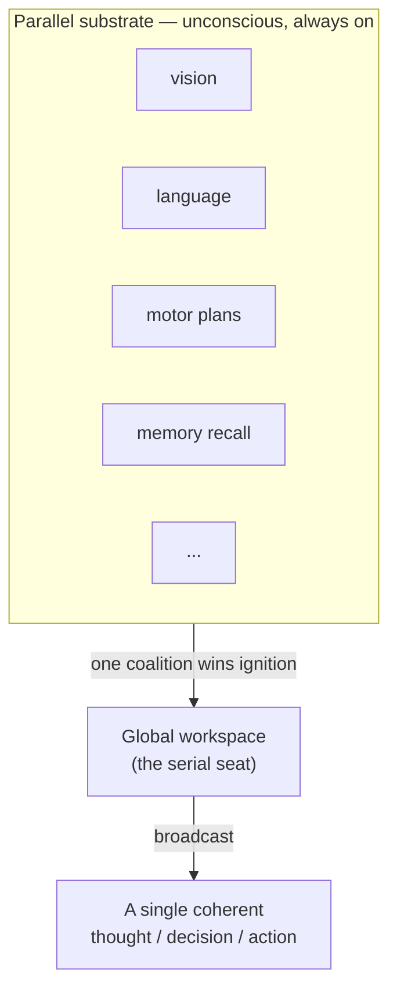
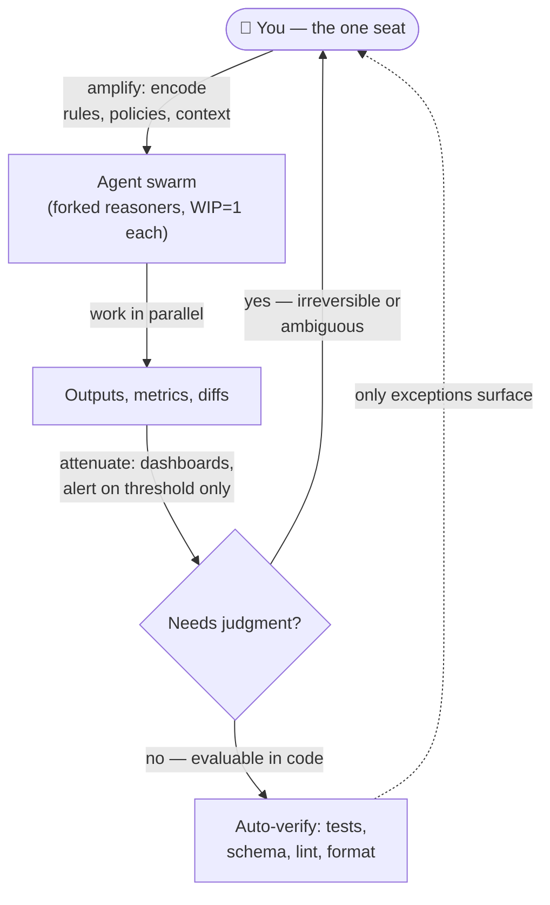

I can cook dinner while listening to music. I cannot read while I code. That small, stupid fact bothered me for a week, because it breaks the story I'd been telling myself — that I'm bad at multitasking, that focus is a muscle I never trained hard enough. If focus were a muscle, cooking-and-music would be just as impossible as reading-and-coding. It isn't. So the muscle story is wrong, and something more interesting is going on.

Here's what set it off. I'd been running AI agents the way the tools now let you — spawn a handful, let them work in parallel, come back and collect the results. The machine juggles sixteen tasks without breaking a sweat. I sat in the middle of it and watched my own head fill up and stall at *two*. The obvious question — *why can the agent do this and I can't?* — has an obvious answer that turns out to be completely backwards.

## Your brain is not sequential

The naive framing is "brains are serial, computers are parallel." It's exactly upside down.

The brain is the most parallel machine we know of. Eighty-six billion neurons firing at once; Hebb's cell assemblies lighting up in parallel; the whole visual field processed everywhere-at-once before you're aware of any of it. Nothing about the *hardware* is sequential. What's sequential is the thin stream that comes out the top — the one voice narrating, the single train of thought, the thing you experience as "paying attention."

Cognitive science has a name for that stream. [Global Workspace Theory](https://pmc.ncbi.nlm.nih.gov/articles/PMC8770991/) (Bernard Baars, 1988; later given a neural home by Stanislas Dehaene) says consciousness is a *serial broadcast* selected out of massively parallel unconscious processing. In Dehaene's words: among the millions of representations crisscrossing the brain unconsciously, *one* is selected for its relevance to your current goal and made globally available to all your decision systems. Parallel substrate; serial spotlight.

So the real shape is **parallel hardware → one serial seat**. And the agent, it turns out, is the *mirror image*: many parallel workers → one serial orchestrator that collects and decides. Neither is purely serial or purely parallel. The whole question is *where each one puts its single seat* — and why.

## Why the stream is serial (and why that's a feature)

The seat isn't serial because evolution ran out of neurons. It's serial for three reasons, and none of them is a defect to be fixed:

- **One body.** You have one mouth, one pair of hands, one *next action*. You cannot turn left and right at once. Output has to be serialized because the thing it controls is singular — and the thought that drives the action serializes to match.
- **One coherent self to protect.** The workspace's job is to force the parallel candidates to collapse into *one* winning state you can act on and defend. The famously tiny capacity of working memory — Nelson Cowan puts it at about [four chunks](https://en.wikipedia.org/wiki/The_Magical_Number_Seven,_Plus_or_Minus_Two), not Miller's folk-remembered seven — isn't a bug in the seat. It *is* the seat. A bottleneck narrow enough to guarantee a single answer.
- **Coherence is serial by nature.** Hebb's *phase sequence* — one cell assembly igniting the next, in order — *is* a train of thought precisely because it's ordered. (I wrote about this in [how to build a knowledge base](/blogs/blog/how_to_build_knowledgebase/).) Fire every assembly at once and you don't get faster thinking; you get a seizure.

The lab version of this is the **central bottleneck**. [Harold Pashler's](https://laplab.ucsd.edu/articles/Pashler_PB1994.pdf) work on the *psychological refractory period* shows that when two tasks need the central response-selection stage, the second one *waits* for the first — and when you force people to weight both tasks equally, the waiting is still there. It's structural, not a strategy you can coach away. There is one central stage, and it serves one customer at a time.

So the serial seat is **load-bearing**. It's the price of coherence, not the absence of horsepower.

## It was never focus — it was channels

Back to the onions. Why *can* I cook to music but not read while coding? Because "attention" is not one thing. [Christopher Wickens' Multiple Resource Theory](https://interruptions.net/literature/Wickens-HF08.pdf) says the operator doesn't have a single pool of attention but *several* — split by modality (visual vs. auditory), by code (verbal vs. spatial), by response (manual vs. vocal). Two tasks interfere in proportion to how much they draw on the *same* pool. Time-sharing is cheap when the pools are separate and brutal when they collide.

| task pair | resources each demands | verdict |
|---|---|---|
| cook + music | motor/spatial + passive auditory — mostly automatic | coexist ✓ |
| walk + talk | motor + verbal | coexist ✓ |
| read + code | the central verbal-symbolic reasoner — both | collide ✗ |
| code + code (two problems) | the central verbal-symbolic reasoner — both | collide ✗ |

Read across it and the pattern is plain. Cooking and music hit two different, cheap, half-automatic channels. Reading and coding both demand the *one* channel that matters for knowledge work: the central symbolic reasoner — parse meaning, hold a model, reason forward. Two hands reaching for one tool. One wins; the other drops.

So the thing we have exactly one of isn't "attention" in general — it's **one central symbolic reasoner**. Everything peripheral, everything drilled into automaticity, we run in bulk all day long. The single reasoner is the only resource that is neither duplicable nor demotable. And — hold this thought — it's exactly the resource an AI agent can copy.

## Focus is a count, not a skill

This reframes the whole self-improvement project. You don't "lose focus" because your willpower is weak. You lose it because two System-2 tasks are contending for the single reasoner, and no amount of grit adds a second one. Focus was never a muscle. **It's a count problem, and the count is one.**

There is exactly one way a human ever *appears* to add a reasoner, and it's not by trying harder — it's by making part of the work stop needing one. [Schneider and Shiffrin (1977)](https://psych.indiana.edu/documents/shiffrin-and-schneider-1977.pdf) drew the line between *controlled* processing (serial, capacity-limited, eats the central channel) and *automatic* processing (built by consistent practice, runs without consuming the seat). Practice doesn't strengthen focus; it *evicts a task from the seat entirely*. I said the same thing in [how to learn](/blogs/blog/how_to_learn/) without knowing the citation: "type the syntax enough times and your hands stop asking your brain for permission… that frees your attention for the problem instead of the keystrokes." That's automaticity demoting typing out of the reasoner so the reasoner is free for the *problem*. But the problem itself — the reading of meaning, the deciding — never demotes. That core is the single seat, and it stays single forever.

And here's the part that should end the "just multitask" fantasy for good: switching between System-2 tasks isn't free, it's *expensive and measurable*. Sophie Leroy named the cost **attention residue** — when you switch from A to B, part of your attention stays stuck on A, for [20 minutes or more](https://get-alfred.ai/blog/attention-residue), and people who switch mid-task perform 30–40% worse on the next one. Gloria Mark's field work puts the recovery at [23 minutes and 15 seconds](https://nimea.app/en/blog/focus-and-interruptions) to get back to the same depth after a single interruption — while knowledge workers get interrupted every few minutes. Do the arithmetic and most people never reach full depth at all. The seat isn't just single; it's *slow to re-seat*. Every switch pays a tax, in a currency you can't earn back.

## What the agent does instead — it forks

Now put the agent next to you and the asymmetry snaps into focus. When a system "runs sixteen tasks at once," that is not one mind holding sixteen things. It's sixteen minds each holding *one* — sixteen fresh context windows, isolated, each single-threaded, each dying when its one job is done. Every individual agent in the swarm runs the same **WIP = 1** discipline a focused human does. The parallelism is *between* agents, never *inside* one.

Anthropic's own [multi-agent research system](https://www.anthropic.com/engineering/multi-agent-research-system) is the clean example: a lead agent plans, spawns three-to-five subagents *in parallel* each with its own objective and its own context, and then synthesizes. It beat the single-agent version by 90%. A spawned subagent isn't a spare hand or a background audio track — it's a **second full reasoner**. That's the entire difference, stated as narrowly as it will go:

> An agent can `fork()` a second reasoner. You have exactly one, and it does not copy.

The machine's ceiling isn't attention — it's silicon. As one engineer who ran a twenty-agent swarm for a year put it, "[my ceiling stopped being attention and became hardware; the machine taps out before I do](https://zachwills.net/i-managed-a-swarm-of-20-ai-agents-for-a-week-here-are-the-8-rules-i-learned/)." Your ceiling is the seat. Its ceiling is `min(16, cores − 2)`. Those are different games.

But notice what the swarm does at the end: it *re-serializes*. The lead agent, the orchestrator, is a single serial decision-maker — it doesn't hold sixteen tasks in mind, it holds one: coordinate, wait, merge. The parallelism buys throughput on the *doing*; the *deciding* collapses back to one seat, because deciding is the thing that never parallelizes. (I made this argument from the other side in [migration is a harness](/blogs/blog/migration_is_a_harness/): parallel generator-and-evaluator loops, but a single orchestrator that commits. And in the knowledge-base post: "merging is just a big write" — union two graphs without an inference step and you keep both contradictory facts, so the agent flips a coin at answer time. Delete the serial seat and you get incoherence.)

## The bottleneck flipped

This is where the small personal puzzle becomes the industry's whole 2026 story. When the agents got fast and forkable, the constraint didn't disappear — it *moved*. It moved onto you.

The reports all say the same thing in different words. "[The bottleneck has moved from writing code to reading it.](https://www.developersdigest.tech/blog/ai-coding-agents-review-queues)" A developer with an agent opens more PRs per day than any human queue can absorb, and [review capacity doesn't scale](https://dev.to/code-board/the-review-bottleneck-why-more-ai-code-means-slower-teams-in-2026-1e5n). The merge conflicts and the review backlog aren't signs the agents are failing — they're signs the agents are *succeeding faster than one human seat can integrate*. The bottleneck isn't the AI. It's the single reasoner trying to orchestrate an abundance of them.

Which means the seat you have exactly one of is now the scarcest resource in the whole system. The interesting question stops being "how do I focus harder" and becomes "**where do I spend the one seat I have?**"

## The strategy: be the orchestrator, not the swarm

The trap is to try to be the swarm — to sit in the middle of sixteen agents and personally track all sixteen. That's asking your one central reasoner to do the one thing it structurally cannot, and paying the 23-minute switch tax on every hop between them. You'll burn out by lunch and integrate nothing.

The move is to do what the swarm already does with its lead agent: **stop being a worker, become the orchestrator.** Cybernetics has the cleanest statement of why. Ashby's *Law of Requisite Variety* — "[only variety can absorb variety](https://www.thoughtworks.com/en-us/insights/blog/generative-ai/cybernetics-and-human-on-the-loop-in-agentic-coding)" — says you cannot match a high-variety system at its own level. A single human seat can't absorb the variety of sixteen parallel workers head-on. The only response is to *step up a level*: stop reviewing every line, and start steering the system that produces the lines. Human-in-the-loop becomes human-*on*-the-loop, or, as the same piece warns, "we'll become a fracture point."

Here's the playbook I've landed on — every rule is really the same rule, *protect the single seat and spend it only where it's irreplaceable*:

- **Amplify, then attenuate.** *Amplify* your judgment outward by encoding it once — decision rules, policies, a `CLAUDE.md`, a domain knowledge base — so the agents carry your intent without you repeating it. *Attenuate* what comes back — aggregate into dashboards, alert only on threshold violations — so your seat sees exceptions, not everything. (Both terms are Ashby's, via Thoughtworks.)
- **Automate what can be evaluated; interrupt only for judgment.** Anything a test, a schema check, or a linter can decide should never touch your seat. Reserve the human interrupt for the two things a check can't do: the *irreversible* call and the *ambiguous* one. This is the same gate as [migration's](/blogs/blog/migration_is_a_harness/) "AI informs, humans commit" — the human is touched twice, to set strategy and to sign off, not sixteen times.
- **Manage orchestrators, not agents.** Don't watch twenty workers; run one or two long-lived orchestrator threads that hold the plan and dispatch the workers. One human seat can hold *one* orchestrator's context. It cannot hold twenty workers'. Match the fan-out to the seat, not to the machine.
- **Run your own WIP = 1, and batch to defend it.** The switch tax is real and it's twenty-three minutes. So don't interleave — *batch*. Review one agent's output to completion, then the next. Give the seat one thing at a time, the same discipline you give each subagent, because you are subject to the exact same law they are.
- **Externalize state so a switch is cheap to recover.** Your intermediate thinking lives in volatile working memory that a switch overwrites. Write it down — a plan, a progress file, a commit — so when you *do* re-seat, you reload from disk instead of from a decayed memory. The swarm survives dead sessions this way; so can you.

The thread through all of it: you can parallelize *search*, generation, review — hand those to forks. You cannot parallelize *understanding*, because understanding is the act of collapsing many parallel candidates into one coherent structure, and collapse is irreducibly serial. That collapse is what your one seat is *for*. Spend it there and nowhere else.

## What the seat is worth now

For most of the history of this work, the bottleneck was making the thing — writing the code, drawing the design, producing the output. The seat spent most of its time *producing*. That era is closing. Production forks now; it runs sixteen-wide on hardware that taps out before you do.

What's left for the one seat is exactly what never forked: judgment, taste, the merge, the irreversible decision — and, quietly the highest-value job in a swarm, [deciding what *not* to build](https://zachwills.net/i-managed-a-swarm-of-20-ai-agents-for-a-week-here-are-the-8-rules-i-learned/). Those were always the senior parts of the job; now they're the *only* parts that are scarce, because everything else got cheap. The bottleneck flipping isn't bad news. It's the market re-pricing your attention up — *if* you move it off the work a fork can do and onto the work only a single, coherent, accountable reasoner can.

> **The lesson:** focus isn't a skill you were failing to train — it's a resource you have exactly one unit of, and it does not copy. The AI's whole trick is that it can `fork()` a reasoner and you can't. So stop trying to be the swarm. Be the thing the swarm can't be: the one seat that decides. Automate what can be checked, batch what needs thought, encode your judgment so it scales without you — and save the seat for the collapse from many to one. That was always the job. Now it's the *whole* job.

You can't fork yourself. Good. It means the one thing you do — reconcile the parallel world into a single decision someone can be held to — is the one thing that stayed rare.
